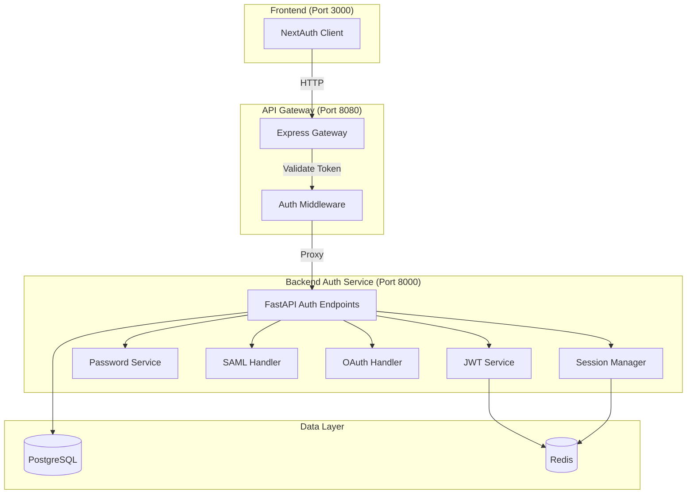

# Design Document: Backend Authentication Service Completion

## Overview

This design completes the Backend Authentication Service by adding comprehensive property-based testing, enterprise authentication protocols (SAML 2.0, OAuth 2.0), secure token management, and production-ready security features. The service builds on the existing FastAPI authentication endpoints (Task 2.1 complete) and integrates with the production-ready API Gateway (409 tests, 95% coverage) and NextAuth frontend (64 tests, 100% coverage).

The design focuses on cryptographic security, protection against common attacks (brute force, token replay, CSRF), comprehensive audit logging, and property-based testing to validate security invariants across all possible inputs.

## Architecture

### System Context



### Authentication Flows

**Standard Login Flow:**
1. User submits credentials to NextAuth
2. NextAuth sends to API Gateway
3. API Gateway proxies to Backend Auth
4. Backend Auth validates credentials (bcrypt)
5. Backend Auth creates JWT tokens
6. Backend Auth stores session in Redis
7. Backend Auth logs authentication event
8. Tokens returned to client

**SAML SSO Flow:**
1. User initiates SAML login
2. Backend Auth redirects to IdP
3. IdP authenticates user
4. IdP returns SAML assertion
5. Backend Auth validates assertion signature
6. Backend Auth creates/updates user
7. Backend Auth issues JWT tokens
8. User redirected to application

**OAuth Flow:**
1. User initiates OAuth login
2. Backend Auth redirects to provider
3. User authorizes at provider
4. Provider returns authorization code
5. Backend Auth exchanges code for tokens (with PKCE)
6. Backend Auth creates/updates user
7. Backend Auth issues JWT tokens
8. User redirected to application

**Token Refresh Flow:**
1. Client sends refresh token
2. Backend Auth validates refresh token
3. Backend Auth checks token not revoked (Redis)
4. Backend Auth generates new token pair
5. Backend Auth rotates refresh token
6. Backend Auth invalidates old refresh token
7. New tokens returned to client

## Components and Interfaces

### 1. JWT Service (Enhanced)

**File:** `backend/app/utils/jwt.py` (existing, to be enhanced)

```python
from dataclasses import dataclass
from datetime import datetime, timedelta
from typing import Optional, Dict, Any
import uuid

@dataclass
class TokenMetadata:
    """Metadata for token tracking and revocation"""
    jti: str  # JWT ID for revocation
    user_id: str
    token_type: str  # "access" or "refresh"
    issued_at: datetime
    expires_at: datetime
    ip_address: Optional[str]
    user_agent: Optional[str]

class JWTService:
    """Enhanced JWT service with security features"""
    
    def create_access_token(
        self,
        data: Dict[str, Any],
        expires_delta: Optional[timedelta] = None,
        metadata: Optional[TokenMetadata] = None
    ) -> str:
        """
        Create access token with JTI for revocation
        
        Security features:
        - Unique JTI per token
        - Token type metadata
        - Configurable expiration
        - HS256 algorithm with 256-bit secret
        """
        pass
    
    def create_refresh_token(
        self,
        data: Dict[str, Any],
        expires_delta: Optional[timedelta] = None,
        metadata: Optional[TokenMetadata] = None
    ) -> str:
        """
        Create refresh token with rotation support
        
        Security features:
        - Unique JTI per token
        - Longer expiration (7 days default)
        - Stored in Redis for revocation
        """
        pass
    
    def validate_token(
        self,
        token: str,
        expected_type: str = "access"
    ) -> Optional[Dict[str, Any]]:
        """
        Validate token signature, expiration, and type
        
        Checks:
        - Signature validity (HS256)
        - Expiration time
        - Token type matches expected
        - Token not revoked (check Redis)
        """
        pass
    
    def revoke_token(self, jti: str, expires_at: datetime) -> None:
        """
        Revoke token by adding JTI to Redis blacklist
        
        TTL set to token expiration time
        """
        pass
    
    def is_token_revoked(self, jti: str) -> bool:
        """Check if token JTI is in revocation list"""
        pass
```

### 2. Password Service (Enhanced)

**File:** `backend/app/utils/password.py` (existing, to be enhanced)

```python
from typing import Tuple
import secrets
import string

class PasswordService:
    """Enhanced password service with security features"""
    
    # Bcrypt configuration
    BCRYPT_ROUNDS = 12  # Minimum 12 rounds for security
    
    def hash_password(self, password: str) -> str:
        """
        Hash password using bcrypt with 12 rounds
        
        Security features:
        - Bcrypt algorithm (resistant to GPU attacks)
        - 12 salt rounds (configurable)
        - Automatic salt generation
        """
        pass
    
    def verify_password(
        self,
        plain_password: str,
        hashed_password: str
    ) -> bool:
        """
        Verify password using constant-time comparison
        
        Security features:
        - Constant-time comparison (prevents timing attacks)
        - Handles invalid hash gracefully
        """
        pass
    
    def validate_password_strength(
        self,
        password: str
    ) -> Tuple[bool, str]:
        """
        Validate password meets security requirements
        
        Requirements:
        - Minimum 8 characters
        - At least one uppercase letter
        - At least one lowercase letter
        - At least one digit
        - At least one special character
        """
        pass
    
    def generate_secure_password(self, length: int = 16) -> str:
        """Generate cryptographically secure random password"""
        pass
```

### 3. SAML Handler

**File:** `backend/app/services/saml_handler.py` (new)

```python
from dataclasses import dataclass
from typing import Optional, Dict, Any
from datetime import datetime

@dataclass
class SAMLConfig:
    """SAML Identity Provider configuration"""
    entity_id: str
    sso_url: str
    slo_url: Optional[str]
    x509_cert: str
    name_id_format: str = "urn:oasis:names:tc:SAML:1.1:nameid-format:emailAddress"

@dataclass
class SAMLAssertion:
    """Parsed SAML assertion data"""
    name_id: str
    email: str
    attributes: Dict[str, Any]
    session_index: Optional[str]
    not_before: datetime
    not_on_or_after: datetime

class SAMLHandler:
    """SAML 2.0 authentication handler"""
    
    def __init__(self, config: SAMLConfig):
        self.config = config
    
    def generate_authn_request(self) -> str:
        """
        Generate SAML authentication request
        
        Returns XML authentication request to send to IdP
        """
        pass
    
    def parse_saml_response(
        self,
        saml_response: str
    ) -> SAMLAssertion:
        """
        Parse and validate SAML response
        
        Validation:
        - Signature verification using IdP certificate
        - Assertion not expired
        - Audience restriction matches SP entity ID
        - Conditions time window valid
        """
        pass
    
    def generate_sp_metadata(self) -> str:
        """
        Generate Service Provider metadata XML
        
        Includes:
        - Entity ID
        - ACS (Assertion Consumer Service) URL
        - Public certificate
        - Supported name ID formats
        """
        pass
    
    def validate_signature(
        self,
        xml_data: str,
        signature: str
    ) -> bool:
        """Validate XML signature using IdP certificate"""
        pass
```

### 4. OAuth Handler

**File:** `backend/app/services/oauth_handler.py` (new)

```python
from dataclasses import dataclass
from typing import Optional, Dict, Any
from enum import Enum

class OAuthProvider(Enum):
    """Supported OAuth providers"""
    GITHUB = "github"
    GOOGLE = "google"
    MICROSOFT = "microsoft"

@dataclass
class OAuthConfig:
    """OAuth provider configuration"""
    provider: OAuthProvider
    client_id: str
    client_secret: str
    authorization_url: str
    token_url: str
    userinfo_url: str
    scopes: list[str]

@dataclass
class OAuthUserInfo:
    """User information from OAuth provider"""
    provider: OAuthProvider
    provider_user_id: str
    email: str
    name: Optional[str]
    avatar_url: Optional[str]
    raw_data: Dict[str, Any]

class OAuthHandler:
    """OAuth 2.0 authentication handler"""
    
    def __init__(self, config: OAuthConfig):
        self.config = config
    
    def generate_authorization_url(
        self,
        state: str,
        code_verifier: str
    ) -> str:
        """
        Generate OAuth authorization URL with PKCE
        
        Parameters:
        - state: CSRF protection token
        - code_verifier: PKCE code verifier
        
        Returns authorization URL to redirect user
        """
        pass
    
    def exchange_code_for_token(
        self,
        code: str,
        code_verifier: str
    ) -> Dict[str, Any]:
        """
        Exchange authorization code for access token
        
        Uses PKCE for enhanced security
        """
        pass
    
    def get_user_info(self, access_token: str) -> OAuthUserInfo:
        """Fetch user information from provider"""
        pass
    
    def generate_pkce_pair(self) -> tuple[str, str]:
        """
        Generate PKCE code verifier and challenge
        
        Returns: (code_verifier, code_challenge)
        """
        pass
    
    def validate_state(self, state: str, expected_state: str) -> bool:
        """Validate OAuth state parameter (CSRF protection)"""
        pass
```

### 5. Session Manager

**File:** `backend/app/services/session_manager.py` (new)

```python
from dataclasses import dataclass
from datetime import datetime, timedelta
from typing import Optional, List
import json

@dataclass
class SessionData:
    """User session data stored in Redis"""
    session_id: str
    user_id: str
    email: str
    role: str
    ip_address: str
    user_agent: str
    created_at: datetime
    last_activity: datetime
    refresh_token_jti: str

class SessionManager:
    """Secure session management with Redis"""
    
    def __init__(self, redis_client):
        self.redis = redis_client
        self.session_ttl = timedelta(days=7)
    
    def create_session(
        self,
        user_id: str,
        email: str,
        role: str,
        ip_address: str,
        user_agent: str,
        refresh_token_jti: str
    ) -> SessionData:
        """
        Create new session in Redis
        
        Session key: session:{user_id}:{session_id}
        TTL: 7 days (matches refresh token)
        """
        pass
    
    def get_session(
        self,
        user_id: str,
        session_id: str
    ) -> Optional[SessionData]:
        """Retrieve session from Redis"""
        pass
    
    def update_activity(
        self,
        user_id: str,
        session_id: str
    ) -> None:
        """Update last activity timestamp"""
        pass
    
    def delete_session(
        self,
        user_id: str,
        session_id: str
    ) -> None:
        """Delete session from Redis"""
        pass
    
    def get_user_sessions(self, user_id: str) -> List[SessionData]:
        """Get all active sessions for a user"""
        pass
    
    def revoke_all_sessions(self, user_id: str) -> int:
        """Revoke all sessions for a user (returns count)"""
        pass
```

### 6. Rate Limiter

**File:** `backend/app/services/rate_limiter.py` (new)

```python
from dataclasses import dataclass
from datetime import datetime, timedelta
from typing import Tuple

@dataclass
class RateLimitConfig:
    """Rate limiting configuration"""
    max_attempts: int
    window_seconds: int
    block_duration_seconds: int = 300  # 5 minutes

class RateLimiter:
    """Distributed rate limiting with Redis"""
    
    def __init__(self, redis_client):
        self.redis = redis_client
    
    def check_rate_limit(
        self,
        identifier: str,
        config: RateLimitConfig
    ) -> Tuple[bool, int]:
        """
        Check if request is within rate limit
        
        Returns: (allowed, remaining_attempts)
        
        Uses sliding window algorithm with Redis
        """
        pass
    
    def record_attempt(
        self,
        identifier: str,
        config: RateLimitConfig
    ) -> None:
        """Record authentication attempt"""
        pass
    
    def reset_limit(self, identifier: str) -> None:
        """Reset rate limit (on successful auth)"""
        pass
    
    def block_identifier(
        self,
        identifier: str,
        duration: timedelta
    ) -> None:
        """Temporarily block identifier"""
        pass
    
    def is_blocked(self, identifier: str) -> bool:
        """Check if identifier is blocked"""
        pass
```

### 7. Audit Logger

**File:** `backend/app/services/audit_logger.py` (new)

```python
from dataclasses import dataclass
from datetime import datetime
from enum import Enum
from typing import Optional, Dict, Any
import logging

class AuditEventType(Enum):
    """Types of audit events"""
    LOGIN_SUCCESS = "login_success"
    LOGIN_FAILURE = "login_failure"
    LOGOUT = "logout"
    TOKEN_REFRESH = "token_refresh"
    PASSWORD_CHANGE = "password_change"
    ACCOUNT_CREATED = "account_created"
    RATE_LIMIT_EXCEEDED = "rate_limit_exceeded"
    SUSPICIOUS_ACTIVITY = "suspicious_activity"
    SAML_AUTH = "saml_auth"
    OAUTH_AUTH = "oauth_auth"

@dataclass
class AuditEvent:
    """Audit event data"""
    event_type: AuditEventType
    user_id: Optional[str]
    email: Optional[str]
    ip_address: str
    user_agent: str
    timestamp: datetime
    success: bool
    details: Dict[str, Any]
    severity: str = "INFO"  # INFO, WARNING, ERROR, CRITICAL

class AuditLogger:
    """Secure audit logging for authentication events"""
    
    def __init__(self):
        self.logger = logging.getLogger("audit")
    
    def log_event(self, event: AuditEvent) -> None:
        """
        Log audit event
        
        Security considerations:
        - Never log passwords or tokens
        - Sanitize user input
        - Include correlation ID for tracing
        - Use structured logging format
        """
        pass
    
    def log_login_success(
        self,
        user_id: str,
        email: str,
        ip_address: str,
        user_agent: str
    ) -> None:
        """Log successful login"""
        pass
    
    def log_login_failure(
        self,
        email: str,
        ip_address: str,
        user_agent: str,
        reason: str
    ) -> None:
        """Log failed login attempt"""
        pass
    
    def log_suspicious_activity(
        self,
        ip_address: str,
        reason: str,
        details: Dict[str, Any]
    ) -> None:
        """Log suspicious activity with elevated severity"""
        pass
```

## Data Models

### Enhanced User Model

```python
from sqlalchemy import Column, String, Boolean, DateTime, Enum as SQLEnum
from sqlalchemy.dialects.postgresql import UUID
from datetime import datetime
import uuid
from enum import Enum

class UserRole(Enum):
    """User roles"""
    USER = "user"
    ADMIN = "admin"
    ENTERPRISE = "enterprise"

class AuthProvider(Enum):
    """Authentication providers"""
    LOCAL = "local"
    SAML = "saml"
    GITHUB = "github"
    GOOGLE = "google"
    MICROSOFT = "microsoft"

class User:
    """Enhanced user model with enterprise auth support"""
    
    id: UUID = Column(UUID(as_uuid=True), primary_key=True, default=uuid.uuid4)
    email: str = Column(String, unique=True, nullable=False, index=True)
    password_hash: Optional[str] = Column(String, nullable=True)  # Null for SSO users
    full_name: Optional[str] = Column(String)
    role: UserRole = Column(SQLEnum(UserRole), default=UserRole.USER)
    is_active: bool = Column(Boolean, default=True)
    
    # Enterprise auth fields
    auth_provider: AuthProvider = Column(SQLEnum(AuthProvider), default=AuthProvider.LOCAL)
    provider_user_id: Optional[str] = Column(String, index=True)  # External user ID
    saml_name_id: Optional[str] = Column(String)  # SAML NameID
    
    # Audit fields
    created_at: datetime = Column(DateTime, default=datetime.utcnow)
    updated_at: datetime = Column(DateTime, default=datetime.utcnow, onupdate=datetime.utcnow)
    last_login: Optional[datetime] = Column(DateTime)
    failed_login_attempts: int = Column(Integer, default=0)
    locked_until: Optional[datetime] = Column(DateTime)
```

### Token Blacklist Model

```python
class TokenBlacklist:
    """Revoked tokens stored in PostgreSQL for long-term tracking"""
    
    id: UUID = Column(UUID(as_uuid=True), primary_key=True, default=uuid.uuid4)
    jti: str = Column(String, unique=True, nullable=False, index=True)
    user_id: UUID = Column(UUID(as_uuid=True), nullable=False, index=True)
    token_type: str = Column(String, nullable=False)  # "access" or "refresh"
    revoked_at: datetime = Column(DateTime, default=datetime.utcnow)
    expires_at: datetime = Column(DateTime, nullable=False)
    reason: Optional[str] = Column(String)  # Why token was revoked
```

### OAuth Account Model

```python
class OAuthAccount:
    """OAuth provider account linkage"""
    
    id: UUID = Column(UUID(as_uuid=True), primary_key=True, default=uuid.uuid4)
    user_id: UUID = Column(UUID(as_uuid=True), ForeignKey("users.id"), nullable=False)
    provider: AuthProvider = Column(SQLEnum(AuthProvider), nullable=False)
    provider_user_id: str = Column(String, nullable=False)
    access_token: Optional[str] = Column(String)  # Encrypted
    refresh_token: Optional[str] = Column(String)  # Encrypted
    expires_at: Optional[datetime] = Column(DateTime)
    created_at: datetime = Column(DateTime, default=datetime.utcnow)
    updated_at: datetime = Column(DateTime, default=datetime.utcnow, onupdate=datetime.utcnow)
    
    # Unique constraint on provider + provider_user_id
    __table_args__ = (
        UniqueConstraint('provider', 'provider_user_id', name='uq_provider_user'),
    )
```

## Correctness Properties

*A property is a characteristic or behavior that should hold true across all valid executions of a system-essentially, a formal statement about what the system should do. Properties serve as the bridge between human-readable specifications and machine-verifiable correctness guarantees.*


### Property Reflection

After analyzing all 50 acceptance criteria, I identified several opportunities to consolidate redundant properties:

**JWT Token Properties (1.1-1.5):**
- Properties 1.1, 1.2, and 1.5 all relate to token generation and can be combined into a comprehensive "JWT generation correctness" property
- Property 1.3 and 1.4 relate to token validation and can be combined into a "JWT validation correctness" property

**Password Properties (2.1, 2.3, 2.5):**
- Properties 2.1 and 2.3 both relate to password processing and can be combined into a "password security" property
- Property 2.5 stands alone for error handling

**SAML Properties (3.1-3.5):**
- Properties 3.1 and 3.2 both relate to SAML assertion validation and can be combined
- Property 3.3 stands alone for session creation
- Properties 3.4 and 3.5 can be combined into SAML configuration property

**OAuth Properties (4.1-4.5):**
- Properties 4.1, 4.2, and 4.3 all relate to OAuth flow security and can be combined
- Property 4.4 and 4.5 relate to OAuth user management and can be combined

**Token Refresh Properties (5.1-5.5):**
- Properties 5.1, 5.2, and 5.3 all relate to refresh token security and can be combined into a comprehensive refresh property
- Properties 5.4 and 5.5 relate to refresh token lifecycle and can be combined

**Rate Limiting Properties (6.1-6.5):**
- Properties 6.1, 6.2, and 6.3 all relate to rate limiting behavior and can be combined
- Properties 6.4 and 6.5 relate to distributed rate limiting and can be combined

**Session Properties (7.1-7.5):**
- Properties 7.1, 7.2, and 7.3 all relate to session lifecycle and can be combined
- Properties 7.4 and 7.5 relate to session management features and can be combined

**Audit Logging Properties (8.1-8.4):**
- All audit logging properties relate to logging completeness and can be combined into a single comprehensive property

**Integration Properties (10.1-10.3):**
- Properties 10.1, 10.2, and 10.3 all relate to API Gateway integration and can be combined

This consolidation reduces ~40 properties to ~15 comprehensive properties, each providing unique validation value without redundancy.

### Property 1: JWT Token Generation Correctness
*For any* valid user data and token metadata, when generating access or refresh tokens, the system should produce a JWT that uses HS256 algorithm, includes a unique JTI, contains the correct token type metadata, and has a valid expiration time.
**Validates: Requirements 1.1, 1.2, 1.5**

### Property 2: JWT Token Validation Correctness
*For any* JWT token (valid or invalid), when validating the token, the system should verify the signature using HS256, check the expiration time, validate the token type matches expected, check the token is not revoked, and reject expired or invalid tokens with 401 status.
**Validates: Requirements 1.3, 1.4**

### Property 3: Password Hashing Security
*For any* password string, when hashing the password, the system should use bcrypt with at least 12 salt rounds, validate password strength before hashing (minimum 8 chars, uppercase, lowercase, digit, special char), and reject weak passwords before hashing occurs.
**Validates: Requirements 2.1, 2.3**

### Property 4: Password Error Handling
*For any* password hashing failure, the system should return a generic error message that does not expose implementation details like bcrypt rounds, salt information, or internal error messages.
**Validates: Requirements 2.5**

### Property 5: SAML Assertion Validation
*For any* SAML assertion received, the system should validate the XML signature using the IdP's public certificate, verify the assertion is not expired by checking NotBefore and NotOnOrAfter conditions, and reject invalid or expired assertions.
**Validates: Requirements 3.1, 3.2**

### Property 6: SAML Session Creation
*For any* valid SAML assertion, when authentication succeeds, the system should create a user session in Redis, generate JWT access and refresh tokens, and return the tokens to the client.
**Validates: Requirements 3.3**

### Property 7: SAML Multi-Provider Support
*For any* configured SAML identity provider, the system should be able to process authentication requests, validate assertions using that provider's certificate, and create sessions for users from that provider.
**Validates: Requirements 3.5**

### Property 8: OAuth Flow Security
*For any* OAuth authentication flow, when initiating the flow, the system should generate a PKCE code verifier and challenge, include state parameter for CSRF protection, redirect to the provider's authorization endpoint with correct parameters (client_id, scope, state, code_challenge), and when receiving the callback, validate the state parameter matches and use PKCE code verifier in token exchange.
**Validates: Requirements 4.1, 4.2, 4.3**

### Property 9: OAuth User Management
*For any* successful OAuth authentication, the system should create a new user account if the provider user ID doesn't exist, update the existing account if it does exist, link the OAuth account to the user, and support GitHub, Google, and Microsoft providers.
**Validates: Requirements 4.4, 4.5**

### Property 10: Refresh Token Security
*For any* refresh token usage, the system should validate the token has not been revoked by checking Redis, generate a new refresh token and invalidate the old one (rotation), detect token reuse by checking if an invalidated token is used again, revoke all user session tokens if reuse is detected, and reject expired refresh tokens requiring re-authentication.
**Validates: Requirements 5.1, 5.2, 5.3, 5.4**

### Property 11: Refresh Token Storage
*For any* refresh token created, the system should store token metadata in Redis with a TTL matching the token expiration (7 days default), include user_id, JTI, and creation timestamp in metadata, and automatically remove expired tokens from Redis.
**Validates: Requirements 5.5**

### Property 12: Rate Limiting Behavior
*For any* IP address making login attempts, the system should limit to 5 attempts per minute, return 429 Too Many Requests with Retry-After header when limit is exceeded, reset the counter on successful authentication, and use Redis for distributed rate limiting across service instances.
**Validates: Requirements 6.1, 6.2, 6.3, 6.5**

### Property 13: Suspicious Activity Detection
*For any* detected suspicious pattern (rapid failed attempts, credential stuffing patterns, unusual geographic locations), the system should temporarily block the IP address, log the activity with elevated severity, and maintain the block for a configured duration.
**Validates: Requirements 6.4**

### Property 14: Session Lifecycle Management
*For any* user authentication, the system should create a session record in Redis with user metadata (email, role, IP, user agent, timestamp), validate requests by checking both JWT validity and session existence, delete the session from Redis on logout, and set TTL on sessions for automatic expiration.
**Validates: Requirements 7.1, 7.2, 7.3, 7.4**

### Property 15: Session Management Features
*For any* user with active sessions, the system should allow the user to list all their active sessions with metadata, allow the user to revoke individual sessions, and allow the user to revoke all sessions (useful after password change).
**Validates: Requirements 7.5**

### Property 16: Audit Logging Completeness
*For any* authentication operation (login success, login failure, logout, token refresh, password change, suspicious activity), the system should log the event with timestamp, user ID (if available), email (if available), IP address, user agent, success status, and appropriate severity level (INFO for normal, WARNING for failures, CRITICAL for suspicious activity).
**Validates: Requirements 8.1, 8.2, 8.3, 8.4**

### Property 17: API Gateway Integration
*For any* token validation request from the API Gateway, the Backend Auth should provide a validation endpoint that verifies the token, returns user context (user_id, email, role, permissions), uses the same JWT secret as the API Gateway for token compatibility, and exposes health check endpoints for monitoring.
**Validates: Requirements 10.1, 10.2, 10.3**

## Error Handling

### JWT Errors
- **Invalid Signature**: Return 401 Unauthorized with message "Invalid token signature"
- **Expired Token**: Return 401 Unauthorized with message "Token has expired"
- **Malformed Token**: Return 401 Unauthorized with message "Malformed token"
- **Revoked Token**: Return 401 Unauthorized with message "Token has been revoked"
- **Token Type Mismatch**: Return 401 Unauthorized with message "Invalid token type"

### Password Errors
- **Weak Password**: Return 400 Bad Request with specific validation failure message
- **Incorrect Password**: Return 401 Unauthorized with message "Incorrect email or password" (generic to prevent user enumeration)
- **Hashing Failure**: Return 500 Internal Server Error with message "Authentication service error" (generic)

### SAML Errors
- **Invalid Signature**: Return 401 Unauthorized with message "SAML assertion signature validation failed"
- **Expired Assertion**: Return 401 Unauthorized with message "SAML assertion has expired"
- **Invalid Metadata**: Return 400 Bad Request with message "Invalid SAML configuration"
- **IdP Communication Error**: Return 503 Service Unavailable with message "Identity provider unavailable"

### OAuth Errors
- **State Mismatch**: Return 401 Unauthorized with message "Invalid OAuth state parameter"
- **Code Exchange Failure**: Return 401 Unauthorized with message "OAuth authorization failed"
- **Provider Error**: Return 503 Service Unavailable with message "OAuth provider unavailable"
- **Invalid PKCE**: Return 401 Unauthorized with message "PKCE validation failed"

### Rate Limiting Errors
- **Rate Limit Exceeded**: Return 429 Too Many Requests with Retry-After header
- **IP Blocked**: Return 403 Forbidden with message "Access temporarily blocked"

### Session Errors
- **Session Not Found**: Return 401 Unauthorized with message "Session expired or invalid"
- **Session Expired**: Return 401 Unauthorized with message "Session has expired"
- **Redis Connection Error**: Return 503 Service Unavailable with message "Session service unavailable"

### Error Response Format
All errors follow consistent JSON format:
```json
{
  "error": "error_code",
  "message": "Human-readable error message",
  "details": "Additional context (only in development mode)",
  "timestamp": "2026-01-20T10:30:00Z",
  "correlation_id": "uuid-for-tracing"
}
```

## Testing Strategy

### Dual Testing Approach

The testing strategy employs both unit tests and property-based tests as complementary approaches:

**Unit Tests** focus on:
- Specific examples of authentication flows
- Edge cases (empty passwords, malformed tokens, expired assertions)
- Error conditions (network failures, database errors, Redis unavailable)
- Integration points between components
- SAML and OAuth provider-specific behaviors

**Property-Based Tests** focus on:
- Universal properties that hold for all inputs
- Security invariants (all tokens have JTI, all passwords use bcrypt)
- Cryptographic correctness (signature validation, token expiration)
- Rate limiting behavior across many concurrent requests
- Session lifecycle across various user actions

Together, unit tests catch concrete bugs in specific scenarios, while property tests verify general correctness across the entire input space.

### Property-Based Testing Configuration

**Framework**: Hypothesis (Python property-based testing library)
- Mature, well-documented library for Python
- Excellent integration with pytest
- Powerful strategies for generating test data
- Automatic shrinking of failing examples

**Configuration**:
- Minimum 100 iterations per property test (due to randomization)
- Each property test references its design document property
- Tag format: `# Feature: backend-auth-completion, Property {number}: {property_text}`
- Use `@given` decorators with Hypothesis strategies
- Configure deadline to 500ms per test case (authentication should be fast)

**Test Organization**:
```
backend/tests/
├── property/
│   ├── test_jwt_properties.py          # Properties 1-2
│   ├── test_password_properties.py     # Properties 3-4
│   ├── test_saml_properties.py         # Properties 5-7
│   ├── test_oauth_properties.py        # Properties 8-9
│   ├── test_refresh_properties.py      # Properties 10-11
│   ├── test_rate_limit_properties.py   # Properties 12-13
│   ├── test_session_properties.py      # Properties 14-15
│   ├── test_audit_properties.py        # Property 16
│   └── test_integration_properties.py  # Property 17
├── unit/
│   ├── test_jwt_service.py
│   ├── test_password_service.py
│   ├── test_saml_handler.py
│   ├── test_oauth_handler.py
│   ├── test_session_manager.py
│   ├── test_rate_limiter.py
│   └── test_audit_logger.py
└── integration/
    ├── test_auth_endpoints.py
    ├── test_saml_flow.py
    ├── test_oauth_flow.py
    └── test_api_gateway_integration.py
```

### Hypothesis Strategies

**JWT Token Generation**:
```python
from hypothesis import strategies as st

# Generate random user data for tokens
user_data_strategy = st.fixed_dictionaries({
    'sub': st.uuids().map(str),
    'email': st.emails(),
    'role': st.sampled_from(['user', 'admin', 'enterprise'])
})

# Generate random token metadata
token_metadata_strategy = st.builds(
    TokenMetadata,
    jti=st.uuids().map(str),
    user_id=st.uuids().map(str),
    token_type=st.sampled_from(['access', 'refresh']),
    issued_at=st.datetimes(),
    expires_at=st.datetimes(),
    ip_address=st.ip_addresses().map(str),
    user_agent=st.text(min_size=10, max_size=200)
)
```

**Password Generation**:
```python
# Generate valid passwords
valid_password_strategy = st.text(
    alphabet=st.characters(
        whitelist_categories=('Lu', 'Ll', 'Nd', 'P')
    ),
    min_size=8,
    max_size=128
).filter(lambda p: (
    any(c.isupper() for c in p) and
    any(c.islower() for c in p) and
    any(c.isdigit() for c in p) and
    any(c in '!@#$%^&*()_+-=[]{}|;:,.<>?' for c in p)
))

# Generate invalid passwords (for testing validation)
invalid_password_strategy = st.one_of(
    st.text(max_size=7),  # Too short
    st.text(alphabet=st.characters(whitelist_categories=('Ll',))),  # No uppercase
    st.text(alphabet=st.characters(whitelist_categories=('Lu',))),  # No lowercase
    st.text(alphabet=st.characters(whitelist_categories=('L',))),   # No digits
)
```

**SAML Assertion Generation**:
```python
# Generate SAML assertions with various validity states
saml_assertion_strategy = st.builds(
    SAMLAssertion,
    name_id=st.emails(),
    email=st.emails(),
    attributes=st.dictionaries(
        keys=st.text(min_size=1, max_size=50),
        values=st.text(min_size=1, max_size=200)
    ),
    session_index=st.uuids().map(str) | st.none(),
    not_before=st.datetimes(),
    not_on_or_after=st.datetimes()
)
```

### Example Property Test

```python
from hypothesis import given, settings
import pytest

# Feature: backend-auth-completion, Property 1: JWT Token Generation Correctness
@given(user_data=user_data_strategy, metadata=token_metadata_strategy)
@settings(max_examples=100, deadline=500)
def test_jwt_generation_correctness(user_data, metadata):
    """
    Property: For any valid user data and token metadata, generated tokens
    should use HS256, include unique JTI, contain correct type, and have valid expiration.
    """
    jwt_service = JWTService()
    
    # Generate token
    token = jwt_service.create_access_token(user_data, metadata=metadata)
    
    # Decode without verification to inspect structure
    header = jwt.get_unverified_header(token)
    payload = jwt.decode(token, options={"verify_signature": False})
    
    # Verify algorithm
    assert header['alg'] == 'HS256', "Token must use HS256 algorithm"
    
    # Verify JTI exists and matches metadata
    assert 'jti' in payload, "Token must include JTI"
    assert payload['jti'] == metadata.jti, "JTI must match metadata"
    
    # Verify token type
    assert payload['type'] == metadata.token_type, "Token type must match metadata"
    
    # Verify expiration exists
    assert 'exp' in payload, "Token must include expiration"
    assert payload['exp'] == int(metadata.expires_at.timestamp()), "Expiration must match metadata"
    
    # Verify token can be validated
    validated = jwt_service.validate_token(token, expected_type=metadata.token_type)
    assert validated is not None, "Generated token must be valid"
```

### Integration Testing

**API Gateway Integration**:
- Test token validation endpoint with tokens from API Gateway
- Verify JWT secret compatibility
- Test health check endpoints
- Simulate API Gateway failures and verify graceful handling

**Database Integration**:
- Test user creation and retrieval
- Test token blacklist storage
- Test OAuth account linkage
- Verify transaction handling

**Redis Integration**:
- Test session storage and retrieval
- Test rate limiting across multiple requests
- Test token revocation
- Verify TTL and expiration behavior

### Security Testing

**Penetration Testing Scenarios**:
- Brute force attack simulation (verify rate limiting)
- Token replay attacks (verify revocation)
- CSRF attacks on OAuth (verify state validation)
- Timing attacks on password verification (verify constant-time)
- Token confusion attacks (verify type checking)

**Compliance Testing**:
- OWASP Top 10 authentication vulnerabilities
- SAML 2.0 specification compliance
- OAuth 2.0 specification compliance
- PKCE implementation correctness

### Performance Testing

**Load Testing**:
- 1000 concurrent login requests
- 10000 token validations per second
- Rate limiting under high load
- Redis connection pool behavior

**Benchmarks**:
- JWT generation: < 10ms
- JWT validation: < 5ms
- Password hashing: < 100ms (bcrypt is intentionally slow)
- SAML assertion validation: < 50ms
- OAuth token exchange: < 200ms (includes external API call)

### Coverage Goals

- **Line Coverage**: Minimum 90%
- **Branch Coverage**: Minimum 85%
- **Property Test Coverage**: All 17 properties implemented
- **Integration Test Coverage**: All external integrations tested
- **Security Test Coverage**: All OWASP authentication risks addressed
