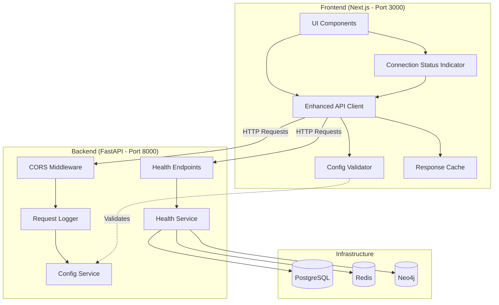
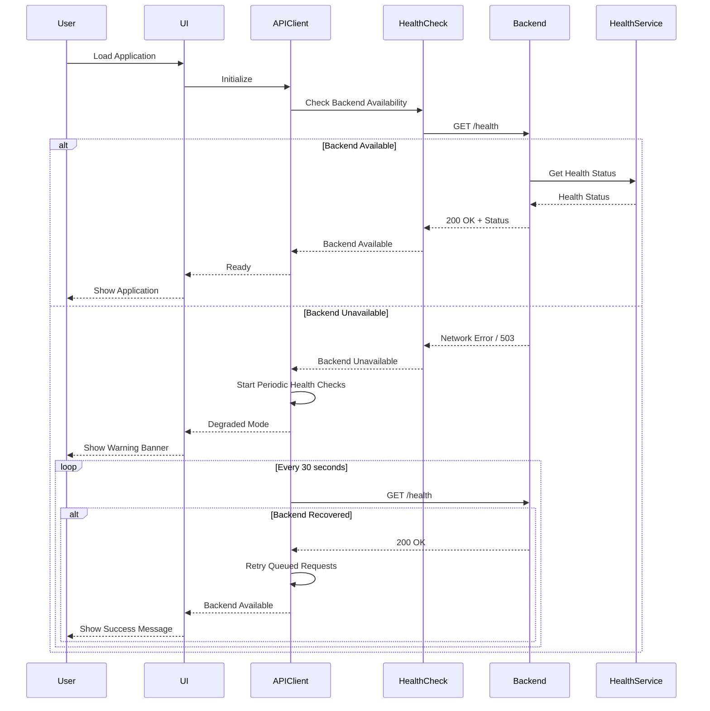

# Design Document: Backend-Frontend Connectivity Improvement

## Overview

This design addresses critical connectivity issues between the Next.js frontend and FastAPI backend by implementing a comprehensive solution that includes:

1. **Unified Configuration Management**: Single source of truth for service URLs and ports
2. **Enhanced Health Monitoring**: Multi-level health checks with detailed status reporting
3. **Resilient API Client**: Automatic retry, circuit breaker, and graceful degradation
4. **Connection Status UI**: Real-time visual feedback for users
5. **Comprehensive Logging**: Detailed connection event tracking for debugging
6. **Configuration Validation**: Pre-startup validation to catch configuration errors

The design follows a layered architecture with clear separation between configuration, connectivity, health monitoring, and user interface concerns.

## Architecture

### System Architecture



### Component Interaction Flow



## Components and Interfaces

### 1. Configuration Service (Backend)

**Purpose**: Centralized configuration management with validation

**Location**: `backend/app/core/config_validator.py`

**Interface**:
```python
class ConfigValidator:
    def validate_all() -> ValidationResult:
        """Validate all configuration settings"""
        
    def validate_required_vars() -> List[str]:
        """Check all required environment variables are set"""
        
    def validate_port_conflicts() -> List[str]:
        """Check for port conflicts between services"""
        
    def validate_urls() -> List[str]:
        """Validate URL formats and accessibility"""
        
    def get_validation_summary() -> dict:
        """Get complete validation summary"""

class ValidationResult:
    is_valid: bool
    errors: List[str]
    warnings: List[str]
    config_summary: dict
```

### 2. Enhanced Health Service (Backend)

**Purpose**: Multi-level health checks with dependency status

**Location**: `backend/app/services/health_service.py` (already exists, will be enhanced)

**Interface**:
```python
class HealthService:
    async def get_health_status() -> HealthStatus:
        """Get overall system health with all dependencies"""
        
    async def get_readiness_status() -> ReadinessStatus:
        """Check if system is ready to accept traffic"""
        
    async def get_liveness_status() -> LivenessStatus:
        """Check if process is alive"""
        
    async def check_dependency(name: str) -> DependencyStatus:
        """Check individual dependency health"""

class HealthStatus:
    status: Literal["healthy", "degraded", "unhealthy"]
    timestamp: datetime
    dependencies: Dict[str, DependencyStatus]
    uptime_seconds: float

class DependencyStatus:
    name: str
    is_connected: bool
    response_time_ms: float
    error: Optional[str]
    last_check: datetime
```

### 3. Enhanced API Client (Frontend)

**Purpose**: Resilient HTTP client with retry, circuit breaker, and caching

**Location**: `frontend/src/lib/api.ts` (will be enhanced)

**Interface**:
```typescript
class EnhancedAPIClient {
    // Configuration
    constructor(config: APIClientConfig)
    
    // Health Management
    checkBackendAvailability(): Promise<boolean>
    getConnectionStatus(): ConnectionStatus
    onStatusChange(callback: (status: ConnectionStatus) => void): void
    
    // Request Methods
    get<T>(url: string, config?: RequestConfig): Promise<T>
    post<T>(url: string, data: any, config?: RequestConfig): Promise<T>
    put<T>(url: string, data: any, config?: RequestConfig): Promise<T>
    delete<T>(url: string, config?: RequestConfig): Promise<T>
    
    // Queue Management
    retryQueuedRequests(): Promise<void>
    clearQueue(): void
    getQueueSize(): number
}

interface ConnectionStatus {
    isAvailable: boolean
    lastCheck: Date
    failureCount: number
    queuedRequests: number
}

interface RequestConfig {
    retry?: boolean
    cache?: boolean
    timeout?: number
}
```

### 4. Connection Status Component (Frontend)

**Purpose**: Visual feedback for connection status

**Location**: `frontend/src/components/ConnectionStatus.tsx`

**Interface**:
```typescript
interface ConnectionStatusProps {
    status: ConnectionStatus
    onRetry?: () => void
}

export function ConnectionStatusBanner(props: ConnectionStatusProps): JSX.Element
export function ConnectionStatusIndicator(props: ConnectionStatusProps): JSX.Element
```

### 5. Response Cache (Frontend)

**Purpose**: Cache successful responses for offline access

**Location**: `frontend/src/lib/cache.ts`

**Interface**:
```typescript
class ResponseCache {
    set(key: string, value: any, ttl: number): void
    get(key: string): any | null
    has(key: string): boolean
    clear(): void
    isStale(key: string): boolean
}
```

### 6. Configuration Validator CLI (Backend)

**Purpose**: Pre-startup configuration validation tool

**Location**: `backend/scripts/validate_config.py`

**Interface**:
```python
def validate_configuration() -> int:
    """
    Validate all configuration and return exit code
    Returns 0 if valid, 1 if invalid
    """

def print_validation_report(result: ValidationResult) -> None:
    """Print formatted validation report"""
```

## Data Models

### Health Status Models

```python
# backend/app/models/health.py

from enum import Enum
from datetime import datetime
from typing import Dict, List, Optional
from pydantic import BaseModel

class HealthStatusEnum(str, Enum):
    HEALTHY = "healthy"
    DEGRADED = "degraded"
    UNHEALTHY = "unhealthy"

class DependencyStatus(BaseModel):
    name: str
    is_connected: bool
    response_time_ms: float
    error: Optional[str] = None
    last_check: datetime

class HealthStatus(BaseModel):
    status: HealthStatusEnum
    timestamp: datetime
    dependencies: Dict[str, DependencyStatus]
    uptime_seconds: float
    
    def to_dict(self) -> dict:
        return {
            "status": self.status.value,
            "timestamp": self.timestamp.isoformat(),
            "dependencies": {
                name: {
                    "is_connected": dep.is_connected,
                    "response_time_ms": dep.response_time_ms,
                    "error": dep.error,
                    "last_check": dep.last_check.isoformat()
                }
                for name, dep in self.dependencies.items()
            },
            "uptime_seconds": self.uptime_seconds
        }

class ReadinessStatus(BaseModel):
    ready: bool
    timestamp: datetime
    checks: Dict[str, bool]
    message: str
    
    def to_dict(self) -> dict:
        return {
            "ready": self.ready,
            "timestamp": self.timestamp.isoformat(),
            "checks": self.checks,
            "message": self.message
        }

class LivenessStatus(BaseModel):
    alive: bool
    timestamp: datetime
    
    def to_dict(self) -> dict:
        return {
            "alive": self.alive,
            "timestamp": self.timestamp.isoformat()
        }
```

### Configuration Models

```python
# backend/app/models/config.py

from typing import List, Dict
from pydantic import BaseModel

class ValidationResult(BaseModel):
    is_valid: bool
    errors: List[str]
    warnings: List[str]
    config_summary: Dict[str, str]
    
    def has_errors(self) -> bool:
        return len(self.errors) > 0
    
    def has_warnings(self) -> bool:
        return len(self.warnings) > 0

class PortConfig(BaseModel):
    service: str
    port: int
    url: str

class ServiceConfig(BaseModel):
    backend_port: int
    backend_url: str
    frontend_port: int
    frontend_url: str
    api_url: str
```

### Frontend Connection Models

```typescript
// frontend/src/types/connection.ts

export enum ConnectionState {
    CONNECTED = 'connected',
    DISCONNECTED = 'disconnected',
    CONNECTING = 'connecting',
    DEGRADED = 'degraded'
}

export interface ConnectionStatus {
    state: ConnectionState
    isAvailable: boolean
    lastCheck: Date
    lastSuccess: Date | null
    failureCount: number
    queuedRequests: number
    downtime: number // milliseconds
}

export interface QueuedRequest {
    id: string
    method: string
    url: string
    data?: any
    timestamp: Date
    retryCount: number
}

export interface CacheEntry {
    key: string
    value: any
    timestamp: Date
    ttl: number
    isStale: boolean
}
```

## Correctness Properties

*A property is a characteristic or behavior that should hold true across all valid executions of a system—essentially, a formal statement about what the system should do. Properties serve as the bridge between human-readable specifications and machine-verifiable correctness guarantees.*


### Property Reflection

After analyzing all acceptance criteria, I've identified the following consolidation opportunities:

**Redundancy Analysis:**

1. **Health Check Properties (4.1, 4.2, 4.4, 4.5)**: These can be partially consolidated. Property 4.1 (overall health status) and 4.4 (response times included) can be combined since response times should always be part of health status. However, 4.2 (readiness) and 4.5 (error messages) provide unique validation.

2. **Logging Properties (8.1, 8.2, 8.3, 8.4, 8.5)**: These are all distinct logging requirements for different events. While they all involve logging, each validates a different aspect (errors, retries, transitions, requests), so they should remain separate.

3. **UI Indicator Properties (6.1, 6.2, 6.3, 6.4)**: These test different UI elements (banner, success notification, status indicator, pending indicator). While all are UI-related, each validates a distinct visual element, so they should remain separate.

4. **Retry and Queue Properties (3.1, 3.2, 3.3)**: Property 3.1 (retry with backoff) and 3.2 (queue on 503) are distinct behaviors. Property 3.3 (retry queued requests) is a consequence of 3.2 but tests a different phase (recovery), so all three should remain.

5. **CORS Properties (5.3, 5.4, 5.5)**: These test different aspects of CORS (preflight headers, credentials, unauthorized rejection) and should remain separate.

6. **Caching Properties (7.4, 7.5)**: Property 7.4 (cache responses) and 7.5 (show stale indicator) are related but test different aspects (caching mechanism vs UI feedback), so both are needed.

**Consolidation Decisions:**
- Combine 4.1 and 4.4 into a single property about health status including response times
- Keep all other properties separate as they provide unique validation value

### Correctness Properties

Property 1: **Configuration Port Consistency**
*For any* set of configuration files (.env, frontend/.env.local, backend/.env), all references to the backend port should resolve to the same value (8000)
**Validates: Requirements 1.4**

Property 2: **Frontend Initialization Validates Backend URL**
*For any* frontend initialization, the API client should attempt to validate that NEXT_PUBLIC_API_URL is accessible before allowing requests
**Validates: Requirements 1.3**

Property 3: **Backend Startup Validates Required Variables**
*For any* backend startup attempt, all required environment variables (JWT_SECRET, POSTGRES_PASSWORD, NEO4J_PASSWORD, etc.) should be validated before the server accepts connections
**Validates: Requirements 2.1**

Property 4: **Missing Variables Cause Startup Failure**
*For any* backend startup with missing required variables, the backend should log descriptive errors for each missing variable and exit with a non-zero status code
**Validates: Requirements 2.2**

Property 5: **Database Failures Allow Degraded Startup**
*For any* backend startup where database connections fail, the backend should log the specific connection errors and continue startup in degraded mode rather than exiting
**Validates: Requirements 2.3**

Property 6: **Health Ready Endpoint Reflects Critical Dependencies**
*For any* request to /health/ready, the endpoint should return 200 only when all critical dependencies (PostgreSQL with migrations applied) are available, and 503 otherwise
**Validates: Requirements 2.5**

Property 7: **Network Errors Trigger Retry with Backoff**
*For any* API request that fails with a network error, the API client should retry the request up to 3 times with exponentially increasing delays (e.g., 1s, 2s, 4s)
**Validates: Requirements 3.1**

Property 8: **503 Status Triggers Queueing**
*For any* non-GET request that receives a 503 status, the API client should mark the backend as unavailable and add the request to a retry queue
**Validates: Requirements 3.2**

Property 9: **Backend Recovery Triggers Queue Retry**
*For any* transition from backend unavailable to available, the API client should automatically attempt to retry all queued requests in order
**Validates: Requirements 3.3**

Property 10: **Periodic Health Checks When Unavailable**
*For any* period where the backend is marked unavailable, the API client should perform health checks at 30-second intervals until the backend becomes available
**Validates: Requirements 3.4**

Property 11: **Failed Requests Return User-Friendly Errors**
*For any* request that fails after all retry attempts, the API client should return an error message that is user-friendly (no stack traces, clear explanation)
**Validates: Requirements 3.5**

Property 12: **Health Status Includes Response Times**
*For any* request to /health, the response should include the overall system health status (healthy/degraded/unhealthy) and response times in milliseconds for each dependency
**Validates: Requirements 4.1, 4.4**

Property 13: **Readiness Check Validates Critical Dependencies**
*For any* request to /health/ready, the response should check PostgreSQL connectivity and migration status, returning 200 only if both are satisfied
**Validates: Requirements 4.2**

Property 14: **Unavailable Dependencies Include Error Messages**
*For any* health check response where a dependency is unavailable, the response should include the specific error message for that dependency
**Validates: Requirements 4.5**

Property 15: **CORS Preflight Returns Correct Headers**
*For any* CORS preflight (OPTIONS) request, the backend should respond with appropriate Access-Control-Allow-Origin, Access-Control-Allow-Methods, and Access-Control-Allow-Headers
**Validates: Requirements 5.3**

Property 16: **CORS Allows Credentials**
*For any* CORS request from an allowed origin, the backend should include Access-Control-Allow-Credentials: true in the response headers
**Validates: Requirements 5.4**

Property 17: **Unauthorized Origins Rejected**
*For any* request from an origin not in the ALLOWED_ORIGINS list, the backend should reject it with a 403 status and log the unauthorized attempt
**Validates: Requirements 5.5**

Property 18: **Backend Unavailable Shows Banner**
*For any* state where the backend is marked unavailable, the frontend UI should display a non-intrusive notification banner informing the user
**Validates: Requirements 6.1**

Property 19: **Backend Recovery Shows Success**
*For any* transition from backend unavailable to available, the frontend should display a success notification and hide the unavailable banner
**Validates: Requirements 6.2**

Property 20: **Connection Status Indicator Reflects State**
*For any* connection state (connected, disconnected, connecting, degraded), the navigation bar should show a visual indicator (icon or badge) that accurately reflects the current state
**Validates: Requirements 6.3**

Property 21: **Queued Requests Show Pending Indicator**
*For any* request that is queued for retry, the UI element that triggered the request should show a pending indicator until the request completes or fails
**Validates: Requirements 6.4**

Property 22: **Backend Unavailable Allows Cached Read Access**
*For any* GET request when the backend is unavailable, the frontend should return cached data if available (within TTL) rather than failing immediately
**Validates: Requirements 7.1**

Property 23: **Backend Unavailable Disables Write UI**
*For any* UI element that requires backend connectivity for write operations (POST, PUT, DELETE), the element should be disabled when the backend is unavailable
**Validates: Requirements 7.2**

Property 24: **Write Attempts Show Clear Message**
*For any* attempt to perform a write operation while the backend is unavailable, the frontend should display a clear message explaining that the operation cannot be completed
**Validates: Requirements 7.3**

Property 25: **GET Responses Cached with TTL**
*For any* successful GET request, the response should be cached with a 5-minute TTL, and subsequent requests to the same endpoint should use the cache if within TTL
**Validates: Requirements 7.4**

Property 26: **Cached Data Shows Stale Indicator**
*For any* UI display of cached data, a visual indicator should be shown to inform the user that the data may be stale
**Validates: Requirements 7.5**

Property 27: **Connection Errors Logged with Details**
*For any* connection error, the API client should log the error with the request URL, HTTP method, and error details (message, code)
**Validates: Requirements 8.1**

Property 28: **Retry Attempts Logged**
*For any* retry attempt, the API client should log the retry attempt number (1, 2, 3) and the delay before the retry
**Validates: Requirements 8.2**

Property 29: **Backend Unavailable Transition Logged**
*For any* transition to backend unavailable state, the API client should log the transition with a timestamp
**Validates: Requirements 8.3**

Property 30: **Backend Recovery Logged with Downtime**
*For any* transition from unavailable to available, the API client should log the recovery with the total downtime duration in seconds or milliseconds
**Validates: Requirements 8.4**

Property 31: **All Requests Logged by Backend**
*For any* incoming HTTP request, the backend should log the request with response status code, duration in milliseconds, and client IP address
**Validates: Requirements 8.5**

Property 32: **Health Check Before Reporting Healthy**
*For any* Docker health check or readiness probe, the backend should verify database connections are established before reporting healthy status
**Validates: Requirements 9.4**

Property 33: **Configuration Validation Reports Missing Variables**
*For any* configuration validation run with missing or invalid variables, the validation should report each missing/invalid variable with a specific error message
**Validates: Requirements 10.2**

Property 34: **Port Conflicts Reported**
*For any* configuration where multiple services are configured to use the same port, the validation should report which services have conflicting port assignments
**Validates: Requirements 10.3**

Property 35: **URL Accessibility Validated**
*For any* configuration validation, the validator should check that the frontend URL can reach the backend URL and vice versa, reporting any accessibility issues
**Validates: Requirements 10.4**

## Error Handling

### Backend Error Handling

1. **Configuration Errors**
   - Missing required variables: Log specific variable names and exit with code 1
   - Invalid variable formats: Log validation error and exit with code 1
   - Port conflicts: Log conflicting services and exit with code 1

2. **Database Connection Errors**
   - PostgreSQL unavailable: Log error, mark as degraded, continue startup
   - Neo4j unavailable: Log error, mark as degraded, continue startup
   - Redis unavailable: Log error, mark as degraded, continue startup
   - Migration failures: Log error, mark as degraded, continue startup

3. **Runtime Errors**
   - Request timeout: Return 504 Gateway Timeout
   - Database query failure: Return 503 Service Unavailable
   - Invalid request: Return 400 Bad Request with validation details

### Frontend Error Handling

1. **Network Errors**
   - Connection refused: Mark backend unavailable, start health checks
   - Timeout: Retry with exponential backoff (up to 3 times)
   - DNS failure: Mark backend unavailable, show error banner

2. **HTTP Errors**
   - 503 Service Unavailable: Queue request (if not GET), mark backend unavailable
   - 500 Internal Server Error: Retry up to 3 times
   - 401 Unauthorized: Clear auth token, redirect to login
   - 403 Forbidden: Show access denied message
   - 404 Not Found: Show not found message (don't retry)

3. **Cache Errors**
   - Cache miss: Proceed with backend request
   - Cache expired: Proceed with backend request, update cache on success
   - Cache corruption: Clear cache entry, proceed with backend request

### Error Recovery Strategies

1. **Automatic Recovery**
   - Retry failed requests with exponential backoff
   - Periodic health checks to detect backend recovery
   - Automatic queue processing on recovery

2. **Manual Recovery**
   - "Retry Connection" button in error banner
   - "Refresh" button to clear cache and retry
   - "Clear Queue" option to discard pending requests

3. **Graceful Degradation**
   - Show cached data when backend unavailable
   - Disable write operations when backend unavailable
   - Allow read-only access to cached content

## Testing Strategy

### Dual Testing Approach

This feature requires both unit tests and property-based tests for comprehensive coverage:

- **Unit tests**: Verify specific examples, edge cases, and error conditions
- **Property tests**: Verify universal properties across all inputs
- Both approaches are complementary and necessary

### Unit Testing Focus

Unit tests should focus on:
- Specific configuration examples (valid, invalid, missing variables)
- Edge cases (empty cache, full queue, simultaneous requests)
- Integration points (health endpoints, CORS middleware, logging)
- Error conditions (network failures, database failures, timeouts)

Avoid writing too many unit tests - property-based tests handle covering lots of inputs.

### Property-Based Testing

**Library Selection:**
- **Backend (Python)**: Use `hypothesis` for property-based testing
- **Frontend (TypeScript)**: Use `fast-check` for property-based testing

**Configuration:**
- Minimum 100 iterations per property test
- Each test must reference its design document property
- Tag format: `Feature: backend-frontend-connectivity-improvement, Property {number}: {property_text}`

**Property Test Examples:**

```python
# Backend property test example
from hypothesis import given, strategies as st

@given(
    postgres_available=st.booleans(),
    neo4j_available=st.booleans(),
    redis_available=st.booleans()
)
def test_health_ready_reflects_dependencies(postgres_available, neo4j_available, redis_available):
    """
    Feature: backend-frontend-connectivity-improvement
    Property 6: Health Ready Endpoint Reflects Critical Dependencies
    
    For any request to /health/ready, the endpoint should return 200 only when
    all critical dependencies (PostgreSQL with migrations applied) are available
    """
    # Setup: Mock database connections based on availability
    # Execute: Call /health/ready endpoint
    # Assert: Status code is 200 only if postgres_available is True
```

```typescript
// Frontend property test example
import fc from 'fast-check';

test('Property 7: Network Errors Trigger Retry with Backoff', () => {
  fc.assert(
    fc.property(
      fc.string(), // url
      fc.constantFrom('GET', 'POST', 'PUT', 'DELETE'), // method
      fc.integer({ min: 1, max: 10 }), // failure count
      async (url, method, failureCount) => {
        // Feature: backend-frontend-connectivity-improvement
        // Property 7: Network Errors Trigger Retry with Backoff
        
        // Setup: Mock network failures
        // Execute: Make request that fails
        // Assert: Verify 3 retry attempts with exponential backoff
      }
    ),
    { numRuns: 100 }
  );
});
```

### Integration Testing

Integration tests should verify:
1. End-to-end request flow from frontend to backend
2. Health check integration with Docker Compose
3. CORS configuration with actual browser requests
4. Cache behavior with real backend responses
5. Queue processing during backend recovery

### Manual Testing Scenarios

1. **Port Mismatch**: Change frontend .env.local to wrong port, verify error banner
2. **Backend Crash**: Stop backend, verify frontend shows unavailable state
3. **Backend Recovery**: Restart backend, verify frontend recovers automatically
4. **Database Failure**: Stop PostgreSQL, verify backend reports degraded status
5. **Configuration Validation**: Run validation with missing variables, verify error messages
