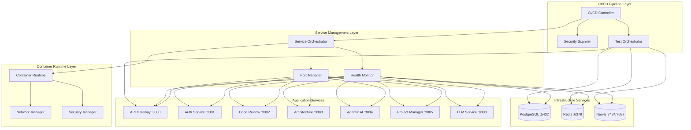

# Design Document: CI/CD Pipeline Fixes

## Overview

This design addresses critical CI/CD pipeline failures and service connectivity issues in the multi-service AI Code Review Platform. The solution implements intelligent port conflict resolution, robust service health monitoring, stable test environments, automated security compliance, and hardened container configurations.

The design focuses on creating a resilient infrastructure that can automatically recover from common deployment issues while maintaining security standards. It introduces dynamic port management, comprehensive health checks, isolated test environments, and integrated security scanning to ensure reliable CI/CD pipeline execution.

## Architecture

The CI/CD pipeline fixes follow a comprehensive infrastructure management approach:



## Components and Interfaces

### Port Manager

The Port Manager handles dynamic port allocation and conflict resolution:

```python
class PortManager:
    def __init__(self):
        self.port_registry: Dict[str, int] = {}
        self.reserved_ports: Set[int] = set()
        self.port_ranges = {
            'api_services': (3000, 3099),
            'backend_services': (8000, 8099),
            'infrastructure': (5000, 5999)
        }
    
    def allocate_port(self, service_name: str, preferred_port: int = None) -> int:
        """Allocate an available port for a service"""
        pass
    
    def release_port(self, service_name: str) -> None:
        """Release a port when service stops"""
        pass
    
    def check_port_availability(self, port: int) -> bool:
        """Check if a port is available"""
        pass
    
    def get_service_port(self, service_name: str) -> Optional[int]:
        """Get the current port for a service"""
        pass
```

### Health Monitor

The Health Monitor provides comprehensive service health checking:

```python
class HealthMonitor:
    def __init__(self):
        self.health_checks: Dict[str, HealthCheck] = {}
        self.retry_config = RetryConfig(
            max_attempts=5,
            base_delay=1.0,
            max_delay=30.0,
            exponential_base=2.0
        )
    
    def register_service(self, service_name: str, health_check: HealthCheck) -> None:
        """Register a service for health monitoring"""
        pass
    
    def check_service_health(self, service_name: str) -> HealthStatus:
        """Check the health of a specific service"""
        pass
    
    def check_all_services(self) -> Dict[str, HealthStatus]:
        """Check health of all registered services"""
        pass
    
    def wait_for_service(self, service_name: str, timeout: int = 60) -> bool:
        """Wait for a service to become healthy"""
        pass
```

### Service Orchestrator

The Service Orchestrator manages service lifecycle and dependencies:

```python
class ServiceOrchestrator:
    def __init__(self, port_manager: PortManager, health_monitor: HealthMonitor):
        self.port_manager = port_manager
        self.health_monitor = health_monitor
        self.service_dependencies: Dict[str, List[str]] = {}
        self.startup_order: List[str] = []
    
    def define_dependencies(self, service_name: str, dependencies: List[str]) -> None:
        """Define service dependencies"""
        pass
    
    def start_services(self, services: List[str]) -> bool:
        """Start services in dependency order"""
        pass
    
    def stop_services(self, services: List[str]) -> None:
        """Stop services gracefully"""
        pass
    
    def restart_service(self, service_name: str) -> bool:
        """Restart a failed service"""
        pass
```

### Test Environment Manager

The Test Environment Manager provides isolated test execution:

```python
class TestEnvironmentManager:
    def __init__(self):
        self.test_containers: Dict[str, Container] = {}
        self.test_networks: Dict[str, Network] = {}
        self.cleanup_handlers: List[Callable] = []
    
    def create_test_environment(self, test_suite: str) -> TestEnvironment:
        """Create isolated test environment"""
        pass
    
    def setup_test_services(self, environment: TestEnvironment) -> None:
        """Setup required services for testing"""
        pass
    
    def cleanup_test_environment(self, environment: TestEnvironment) -> None:
        """Clean up test environment resources"""
        pass
    
    def run_test_suite(self, test_suite: str, environment: TestEnvironment) -> TestResult:
        """Execute test suite in isolated environment"""
        pass
```

### Security Scanner

The Security Scanner provides automated security compliance validation:

```python
class SecurityScanner:
    def __init__(self):
        self.vulnerability_db = VulnerabilityDatabase()
        self.security_policies = SecurityPolicies()
        self.scan_results: Dict[str, ScanResult] = {}
    
    def scan_container_image(self, image_name: str) -> ScanResult:
        """Scan container image for vulnerabilities"""
        pass
    
    def scan_dependencies(self, requirements_file: str) -> ScanResult:
        """Scan dependencies for known vulnerabilities"""
        pass
    
    def validate_configuration(self, config: Dict) -> ValidationResult:
        """Validate configuration against security policies"""
        pass
    
    def generate_compliance_report(self) -> ComplianceReport:
        """Generate security compliance report"""
        pass
```

### Container Security Manager

The Container Security Manager enforces security hardening:

```python
class ContainerSecurityManager:
    def __init__(self):
        self.security_policies = ContainerSecurityPolicies()
        self.user_mappings: Dict[str, int] = {}
        self.resource_limits: Dict[str, ResourceLimits] = {}
    
    def apply_security_hardening(self, container_config: ContainerConfig) -> ContainerConfig:
        """Apply security hardening to container configuration"""
        pass
    
    def create_non_root_user(self, container_name: str) -> UserConfig:
        """Create non-root user for container"""
        pass
    
    def set_resource_limits(self, container_name: str, limits: ResourceLimits) -> None:
        """Set resource limits for container"""
        pass
    
    def configure_network_isolation(self, container_name: str, network_policy: NetworkPolicy) -> None:
        """Configure network isolation for container"""
        pass
```

## Data Models

### Port Registry

```python
@dataclass
class PortAllocation:
    service_name: str
    port: int
    allocated_at: datetime
    status: PortStatus
    
@dataclass
class PortRange:
    start: int
    end: int
    category: str
    reserved_ports: Set[int]
```

### Health Check Configuration

```python
@dataclass
class HealthCheck:
    endpoint: str
    method: str = "GET"
    expected_status: int = 200
    timeout: int = 10
    headers: Dict[str, str] = field(default_factory=dict)
    
@dataclass
class HealthStatus:
    service_name: str
    status: ServiceStatus
    response_time: float
    last_check: datetime
    error_message: Optional[str] = None
```

### Test Environment Configuration

```python
@dataclass
class TestEnvironment:
    environment_id: str
    test_suite: str
    containers: List[Container]
    networks: List[Network]
    volumes: List[Volume]
    created_at: datetime
    
@dataclass
class TestResult:
    test_suite: str
    environment_id: str
    status: TestStatus
    duration: float
    passed_tests: int
    failed_tests: int
    error_logs: List[str]
```

### Security Scan Results

```python
@dataclass
class Vulnerability:
    cve_id: str
    severity: VulnerabilitySeverity
    description: str
    affected_package: str
    fixed_version: Optional[str]
    
@dataclass
class ScanResult:
    scan_id: str
    target: str
    scan_type: ScanType
    vulnerabilities: List[Vulnerability]
    compliance_score: float
    scan_duration: float
    recommendations: List[str]
```

### Container Security Configuration

```python
@dataclass
class ContainerSecurityConfig:
    run_as_non_root: bool = True
    read_only_root_filesystem: bool = True
    drop_capabilities: List[str] = field(default_factory=lambda: ["ALL"])
    add_capabilities: List[str] = field(default_factory=list)
    security_opt: List[str] = field(default_factory=list)
    
@dataclass
class ResourceLimits:
    memory: str
    cpu: str
    pids_limit: int
    ulimits: Dict[str, int]
```
## Correctness Properties

*A property is a characteristic or behavior that should hold true across all valid executions of a system—essentially, a formal statement about what the system should do. Properties serve as the bridge between human-readable specifications and machine-verifiable correctness guarantees.*

### Property 1: Port Allocation Consistency
*For any* service requesting a port, the Port_Manager should allocate an available port within the appropriate range and maintain accurate registry state
**Validates: Requirements 1.1, 1.2, 1.5**

### Property 2: Configuration Update Propagation
*For any* port assignment change, all dependent service configurations should be updated to reflect the new port assignment
**Validates: Requirements 1.3**

### Property 3: Concurrent Port Allocation Safety
*For any* set of services starting simultaneously, no two services should receive the same port allocation
**Validates: Requirements 1.4**

### Property 4: Health Monitoring Reliability
*For any* service, health monitoring should complete within specified timeouts, implement proper retry logic for failures, and trigger automatic recovery when needed
**Validates: Requirements 2.1, 2.2, 2.3**

### Property 5: Service Endpoint Validation
*For any* service endpoint, the Health_Monitor should validate responses match expected criteria and provide detailed diagnostics for failures
**Validates: Requirements 2.4, 2.6**

### Property 6: Dependency-Ordered Startup
*For any* set of interdependent services, the Service_Orchestrator should start them in proper dependency order
**Validates: Requirements 2.5**

### Property 7: Test Environment Isolation
*For any* test suite execution, the Test_Environment should provide isolated resources, clean database state, and complete resource cleanup afterward
**Validates: Requirements 3.1, 3.2, 3.4**

### Property 8: Test Mocking Consistency
*For any* frontend test execution, backend service mocks should behave consistently across test runs
**Validates: Requirements 3.3**

### Property 9: Test Failure Diagnostics
*For any* test failure, the Test_Environment should capture comprehensive logs and diagnostic information
**Validates: Requirements 3.5**

### Property 10: Parallel Test Isolation
*For any* parallel test execution, tests should not interfere with each other's execution or results
**Validates: Requirements 3.6**

### Property 11: Security-Based Deployment Blocking
*For any* deployment with detected vulnerabilities, the CI_CD_Pipeline should block deployment and provide remediation guidance
**Validates: Requirements 4.1, 4.3**

### Property 12: Container Security Validation
*For any* container image, the Security_Scanner should validate against security policies and enforce secure configuration standards
**Validates: Requirements 4.2, 4.4**

### Property 13: Security Compliance Reporting
*For any* completed security scan, a compliance report should be generated with vulnerability details and compliance scores
**Validates: Requirements 4.5**

### Property 14: Multi-Stage Security Integration
*For any* CI/CD pipeline execution, security scanning should occur at all specified pipeline stages
**Validates: Requirements 4.6**

### Property 15: Container Security Hardening
*For any* container deployment, security hardening should be applied including non-root users, resource limits, and configuration validation
**Validates: Requirements 5.1, 5.2, 5.5**

### Property 16: Filesystem Security Enforcement
*For any* container where read-only filesystem is applicable, the Container_Runtime should enforce read-only filesystem usage
**Validates: Requirements 5.3**

### Property 17: Network Segmentation Implementation
*For any* service deployment, proper network segmentation should be implemented between services
**Validates: Requirements 5.4**

### Property 18: Security Event Audit Logging
*For any* security-relevant event, the Container_Runtime should log the event with sufficient detail for audit purposes
**Validates: Requirements 5.6**

## Error Handling

### Port Conflict Resolution
- **Port Unavailable**: Automatically try next available port in range
- **Range Exhaustion**: Log critical error and fail gracefully with clear message
- **Registry Corruption**: Rebuild registry from current system state
- **Race Conditions**: Use atomic operations with retry logic

### Service Health Failures
- **Connection Refused**: Implement exponential backoff with maximum retry limit
- **Timeout Errors**: Increase timeout gradually up to maximum threshold
- **Invalid Responses**: Log detailed response information and mark service unhealthy
- **Dependency Failures**: Cascade health status to dependent services

### Test Environment Issues
- **Resource Cleanup Failures**: Force cleanup with system-level commands
- **Isolation Breaches**: Terminate affected test environments immediately
- **Database State Corruption**: Reset to clean snapshot or rebuild
- **Mock Service Failures**: Restart mock services with fresh configuration

### Security Compliance Failures
- **Vulnerability Detection**: Block deployment and generate detailed report
- **Policy Violations**: Provide specific remediation steps
- **Scan Timeouts**: Retry with extended timeout or manual intervention
- **False Positives**: Allow manual override with justification logging

### Container Security Issues
- **Privilege Escalation**: Terminate container and log security incident
- **Resource Limit Breaches**: Enforce limits and restart container
- **Configuration Violations**: Reject deployment with specific error details
- **Network Policy Violations**: Block network access and alert security team

## Testing Strategy

### Dual Testing Approach

The testing strategy employs both unit testing and property-based testing to ensure comprehensive coverage:

**Unit Tests**: Focus on specific examples, edge cases, and error conditions
- Port conflict scenarios with specific port numbers
- Health check failures with known error responses  
- Test environment setup with specific service configurations
- Security scan results with known vulnerabilities
- Container security violations with specific misconfigurations

**Property Tests**: Verify universal properties across all inputs using property-based testing
- Each correctness property will be implemented as a property-based test
- Minimum 100 iterations per property test to ensure comprehensive input coverage
- Tests will use randomized inputs to discover edge cases automatically

### Property-Based Testing Configuration

**Testing Framework**: Use Hypothesis (Python) for property-based testing
- Configure each test to run minimum 100 iterations
- Use custom generators for service configurations, port ranges, and security policies
- Tag each test with reference to design document property

**Test Tagging Format**: 
```python
# Feature: ci-cd-pipeline-fixes, Property 1: Port Allocation Consistency
@given(service_name=text(), preferred_port=integers(min_value=1024, max_value=65535))
def test_port_allocation_consistency(service_name, preferred_port):
    # Test implementation
```

**Coverage Requirements**:
- Each correctness property must be implemented by exactly one property-based test
- Unit tests complement property tests by covering specific integration scenarios
- Integration tests verify end-to-end pipeline behavior with real services

### Test Environment Configuration

**Isolated Test Execution**:
- Each test suite runs in isolated Docker containers
- Database state reset between test runs
- Network isolation prevents test interference
- Resource cleanup verified after each test completion

**Mock Service Management**:
- Consistent mock behavior across test runs
- Configurable response patterns for different test scenarios
- Automatic mock service restart on failure
- Mock service health monitoring during tests

**Security Testing Integration**:
- Automated vulnerability injection for security tests
- Container security policy validation in test environments
- Compliance report generation during test execution
- Security scan integration with CI/CD pipeline tests