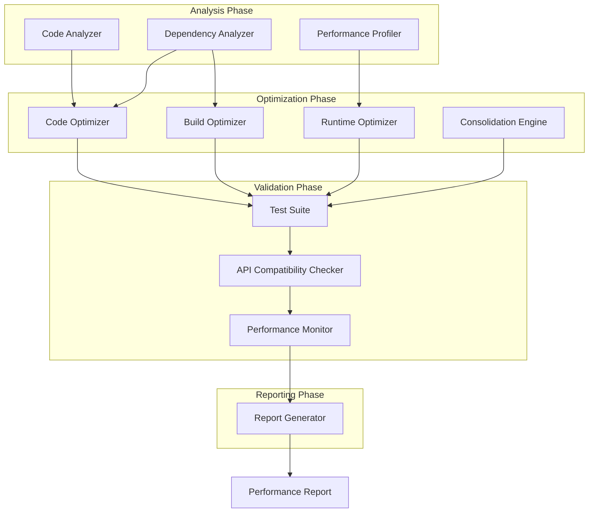

# Design Document: Comprehensive Project Optimization

## Overview

This design describes a comprehensive optimization system for a full-stack application consisting of a Python/FastAPI backend and Next.js/React TypeScript frontend. The system implements automated analysis, refactoring, and optimization across multiple dimensions: code volume reduction (≥30%), build time reduction (≥20%), and runtime memory reduction (≥15%). The design emphasizes maintaining API compatibility while improving code quality through comprehensive testing and consolidation of duplicate resources.

The optimization system operates in phases: analysis, optimization, validation, and reporting. Each phase is designed to be incremental and reversible, allowing for safe application of optimizations with continuous validation against regression tests and API compatibility checks.

## Architecture

### High-Level Architecture



### Component Interaction Flow

1. **Analysis Phase**: Scanners analyze codebase, dependencies, and runtime behavior
2. **Optimization Phase**: Optimizers apply transformations based on analysis results
3. **Validation Phase**: Test suite validates changes, compatibility checker ensures API contracts preserved
4. **Reporting Phase**: Performance monitor compares metrics and generates comprehensive report

### Technology Stack Integration

- **Backend Analysis**: Python AST parsing, static analysis tools (pylint, mypy), dependency graph analysis
- **Frontend Analysis**: TypeScript compiler API, webpack bundle analyzer, ESLint
- **Build Tools**: Webpack/Next.js build system, tree-shaking via Rollup/Terser
- **Testing**: pytest (backend), Jest/Vitest (frontend), Playwright (integration)
- **Performance Monitoring**: memory-profiler (Python), Chrome DevTools Protocol (frontend)

## Components and Interfaces

### 1. Code Analyzer

**Purpose**: Identifies optimization opportunities in source code

**Interface**:
```typescript
interface CodeAnalyzer {
  scanCodebase(rootPath: string): AnalysisReport
  identifyDuplicates(files: FileNode[]): DuplicateReport
  findDeadCode(entryPoints: string[]): DeadCodeReport
  analyzeComplexity(files: FileNode[]): ComplexityReport
}

interface AnalysisReport {
  totalFiles: number
  totalLines: number
  duplicateBlocks: DuplicateBlock[]
  deadCodeLocations: CodeLocation[]
  complexityHotspots: ComplexityMetric[]
}

interface DuplicateBlock {
  locations: CodeLocation[]
  similarity: number
  linesOfCode: number
  suggestedRefactoring: RefactoringStrategy
}
```

**Responsibilities**:
- Parse source files using language-specific AST parsers
- Detect duplicate code blocks using token-based similarity analysis
- Identify unreferenced functions, classes, and modules
- Calculate cyclomatic complexity and identify refactoring candidates
- Generate actionable optimization recommendations

### 2. Dependency Analyzer

**Purpose**: Analyzes and optimizes project dependencies

**Interface**:
```typescript
interface DependencyAnalyzer {
  analyzeDependencies(manifestPath: string): DependencyReport
  findUnusedDependencies(usageMap: UsageMap): string[]
  detectDuplicateVersions(): DuplicateVersionReport
  checkForUpdates(): UpdateReport
}

interface DependencyReport {
  directDependencies: Dependency[]
  transitiveDependencies: Dependency[]
  unusedDependencies: string[]
  outdatedDependencies: OutdatedDependency[]
  duplicateVersions: DuplicateVersion[]
}

interface Dependency {
  name: string
  version: string
  size: number
  usageCount: number
}
```

**Responsibilities**:
- Parse package.json, requirements.txt, and lock files
- Build dependency graph showing direct and transitive dependencies
- Track actual usage of imported modules
- Identify unused dependencies safe for removal
- Detect version conflicts and suggest resolutions

### 3. Code Optimizer

**Purpose**: Applies code-level optimizations and refactorings

**Interface**:
```typescript
interface CodeOptimizer {
  removeDuplicates(duplicates: DuplicateBlock[]): OptimizationResult
  removeDeadCode(deadCode: CodeLocation[]): OptimizationResult
  consolidateUtilities(utilities: UtilityFunction[]): OptimizationResult
  refactorForModularity(violations: ArchitectureViolation[]): OptimizationResult
}

interface OptimizationResult {
  filesModified: string[]
  linesRemoved: number
  linesAdded: number
  netReduction: number
  backupPath: string
}
```

**Responsibilities**:
- Extract duplicate code into reusable functions/modules
- Remove unreferenced code while preserving functionality
- Consolidate utility functions into shared libraries
- Refactor monolithic modules into focused components
- Maintain backup of original code for rollback

### 4. Build Optimizer

**Purpose**: Optimizes build configuration and bundle generation

**Interface**:
```typescript
interface BuildOptimizer {
  enableTreeShaking(config: BuildConfig): BuildConfig
  implementCodeSplitting(routes: Route[]): SplitConfig
  configureLazyLoading(components: Component[]): LazyLoadConfig
  optimizeDependencies(deps: Dependency[]): DependencyConfig
}

interface BuildConfig {
  treeShaking: boolean
  minification: MinificationConfig
  sourceMaps: boolean
  splitChunks: SplitChunksConfig
}

interface SplitConfig {
  routeChunks: ChunkDefinition[]
  vendorChunks: ChunkDefinition[]
  commonChunks: ChunkDefinition[]
}
```

**Responsibilities**:
- Configure webpack/Next.js for optimal tree-shaking
- Define code splitting strategy for routes and components
- Implement dynamic imports for lazy loading
- Optimize chunk sizes and loading priorities
- Configure build caching for faster rebuilds

### 5. Runtime Optimizer

**Purpose**: Optimizes runtime performance and memory usage

**Interface**:
```typescript
interface RuntimeOptimizer {
  optimizeMemoryUsage(profile: MemoryProfile): OptimizationPlan
  implementCaching(accessPatterns: AccessPattern[]): CacheConfig
  optimizeQueries(queries: DatabaseQuery[]): QueryOptimization[]
  configureResourcePooling(resources: Resource[]): PoolConfig
}

interface MemoryProfile {
  peakUsage: number
  averageUsage: number
  allocationHotspots: AllocationSite[]
  leakSuspects: LeakCandidate[]
}

interface CacheConfig {
  strategy: 'LRU' | 'LFU' | 'TTL'
  maxSize: number
  ttl: number
  invalidationRules: InvalidationRule[]
}
```

**Responsibilities**:
- Profile memory usage patterns
- Implement memory-bounded caches with appropriate eviction policies
- Optimize database query patterns (connection pooling, result streaming)
- Configure resource pooling for connections and workers
- Implement proper cleanup and disposal patterns

### 6. Test Suite

**Purpose**: Validates optimizations through comprehensive testing

**Interface**:
```typescript
interface TestSuite {
  runUnitTests(scope: TestScope): TestResult
  runIntegrationTests(endpoints: Endpoint[]): TestResult
  runPerformanceTests(benchmarks: Benchmark[]): PerformanceResult
  runRegressionTests(baseline: TestBaseline): RegressionResult
}

interface TestResult {
  totalTests: number
  passed: number
  failed: number
  skipped: number
  coverage: CoverageReport
  duration: number
}

interface PerformanceResult extends TestResult {
  benchmarks: BenchmarkResult[]
  regressions: PerformanceRegression[]
}
```

**Responsibilities**:
- Execute unit tests for modified modules
- Run integration tests for API endpoints and service interactions
- Execute performance benchmarks measuring response time and throughput
- Compare results against baseline to detect regressions
- Generate coverage reports showing test completeness

### 7. API Compatibility Checker

**Purpose**: Ensures API contracts remain unchanged after optimization

**Interface**:
```typescript
interface APICompatibilityChecker {
  captureAPISignatures(endpoints: Endpoint[]): APIBaseline
  validateCompatibility(baseline: APIBaseline, current: APIBaseline): CompatibilityReport
  checkRequestSchemas(endpoint: Endpoint): SchemaValidation
  checkResponseSchemas(endpoint: Endpoint): SchemaValidation
}

interface APIBaseline {
  endpoints: EndpointSignature[]
  schemas: SchemaDefinition[]
  version: string
  capturedAt: Date
}

interface CompatibilityReport {
  compatible: boolean
  breakingChanges: BreakingChange[]
  warnings: CompatibilityWarning[]
}
```

**Responsibilities**:
- Capture API endpoint signatures before optimization
- Validate request/response schemas match original specifications
- Detect breaking changes in API contracts
- Verify HTTP status codes and error responses
- Generate compatibility report with detailed findings

### 8. Performance Monitor

**Purpose**: Measures and reports optimization metrics

**Interface**:
```typescript
interface PerformanceMonitor {
  captureBaseline(): PerformanceBaseline
  measureOptimizations(): PerformanceMetrics
  compareMetrics(baseline: PerformanceBaseline, current: PerformanceMetrics): ComparisonReport
  generateReport(comparison: ComparisonReport): PerformanceReport
}

interface PerformanceBaseline {
  codeMetrics: CodeMetrics
  buildMetrics: BuildMetrics
  runtimeMetrics: RuntimeMetrics
  timestamp: Date
}

interface CodeMetrics {
  totalFiles: number
  totalLines: number
  dependencyCount: number
  duplicateCodePercentage: number
}

interface BuildMetrics {
  totalBuildTime: number
  bundleSize: number
  chunkCount: number
}

interface RuntimeMetrics {
  peakMemory: number
  averageMemory: number
  averageResponseTime: number
  throughput: number
}
```

**Responsibilities**:
- Capture baseline metrics before optimization
- Measure post-optimization metrics
- Calculate percentage improvements
- Identify which optimizations contributed most
- Generate comprehensive performance report

### 9. Consolidation Engine

**Purpose**: Merges duplicate scripts, documentation, and configurations

**Interface**:
```typescript
interface ConsolidationEngine {
  consolidateScripts(scripts: Script[]): ConsolidationResult
  consolidateDocumentation(docs: Document[]): ConsolidationResult
  consolidateConfigs(configs: ConfigFile[]): ConsolidationResult
  updateReferences(oldPaths: string[], newPath: string): void
}

interface ConsolidationResult {
  originalCount: number
  consolidatedCount: number
  filesRemoved: string[]
  filesCreated: string[]
  referencesUpdated: number
}
```

**Responsibilities**:
- Identify duplicate or similar scripts
- Merge scripts into parameterized versions
- Consolidate redundant documentation
- Create hierarchical configuration system
- Update all references to consolidated resources

## Data Models

### Analysis Models

```typescript
interface CodeLocation {
  filePath: string
  startLine: number
  endLine: number
  startColumn: number
  endColumn: number
}

interface FileNode {
  path: string
  content: string
  ast: ASTNode
  imports: Import[]
  exports: Export[]
  size: number
}

interface ComplexityMetric {
  location: CodeLocation
  cyclomaticComplexity: number
  cognitiveComplexity: number
  linesOfCode: number
  suggestedRefactoring: string
}
```

### Optimization Models

```typescript
interface RefactoringStrategy {
  type: 'extract-function' | 'extract-module' | 'inline' | 'merge'
  targetLocation: CodeLocation
  newModulePath?: string
  parameters?: Parameter[]
}

interface ChunkDefinition {
  name: string
  files: string[]
  priority: 'high' | 'medium' | 'low'
  loadStrategy: 'eager' | 'lazy' | 'prefetch'
}

interface QueryOptimization {
  originalQuery: string
  optimizedQuery: string
  improvement: string
  estimatedSpeedup: number
}
```

### Testing Models

```typescript
interface Benchmark {
  name: string
  operation: () => Promise<void>
  iterations: number
  warmupIterations: number
}

interface BenchmarkResult {
  name: string
  averageTime: number
  minTime: number
  maxTime: number
  standardDeviation: number
  throughput: number
}

interface CoverageReport {
  linesCovered: number
  linesTotal: number
  branchesCovered: number
  branchesTotal: number
  functionsCovered: number
  functionsTotal: number
  percentage: number
}
```

### Reporting Models

```typescript
interface ComparisonReport {
  codeVolumeReduction: number // percentage
  buildTimeReduction: number // percentage
  memoryReduction: number // percentage
  detailedBreakdown: OptimizationBreakdown[]
  goalsAchieved: GoalStatus[]
}

interface OptimizationBreakdown {
  category: string
  contribution: number // percentage of total improvement
  details: string
}

interface GoalStatus {
  goal: string
  target: number
  achieved: number
  status: 'met' | 'exceeded' | 'not-met'
}
```

## Correctness Properties

*A property is a characteristic or behavior that should hold true across all valid executions of a system—essentially, a formal statement about what the system should do. Properties serve as the bridge between human-readable specifications and machine-verifiable correctness guarantees.*


### Property Reflection

After analyzing all acceptance criteria, several redundancies were identified:

**Redundant Properties Eliminated:**
- 2.2 (bundle size reduction) is implied by 2.1 (tree-shaking eliminates unused exports)
- 2.4 (separate bundles) is implied by 2.3 (code splitting implementation)
- 2.6 (deferred loading) is implied by 2.5 (lazy loading implementation)
- 3.4 (cache memory limits) is implied by 3.3 (memory-bounded caches)
- 4.7 (request/response schemas) is implied by 4.6 (API contracts include schemas)
- 8.2 and 8.3 are duplicates of 1.3 and 1.4 (unused dependency detection and removal)

**Properties Combined:**
- 6.5, 6.6, 6.7 can be combined into a single property about report completeness
- 10.3, 10.4, 10.5 can be combined into a single property about API schema compatibility

### Core Properties

Property 1: Duplicate Code Detection Completeness
*For any* codebase with duplicate code blocks, the Code_Analyzer should identify all blocks with similarity above the configured threshold
**Validates: Requirements 1.1**

Property 2: Unused Dependency Detection Completeness
*For any* project with unused dependencies, the Code_Analyzer should identify all dependencies that are declared but never imported or used
**Validates: Requirements 1.3**

Property 3: Dependency Removal Correctness
*For any* set of unused dependencies, after removal by the Optimization_System, none of the removed dependencies should appear in any package manifest files
**Validates: Requirements 1.4**

Property 4: Dead Code Detection Completeness
*For any* codebase with unreferenced functions, classes, or modules, the Code_Analyzer should identify all elements that are never called or imported
**Validates: Requirements 1.5**

Property 5: Dead Code Removal Safety
*For any* codebase, after dead code removal, all existing tests should continue to pass with identical results
**Validates: Requirements 1.6**

Property 6: Business Logic Consolidation Equivalence
*For any* set of similar business logic modules, the consolidated module should produce identical outputs for all inputs compared to the original modules
**Validates: Requirements 1.7**

Property 7: Utility Function Consolidation Equivalence
*For any* set of duplicate utility functions, the consolidated shared library functions should produce identical outputs for all inputs compared to the original functions
**Validates: Requirements 1.8**

Property 8: Style Consolidation Equivalence
*For any* set of duplicate CSS and styling code, the consolidated styles should produce identical visual rendering for all components
**Validates: Requirements 1.9**

Property 9: Tree-Shaking Effectiveness
*For any* frontend bundle processed with tree-shaking, all unused exports should be eliminated from the final bundle
**Validates: Requirements 2.1**

Property 10: Code Splitting Correctness
*For any* application with code splitting implemented, each route and large component should have a separate bundle that loads independently
**Validates: Requirements 2.3**

Property 11: Lazy Loading Correctness
*For any* component configured for lazy loading, the component code should not be loaded until it is actually needed
**Validates: Requirements 2.5**

Property 12: Dependency Graph Optimization
*For any* optimized dependency graph, there should be no redundant imports where the same module is imported multiple times in the same scope
**Validates: Requirements 2.7**

Property 13: Build Time Reduction Achievement
*For any* optimized build process, the total build duration should be at least 20% less than the baseline build duration
**Validates: Requirements 2.8**

Property 14: Memory Optimization Effectiveness
*For any* memory-intensive operation identified and optimized, the memory allocation should be measurably reduced compared to the original implementation
**Validates: Requirements 3.2**

Property 15: Cache Memory Bounds
*For any* memory-bounded cache implementation, the cache memory usage should never exceed the configured maximum limit
**Validates: Requirements 3.3**

Property 16: Resource Cleanup Completeness
*For any* resource with a lifecycle (connections, file handles, etc.), proper cleanup and disposal should occur when the resource is no longer needed
**Validates: Requirements 3.5**

Property 17: Memory Reduction Achievement
*For any* optimized runtime, the peak memory usage should be at least 15% less than the baseline peak memory usage
**Validates: Requirements 3.6**

Property 18: Query Optimization Correctness
*For any* database query with connection pooling or result streaming, the query should return identical results to the original implementation
**Validates: Requirements 3.7**

Property 19: Unit Test Preservation
*For any* optimization applied, 100% of existing unit tests should continue to pass with identical results
**Validates: Requirements 4.1**

Property 20: Test Coverage Adequacy
*For any* modified module, unit tests should achieve at least 80% code coverage
**Validates: Requirements 4.2**

Property 21: Integration Test Coverage
*For any* critical API endpoint or service interaction, there should be at least one integration test validating the interaction
**Validates: Requirements 4.3**

Property 22: Integration Test Performance
*For any* integration test executed, the response time should be within acceptable thresholds defined in the test configuration
**Validates: Requirements 4.4**

Property 23: Performance Benchmark Completeness
*For any* key operation identified, there should be a performance benchmark measuring response time, throughput, and resource usage
**Validates: Requirements 4.5**

Property 24: API Contract Preservation
*For any* public API endpoint, the endpoint signature, request schema, response schema, and HTTP status codes should remain unchanged after optimization
**Validates: Requirements 4.6, 10.2, 10.3, 10.4, 10.5**

Property 25: Test Report Completeness
*For any* test suite execution, the generated report should include pass rates, failure details, and coverage metrics
**Validates: Requirements 4.8**

Property 26: Script Consolidation Correctness
*For any* set of duplicate scripts merged into a unified script, the unified script should produce identical results for all input parameters
**Validates: Requirements 5.2**

Property 27: Documentation Consolidation Completeness
*For any* set of redundant documentation merged, the consolidated documentation should contain all unique information from the original documents
**Validates: Requirements 5.4**

Property 28: Configuration Hierarchy Correctness
*For any* hierarchical configuration system, environment-specific overrides should correctly override base configuration values
**Validates: Requirements 5.6**

Property 29: Reference Update Completeness
*For any* consolidated resource, all references to the original resource locations should be updated to point to the new consolidated location
**Validates: Requirements 5.7**

Property 30: Baseline Capture Completeness
*For any* optimization process, baseline metrics for code volume, build time, and runtime memory should be captured before optimization begins
**Validates: Requirements 6.1**

Property 31: Performance Report Accuracy
*For any* performance report generated, the percentage improvements should be calculated correctly based on baseline and post-optimization metrics
**Validates: Requirements 6.3**

Property 32: Report Breakdown Completeness
*For any* performance report, the report should include detailed breakdowns of code volume, build time, and runtime metrics with before/after comparisons
**Validates: Requirements 6.5, 6.6, 6.7**

Property 33: Optimization Target Achievement
*For any* completed optimization, the system should verify that all targets (30% code reduction, 20% build time reduction, 15% memory reduction) are met
**Validates: Requirements 6.8**

Property 34: CI/CD Step Consolidation
*For any* CI/CD workflow with redundant steps, the consolidated workflow should execute fewer steps while maintaining all quality gates
**Validates: Requirements 7.2**

Property 35: CI/CD Cache Invalidation
*For any* CI/CD caching implementation, the cache should be invalidated when dependencies change
**Validates: Requirements 7.4**

Property 36: Parallel Test Execution Correctness
*For any* test suite configured for parallel execution, all tests should pass with identical results to sequential execution
**Validates: Requirements 7.5**

Property 37: CI/CD Pipeline Performance
*For any* optimized CI/CD pipeline, the execution time should be reduced while maintaining all quality gates
**Validates: Requirements 7.6**

Property 38: Dependency Update Compatibility
*For any* dependency updated to a newer version, all tests should pass, confirming compatibility
**Validates: Requirements 8.5, 8.6**

Property 39: Duplicate Dependency Consolidation
*For any* project with multiple versions of the same library, the consolidated version should be compatible with all usage sites
**Validates: Requirements 8.8**

Property 40: Single Responsibility Adherence
*For any* refactored module, the module should have a single, well-defined responsibility
**Validates: Requirements 9.2**

Property 41: Component Design Pattern Adherence
*For any* refactored component, the component should follow established design patterns with clear interfaces
**Validates: Requirements 9.4**

Property 42: Module Coupling Reduction
*For any* refactored module, the number of dependencies should be reduced compared to the original implementation
**Validates: Requirements 9.6**

Property 43: API Contract Test Coverage
*For any* public API endpoint, there should be at least one contract test validating the endpoint behavior
**Validates: Requirements 10.6**

Property 44: Contract Test Pass Rate
*For any* contract test suite executed after optimization, 100% of tests should pass with identical behavior to pre-optimization state
**Validates: Requirements 10.7**

## Design Decisions and Rationales

### 1. Phased Optimization Approach

**Decision**: Implement optimization in distinct phases (Analysis → Optimization → Validation → Reporting) rather than a single monolithic process.

**Rationale**: 
- Allows for incremental progress with validation at each stage
- Enables rollback if issues are detected during validation
- Provides clear checkpoints for stakeholder review
- Facilitates debugging by isolating which phase introduced issues

### 2. AST-Based Code Analysis

**Decision**: Use Abstract Syntax Tree (AST) parsing for code analysis rather than regex-based pattern matching.

**Rationale**:
- AST parsing provides semantic understanding of code structure
- Eliminates false positives from string matching in comments or literals
- Enables accurate detection of duplicate logic regardless of formatting
- Supports language-specific optimizations (Python vs TypeScript)

### 3. Token-Based Similarity Detection

**Decision**: Use token-based similarity analysis for duplicate code detection rather than line-by-line comparison.

**Rationale**:
- Detects semantic duplicates even when variable names differ
- Ignores whitespace and formatting differences
- Configurable similarity threshold allows tuning for false positive/negative balance
- Industry-standard approach used by tools like PMD and SonarQube

### 4. Memory-Bounded Caches with LRU Eviction

**Decision**: Implement caches with strict memory limits and Least Recently Used (LRU) eviction policy.

**Rationale**:
- Prevents unbounded memory growth that could cause OOM errors
- LRU policy keeps frequently accessed data in cache
- Configurable limits allow tuning for different deployment environments
- Provides predictable memory usage patterns for capacity planning

### 5. Connection Pooling for Database Queries

**Decision**: Implement connection pooling with configurable pool sizes rather than creating connections on-demand.

**Rationale**:
- Eliminates connection establishment overhead for each query
- Prevents connection exhaustion under high load
- Enables connection reuse across requests
- Standard practice for production database applications

### 6. Result Streaming for Large Datasets

**Decision**: Use streaming/cursor-based result fetching for large query results rather than loading all results into memory.

**Rationale**:
- Prevents memory exhaustion when processing large datasets
- Enables processing to begin before all results are fetched
- Reduces latency for first result
- Scales to arbitrarily large result sets

### 7. Tree-Shaking via Webpack/Rollup

**Decision**: Leverage existing build tool tree-shaking capabilities rather than implementing custom dead code elimination.

**Rationale**:
- Webpack and Rollup have mature, well-tested tree-shaking implementations
- Integrates seamlessly with existing build pipeline
- Supports ES6 module static analysis
- Handles complex dependency graphs correctly

### 8. Route-Based Code Splitting

**Decision**: Split code primarily by route boundaries rather than arbitrary chunk sizes.

**Rationale**:
- Aligns with user navigation patterns (users visit routes)
- Provides predictable loading behavior
- Simplifies cache management (route chunks can be cached independently)
- Enables route-level prefetching strategies

### 9. Dynamic Imports for Lazy Loading

**Decision**: Use dynamic import() syntax for lazy loading rather than custom loading mechanisms.

**Rationale**:
- Native JavaScript feature with broad browser support
- Integrates with webpack code splitting automatically
- Provides Promise-based API for loading state management
- Enables progressive enhancement patterns

### 10. API Baseline Capture Before Optimization

**Decision**: Capture complete API signatures and schemas before any optimization work begins.

**Rationale**:
- Provides ground truth for compatibility validation
- Enables automated regression detection
- Documents original API contracts for reference
- Supports rollback decisions if breaking changes detected

### 11. Comprehensive Test Suite Execution

**Decision**: Run full test suite (unit + integration + performance) after each optimization rather than selective testing.

**Rationale**:
- Detects unexpected interactions between optimizations
- Provides confidence in system-wide correctness
- Catches regressions early when they're easier to fix
- Validates performance improvements are real and sustained

### 12. Hierarchical Configuration System

**Decision**: Implement base configuration with environment-specific overrides rather than separate configuration files per environment.

**Rationale**:
- Reduces duplication of common configuration values
- Makes environment differences explicit and visible
- Simplifies adding new environments (only specify differences)
- Follows DRY principle for configuration management

### 13. Backup Creation Before Modifications

**Decision**: Create timestamped backups of all files before applying optimizations.

**Rationale**:
- Enables quick rollback if issues discovered
- Provides audit trail of changes
- Allows comparison of before/after states
- Reduces risk of optimization process

### 14. Parallel Test Execution in CI/CD

**Decision**: Execute independent test suites in parallel rather than sequentially.

**Rationale**:
- Reduces total CI/CD pipeline execution time
- Utilizes available compute resources efficiently
- Provides faster feedback to developers
- Scales with test suite growth

### 15. Dependency Graph Analysis

**Decision**: Build complete dependency graph including transitive dependencies rather than analyzing only direct dependencies.

**Rationale**:
- Identifies hidden dependencies that affect bundle size
- Detects version conflicts in transitive dependencies
- Enables accurate impact analysis for dependency updates
- Supports optimization of entire dependency tree

### 16. Modular Architecture Enforcement

**Decision**: Enforce single responsibility principle and clear interfaces through automated refactoring rather than manual code review.

**Rationale**:
- Ensures consistent application of architectural standards
- Scales to large codebases where manual review is impractical
- Provides objective criteria for module boundaries
- Enables automated detection of architectural violations

### 17. Performance Monitoring with Detailed Breakdowns

**Decision**: Track and report performance metrics at granular level (per optimization category) rather than aggregate metrics only.

**Rationale**:
- Identifies which optimizations provide most value
- Enables data-driven prioritization of future optimizations
- Supports troubleshooting when targets not met
- Provides transparency for stakeholder reporting

### 18. Incremental Optimization with Validation

**Decision**: Apply optimizations incrementally with validation after each change rather than applying all optimizations at once.

**Rationale**:
- Isolates which optimization caused issues if problems occur
- Provides more frequent validation checkpoints
- Enables partial rollback of problematic optimizations
- Reduces risk of cascading failures

## Implementation Strategy

### Phase 1: Analysis and Baseline Capture

1. **Code Analysis**
   - Run Code Analyzer to scan entire codebase
   - Generate duplicate code report with similarity scores
   - Identify dead code locations
   - Calculate complexity metrics for all modules

2. **Dependency Analysis**
   - Parse all package manifests (package.json, requirements.txt)
   - Build complete dependency graph
   - Identify unused dependencies
   - Detect duplicate versions and outdated packages

3. **Performance Baseline**
   - Capture current code metrics (files, lines, dependencies)
   - Measure current build time with detailed breakdown
   - Profile runtime memory usage under typical load
   - Capture API signatures and schemas

### Phase 2: Code Volume Optimization

1. **Duplicate Code Consolidation**
   - Extract duplicate blocks into shared functions/modules
   - Update all call sites to use consolidated code
   - Run unit tests to verify equivalence

2. **Dead Code Removal**
   - Remove unreferenced functions, classes, and modules
   - Run full test suite to verify no functionality lost
   - Update imports and exports

3. **Dependency Cleanup**
   - Remove unused dependencies from manifests
   - Update lock files
   - Verify application still builds and runs

4. **Utility and Style Consolidation**
   - Merge duplicate utility functions into shared library
   - Consolidate duplicate CSS/styling code
   - Update all references

### Phase 3: Build Time Optimization

1. **Tree-Shaking Configuration**
   - Enable tree-shaking in webpack/Next.js config
   - Configure sideEffects in package.json
   - Verify unused exports eliminated from bundle

2. **Code Splitting Implementation**
   - Define route-based split points
   - Identify large components for splitting
   - Configure webpack splitChunks

3. **Lazy Loading Implementation**
   - Convert static imports to dynamic imports for large components
   - Implement loading states for lazy components
   - Configure prefetching for likely-needed chunks

4. **Build Caching**
   - Configure build cache for dependencies
   - Implement incremental builds
   - Measure build time improvements

### Phase 4: Runtime Memory Optimization

1. **Memory Profiling**
   - Profile application under typical load
   - Identify memory-intensive operations
   - Detect potential memory leaks

2. **Cache Implementation**
   - Implement memory-bounded caches with LRU eviction
   - Configure cache sizes based on profiling data
   - Implement cache invalidation rules

3. **Query Optimization**
   - Implement connection pooling for database connections
   - Convert large result queries to use streaming
   - Optimize query patterns based on access patterns

4. **Resource Lifecycle Management**
   - Implement proper cleanup for connections
   - Add disposal patterns for file handles
   - Verify no resource leaks

### Phase 5: Consolidation

1. **Script Consolidation**
   - Identify duplicate scripts
   - Merge into parameterized versions
   - Update documentation and references

2. **Documentation Consolidation**
   - Identify redundant documentation
   - Merge into unified structure
   - Remove outdated content

3. **Configuration Consolidation**
   - Create base configuration
   - Extract environment-specific overrides
   - Implement hierarchical loading

### Phase 6: CI/CD Optimization

1. **Workflow Analysis**
   - Identify redundant CI/CD steps
   - Analyze test execution patterns
   - Measure current pipeline duration

2. **Workflow Optimization**
   - Consolidate redundant steps
   - Implement dependency caching
   - Configure parallel test execution

3. **Validation**
   - Verify all quality gates still enforced
   - Measure pipeline duration improvement

### Phase 7: Validation and Testing

1. **Unit Test Execution**
   - Run all unit tests
   - Verify 100% pass rate
   - Generate coverage report

2. **Integration Test Execution**
   - Run all integration tests
   - Verify response times within thresholds
   - Validate API contracts

3. **Performance Benchmarking**
   - Execute performance benchmarks
   - Compare against baseline
   - Identify any regressions

4. **API Compatibility Validation**
   - Compare current API signatures against baseline
   - Verify request/response schemas unchanged
   - Validate HTTP status codes

### Phase 8: Reporting

1. **Metric Collection**
   - Capture post-optimization metrics
   - Calculate percentage improvements
   - Identify optimization contributions

2. **Report Generation**
   - Generate comprehensive performance report
   - Include detailed breakdowns by category
   - Document goal achievement status

3. **Documentation Update**
   - Update architectural documentation
   - Document new patterns and standards
   - Create maintenance guidelines

## Testing Strategy

### Unit Testing

- **Scope**: All modified modules and new code
- **Coverage Target**: ≥80% for modified code
- **Framework**: pytest (backend), Jest/Vitest (frontend)
- **Focus**: Individual function and class behavior

### Integration Testing

- **Scope**: All critical API endpoints and service interactions
- **Coverage Target**: All public APIs
- **Framework**: pytest with httpx (backend), Playwright (frontend)
- **Focus**: End-to-end request/response flows

### Performance Testing

- **Scope**: Key operations identified during analysis
- **Metrics**: Response time, throughput, memory usage
- **Framework**: pytest-benchmark (backend), Chrome DevTools Protocol (frontend)
- **Focus**: Regression detection and improvement validation

### Contract Testing

- **Scope**: All public API endpoints
- **Coverage Target**: 100% of public APIs
- **Framework**: Custom API compatibility checker
- **Focus**: API signature and schema preservation

### Regression Testing

- **Scope**: Full application functionality
- **Coverage Target**: All existing tests
- **Framework**: Full test suite execution
- **Focus**: Detecting unintended behavior changes

## Rollback Strategy

### Backup System

- Create timestamped backups before each optimization phase
- Store backups in `.optimization_backups/` directory
- Include manifest of all modified files

### Rollback Triggers

- Any test failure during validation phase
- API compatibility check failures
- Performance regression beyond acceptable threshold
- Build failures after optimization

### Rollback Process

1. Identify which optimization phase caused issue
2. Restore files from backup for that phase
3. Re-run validation to confirm issue resolved
4. Document issue for future analysis
5. Adjust optimization strategy if needed

## Success Criteria

### Code Volume Reduction

- ✓ Total lines of code reduced by ≥30%
- ✓ Duplicate code blocks consolidated
- ✓ Unused dependencies removed
- ✓ Dead code eliminated

### Build Time Reduction

- ✓ Total build time reduced by ≥20%
- ✓ Tree-shaking implemented and effective
- ✓ Code splitting implemented for routes and components
- ✓ Lazy loading implemented for large components

### Runtime Memory Reduction

- ✓ Peak memory usage reduced by ≥15%
- ✓ Memory-bounded caches implemented
- ✓ Connection pooling implemented
- ✓ Resource cleanup patterns implemented

### Quality Assurance

- ✓ 100% of existing unit tests pass
- ✓ ≥80% code coverage for modified modules
- ✓ All integration tests pass within thresholds
- ✓ All API contracts preserved
- ✓ No performance regressions detected

### Consolidation

- ✓ Duplicate scripts consolidated
- ✓ Redundant documentation merged
- ✓ Configuration hierarchy implemented
- ✓ All references updated

### CI/CD Optimization

- ✓ Pipeline execution time reduced
- ✓ All quality gates maintained
- ✓ Dependency caching implemented
- ✓ Parallel test execution configured

## Maintenance and Future Considerations

### Ongoing Monitoring

- Establish performance monitoring dashboards
- Set up alerts for metric regressions
- Schedule periodic optimization reviews

### Documentation

- Maintain architectural decision records
- Document optimization patterns and standards
- Create onboarding guides for new developers

### Continuous Improvement

- Collect feedback on optimization effectiveness
- Identify new optimization opportunities
- Refine optimization thresholds based on experience

### Scalability

- Design optimization system to handle codebase growth
- Plan for additional optimization phases as needed
- Consider automation of routine optimization tasks