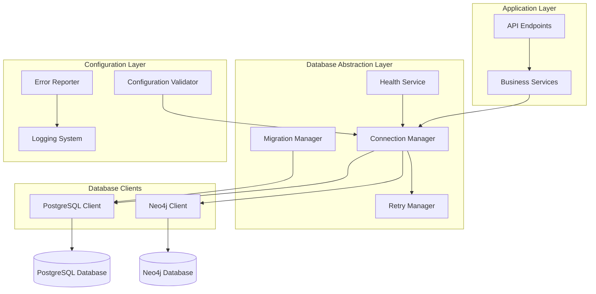

# Design Document: Database Connectivity Fixes

## Overview

This design addresses critical database connectivity issues in the AI Code Review Platform by implementing comprehensive fixes for PostgreSQL asyncpg compatibility, Neo4j authentication resilience, and migration file encoding problems. The solution focuses on creating robust connection management with proper error handling, retry mechanisms, and health monitoring.

The design emphasizes backward compatibility while resolving immediate connectivity issues. It introduces enhanced connection pooling, exponential backoff retry logic, and comprehensive error reporting to ensure reliable database operations across different deployment environments.

## Architecture

The database connectivity fixes follow a layered architecture approach:



### Key Architectural Principles

1. **Separation of Concerns**: Database-specific logic is isolated in dedicated client classes
2. **Centralized Connection Management**: All database connections flow through the Connection Manager
3. **Configurable Resilience**: Retry policies and timeouts are externally configurable
4. **Comprehensive Monitoring**: Health checks and error reporting provide full visibility
5. **Graceful Degradation**: System continues operating with reduced functionality when databases are unavailable

## Components and Interfaces

### Connection Manager

The Connection Manager serves as the central hub for all database connectivity operations:

```python
class ConnectionManager:
    def __init__(self, config: DatabaseConfig):
        self.config = config
        self.postgresql_pool: Optional[asyncpg.Pool] = None
        self.neo4j_driver: Optional[neo4j.Driver] = None
        self.retry_manager = RetryManager(config.retry_config)
        
    async def get_postgresql_connection(self) -> asyncpg.Connection:
        """Get PostgreSQL connection with retry logic"""
        
    async def get_neo4j_session(self) -> neo4j.AsyncSession:
        """Get Neo4j session with authentication retry"""
        
    async def initialize_pools(self) -> None:
        """Initialize connection pools with validation"""
        
    async def close_all_connections(self) -> None:
        """Gracefully close all database connections"""
```

### Retry Manager

Implements exponential backoff and retry logic for failed connections:

```python
class RetryManager:
    def __init__(self, config: RetryConfig):
        self.max_retries = config.max_retries
        self.base_delay = config.base_delay
        self.max_delay = config.max_delay
        self.backoff_multiplier = config.backoff_multiplier
        
    async def execute_with_retry(self, operation: Callable, operation_type: str) -> Any:
        """Execute operation with exponential backoff retry"""
        
    def calculate_delay(self, attempt: int) -> float:
        """Calculate delay for next retry attempt"""
        
    def should_retry(self, exception: Exception, attempt: int) -> bool:
        """Determine if operation should be retried"""
```

### PostgreSQL Client

Enhanced PostgreSQL client with Python 3.13 compatibility checks:

```python
class PostgreSQLClient:
    def __init__(self, connection_manager: ConnectionManager):
        self.connection_manager = connection_manager
        self.compatibility_checker = CompatibilityChecker()
        
    async def validate_compatibility(self) -> CompatibilityResult:
        """Check Python/asyncpg version compatibility"""
        
    async def create_pool(self, dsn: str, **kwargs) -> asyncpg.Pool:
        """Create connection pool with compatibility validation"""
        
    async def execute_query(self, query: str, *args) -> Any:
        """Execute query with connection retry"""
```

### Neo4j Client

Neo4j client with authentication failure handling:

```python
class Neo4jClient:
    def __init__(self, connection_manager: ConnectionManager):
        self.connection_manager = connection_manager
        self.auth_failure_tracker = AuthFailureTracker()
        
    async def create_driver(self, uri: str, auth: Tuple[str, str]) -> neo4j.Driver:
        """Create Neo4j driver with auth retry logic"""
        
    async def execute_query(self, query: str, parameters: Dict = None) -> neo4j.Result:
        """Execute Cypher query with session management"""
        
    def handle_auth_failure(self, exception: neo4j.AuthError) -> None:
        """Track and handle authentication failures"""
```

### Migration Manager

Enhanced migration manager with encoding validation:

```python
class MigrationManager:
    def __init__(self, connection_manager: ConnectionManager):
        self.connection_manager = connection_manager
        self.encoding_validator = EncodingValidator()
        
    async def validate_migration_files(self, migration_dir: Path) -> ValidationResult:
        """Validate encoding of all migration files"""
        
    async def execute_migration(self, migration_file: Path) -> MigrationResult:
        """Execute migration with encoding validation"""
        
    def fix_encoding_issues(self, file_path: Path) -> EncodingFixResult:
        """Attempt to fix common encoding issues"""
```

### Health Service

Comprehensive health monitoring for database connectivity:

```python
class HealthService:
    def __init__(self, connection_manager: ConnectionManager):
        self.connection_manager = connection_manager
        self.health_history = HealthHistory()
        
    async def check_postgresql_health(self) -> HealthStatus:
        """Perform PostgreSQL connectivity and performance checks"""
        
    async def check_neo4j_health(self) -> HealthStatus:
        """Perform Neo4j connectivity and authentication checks"""
        
    async def check_migration_health(self) -> HealthStatus:
        """Validate migration file integrity and encoding"""
        
    async def get_overall_health(self) -> OverallHealthStatus:
        """Aggregate health status from all database components"""
```

## Data Models

### Configuration Models

```python
@dataclass
class DatabaseConfig:
    postgresql_dsn: str
    neo4j_uri: str
    neo4j_auth: Tuple[str, str]
    connection_timeout: int = 30
    pool_min_size: int = 5
    pool_max_size: int = 20
    retry_config: RetryConfig = field(default_factory=RetryConfig)

@dataclass
class RetryConfig:
    max_retries: int = 3
    base_delay: float = 1.0
    max_delay: float = 60.0
    backoff_multiplier: float = 2.0
    retry_on_timeout: bool = True
    retry_on_auth_failure: bool = True
```

### Health Status Models

```python
@dataclass
class HealthStatus:
    component: str
    status: HealthState
    message: str
    details: Dict[str, Any]
    timestamp: datetime
    response_time_ms: Optional[float] = None

@dataclass
class CompatibilityResult:
    is_compatible: bool
    python_version: str
    asyncpg_version: str
    issues: List[str]
    recommendations: List[str]
```

### Error Models

```python
@dataclass
class DatabaseError:
    error_type: ErrorType
    component: str
    message: str
    details: Dict[str, Any]
    timestamp: datetime
    resolution_steps: List[str]

class ErrorType(Enum):
    CONNECTION_TIMEOUT = "connection_timeout"
    AUTHENTICATION_FAILURE = "authentication_failure"
    ENCODING_ERROR = "encoding_error"
    COMPATIBILITY_ERROR = "compatibility_error"
    POOL_EXHAUSTION = "pool_exhaustion"
```

## Error Handling

### Error Classification and Response

The system implements a comprehensive error handling strategy that categorizes database errors and provides appropriate responses:

1. **Connection Timeout Errors**
   - Automatic retry with exponential backoff
   - Pool connection recycling
   - Detailed logging with connection parameters

2. **Authentication Failures**
   - Exponential backoff to prevent rate limiting
   - Credential validation and refresh
   - Security-conscious logging (no password exposure)

3. **Encoding Errors**
   - File encoding detection and conversion
   - Graceful fallback to alternative encodings
   - Clear error messages with file location

4. **Compatibility Errors**
   - Version validation at startup
   - Clear upgrade/downgrade recommendations
   - Prevention of incompatible operations

### Error Recovery Strategies

```python
class ErrorRecoveryStrategy:
    async def handle_connection_timeout(self, error: ConnectionTimeoutError) -> RecoveryAction:
        """Implement connection timeout recovery"""
        
    async def handle_auth_failure(self, error: AuthenticationError) -> RecoveryAction:
        """Implement authentication failure recovery"""
        
    async def handle_encoding_error(self, error: EncodingError) -> RecoveryAction:
        """Implement encoding error recovery"""
        
    async def handle_compatibility_error(self, error: CompatibilityError) -> RecoveryAction:
        """Implement compatibility error recovery"""
```

## Testing Strategy

The testing strategy employs both unit tests and property-based tests to ensure comprehensive coverage of database connectivity scenarios.

### Unit Testing Approach

Unit tests focus on specific error conditions, edge cases, and integration points:

- **Connection Manager Tests**: Verify pool initialization, connection acquisition, and cleanup
- **Retry Logic Tests**: Test exponential backoff calculations and retry decision logic  
- **Error Handling Tests**: Validate error classification and recovery strategies
- **Configuration Tests**: Ensure proper validation of database configuration parameters
- **Health Check Tests**: Verify accurate reporting of database connectivity status

### Property-Based Testing Approach

Property-based tests validate universal behaviors across many generated inputs:

- **Connection Pool Properties**: Verify pool behavior under various load conditions
- **Retry Mechanism Properties**: Test retry logic with different failure patterns
- **Encoding Validation Properties**: Validate encoding detection across various file contents
- **Configuration Validation Properties**: Test configuration validation with various parameter combinations

### Test Configuration

- **Minimum 100 iterations** per property test to ensure comprehensive input coverage
- **Test isolation** using database transactions and connection mocking
- **Performance benchmarks** to detect regression in connection establishment times
- **Integration tests** with real database instances in CI/CD pipeline

Each property test will be tagged with the format:
**Feature: database-connectivity-fixes, Property {number}: {property_text}**

## Correctness Properties

*A property is a characteristic or behavior that should hold true across all valid executions of a system-essentially, a formal statement about what the system should do. Properties serve as the bridge between human-readable specifications and machine-verifiable correctness guarantees.*

### Property 1: Connection Compatibility Validation
*For any* Python version and asyncpg version combination, the PostgreSQL client should establish connections successfully when versions are compatible and fail gracefully with clear error messages when incompatible
**Validates: Requirements 1.1, 1.3, 1.4**

### Property 2: Connection Timeout Handling
*For any* database connection request, the connection should either complete within the configured timeout period or be terminated with proper cleanup and detailed logging
**Validates: Requirements 1.2, 4.4**

### Property 3: Exponential Backoff Retry Logic
*For any* sequence of Neo4j authentication failures, the retry handler should implement exponential backoff starting at 1 second with appropriate spacing to prevent rate limiting
**Validates: Requirements 2.1, 2.2**

### Property 4: Retry State Management
*For any* sequence of authentication failures followed by success, the retry handler should reset backoff intervals to initial values and properly track failure history
**Validates: Requirements 2.4, 2.5**

### Property 5: Retry Exhaustion Handling
*For any* operation that exceeds maximum retry attempts, the system should log the failure with clear resolution guidance and stop further retry attempts
**Validates: Requirements 2.3**

### Property 6: UTF-8 Encoding Validation
*For any* migration file, the migration manager should validate UTF-8 encoding before execution and handle encoding correctly during file operations
**Validates: Requirements 3.1, 3.3**

### Property 7: Encoding Error Handling
*For any* file with encoding issues, the system should provide specific error messages identifying the problematic file and line, and handle non-UTF-8 characters consistently
**Validates: Requirements 3.2, 3.4**

### Property 8: Migration File Creation Integrity
*For any* new migration file created by the system, the file should be properly UTF-8 encoded and readable without encoding errors
**Validates: Requirements 3.5**

### Property 9: Connection Pool Management
*For any* database type (PostgreSQL or Neo4j), the connection manager should implement proper connection pooling with configurable limits and timeout handling
**Validates: Requirements 4.1, 4.2, 4.3**

### Property 10: Pool Health and Recovery
*For any* connection pool experiencing failures, the connection manager should monitor pool health and automatically recreate failed connections
**Validates: Requirements 4.5**

### Property 11: Comprehensive Error Logging
*For any* database connection error, the system should log complete error details including connection parameters, error codes, and timestamps while excluding sensitive information
**Validates: Requirements 1.5, 5.1, 5.3**

### Property 12: Error Classification and Messaging
*For any* database error, the system should properly categorize the error type and provide structured error messages with recommended resolution steps
**Validates: Requirements 5.2, 5.4**

### Property 13: Error Statistics Tracking
*For any* sequence of database errors, the system should maintain error statistics to identify recurring connectivity patterns over time
**Validates: Requirements 5.5**

### Property 14: Comprehensive Health Monitoring
*For any* health check execution, the health service should test connectivity for both database types, identify specific problem types, and validate connection pool status
**Validates: Requirements 6.1, 6.2, 6.3**

### Property 15: Health Check Error Reporting
*For any* failed health check, the system should provide actionable error messages with specific resolution guidance and track health history for pattern identification
**Validates: Requirements 6.4, 6.5**

### Property 16: Configuration Validation Completeness
*For any* system startup, the configuration validator should verify all required database parameters are present, validate version compatibility, and check that timeout and retry values are within acceptable ranges
**Validates: Requirements 7.1, 7.2, 7.4**

### Property 17: Configuration Conflict Prevention
*For any* configuration with conflicts, the system should prevent startup and provide clear resolution instructions with appropriate configuration templates
**Validates: Requirements 7.3, 7.5**