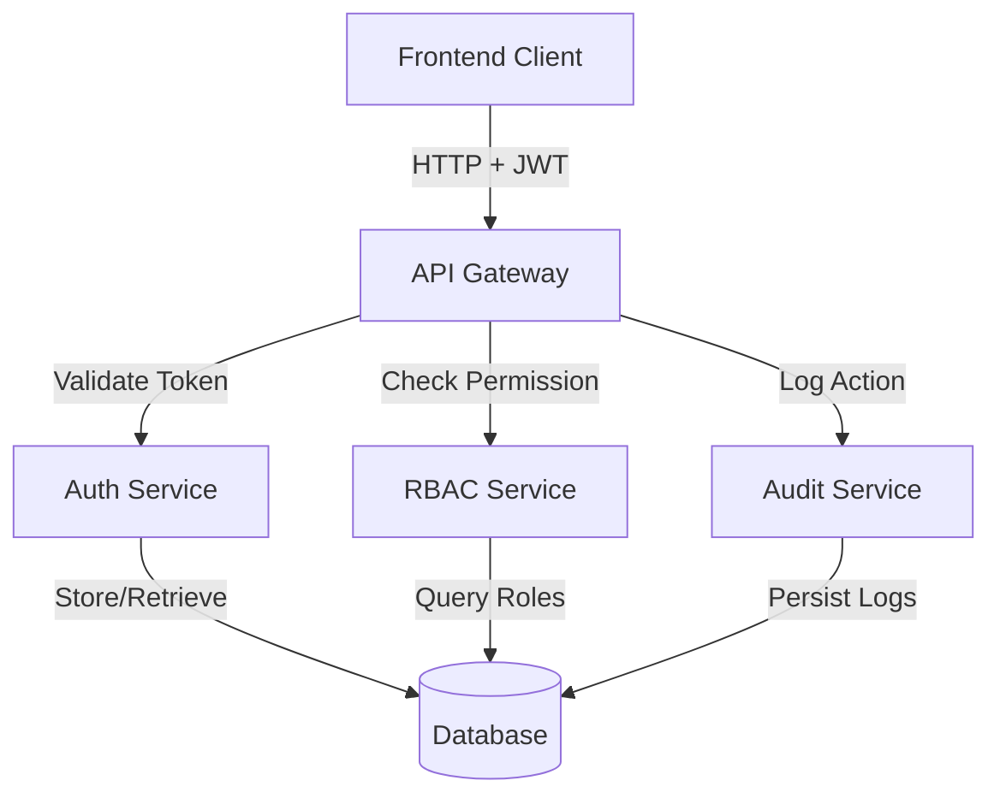

# Design Document: Enterprise RBAC Authentication System

## Overview

This design document outlines the architecture for an enterprise-level Role-Based Access Control (RBAC) authentication system. The system provides secure JWT-based authentication, fine-grained authorization through middleware, frontend route protection, and comprehensive audit logging for compliance.

The architecture follows a layered approach with clear separation between authentication (identity verification), authorization (permission checking), and audit logging (compliance tracking). The system supports three distinct roles (Admin, Programmer, Visitor) with hierarchical permissions and project-level isolation.

## Architecture

### High-Level Architecture



### Layer Responsibilities

1. **Presentation Layer (Frontend)**
   - Route guards for navigation protection
   - Conditional rendering based on permissions
   - Login UI with error handling
   - JWT token storage and management

2. **API Layer**
   - RESTful endpoints for authentication and resource management
   - Authorization middleware integration
   - Request validation and error handling

3. **Business Logic Layer**
   - Authentication service (login, logout, token generation)
   - RBAC service (permission checking, role management)
   - Project isolation logic
   - Audit logging service

4. **Data Layer**
   - User, Role, Permission, Project, and AuditLog entities
   - Secure password storage
   - Session management

## Components and Interfaces

### 1. Authentication Service

**Responsibilities:**
- User credential validation
- JWT token generation and validation
- Session lifecycle management
- Password hashing and verification

**Interface:**

```typescript
interface AuthService {
  // Authenticate user and return JWT token
  login(username: string, password: string): Promise<AuthResult>
  
  // Invalidate current session
  logout(userId: string, token: string): Promise<void>
  
  // Validate JWT token and return user info
  validateToken(token: string): Promise<TokenPayload>
  
  // Refresh token before expiration
  refreshToken(token: string): Promise<string>
  
  // Hash password securely
  hashPassword(password: string): Promise<string>
  
  // Verify password against hash
  verifyPassword(password: string, hash: string): Promise<boolean>
}

interface AuthResult {
  success: boolean
  token?: string
  user?: UserInfo
  error?: string
}

interface TokenPayload {
  userId: string
  username: string
  role: Role
  iat: number  // issued at
  exp: number  // expiration
}

interface UserInfo {
  id: string
  username: string
  role: Role
  createdAt: Date
  lastLogin: Date
}
```

### 2. RBAC Service

**Responsibilities:**
- Role and permission management
- Permission checking for users
- Role-to-permission mapping
- User role assignment

**Interface:**

```typescript
enum Role {
  ADMIN = 'ADMIN',
  PROGRAMMER = 'PROGRAMMER',
  VISITOR = 'VISITOR'
}

enum Permission {
  CREATE_USER = 'CREATE_USER',
  DELETE_USER = 'DELETE_USER',
  UPDATE_USER = 'UPDATE_USER',
  VIEW_USER = 'VIEW_USER',
  CREATE_PROJECT = 'CREATE_PROJECT',
  DELETE_PROJECT = 'DELETE_PROJECT',
  UPDATE_PROJECT = 'UPDATE_PROJECT',
  VIEW_PROJECT = 'VIEW_PROJECT',
  MODIFY_CONFIG = 'MODIFY_CONFIG',
  VIEW_CONFIG = 'VIEW_CONFIG',
  EXPORT_REPORT = 'EXPORT_REPORT'
}

interface RBACService {
  // Check if user has specific permission
  hasPermission(userId: string, permission: Permission): Promise<boolean>
  
  // Check if user can access specific project
  canAccessProject(userId: string, projectId: string, permission: Permission): Promise<boolean>
  
  // Get all permissions for a role
  getRolePermissions(role: Role): Permission[]
  
  // Assign role to user
  assignRole(userId: string, role: Role): Promise<void>
  
  // Grant project access to user
  grantProjectAccess(projectId: string, userId: string): Promise<void>
  
  // Revoke project access from user
  revokeProjectAccess(projectId: string, userId: string): Promise<void>
}
```

### 3. Authorization Middleware

**Responsibilities:**
- Intercept API requests
- Validate JWT tokens
- Check user permissions
- Return appropriate error responses

**Interface:**

```typescript
interface AuthMiddleware {
  // Middleware to check if user has required role
  checkRole(requiredRole: Role): MiddlewareFunction
  
  // Middleware to check if user has required permission
  checkPermission(requiredPermission: Permission): MiddlewareFunction
  
  // Middleware to validate JWT token
  authenticateToken(): MiddlewareFunction
  
  // Middleware to check project ownership or access
  checkProjectAccess(permission: Permission): MiddlewareFunction
}

type MiddlewareFunction = (req: Request, res: Response, next: NextFunction) => void | Promise<void>

interface Request {
  headers: { authorization?: string }
  user?: TokenPayload  // Set by authenticateToken middleware
  params: { projectId?: string, userId?: string }
  body: any
}
```

### 4. Audit Service

**Responsibilities:**
- Log user actions
- Persist audit records
- Query audit logs with filters
- Prevent log tampering

**Interface:**

```typescript
interface AuditService {
  // Log a user action
  logAction(entry: AuditEntry): Promise<void>
  
  // Query audit logs with filters
  queryLogs(filter: AuditFilter): Promise<AuditEntry[]>
  
  // Get logs for specific user
  getUserLogs(userId: string, limit?: number): Promise<AuditEntry[]>
}

interface AuditEntry {
  id: string
  timestamp: Date
  userId: string
  username: string
  action: string
  resourceType?: string
  resourceId?: string
  ipAddress: string
  userAgent?: string
  success: boolean
  errorMessage?: string
}

interface AuditFilter {
  userId?: string
  action?: string
  startDate?: Date
  endDate?: Date
  success?: boolean
  limit?: number
  offset?: number
}
```

### 5. Frontend Route Guard

**Responsibilities:**
- Protect routes based on user role
- Redirect unauthorized users
- Check token validity on navigation
- Handle session expiration

**Interface:**

```typescript
interface RouteGuard {
  // Check if user can access route
  canActivate(route: Route, user: UserInfo): boolean
  
  // Get redirect path for unauthorized access
  getRedirectPath(user: UserInfo | null): string
  
  // Check if token is still valid
  isTokenValid(token: string): boolean
}

interface Route {
  path: string
  requiredRole?: Role
  requiredPermission?: Permission
}
```

### 6. Permission HOC (Higher-Order Component)

**Responsibilities:**
- Wrap components with permission checks
- Conditionally render UI elements
- Hide/disable actions based on permissions

**Interface:**

```typescript
interface PermissionHOC {
  // Wrap component with permission check
  withPermission(
    Component: React.ComponentType,
    requiredPermission: Permission
  ): React.ComponentType
  
  // Conditionally render children based on permission
  CanAccess(props: {
    permission: Permission,
    children: React.ReactNode,
    fallback?: React.ReactNode
  }): React.ReactElement
}
```

## Data Models

### User Entity

```typescript
interface User {
  id: string
  username: string
  passwordHash: string
  role: Role
  createdAt: Date
  updatedAt: Date
  lastLogin: Date | null
  isActive: boolean
}
```

### Project Entity

```typescript
interface Project {
  id: string
  name: string
  description: string
  ownerId: string  // User who created the project
  createdAt: Date
  updatedAt: Date
  accessGrants: ProjectAccess[]  // Explicit access grants
}

interface ProjectAccess {
  projectId: string
  userId: string
  grantedAt: Date
  grantedBy: string  // Admin or owner who granted access
}
```

### Session Entity

```typescript
interface Session {
  id: string
  userId: string
  token: string
  issuedAt: Date
  expiresAt: Date
  isValid: boolean
  deviceInfo?: string
  ipAddress: string
}
```

### Role-Permission Mapping

```typescript
const ROLE_PERMISSIONS: Record<Role, Permission[]> = {
  [Role.ADMIN]: [
    Permission.CREATE_USER,
    Permission.DELETE_USER,
    Permission.UPDATE_USER,
    Permission.VIEW_USER,
    Permission.CREATE_PROJECT,
    Permission.DELETE_PROJECT,
    Permission.UPDATE_PROJECT,
    Permission.VIEW_PROJECT,
    Permission.MODIFY_CONFIG,
    Permission.VIEW_CONFIG,
    Permission.EXPORT_REPORT
  ],
  [Role.PROGRAMMER]: [
    Permission.CREATE_PROJECT,
    Permission.UPDATE_PROJECT,  // Own projects only
    Permission.VIEW_PROJECT,    // Own or granted projects
    Permission.VIEW_CONFIG,
    Permission.EXPORT_REPORT
  ],
  [Role.VISITOR]: [
    Permission.VIEW_PROJECT  // Assigned projects only
  ]
};
```

## Correctness Properties

*A property is a characteristic or behavior that should hold true across all valid executions of a system—essentially, a formal statement about what the system should do. Properties serve as the bridge between human-readable specifications and machine-verifiable correctness guarantees.*


### Property Reflection

After analyzing all acceptance criteria, I identified several redundancies:

- **2.3 and 4.1** both test project ownership on creation → Combine into single property
- **2.4 and 4.3** both test unauthorized project access denial → Combine into single property
- **1.4 and 10.2** both test expired session/token rejection → Combine into single property
- **Role permission mappings (9.2, 9.3, 9.4)** are specific examples, not properties → Keep as examples
- **Password hashing (1.5)** and **password storage** can be combined into one comprehensive property

### Authentication Properties

**Property 1: Valid credentials generate valid JWT tokens**
*For any* valid user credentials (username and password), when the user logs in, the returned JWT token should contain the correct userId and role, and should be verifiable by the token validation function.
**Validates: Requirements 1.1**

**Property 2: Invalid credentials are rejected**
*For any* invalid credentials (non-existent username, incorrect password, or malformed input), the login attempt should be rejected and return an error message without revealing which part was incorrect.
**Validates: Requirements 1.2, 6.2**

**Property 3: Logout invalidates sessions**
*For any* active user session, when the user logs out, the session should be marked as invalid and subsequent requests using that token should be rejected.
**Validates: Requirements 1.3**

**Property 4: Expired tokens require re-authentication**
*For any* JWT token with an expiration time in the past, any request using that token should be rejected with a 401 Unauthorized response.
**Validates: Requirements 1.4, 10.2**

**Property 5: Passwords are never stored in plaintext**
*For any* password provided during user creation or password change, the stored value in the database should not equal the plaintext password and should be a valid hash from the configured hashing algorithm.
**Validates: Requirements 1.5**

### Role-Based Access Control Properties

**Property 6: Users have exactly one role**
*For any* user in the system, that user should have exactly one role assigned from the set {Admin, Programmer, Visitor}.
**Validates: Requirements 2.1**

**Property 7: Admin users have all permissions**
*For any* user with the Admin role and any permission check, the permission check should return true.
**Validates: Requirements 2.2**

**Property 8: Project creation sets ownership**
*For any* Programmer who creates a project, the created project's ownerId field should equal that Programmer's userId.
**Validates: Requirements 2.3, 4.1**

**Property 9: Unauthorized project access is denied**
*For any* Programmer attempting to access a project they don't own and haven't been granted access to, the access attempt should be denied with a 403 Forbidden response.
**Validates: Requirements 2.4, 4.3**

**Property 10: Visitors cannot modify resources**
*For any* user with the Visitor role and any modification operation (create, update, delete), the operation should be denied with a 403 Forbidden response.
**Validates: Requirements 2.5**

**Property 11: Visitors have read-only access to assigned projects**
*For any* Visitor with an assigned project, read operations on that project should succeed, while write operations should be denied.
**Validates: Requirements 2.6**

### Authorization Middleware Properties

**Property 12: Middleware validates JWT tokens**
*For any* request to a protected endpoint, the authorization middleware should extract and validate the JWT token before allowing the request to proceed.
**Validates: Requirements 3.2**

**Property 13: Matching roles grant access**
*For any* user whose role matches the required role for an endpoint, the authorization middleware should allow the request to proceed to the handler.
**Validates: Requirements 3.3**

**Property 14: Non-matching roles return 403**
*For any* user whose role does not match the required role for an endpoint, the authorization middleware should return a 403 Forbidden response.
**Validates: Requirements 3.4**

**Property 15: Invalid tokens return 401**
*For any* request with an invalid, expired, or missing JWT token, the authorization middleware should return a 401 Unauthorized response.
**Validates: Requirements 3.5**

### Project Isolation Properties

**Property 16: Project access requires ownership or grant**
*For any* Programmer requesting access to a project, access should be granted if and only if the user is the project owner or has an explicit access grant for that project.
**Validates: Requirements 4.2**

**Property 17: Admins bypass project isolation**
*For any* user with the Admin role and any project, the user should be able to access the project regardless of ownership or access grants.
**Validates: Requirements 4.4**

**Property 18: Access grants enable project access**
*For any* project with an explicit access grant to a Programmer, that Programmer should be able to access the project even if they are not the owner.
**Validates: Requirements 4.5**

### Frontend Route Protection Properties

**Property 19: Non-Admins cannot access admin routes**
*For any* user with a role other than Admin, attempting to navigate to routes under /admin should result in redirection to an unauthorized page.
**Validates: Requirements 5.1**

**Property 20: Users without config permissions cannot access settings**
*For any* user without the MODIFY_CONFIG permission, attempting to navigate to /settings routes should result in redirection to an unauthorized page.
**Validates: Requirements 5.2**

**Property 21: UI elements hidden without permissions**
*For any* UI component with a required permission, if the current user lacks that permission, the component should not be rendered in the DOM.
**Validates: Requirements 5.3**

**Property 22: Expired sessions redirect to login**
*For any* route navigation with an expired session token, the route guard should redirect the user to the login page.
**Validates: Requirements 5.4**

**Property 23: Authenticated users redirected from login**
*For any* user with a valid, non-expired session token, attempting to navigate to the login page should result in redirection to their default dashboard.
**Validates: Requirements 6.5**

### Audit Logging Properties

**Property 24: Audit logs contain required fields**
*For any* sensitive action performed by a user, the created audit log entry should contain timestamp, userId, action description, and IP address fields with non-null values.
**Validates: Requirements 7.1**

**Property 25: Audit logs persist immediately**
*For any* audit log entry created, querying the audit log immediately after creation should return the entry.
**Validates: Requirements 7.3**

**Property 26: Users cannot modify audit logs**
*For any* user (including Admins) and any audit log entry, attempts to modify or delete the entry should be rejected.
**Validates: Requirements 7.4**

**Property 27: Audit log queries filter correctly**
*For any* audit log query with filters (userId, action type, date range), all returned entries should match the specified filters, and no matching entries should be excluded.
**Validates: Requirements 7.5**

### User and Role Management Properties

**Property 28: User creation requires all fields**
*For any* user creation attempt missing username, password, or role, the creation should be rejected with a validation error.
**Validates: Requirements 8.1**

**Property 29: Role updates apply immediately**
*For any* user whose role is changed, permission checks for that user should immediately reflect the new role's permissions, even for active sessions.
**Validates: Requirements 8.2**

**Property 30: User deletion invalidates sessions**
*For any* user with active sessions, when that user is deleted, all of their session tokens should become invalid and be rejected on subsequent requests.
**Validates: Requirements 8.3**

**Property 31: User list contains required fields**
*For any* user returned in a user list query, the response should include username, role, createdAt, and lastLogin fields.
**Validates: Requirements 8.5**

**Property 32: Authorization checks verify role permissions**
*For any* authorization check for a specific permission, the check should return true if and only if the user's role includes that permission in the role-permission mapping.
**Validates: Requirements 9.5**

### Session Management Properties

**Property 33: Login creates session with expiration**
*For any* successful login, a session should be created with an expiresAt timestamp that is greater than the current time and less than or equal to current time plus the configured session duration.
**Validates: Requirements 10.1**

**Property 34: Concurrent sessions are supported**
*For any* user, creating multiple sessions from different devices should result in all sessions being valid and usable concurrently.
**Validates: Requirements 10.3**

**Property 35: Password change invalidates all sessions**
*For any* user with multiple active sessions, when that user's password is changed, all existing session tokens should become invalid.
**Validates: Requirements 10.4**

**Property 36: Active usage refreshes tokens**
*For any* user with an active session, making requests within the refresh window before token expiration should result in a new token with an extended expiration time.
**Validates: Requirements 10.5**

## Error Handling

### Authentication Errors

1. **Invalid Credentials**: Return 401 with generic message "Invalid username or password" to prevent username enumeration
2. **Expired Token**: Return 401 with message "Session expired, please log in again"
3. **Malformed Token**: Return 401 with message "Invalid authentication token"
4. **Missing Token**: Return 401 with message "Authentication required"

### Authorization Errors

1. **Insufficient Permissions**: Return 403 with message "You do not have permission to perform this action"
2. **Project Access Denied**: Return 403 with message "You do not have access to this project"
3. **Role Mismatch**: Return 403 with message "This action requires {required_role} role"

### Validation Errors

1. **Missing Required Fields**: Return 400 with message listing missing fields
2. **Invalid Role**: Return 400 with message "Role must be one of: Admin, Programmer, Visitor"
3. **Weak Password**: Return 400 with message describing password requirements
4. **Duplicate Username**: Return 409 with message "Username already exists"

### System Errors

1. **Database Errors**: Return 500 with generic message "An error occurred, please try again"
2. **Token Generation Failure**: Return 500 with message "Failed to generate authentication token"
3. **Audit Log Failure**: Log error but don't fail the primary operation (graceful degradation)

### Error Response Format

All errors should follow a consistent format:

```typescript
interface ErrorResponse {
  success: false
  error: {
    code: string        // Machine-readable error code
    message: string     // Human-readable error message
    details?: any       // Optional additional context
  }
  timestamp: string
  requestId: string     // For tracing
}
```

## Testing Strategy

### Dual Testing Approach

This system requires both unit tests and property-based tests for comprehensive coverage:

- **Unit tests**: Verify specific examples, edge cases, and error conditions
- **Property tests**: Verify universal properties across all inputs using randomized testing

### Property-Based Testing Configuration

We will use **fast-check** (for TypeScript/JavaScript) as the property-based testing library. Each property test will:

- Run a minimum of 100 iterations with randomized inputs
- Be tagged with a comment referencing the design property
- Tag format: `// Feature: enterprise-rbac-authentication, Property {number}: {property_text}`

### Test Coverage by Component

**Authentication Service**:
- Unit tests: Specific password hashing examples, token format validation
- Property tests: Properties 1-5 (valid/invalid credentials, logout, expiration, password hashing)

**RBAC Service**:
- Unit tests: Role-permission mapping examples (Admin, Programmer, Visitor)
- Property tests: Properties 6-11 (role assignment, permissions, project ownership, access control)

**Authorization Middleware**:
- Unit tests: Specific HTTP status codes, error message formats
- Property tests: Properties 12-15 (token validation, role matching, error responses)

**Project Isolation**:
- Unit tests: Specific access grant scenarios
- Property tests: Properties 16-18 (ownership checks, admin bypass, access grants)

**Frontend Route Guard**:
- Unit tests: Specific route configurations, redirect paths
- Property tests: Properties 19-23 (route protection, conditional rendering, session expiration)

**Audit Service**:
- Unit tests: Specific action types logged, log entry format
- Property tests: Properties 24-27 (log completeness, persistence, immutability, filtering)

**User Management**:
- Unit tests: Last admin deletion prevention, specific validation rules
- Property tests: Properties 28-32 (field validation, role updates, session invalidation, list completeness)

**Session Management**:
- Unit tests: Specific expiration times, refresh timing
- Property tests: Properties 33-36 (session creation, concurrent sessions, password change, token refresh)

### Integration Testing

In addition to unit and property tests, integration tests should verify:

1. **End-to-end authentication flow**: Login → Access protected resource → Logout
2. **Role-based access scenarios**: Admin vs Programmer vs Visitor accessing same resources
3. **Project isolation**: Multiple programmers with overlapping project access
4. **Audit log integration**: Verify logs are created for all sensitive operations
5. **Session lifecycle**: Login → Token refresh → Expiration → Re-authentication

### Security Testing

Security-specific tests should include:

1. **Token tampering**: Verify modified tokens are rejected
2. **SQL injection**: Test authentication with malicious input
3. **Brute force protection**: Verify rate limiting on login attempts (if implemented)
4. **Session fixation**: Verify new session created on login
5. **CSRF protection**: Verify state-changing operations require valid tokens

### Performance Testing

Performance tests should verify:

1. **Token validation speed**: Should complete in < 10ms
2. **Permission check speed**: Should complete in < 5ms
3. **Audit log write speed**: Should not block primary operations
4. **Concurrent session handling**: System should handle 1000+ concurrent sessions

### Test Data Generation

For property-based tests, we need generators for:

```typescript
// User generators
const arbitraryUser = fc.record({
  id: fc.uuid(),
  username: fc.string({ minLength: 3, maxLength: 50 }),
  role: fc.constantFrom(Role.ADMIN, Role.PROGRAMMER, Role.VISITOR),
  passwordHash: fc.string({ minLength: 60, maxLength: 60 }) // bcrypt hash length
})

// Project generators
const arbitraryProject = fc.record({
  id: fc.uuid(),
  name: fc.string({ minLength: 1, maxLength: 100 }),
  ownerId: fc.uuid()
})

// Token generators
const arbitraryValidToken = fc.record({
  userId: fc.uuid(),
  role: fc.constantFrom(Role.ADMIN, Role.PROGRAMMER, Role.VISITOR),
  iat: fc.integer({ min: Date.now() / 1000 - 3600, max: Date.now() / 1000 }),
  exp: fc.integer({ min: Date.now() / 1000 + 60, max: Date.now() / 1000 + 3600 })
})

const arbitraryExpiredToken = fc.record({
  userId: fc.uuid(),
  role: fc.constantFrom(Role.ADMIN, Role.PROGRAMMER, Role.VISITOR),
  iat: fc.integer({ min: Date.now() / 1000 - 7200, max: Date.now() / 1000 - 3600 }),
  exp: fc.integer({ min: Date.now() / 1000 - 3600, max: Date.now() / 1000 - 60 })
})

// Credential generators
const arbitraryValidCredentials = fc.record({
  username: fc.string({ minLength: 3, maxLength: 50 }),
  password: fc.string({ minLength: 8, maxLength: 128 })
})

const arbitraryInvalidCredentials = fc.oneof(
  fc.record({ username: fc.string(), password: fc.constant('wrong_password') }),
  fc.record({ username: fc.constant('nonexistent_user'), password: fc.string() }),
  fc.record({ username: fc.constant(''), password: fc.string() })
)
```

### Mocking Strategy

For unit and property tests, mock:

1. **Database layer**: Use in-memory data structures or test database
2. **JWT library**: Mock for predictable token generation in tests
3. **HTTP requests**: Mock request/response objects for middleware tests
4. **Time**: Mock Date.now() for expiration testing
5. **IP address extraction**: Mock for audit logging tests

### Continuous Integration

All tests should run on:

1. Every commit to feature branches
2. Every pull request
3. Before deployment to staging/production
4. Nightly for extended property test runs (1000+ iterations)

Test failures should block deployment and trigger notifications.
