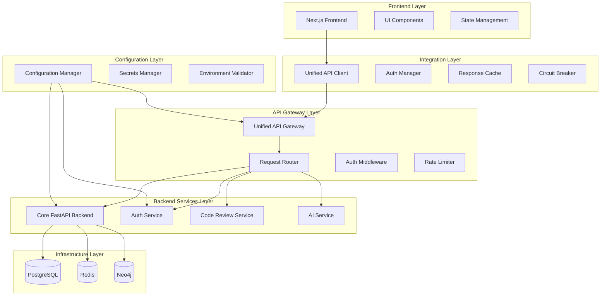

# Design Document

## Overview

This design establishes a comprehensive integration strategy for frontend-backend systems while systematically eliminating redundancies throughout the project architecture. The solution transforms the current fragmented microservices architecture into a unified, streamlined system that maintains all core functionality while reducing complexity, improving maintainability, and optimizing resource usage.

The design implements a layered architecture with centralized configuration management, service consolidation, unified API integration, and comprehensive monitoring. The approach ensures zero-downtime migration through blue-green deployment strategies and provides rollback capabilities at each integration phase.

## Architecture

### High-Level Architecture



### Service Consolidation Strategy

The design consolidates the current 7 microservices into 3 core services:

1. **Core Backend Service** (FastAPI) - Consolidates project-manager, architecture-analyzer functionality
2. **Authentication Service** - Remains separate for security isolation
3. **AI/Review Service** - Consolidates agentic-ai, code-review-engine, llm-service functionality

The API Gateway handles routing and cross-cutting concerns, eliminating the need for separate service-to-service communication complexity.

## Components and Interfaces

### Configuration Manager

**Purpose**: Centralized configuration management eliminating duplicate environment files

**Interface**:
```python
class ConfigurationManager:
    def load_configuration(self, environment: str) -> Configuration
    def validate_configuration(self, config: Configuration) -> ValidationResult
    def get_service_config(self, service_name: str) -> ServiceConfig
    def update_configuration(self, updates: Dict[str, Any]) -> None
    def watch_configuration_changes(self) -> AsyncIterator[ConfigChange]
```

**Key Features**:
- Hierarchical configuration with environment-specific overrides
- Real-time configuration validation and hot reloading
- Secure secrets management with encryption at rest
- Configuration drift detection and alerting

### Unified API Client

**Purpose**: Frontend integration layer providing consistent backend communication

**Interface**:
```typescript
class UnifiedAPIClient {
    async request<T>(endpoint: string, options: RequestOptions): Promise<T>
    async authenticate(credentials: AuthCredentials): Promise<AuthResult>
    async refreshToken(): Promise<string>
    setAuthToken(token: string): void
    enableCircuitBreaker(config: CircuitBreakerConfig): void
    enableRetry(config: RetryConfig): void
}
```

**Key Features**:
- Automatic authentication token management
- Circuit breaker pattern for fault tolerance
- Intelligent retry with exponential backoff
- Response caching with TTL and invalidation
- Request/response interceptors for logging and monitoring

### Service Consolidator

**Purpose**: Identifies and merges redundant microservices while preserving functionality

**Interface**:
```python
class ServiceConsolidator:
    def analyze_service_dependencies(self) -> DependencyGraph
    def identify_consolidation_candidates(self) -> List[ConsolidationPlan]
    def merge_services(self, plan: ConsolidationPlan) -> MergeResult
    def update_service_references(self, old_service: str, new_service: str) -> None
    def validate_consolidated_functionality(self) -> ValidationReport
```

**Key Features**:
- Dependency analysis and impact assessment
- Automated code migration and reference updates
- Functionality preservation validation
- Rollback capabilities for failed consolidations

### Unified API Gateway

**Purpose**: Central routing and cross-cutting concerns for all backend services

**Interface**:
```python
class UnifiedAPIGateway:
    def register_service(self, service: ServiceDefinition) -> None
    def route_request(self, request: HTTPRequest) -> HTTPResponse
    def apply_middleware(self, middleware: List[Middleware]) -> None
    def enable_rate_limiting(self, config: RateLimitConfig) -> None
    def enable_authentication(self, auth_config: AuthConfig) -> None
```

**Key Features**:
- Dynamic service registration and discovery
- Load balancing with health-aware routing
- Comprehensive middleware pipeline (auth, logging, metrics)
- Rate limiting and DDoS protection
- API versioning and backward compatibility

### Health Monitor

**Purpose**: Comprehensive health monitoring and service discovery

**Interface**:
```python
class HealthMonitor:
    def register_health_check(self, service: str, check: HealthCheck) -> None
    def get_service_health(self, service: str) -> HealthStatus
    def get_system_health(self) -> SystemHealthReport
    def enable_alerting(self, config: AlertConfig) -> None
    def get_health_metrics(self, timeframe: TimeRange) -> HealthMetrics
```

**Key Features**:
- Multi-level health checks (liveness, readiness, startup)
- Dependency health propagation
- Automated alerting and notification
- Health trend analysis and prediction
- Integration with monitoring systems (Prometheus, Grafana)

## Data Models

### Configuration Schema

```python
@dataclass
class Configuration:
    environment: str
    services: Dict[str, ServiceConfig]
    databases: DatabaseConfig
    security: SecurityConfig
    monitoring: MonitoringConfig
    
@dataclass
class ServiceConfig:
    name: str
    port: int
    host: str
    endpoints: List[str]
    dependencies: List[str]
    resources: ResourceConfig
    
@dataclass
class DatabaseConfig:
    postgresql: PostgreSQLConfig
    redis: RedisConfig
    neo4j: Neo4jConfig
    connection_pools: ConnectionPoolConfig
```

### Service Registry Schema

```python
@dataclass
class ServiceRegistration:
    service_id: str
    name: str
    version: str
    endpoints: List[Endpoint]
    health_check_url: str
    metadata: Dict[str, Any]
    registration_time: datetime
    last_heartbeat: datetime
    
@dataclass
class Endpoint:
    path: str
    method: str
    description: str
    schema: Optional[str]
    authentication_required: bool
```

### Health Status Schema

```python
@dataclass
class HealthStatus:
    service_name: str
    status: HealthState  # HEALTHY, DEGRADED, UNHEALTHY
    checks: List[HealthCheck]
    response_time_ms: int
    last_check_time: datetime
    dependencies: List[DependencyHealth]
    
@dataclass
class HealthCheck:
    name: str
    status: HealthState
    message: str
    details: Dict[str, Any]
```

## Error Handling

### Error Classification and Response Strategy

**Network Errors**:
- Connection timeouts: Retry with exponential backoff (max 3 attempts)
- DNS resolution failures: Circuit breaker activation, fallback to cached responses
- SSL/TLS errors: Immediate failure with security alert

**Service Errors**:
- 5xx errors: Retry with backoff, circuit breaker if persistent
- 4xx errors: No retry, log for analysis, return user-friendly message
- Authentication errors: Automatic token refresh, re-authentication if needed

**Configuration Errors**:
- Missing variables: Fail fast with descriptive error message
- Invalid values: Validation error with correction suggestions
- Conflicts: Warning with precedence resolution

### Circuit Breaker Implementation

```python
class CircuitBreaker:
    def __init__(self, failure_threshold: int = 5, timeout: int = 60):
        self.failure_threshold = failure_threshold
        self.timeout = timeout
        self.failure_count = 0
        self.last_failure_time = None
        self.state = CircuitState.CLOSED
    
    async def call(self, func: Callable) -> Any:
        if self.state == CircuitState.OPEN:
            if self._should_attempt_reset():
                self.state = CircuitState.HALF_OPEN
            else:
                raise CircuitBreakerOpenError()
        
        try:
            result = await func()
            self._on_success()
            return result
        except Exception as e:
            self._on_failure()
            raise e
```

## Testing Strategy

### Dual Testing Approach

The testing strategy combines unit tests for specific functionality with property-based tests for comprehensive validation across all inputs and scenarios.

**Unit Testing Focus**:
- Configuration validation edge cases
- Service consolidation specific scenarios
- Authentication flow integration points
- Error handling and recovery mechanisms
- API gateway routing logic

**Property-Based Testing Focus**:
- Configuration consistency across all services
- API response format consistency
- Health check reliability across all conditions
- Load balancing fairness and reliability
- Data integrity during service consolidation

**Integration Testing**:
- End-to-end API flows through the unified gateway
- Service discovery and registration workflows
- Configuration hot-reloading scenarios
- Failover and recovery testing
- Performance and load testing

**Property-Based Test Configuration**:
- Minimum 100 iterations per property test
- Each test tagged with feature name and property reference
- Comprehensive input generation covering edge cases
- Automated test data cleanup and isolation

### Test Environment Management

```python
class TestEnvironmentManager:
    def setup_test_environment(self) -> TestEnvironment:
        """Create isolated test environment with all services"""
        
    def cleanup_test_environment(self, env: TestEnvironment) -> None:
        """Clean up test resources and data"""
        
    def create_test_data(self, scenario: TestScenario) -> TestData:
        """Generate test data for specific scenarios"""
        
    def validate_test_isolation(self) -> ValidationResult:
        """Ensure tests don't interfere with each other"""
```

## Correctness Properties

*A property is a characteristic or behavior that should hold true across all valid executions of a system-essentially, a formal statement about what the system should do. Properties serve as the bridge between human-readable specifications and machine-verifiable correctness guarantees.*

### Configuration Management Properties

**Property 1: Configuration Consolidation Consistency**
*For any* set of environment configuration files with overlapping variables, the Configuration_Manager should produce a hierarchical configuration that contains all unique variables and applies correct precedence rules for conflicts.
**Validates: Requirements 1.1, 1.2**

**Property 2: Configuration Validation Completeness**
*For any* service configuration with missing or invalid required variables, the Configuration_Manager should return descriptive error messages identifying all validation failures.
**Validates: Requirements 1.3**

**Property 3: Service Configuration Subsetting**
*For any* master configuration and service definition, the generated service-specific configuration should contain only variables relevant to that service and no extraneous variables.
**Validates: Requirements 1.4**

**Property 4: Configuration Change Propagation**
*For any* configuration update, all dependent services should receive the updated configuration within the specified propagation timeout.
**Validates: Requirements 1.5**

### Service Consolidation Properties

**Property 5: Service Overlap Detection Accuracy**
*For any* set of microservices with known overlapping functionality, the Service_Consolidator should correctly identify all overlapping responsibilities and suggest appropriate consolidation strategies.
**Validates: Requirements 2.1**

**Property 6: Functionality Preservation During Consolidation**
*For any* service consolidation operation, all unique functionality from the original services should be preserved and accessible in the consolidated service.
**Validates: Requirements 2.2**

**Property 7: Request Routing Correctness**
*For any* API request, the unified API gateway should route the request to the correct backend service or consolidated endpoint based on the request characteristics.
**Validates: Requirements 2.3**

**Property 8: Reference Update Completeness**
*For any* service merge operation, all client code and configuration references to the old services should be updated to reference the new consolidated services.
**Validates: Requirements 2.4**

**Property 9: Backward Compatibility Maintenance**
*For any* external integration using the old API format, the system should continue to function correctly during the transition period.
**Validates: Requirements 2.5**

### API Integration Properties

**Property 10: Unified API Client Behavior**
*For any* backend service request, the unified API client should handle authentication, implement retry logic, and provide consistent error handling regardless of the target service.
**Validates: Requirements 3.1**

**Property 11: Request Type Routing**
*For any* API request type, the Integration_Layer should automatically route the request to the appropriate service endpoint based on the request characteristics.
**Validates: Requirements 3.2**

**Property 12: Circuit Breaker and Graceful Degradation**
*For any* backend service failure scenario, the Integration_Layer should activate circuit breaker patterns and provide graceful degradation without cascading failures.
**Validates: Requirements 3.3**

**Property 13: Response Format Consistency**
*For any* API endpoint response, the format should conform to the unified response schema regardless of which backend service generated the response.
**Validates: Requirements 3.4**

**Property 14: Schema Validation Enforcement**
*For any* API request or response, validation against OpenAPI specifications should be enforced and validation failures should be properly reported.
**Validates: Requirements 3.5**

### Database and Infrastructure Properties

**Property 15: Connection Pool Management**
*For any* database connection request, the Connection_Pool should provide connections efficiently while maintaining connection limits and health monitoring.
**Validates: Requirements 4.1, 4.2**

**Property 16: Connection Health and Recovery**
*For any* failed database connection, the Connection_Pool should detect the failure and automatically attempt reconnection according to the configured retry strategy.
**Validates: Requirements 4.3**

**Property 17: Migration Coordination**
*For any* database schema migration, all dependent services should be coordinated to ensure consistent schema versions and no data corruption.
**Validates: Requirements 4.4**

**Property 18: Connection Metrics Collection**
*For any* database connection activity, relevant metrics should be collected and made available for monitoring and performance optimization.
**Validates: Requirements 4.5**

### Deployment and Orchestration Properties

**Property 19: Docker Compose Configuration Merging**
*For any* environment deployment, the Deployment_Orchestrator should correctly merge base and environment-specific Docker Compose configurations without conflicts.
**Validates: Requirements 5.1, 5.2**

**Property 20: Service Dependency and Health Management**
*For any* service deployment, proper dependencies should be enforced and health checks should accurately reflect service readiness.
**Validates: Requirements 5.3**

**Property 21: Horizontal Scaling and Load Balancing**
*For any* scaling operation, services should scale horizontally while maintaining load balancing and service availability.
**Validates: Requirements 5.4**

**Property 22: Unified Logging Configuration**
*For any* deployed service, logging configuration should be consistent and conform to the unified logging standards.
**Validates: Requirements 5.5**

### Code Redundancy Elimination Properties

**Property 23: Duplicate Code Detection Accuracy**
*For any* codebase scan, the Redundancy_Analyzer should correctly identify all duplicate functions, classes, and modules across services.
**Validates: Requirements 6.1**

**Property 24: Code Extraction and Shared Library Creation**
*For any* identified duplicate code, the extraction process should create properly structured shared libraries that maintain all original functionality.
**Validates: Requirements 6.2, 6.3**

**Property 25: Reference Update and Functionality Preservation**
*For any* code refactoring operation, all references should be updated correctly and original functionality should be preserved.
**Validates: Requirements 6.4**

**Property 26: Duplication Reduction Metrics**
*For any* redundancy elimination process, accurate metrics should be generated showing the reduction in code duplication.
**Validates: Requirements 6.5**

### Authentication and Authorization Properties

**Property 27: Single Sign-On Functionality**
*For any* user authentication, the SSO system should provide access to all frontend and backend services with a single login.
**Validates: Requirements 7.1**

**Property 28: JWT Token Validity Across Services**
*For any* generated JWT token, it should be valid and accepted by all services in the system.
**Validates: Requirements 7.2**

**Property 29: Automatic Token Management**
*For any* token validation or refresh operation, the middleware should handle it automatically without user intervention.
**Validates: Requirements 7.3**

**Property 30: Centralized Authorization Checking**
*For any* authorization request, permissions should be checked against the centralized authorization service and enforced consistently.
**Validates: Requirements 7.4**

**Property 31: Session Management and Cleanup**
*For any* user session, automatic logout and token cleanup should occur according to the configured session policies.
**Validates: Requirements 7.5**

### Health Monitoring and Service Discovery Properties

**Property 32: Unified Health Check Endpoints**
*For any* service health check request, detailed status information should be returned in a consistent format across all services.
**Validates: Requirements 8.1**

**Property 33: Automatic Service Registration**
*For any* service startup, the service should be automatically registered in the Service_Registry with correct endpoint and capability information.
**Validates: Requirements 8.2**

**Property 34: Periodic Health Monitoring**
*For any* registered service, periodic health checks should be performed and service availability status should be updated accordingly.
**Validates: Requirements 8.3**

**Property 35: Service Removal and Notification**
*For any* service that becomes unavailable, it should be removed from active routing and all dependent services should be notified.
**Validates: Requirements 8.4**

**Property 36: Health Monitoring Dashboards and Alerting**
*For any* system health event, appropriate dashboard updates and alerts should be generated according to the configured monitoring rules.
**Validates: Requirements 8.5**

### Configuration and Secrets Management Properties

**Property 37: Configuration and Secrets Separation**
*For any* configuration data, secrets should be properly separated from regular configuration and stored securely.
**Validates: Requirements 9.1**

**Property 38: Secure Secret Retrieval**
*For any* secret access request, secrets should be retrieved from secure storage using proper authentication and authorization.
**Validates: Requirements 9.2**

**Property 39: Configuration Validation and Type Checking**
*For any* configuration value, proper validation and type checking should be performed according to the defined schema.
**Validates: Requirements 9.3**

**Property 40: Hot Configuration Reloading**
*For any* configuration change, hot reloading should be applied where possible without requiring service restarts.
**Validates: Requirements 9.4**

**Property 41: Configuration Access Auditing**
*For any* configuration access or change, proper audit logs should be generated for security compliance.
**Validates: Requirements 9.5**

### Migration and Rollback Properties

**Property 42: Comprehensive Backup Creation**
*For any* integration process start, comprehensive backups should be created that include all configuration and code necessary for rollback.
**Validates: Requirements 10.1**

**Property 43: Blue-Green Deployment Implementation**
*For any* service migration, blue-green deployment strategies should ensure zero-downtime transitions.
**Validates: Requirements 10.2**

**Property 44: Rollback Capability at Each Phase**
*For any* integration phase, rollback capabilities should be available and functional.
**Validates: Requirements 10.3**

**Property 45: Rollback Execution Completeness**
*For any* rollback operation, previous configurations should be restored and affected services should be restarted correctly.
**Validates: Requirements 10.4**

**Property 46: Migration Step Validation**
*For any* migration step, system functionality should be validated before proceeding to the next step.
**Validates: Requirements 10.5**

### Performance Optimization Properties

**Property 47: Intelligent Caching Implementation**
*For any* API response or database query, appropriate caching strategies should be applied based on data characteristics and access patterns.
**Validates: Requirements 11.1**

**Property 48: Cache Invalidation Strategy**
*For any* cached data, invalidation should occur according to data freshness requirements and update patterns.
**Validates: Requirements 11.2**

**Property 49: Connection Pooling and Request Batching**
*For any* database or service connection, pooling and batching should be used to optimize performance.
**Validates: Requirements 11.3**

**Property 50: Shared Caching for Redundant Requests**
*For any* data request made by multiple services, shared caching should be used to reduce redundant requests.
**Validates: Requirements 11.4**

**Property 51: Adaptive Caching Strategy Adjustment**
*For any* performance metric change, caching strategies should be automatically adjusted to maintain optimal performance.
**Validates: Requirements 11.5**