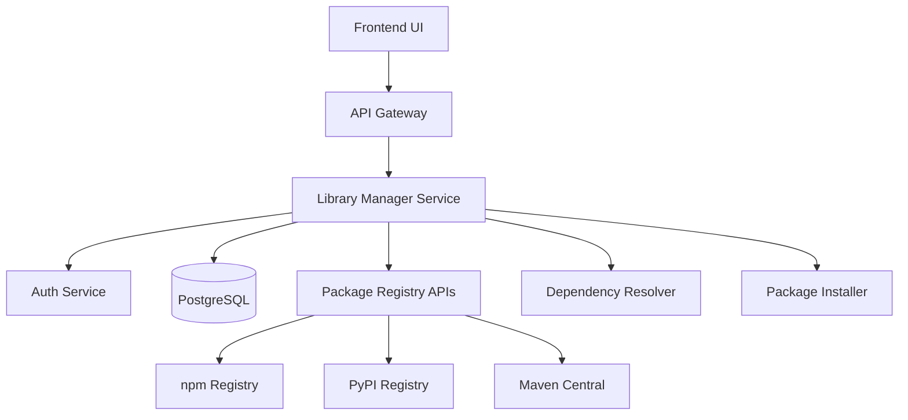
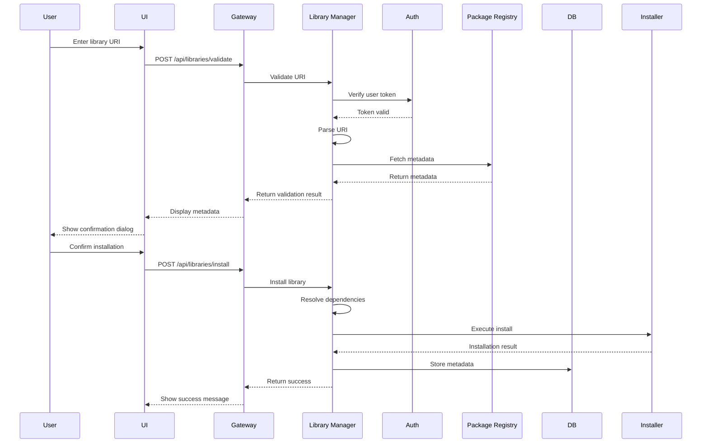
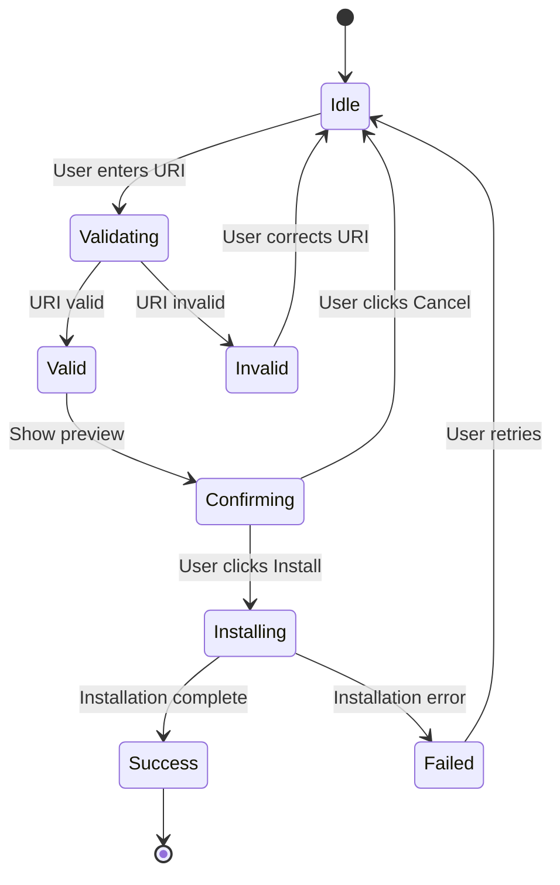

# Design Document: Library Management Feature

## Overview

The Library Management feature enables developers to add external libraries to the AI Code Review Platform by entering a library URI. The system validates the URI, retrieves metadata from package registries, resolves dependencies, and installs the library into the appropriate project context (backend Python or frontend TypeScript).

This feature integrates with the existing microservices architecture, using the API Gateway for external calls, Auth Service for authentication, and PostgreSQL for metadata storage.

## Architecture

### High-Level Architecture



### Component Interaction Flow



## Components and Interfaces

### 1. Library Manager Service

**Responsibility**: Core orchestration service for library management operations.

**API Endpoints**:

```typescript
// Validate and retrieve library metadata
POST /api/libraries/validate
Request: {
  uri: string;
  projectContext?: string; // 'backend' | 'frontend' | 'services'
}
Response: {
  valid: boolean;
  library?: {
    name: string;
    version: string;
    description: string;
    license: string;
    dependencies: Array<{name: string, version: string}>;
    registryType: 'npm' | 'pypi' | 'maven';
  };
  suggestedContext?: string;
  errors?: string[];
}

// Install library
POST /api/libraries/install
Request: {
  uri: string;
  projectContext: string;
  version?: string;
}
Response: {
  success: boolean;
  installedLibrary?: {
    name: string;
    version: string;
    installedAt: string;
  };
  errors?: string[];
}

// Search libraries
GET /api/libraries/search?q={query}&registry={type}
Response: {
  results: Array<{
    name: string;
    description: string;
    version: string;
    downloads: number;
    uri: string;
  }>;
}

// List installed libraries
GET /api/libraries?projectContext={context}
Response: {
  libraries: Array<{
    name: string;
    version: string;
    installedAt: string;
    installedBy: string;
    projectContext: string;
  }>;
}
```

**Internal Components**:

```python
class LibraryManager:
    """Main orchestrator for library operations"""
    
    def __init__(
        self,
        uri_parser: URIParser,
        metadata_fetcher: MetadataFetcher,
        dependency_resolver: DependencyResolver,
        installer: PackageInstaller,
        db_repository: LibraryRepository
    ):
        pass
    
    async def validate_library(self, uri: str, context: Optional[str]) -> ValidationResult:
        """Validate library URI and fetch metadata"""
        pass
    
    async def install_library(
        self, 
        uri: str, 
        context: str, 
        version: Optional[str],
        user_id: str
    ) -> InstallationResult:
        """Install library and store metadata"""
        pass
    
    async def search_libraries(
        self, 
        query: str, 
        registry_type: Optional[str]
    ) -> List[LibrarySearchResult]:
        """Search for libraries across registries"""
        pass
```

### 2. URI Parser

**Responsibility**: Parse and validate library URIs.

```python
class URIParser:
    """Parse library URIs and extract components"""
    
    PATTERNS = {
        'npm': [
            r'^npm:([a-z0-9-]+(?:@[a-z0-9-]+)?(?:/[a-z0-9-]+)?)(?:@(.+))?$',
            r'^https?://(?:www\.)?npmjs\.com/package/([^/]+)(?:/v/(.+))?$'
        ],
        'pypi': [
            r'^pypi:([a-z0-9-_]+)(?:==(.+))?$',
            r'^https?://pypi\.org/project/([^/]+)(?:/(.+))?$'
        ],
        'maven': [
            r'^maven:([^:]+):([^:]+)(?::(.+))?$'
        ]
    }
    
    def parse(self, uri: str) -> ParsedURI:
        """
        Parse URI and return structured information
        
        Returns:
            ParsedURI with registry_type, package_name, version
        """
        pass
    
    def validate_format(self, uri: str) -> Tuple[bool, Optional[str]]:
        """Validate URI format and return error if invalid"""
        pass
```

### 3. Metadata Fetcher

**Responsibility**: Retrieve library metadata from package registries.

```python
class MetadataFetcher:
    """Fetch library metadata from package registries"""
    
    def __init__(self, http_client: HTTPClient, circuit_breaker: CircuitBreaker):
        self.registries = {
            'npm': NPMRegistryClient(http_client, circuit_breaker),
            'pypi': PyPIRegistryClient(http_client, circuit_breaker),
            'maven': MavenRegistryClient(http_client, circuit_breaker)
        }
    
    async def fetch_metadata(
        self, 
        registry_type: str, 
        package_name: str,
        version: Optional[str]
    ) -> LibraryMetadata:
        """Fetch metadata from appropriate registry"""
        pass

class NPMRegistryClient:
    """Client for npm registry API"""
    
    BASE_URL = "https://registry.npmjs.org"
    
    async def get_package_info(self, package_name: str) -> dict:
        """GET /{package_name}"""
        pass
    
    async def search(self, query: str) -> List[dict]:
        """GET /-/v1/search?text={query}"""
        pass

class PyPIRegistryClient:
    """Client for PyPI JSON API"""
    
    BASE_URL = "https://pypi.org/pypi"
    
    async def get_package_info(self, package_name: str) -> dict:
        """GET /{package_name}/json"""
        pass
    
    async def search(self, query: str) -> List[dict]:
        """Search via PyPI XML-RPC or third-party API"""
        pass
```

### 4. Dependency Resolver

**Responsibility**: Analyze dependencies and detect conflicts.

```python
class DependencyResolver:
    """Resolve and validate library dependencies"""
    
    def __init__(self, project_analyzer: ProjectAnalyzer):
        self.project_analyzer = project_analyzer
    
    async def check_conflicts(
        self,
        library: LibraryMetadata,
        project_context: str
    ) -> ConflictAnalysis:
        """
        Check for version conflicts with existing dependencies
        
        Returns:
            ConflictAnalysis with conflicts list and suggestions
        """
        pass
    
    def detect_circular_dependencies(
        self,
        library: LibraryMetadata,
        existing_deps: List[Dependency]
    ) -> Optional[List[str]]:
        """Detect circular dependency chains"""
        pass
    
    def suggest_compatible_version(
        self,
        library_name: str,
        constraints: List[VersionConstraint]
    ) -> Optional[str]:
        """Suggest version that satisfies all constraints"""
        pass
```

### 5. Package Installer

**Responsibility**: Execute package manager commands to install libraries.

```python
class PackageInstaller:
    """Execute package installation commands"""
    
    def __init__(self, file_manager: FileManager, command_executor: CommandExecutor):
        self.file_manager = file_manager
        self.command_executor = command_executor
    
    async def install(
        self,
        library: LibraryMetadata,
        project_context: str,
        version: str
    ) -> InstallationResult:
        """
        Install library by:
        1. Update dependency file (package.json, requirements.txt)
        2. Execute install command
        3. Verify installation
        4. Rollback on failure
        """
        pass
    
    async def update_dependency_file(
        self,
        file_path: str,
        library_name: str,
        version: str
    ) -> None:
        """Add library to dependency file"""
        pass
    
    async def rollback(self, backup_path: str) -> None:
        """Restore dependency file from backup"""
        pass
```

### 6. Library Repository

**Responsibility**: Persist library metadata to PostgreSQL.

```python
class LibraryRepository:
    """Database operations for library metadata"""
    
    async def save_library(self, library: InstalledLibrary) -> int:
        """Insert library record"""
        pass
    
    async def get_libraries_by_project(
        self,
        project_id: str,
        context: Optional[str]
    ) -> List[InstalledLibrary]:
        """Query installed libraries"""
        pass
    
    async def update_library_version(
        self,
        library_id: int,
        new_version: str
    ) -> None:
        """Update library version"""
        pass
```

## Data Models

### Database Schema

```sql
-- Libraries table
CREATE TABLE libraries (
    id SERIAL PRIMARY KEY,
    project_id VARCHAR(255) NOT NULL,
    name VARCHAR(255) NOT NULL,
    version VARCHAR(50) NOT NULL,
    registry_type VARCHAR(20) NOT NULL, -- 'npm', 'pypi', 'maven'
    project_context VARCHAR(50) NOT NULL, -- 'backend', 'frontend', 'services'
    description TEXT,
    license VARCHAR(100),
    installed_at TIMESTAMP DEFAULT CURRENT_TIMESTAMP,
    installed_by VARCHAR(255) NOT NULL,
    uri TEXT NOT NULL,
    metadata JSONB, -- Store additional metadata
    UNIQUE(project_id, name, project_context)
);

CREATE INDEX idx_libraries_project ON libraries(project_id);
CREATE INDEX idx_libraries_context ON libraries(project_context);
CREATE INDEX idx_libraries_installed_at ON libraries(installed_at);

-- Library dependencies table (for tracking dependency tree)
CREATE TABLE library_dependencies (
    id SERIAL PRIMARY KEY,
    library_id INTEGER REFERENCES libraries(id) ON DELETE CASCADE,
    dependency_name VARCHAR(255) NOT NULL,
    dependency_version VARCHAR(50) NOT NULL,
    is_direct BOOLEAN DEFAULT true
);

CREATE INDEX idx_lib_deps_library ON library_dependencies(library_id);
```

### Python Data Models

```python
from dataclasses import dataclass
from datetime import datetime
from typing import List, Optional
from enum import Enum

class RegistryType(Enum):
    NPM = "npm"
    PYPI = "pypi"
    MAVEN = "maven"

class ProjectContext(Enum):
    BACKEND = "backend"
    FRONTEND = "frontend"
    SERVICES = "services"

@dataclass
class ParsedURI:
    registry_type: RegistryType
    package_name: str
    version: Optional[str]
    raw_uri: str

@dataclass
class Dependency:
    name: str
    version: str
    is_direct: bool = True

@dataclass
class LibraryMetadata:
    name: str
    version: str
    description: str
    license: str
    registry_type: RegistryType
    dependencies: List[Dependency]
    homepage: Optional[str] = None
    repository: Optional[str] = None

@dataclass
class InstalledLibrary:
    id: Optional[int]
    project_id: str
    name: str
    version: str
    registry_type: RegistryType
    project_context: ProjectContext
    description: str
    license: str
    installed_at: datetime
    installed_by: str
    uri: str
    metadata: dict

@dataclass
class ValidationResult:
    valid: bool
    library: Optional[LibraryMetadata]
    suggested_context: Optional[ProjectContext]
    errors: List[str]

@dataclass
class ConflictAnalysis:
    has_conflicts: bool
    conflicts: List[dict]  # [{package, existing_version, required_version}]
    suggestions: List[str]
    circular_dependencies: Optional[List[str]]

@dataclass
class InstallationResult:
    success: bool
    installed_library: Optional[InstalledLibrary]
    errors: List[str]
```

### Frontend TypeScript Models

```typescript
export enum RegistryType {
  NPM = 'npm',
  PYPI = 'pypi',
  MAVEN = 'maven'
}

export enum ProjectContext {
  BACKEND = 'backend',
  FRONTEND = 'frontend',
  SERVICES = 'services'
}

export interface LibraryMetadata {
  name: string;
  version: string;
  description: string;
  license: string;
  registryType: RegistryType;
  dependencies: Array<{
    name: string;
    version: string;
  }>;
  homepage?: string;
  repository?: string;
}

export interface InstalledLibrary {
  id: number;
  name: string;
  version: string;
  registryType: RegistryType;
  projectContext: ProjectContext;
  installedAt: string;
  installedBy: string;
  uri: string;
}

export interface ValidationResponse {
  valid: boolean;
  library?: LibraryMetadata;
  suggestedContext?: ProjectContext;
  errors?: string[];
}

export interface InstallationResponse {
  success: boolean;
  installedLibrary?: InstalledLibrary;
  errors?: string[];
}
```

## User Interface Design

### UI Components

The Library Management feature provides an intuitive interface for adding, searching, and managing libraries. The UI follows the platform's existing design system and integrates seamlessly with the current frontend architecture.

**Design Rationale**: The UI is designed to minimize friction in the library addition workflow while providing sufficient information for informed decision-making. Real-time validation and progressive disclosure patterns ensure users understand what they're adding before committing to installation.

#### 1. Library Addition Component

**Location**: Accessible from project settings or a dedicated "Dependencies" section in the main navigation.

**Component Structure**:

```typescript
interface LibraryAdditionProps {
  projectId: string;
  onLibraryAdded: (library: InstalledLibrary) => void;
}

export function LibraryAddition({ projectId, onLibraryAdded }: LibraryAdditionProps) {
  // Component implementation
}
```

**UI Elements**:

1. **URI Input Field**
   - Text input with placeholder: "Enter library URI (e.g., npm:react@18.0.0, pypi:django)"
   - Real-time validation with inline feedback
   - Auto-complete suggestions based on search results
   - Clear button to reset input

2. **Validation Feedback**
   - Success indicator (green checkmark) when URI is valid
   - Error indicator (red X) with descriptive message when invalid
   - Loading spinner during validation
   - Format hints displayed below input field

3. **Library Preview Card**
   - Displayed after successful validation
   - Shows: library name, version, description, license
   - Lists direct dependencies (expandable)
   - Displays suggested project context
   - Shows registry type badge (npm/PyPI/Maven)

4. **Context Selector**
   - Dropdown to select project context (if multiple options available)
   - Pre-selected based on automatic detection
   - Disabled if only one valid context exists

5. **Action Buttons**
   - "Install Library" button (primary action)
   - "Cancel" button (secondary action)
   - Disabled state during installation

6. **Progress Indicator**
   - Progress bar showing installation stages:
     - Validating dependencies
     - Updating dependency file
     - Installing packages
     - Verifying installation
   - Estimated time remaining
   - Current operation description

7. **Result Display**
   - Success message with installation details
   - Error message with remediation suggestions
   - Link to view installed libraries

**Interaction Flow**:



#### 2. Library Search Component

**Component Structure**:

```typescript
interface LibrarySearchProps {
  onLibrarySelected: (uri: string) => void;
}

export function LibrarySearch({ onLibrarySelected }: LibrarySearchProps) {
  // Component implementation
}
```

**UI Elements**:

1. **Search Input**
   - Text input with search icon
   - Placeholder: "Search for libraries..."
   - Debounced search (300ms delay)
   - Clear button

2. **Registry Filter**
   - Chip/pill buttons for: All, npm, PyPI, Maven
   - Single selection
   - Default: All

3. **Search Results List**
   - Card-based layout
   - Each result shows:
     - Library name (bold)
     - Description (truncated)
     - Latest version
     - Download count / popularity metric
     - Registry type badge
   - Hover state with "Add" button
   - Click to populate URI input field

4. **Empty States**
   - No results: "No libraries found. Try different keywords."
   - Initial state: "Search for libraries by name or keywords"
   - Error state: "Unable to search. Please try again."

5. **Pagination**
   - Load more button (if results exceed 20)
   - Infinite scroll option

#### 3. Installed Libraries Component

**Component Structure**:

```typescript
interface InstalledLibrariesProps {
  projectId: string;
  context?: ProjectContext;
}

export function InstalledLibraries({ projectId, context }: InstalledLibrariesProps) {
  // Component implementation
}
```

**UI Elements**:

1. **Filter Bar**
   - Context filter: All, Backend, Frontend, Services
   - Date range picker
   - Search by library name

2. **Libraries Table**
   - Columns: Name, Version, Context, Installed Date, Installed By
   - Sortable columns
   - Row actions: Update, Remove (future enhancement)

3. **Library Details Modal**
   - Triggered by clicking library name
   - Shows full metadata
   - Dependency tree visualization
   - Installation history

### UI State Management

**Design Rationale**: Using TanStack Query for server state management provides automatic caching, background refetching, and optimistic updates, reducing boilerplate and improving user experience.

```typescript
// React Query hooks for library operations

export function useValidateLibrary() {
  return useMutation({
    mutationFn: async (uri: string) => {
      const response = await fetch('/api/libraries/validate', {
        method: 'POST',
        headers: { 'Content-Type': 'application/json' },
        body: JSON.stringify({ uri })
      });
      return response.json();
    }
  });
}

export function useInstallLibrary() {
  const queryClient = useQueryClient();
  
  return useMutation({
    mutationFn: async (params: { uri: string; projectContext: string }) => {
      const response = await fetch('/api/libraries/install', {
        method: 'POST',
        headers: { 'Content-Type': 'application/json' },
        body: JSON.stringify(params)
      });
      return response.json();
    },
    onSuccess: () => {
      // Invalidate installed libraries query to refetch
      queryClient.invalidateQueries({ queryKey: ['libraries'] });
    }
  });
}

export function useSearchLibraries(query: string, registryType?: string) {
  return useQuery({
    queryKey: ['library-search', query, registryType],
    queryFn: async () => {
      const params = new URLSearchParams({ q: query });
      if (registryType) params.append('registry', registryType);
      
      const response = await fetch(`/api/libraries/search?${params}`);
      return response.json();
    },
    enabled: query.length > 2, // Only search if query is 3+ characters
    staleTime: 5 * 60 * 1000 // Cache for 5 minutes
  });
}

export function useInstalledLibraries(projectId: string, context?: string) {
  return useQuery({
    queryKey: ['libraries', projectId, context],
    queryFn: async () => {
      const params = new URLSearchParams({ projectId });
      if (context) params.append('projectContext', context);
      
      const response = await fetch(`/api/libraries?${params}`);
      return response.json();
    }
  });
}
```

### Error Handling in UI

**Design Rationale**: Clear, actionable error messages help users understand what went wrong and how to fix it, reducing support burden and improving user satisfaction.

**Error Display Patterns**:

1. **Inline Validation Errors**
   - Displayed below input field
   - Red text with error icon
   - Example: "Invalid URI format. Expected: npm:package-name or pypi:package-name"

2. **Toast Notifications**
   - Used for transient errors (network issues)
   - Auto-dismiss after 5 seconds
   - Example: "Unable to reach npm registry. Please try again."

3. **Modal Dialogs**
   - Used for critical errors requiring user action
   - Example: Dependency conflicts with resolution options

4. **Error Recovery Actions**
   - "Retry" button for network errors
   - "View Details" link for complex errors
   - "Contact Support" link for unexpected errors

**Error Message Templates**:

```typescript
const ERROR_MESSAGES = {
  INVALID_URI: 'Invalid URI format. Expected formats: npm:package-name, pypi:package-name, or https://npmjs.com/package/name',
  NETWORK_ERROR: 'Unable to connect to package registry. Please check your internet connection and try again.',
  NOT_FOUND: 'Library not found in registry. Please verify the package name and try again.',
  CONFLICT: 'Version conflict detected. Please review the conflicts and choose a compatible version.',
  PERMISSION_DENIED: 'You do not have permission to add libraries to this project.',
  INSTALLATION_FAILED: 'Installation failed. The dependency file has been restored to its previous state.'
};
```

### Accessibility Considerations

**Design Rationale**: Following WCAG 2.1 AA standards ensures the feature is usable by all developers, including those using assistive technologies.

1. **Keyboard Navigation**
   - All interactive elements accessible via Tab key
   - Enter key to submit forms
   - Escape key to close modals

2. **Screen Reader Support**
   - ARIA labels on all form inputs
   - ARIA live regions for dynamic content updates
   - Descriptive button labels

3. **Visual Accessibility**
   - Sufficient color contrast (4.5:1 minimum)
   - Focus indicators on all interactive elements
   - Error states not conveyed by color alone

4. **Responsive Design**
   - Mobile-friendly layout
   - Touch-friendly button sizes (minimum 44x44px)
   - Readable text sizes (minimum 16px)


## Correctness Properties

*A property is a characteristic or behavior that should hold true across all valid executions of a system—essentially, a formal statement about what the system should do. Properties serve as the bridge between human-readable specifications and machine-verifiable correctness guarantees.*

### Property 1: URI Parsing Correctness

*For any* valid library URI (npm, PyPI, or Maven format), parsing the URI should correctly identify the registry type, extract the package name, and extract the version specifier (if present).

**Validates: Requirements 1.1, 1.2, 1.3**

### Property 2: Invalid URI Rejection

*For any* malformed or unrecognized library URI, the parser should reject it and return a descriptive error message indicating the specific validation failure.

**Validates: Requirements 1.4**

### Property 3: Registry API Selection

*For any* valid library URI, the metadata fetcher should query the correct Package Registry API based on the identified registry type.

**Validates: Requirements 2.1**

### Property 4: Metadata Extraction Completeness

*For any* successful registry API response, the metadata fetcher should extract all required fields (name, version, description, license, dependencies) and return a complete LibraryMetadata object.

**Validates: Requirements 2.2, 2.3**

### Property 5: Context Detection Consistency

*For any* library URI, the context detector should consistently map npm packages to frontend context and PyPI packages to backend context.

**Validates: Requirements 3.1, 3.2**

### Property 6: Configuration File Validation

*For any* project context, the validator should verify that the appropriate package manager configuration file exists (package.json for frontend, requirements.txt for backend) before allowing installation.

**Validates: Requirements 3.4**

### Property 7: Dependency Conflict Detection

*For any* library with dependencies, the dependency resolver should analyze all dependencies against existing project dependencies and correctly identify version conflicts when they exist.

**Validates: Requirements 4.1, 4.2**

### Property 8: Circular Dependency Detection

*For any* dependency tree, the dependency resolver should detect circular dependency chains and report them before installation.

**Validates: Requirements 4.5**

### Property 9: Installation Rollback on Failure

*For any* library installation that fails, the system should rollback all changes to dependency files, restoring them to their pre-installation state.

**Validates: Requirements 5.4**

### Property 10: Installation Workflow Completeness

*For any* successful library installation, the system should: (1) update the dependency file, (2) execute the install command, (3) update the lock file, and (4) verify the library is accessible—in that order.

**Validates: Requirements 5.1, 5.2, 5.3, 5.5**

### Property 11: Database Storage Completeness

*For any* successfully installed library, the database should contain a record with all required fields: name, version, installation date, project context, installed_by user, and project association.

**Validates: Requirements 6.1, 6.2, 6.3, 6.4**

### Property 12: Library Query Correctness

*For any* query filter (project, date, or user), the repository should return only libraries that match the filter criteria and should return all libraries that match.

**Validates: Requirements 6.5**

### Property 13: Version Selection Correctness

*For any* library URI with a version specifier, the system should install that exact version; for any URI without a version specifier, the system should install the latest stable version.

**Validates: Requirements 7.1, 7.2**

### Property 14: Semantic Versioning Constraint Handling

*For any* semantic versioning constraint (^, ~, >=, etc.), the system should correctly interpret the constraint and select a version that satisfies it.

**Validates: Requirements 7.3**

### Property 15: Version Difference Detection

*For any* library that is already installed, attempting to install a different version should detect the version difference and offer upgrade/downgrade options.

**Validates: Requirements 7.4**

### Property 16: Breaking Change Analysis

*For any* library version update, the system should analyze the version change (major, minor, patch) and check for potential breaking changes in the dependency tree.

**Validates: Requirements 7.5**

### Property 17: Search Query Routing

*For any* search query, the system should query the appropriate Package Registry APIs based on the specified registry type filter (or all registries if no filter is specified).

**Validates: Requirements 9.2**

### Property 18: Search Result Completeness

*For any* search result, the displayed information should include the library name, description, and version at minimum.

**Validates: Requirements 9.3**

### Property 19: Search Result Filtering

*For any* search results and registry type filter, the filtered results should contain only libraries from the specified registry type.

**Validates: Requirements 9.5**

### Property 20: Operation Logging

*For any* library operation (validate, install, search), the system should create a log entry with the operation type, timestamp, user, and outcome.

**Validates: Requirements 10.3**

### Property 21: Rate Limit Enforcement

*For any* sequence of external API requests, the system should enforce rate limits and activate circuit breakers when thresholds are exceeded, preventing excessive requests to Package Registry APIs.

**Validates: Requirements 10.4**

## Error Handling

### Error Categories

**1. Validation Errors**
- Invalid URI format
- Unsupported registry type
- Invalid version specifier format
- Missing configuration files

**Error Response Format**:
```python
{
    "error_type": "ValidationError",
    "message": "Invalid URI format",
    "details": "URI must match pattern: npm:package-name[@version]",
    "uri": "invalid-uri-here"
}
```

**2. Network Errors**
- Registry API unreachable
- Timeout during metadata fetch
- Rate limit exceeded
- Circuit breaker open

**Error Response Format**:
```python
{
    "error_type": "NetworkError",
    "message": "Unable to reach npm registry",
    "details": "Connection timeout after 30 seconds",
    "registry": "npm",
    "retry_after": 60  # seconds
}
```

**3. Dependency Errors**
- Version conflicts detected
- Circular dependencies found
- Incompatible dependency versions
- Missing peer dependencies

**Error Response Format**:
```python
{
    "error_type": "DependencyError",
    "message": "Version conflict detected",
    "conflicts": [
        {
            "package": "react",
            "existing_version": "17.0.2",
            "required_version": "^18.0.0"
        }
    ],
    "suggestions": ["Upgrade react to ^18.0.0", "Use library version 1.2.0 instead"]
}
```

**4. Installation Errors**
- Package manager command failed
- Insufficient permissions
- Disk space issues
- Lock file conflicts

**Error Response Format**:
```python
{
    "error_type": "InstallationError",
    "message": "npm install failed",
    "details": "EACCES: permission denied",
    "command": "npm install package-name@1.0.0",
    "exit_code": 1,
    "rollback_performed": true
}
```

**5. Database Errors**
- Connection pool exhausted
- Constraint violations
- Query timeouts

**Error Response Format**:
```python
{
    "error_type": "DatabaseError",
    "message": "Failed to store library metadata",
    "details": "Unique constraint violation",
    "constraint": "libraries_project_id_name_context_unique"
}
```

### Error Handling Strategy

**Retry Logic**:
- Network errors: Exponential backoff with max 3 retries
- Database errors: Immediate retry once, then fail
- Installation errors: No automatic retry (user must retry manually)

**Circuit Breaker Configuration**:
```python
CIRCUIT_BREAKER_CONFIG = {
    'failure_threshold': 5,  # Open after 5 failures
    'timeout': 60,  # Stay open for 60 seconds
    'expected_exception': (NetworkError, TimeoutError)
}
```

**Rollback Procedures**:
1. **Installation Failure**: Restore dependency file from backup
2. **Database Failure**: No rollback needed (transaction will auto-rollback)
3. **Partial Installation**: Remove partially installed files, restore dependency file

## Testing Strategy

### Dual Testing Approach

This feature requires both **unit tests** and **property-based tests** for comprehensive coverage:

- **Unit tests**: Verify specific examples, edge cases, and error conditions
- **Property tests**: Verify universal properties across all inputs

### Property-Based Testing

**Library**: Use `hypothesis` for Python backend testing and `fast-check` for TypeScript frontend testing.

**Configuration**: Each property test must run a minimum of 100 iterations to ensure comprehensive input coverage.

**Test Tagging**: Each property test must include a comment tag referencing the design document property:
```python
# Feature: library-management, Property 1: URI Parsing Correctness
```

**Property Test Examples**:

```python
from hypothesis import given, strategies as st
import pytest

# Feature: library-management, Property 1: URI Parsing Correctness
@given(st.one_of(
    st.from_regex(r'^npm:[a-z0-9-]+(@[0-9]+\.[0-9]+\.[0-9]+)?$'),
    st.from_regex(r'^pypi:[a-z0-9-_]+(==[0-9]+\.[0-9]+\.[0-9]+)?$')
))
def test_uri_parsing_correctness(uri: str):
    """Property 1: Valid URIs should parse correctly"""
    parser = URIParser()
    result = parser.parse(uri)
    
    assert result.registry_type in [RegistryType.NPM, RegistryType.PYPI]
    assert result.package_name is not None
    assert len(result.package_name) > 0

# Feature: library-management, Property 2: Invalid URI Rejection
@given(st.text().filter(lambda s: not s.startswith(('npm:', 'pypi:', 'maven:'))))
def test_invalid_uri_rejection(invalid_uri: str):
    """Property 2: Invalid URIs should be rejected with error"""
    parser = URIParser()
    valid, error = parser.validate_format(invalid_uri)
    
    assert not valid
    assert error is not None
    assert len(error) > 0

# Feature: library-management, Property 9: Installation Rollback on Failure
@given(st.builds(LibraryMetadata))
def test_installation_rollback(library: LibraryMetadata):
    """Property 9: Failed installations should rollback changes"""
    installer = PackageInstaller(file_manager, command_executor)
    
    # Backup original state
    original_content = file_manager.read('package.json')
    
    # Simulate installation failure
    command_executor.set_failure_mode(True)
    
    result = await installer.install(library, 'frontend', library.version)
    
    # Verify rollback occurred
    assert not result.success
    current_content = file_manager.read('package.json')
    assert current_content == original_content
```

### Unit Testing

**Focus Areas**:
1. Specific URI format examples (npm:react@18.0.0, pypi:django==4.2.0)
2. Error conditions (network timeout, 404 not found, permission denied)
3. Edge cases (empty version, special characters in package names)
4. Integration points (Auth Service authentication, API Gateway routing)

**Unit Test Examples**:

```python
def test_npm_uri_example():
    """Test specific npm URI format"""
    parser = URIParser()
    result = parser.parse("npm:react@18.0.0")
    
    assert result.registry_type == RegistryType.NPM
    assert result.package_name == "react"
    assert result.version == "18.0.0"

def test_network_timeout_error():
    """Test network timeout handling"""
    fetcher = MetadataFetcher(http_client, circuit_breaker)
    
    with pytest.raises(NetworkError) as exc_info:
        await fetcher.fetch_metadata('npm', 'nonexistent-package', None)
    
    assert "timeout" in str(exc_info.value).lower()

def test_auth_service_integration():
    """Test authentication through Auth Service"""
    manager = LibraryManager(...)
    
    # Test with invalid token
    with pytest.raises(AuthenticationError):
        await manager.validate_library("npm:react", context=None, token="invalid")
```

### Integration Testing

**Test Scenarios**:
1. End-to-end library installation flow
2. Dependency conflict resolution workflow
3. Search and install workflow
4. Version upgrade workflow
5. Rollback on failure workflow

### Performance Testing

**Metrics to Monitor**:
- URI parsing latency (target: < 10ms)
- Metadata fetch latency (target: < 500ms)
- Installation time (target: < 30s for small libraries)
- Database query performance (target: < 100ms)
- Circuit breaker activation rate

**Load Testing**:
- Concurrent library installations (target: 10 concurrent)
- Search query throughput (target: 100 queries/second)
- Rate limit enforcement under load

## Implementation Notes

### Technology Stack

**Backend**:
- Python 3.11+
- FastAPI for REST API
- SQLAlchemy for database ORM
- httpx for async HTTP requests
- hypothesis for property-based testing

**Frontend**:
- Next.js 14+ with App Router
- React 18+
- TypeScript 5+
- TanStack Query for data fetching
- fast-check for property-based testing

**Database**:
- PostgreSQL 15+ for library metadata storage

### External Dependencies

**Package Registry APIs**:
- npm Registry API: https://registry.npmjs.org
- PyPI JSON API: https://pypi.org/pypi
- Maven Central API: https://search.maven.org/solrsearch

**Rate Limits**:
- npm: No official limit, but use circuit breaker at 100 req/min
- PyPI: No official limit, but use circuit breaker at 100 req/min
- Maven: 100 requests per minute

### Security Considerations

1. **Input Validation**: All URIs must be validated before processing
2. **Command Injection**: Package manager commands must use parameterized execution
3. **Path Traversal**: File paths must be validated to prevent directory traversal
4. **Authentication**: All API endpoints require valid JWT tokens
5. **Rate Limiting**: Enforce rate limits to prevent abuse
6. **Audit Logging**: Log all library operations for security auditing

### Deployment Considerations

1. **Database Migration**: Run migration to create libraries and library_dependencies tables
2. **Environment Variables**: Configure registry API URLs and rate limits
3. **File Permissions**: Ensure service has write access to dependency files
4. **Package Manager Installation**: Ensure npm and pip are installed on the server
5. **Circuit Breaker Configuration**: Configure thresholds based on expected load

## Future Enhancements

1. **Automatic Dependency Updates**: Periodic checks for library updates
2. **Security Vulnerability Scanning**: Integration with vulnerability databases
3. **License Compliance Checking**: Automated license compatibility analysis
4. **Private Registry Support**: Support for private npm/PyPI registries
5. **Bulk Operations**: Install multiple libraries at once
6. **Dependency Visualization**: Graph view of dependency trees
7. **Rollback to Previous Versions**: One-click rollback to previous library versions
8. **Library Usage Analytics**: Track which libraries are most used across projects
