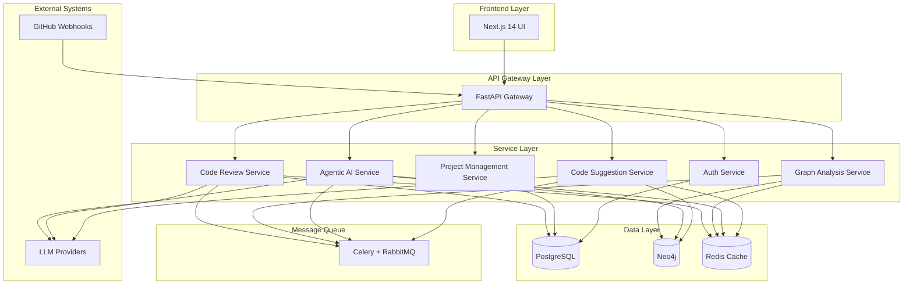
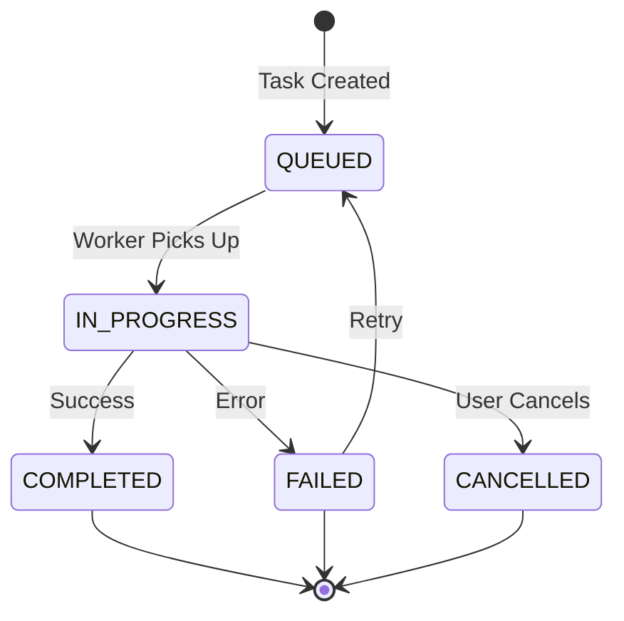

# Design Document: Platform Feature Completion and Optimization

## Overview

This design document outlines the architecture and implementation approach for completing and optimizing the six core features of the AI-powered code review platform. The platform follows a microservices architecture with FastAPI backends, multiple database systems (PostgreSQL, Neo4j, Redis), and a Next.js frontend.

The design focuses on:
1. Enhancing existing services (Code Review, Graph Analysis, Agentic AI, Authentication)
2. Completing the Project Management Service
3. Introducing the new Intelligent Code Suggestion Service (Feature 8.1.3)
4. Ensuring seamless service integration
5. Enforcing ISO/IEC 25010 and ISO/IEC 23396 standards compliance
6. Optimizing performance and scalability

## Architecture

### High-Level Architecture



### Service Architecture Patterns

**Microservices Pattern**: Each core feature is implemented as an independent service with its own API, business logic, and data access layer.

**Event-Driven Architecture**: Services communicate asynchronously using Celery task queues for long-running operations (code analysis, graph generation, AI reasoning).

**API Gateway Pattern**: A central FastAPI gateway handles routing, authentication, rate limiting, and request aggregation.

**Circuit Breaker Pattern**: Services implement circuit breakers for external dependencies (LLM providers, GitHub API) to prevent cascading failures.

**Cache-Aside Pattern**: Redis caches frequently accessed data (user sessions, graph query results, LLM responses) to reduce database load.

## Components and Interfaces

### 1. Code Review Service Enhancement

**Purpose**: Automated code quality analysis with standards compliance

**Key Components**:

- **WebhookHandler**: Receives and validates GitHub webhook events
- **PRAnalyzer**: Orchestrates code review workflow
- **ASTParser**: Parses code into abstract syntax trees
- **QualityAnalyzer**: Analyzes code against quality standards
- **StandardsMapper**: Maps findings to ISO/IEC 25010 and ISO/IEC 23396
- **SecurityScanner**: Cross-references OWASP Top 10 vulnerabilities
- **CommentGenerator**: Formats and posts review comments to GitHub
- **LLMClient**: Interfaces with multiple LLM providers with fallback

**API Endpoints**:

```python
POST /api/v1/code-review/webhook
  # Receives GitHub webhook events
  # Returns: 202 Accepted (async processing)

GET /api/v1/code-review/status/{review_id}
  # Returns review status and results
  # Returns: ReviewStatus object

POST /api/v1/code-review/analyze
  # Manually trigger code review
  # Body: { repo_url, pr_number, branch }
  # Returns: ReviewJob object

GET /api/v1/code-review/standards
  # Returns supported standards and rules
  # Returns: List[Standard]
```

**Data Models**:

```python
class ReviewJob:
    id: UUID
    pr_id: str
    repository: str
    status: ReviewStatus  # QUEUED, ANALYZING, COMPLETED, FAILED
    created_at: datetime
    completed_at: Optional[datetime]
    findings: List[Finding]

class Finding:
    id: UUID
    severity: Severity  # CRITICAL, HIGH, MEDIUM, LOW, INFO
    category: Category  # SECURITY, LOGIC, STYLE, PERFORMANCE
    iso_25010_characteristic: str  # e.g., "Security", "Maintainability"
    iso_23396_practice: Optional[str]
    owasp_reference: Optional[str]
    file_path: str
    line_number: int
    description: str
    suggestion: str
    confidence: float  # 0.0 to 1.0
```

**Integration Points**:
- Receives events from GitHub webhooks
- Queries Graph Analysis Service for architectural context
- Uses Agentic AI Service for complex reasoning
- Stores results in PostgreSQL
- Caches LLM responses in Redis

### 2. Graph Analysis Service Enhancement

**Purpose**: Real-time architecture visualization and drift detection

**Key Components**:

- **CodeParser**: Multi-language AST parser (Python, JavaScript/TypeScript)
- **DependencyExtractor**: Extracts relationships between code entities
- **GraphBuilder**: Constructs and updates Neo4j graph
- **ArchitectureAnalyzer**: Runs graph algorithms for pattern detection
- **DriftDetector**: Compares current vs baseline architecture
- **CouplingAnalyzer**: Identifies unexpected dependencies
- **CycleDetector**: Finds circular dependencies
- **DiagramGenerator**: Creates visual architecture representations

**API Endpoints**:

```python
POST /api/v1/graph/analyze
  # Analyzes code and updates graph
  # Body: { repo_url, branch, language }
  # Returns: AnalysisJob object

GET /api/v1/graph/architecture/{project_id}
  # Returns architecture diagram data
  # Query params: depth, node_types
  # Returns: GraphData object

GET /api/v1/graph/drift/{project_id}
  # Returns architectural drift analysis
  # Returns: DriftReport object

GET /api/v1/graph/dependencies/{component_id}
  # Returns dependencies for a component
  # Query params: direction (incoming/outgoing), depth
  # Returns: List[Dependency]

POST /api/v1/graph/query
  # Executes custom Cypher query
  # Body: { query, parameters }
  # Returns: QueryResult object
```

**Data Models**:

```python
class GraphNode:
    id: str
    type: NodeType  # MODULE, CLASS, FUNCTION, VARIABLE
    name: str
    file_path: str
    line_number: int
    properties: Dict[str, Any]

class GraphEdge:
    source_id: str
    target_id: str
    relationship: RelationType  # IMPORTS, CALLS, INHERITS, USES
    weight: float

class DriftReport:
    project_id: UUID
    baseline_date: datetime
    current_date: datetime
    new_couplings: List[Coupling]
    removed_couplings: List[Coupling]
    circular_dependencies: List[Cycle]
    complexity_changes: Dict[str, float]
    risk_score: float
```

**Neo4j Schema**:

```cypher
// Node types
(:Module {name, path, language})
(:Class {name, path, line_number})
(:Function {name, path, line_number, complexity})
(:Variable {name, type})

// Relationship types
(:Module)-[:IMPORTS]->(:Module)
(:Class)-[:INHERITS]->(:Class)
(:Function)-[:CALLS]->(:Function)
(:Class)-[:CONTAINS]->(:Function)
(:Function)-[:USES]->(:Variable)
```

**Integration Points**:
- Receives code from Code Review Service and Project Management Service
- Provides context to Agentic AI Service and Code Suggestion Service
- Stores graph data in Neo4j
- Caches query results in Redis

### 3. Agentic AI Service Enhancement

**Purpose**: Complex reasoning and decision support using multiple LLMs

**Key Components**:

- **LLMOrchestrator**: Manages multiple LLM providers with failover
- **ContextBuilder**: Gathers relevant context from graph database
- **PatternRecognizer**: Identifies code patterns and anti-patterns
- **CleanCodeAnalyzer**: Detects violations of Clean Code principles
- **ScenarioSimulator**: Evaluates architectural decision scenarios
- **ReasoningEngine**: Generates explainable suggestions
- **KnowledgeBase**: Manages OWASP, style guides, and best practices
- **ExplanationGenerator**: Creates natural language explanations
- **NaturalLanguageProcessor**: Converts technical findings into developer-friendly language

**API Endpoints**:

```python
POST /api/v1/ai/reason
  # Performs complex reasoning task
  # Body: { task_type, context, constraints }
  # Returns: ReasoningResult object

POST /api/v1/ai/simulate
  # Simulates architectural decision scenarios
  # Body: { current_state, proposed_changes }
  # Returns: SimulationResult object

POST /api/v1/ai/explain
  # Generates explanation for code or decision
  # Body: { code, context }
  # Returns: Explanation object

GET /api/v1/ai/patterns/{project_id}
  # Identifies patterns in project
  # Returns: List[Pattern]

POST /api/v1/ai/refactor-suggest
  # Suggests refactoring opportunities
  # Body: { component_id, constraints }
  # Returns: List[RefactoringSuggestion]
```

**Data Models**:

```python
class ReasoningResult:
    id: UUID
    task_type: str
    suggestions: List[Suggestion]
    confidence: float
    reasoning_chain: List[ReasoningStep]
    knowledge_references: List[str]

class Suggestion:
    title: str
    description: str
    impact: Impact  # HIGH, MEDIUM, LOW
    effort: Effort  # HIGH, MEDIUM, LOW
    risk: Risk  # HIGH, MEDIUM, LOW
    code_example: Optional[str]
    rationale: str

class SimulationResult:
    scenarios: List[Scenario]
    recommended_scenario: int
    comparison_matrix: Dict[str, Dict[str, float]]

class Scenario:
    name: str
    changes: List[Change]
    predicted_outcomes: Dict[str, float]
    risks: List[str]
    benefits: List[str]
```

**LLM Provider Configuration**:

```python
class LLMProvider:
    name: str  # "openai", "anthropic", "ollama"
    model: str  # "gpt-4", "claude-3.5-sonnet", "codellama"
    priority: int  # Lower = higher priority
    max_tokens: int
    temperature: float
    timeout: int
    rate_limit: int  # requests per minute
```

**Clean Code Principles Detection**:

The Agentic AI Service implements comprehensive Clean Code principle detection:

```python
class CleanCodePrinciple(str, Enum):
    MEANINGFUL_NAMES = "meaningful_names"  # Variables, functions, classes should reveal intent
    SMALL_FUNCTIONS = "small_functions"  # Functions should be small and do one thing
    DRY = "dry"  # Don't Repeat Yourself
    SINGLE_RESPONSIBILITY = "single_responsibility"  # One class, one responsibility
    PROPER_COMMENTS = "proper_comments"  # Comments should explain why, not what
    ERROR_HANDLING = "error_handling"  # Proper exception handling, no ignored errors
    FORMATTING = "formatting"  # Consistent indentation, spacing, line length
    BOUNDARIES = "boundaries"  # Clean interfaces between modules
    UNIT_TESTS = "unit_tests"  # Code should be testable and tested

class CleanCodeViolation:
    principle: CleanCodePrinciple
    severity: Severity
    location: CodeLocation
    description: str
    suggestion: str
    example_fix: Optional[str]
```

**Natural Language Generation**:

The service converts technical analysis into developer-friendly explanations:

```python
class NaturalLanguageExplanation:
    technical_finding: str  # Raw technical analysis
    developer_explanation: str  # Human-readable explanation
    why_it_matters: str  # Business/quality impact
    how_to_fix: str  # Step-by-step remediation
    code_example: Optional[str]  # Visual example
    
# Example transformation:
# Technical: "Cyclomatic complexity of 15 exceeds threshold of 10"
# Developer: "This function is doing too many things. Consider breaking it into 
#            smaller, focused functions. This will make your code easier to test,
#            understand, and maintain."
```

**Knowledge Base Structure**:

```python
class KnowledgeBase:
    owasp_top_10: Dict[int, OWASPVulnerability]  # Security vulnerabilities
    google_style_guides: Dict[Language, StyleGuide]  # Language-specific guides
    clean_code_patterns: List[CodePattern]  # Clean Code best practices
    anti_patterns: List[AntiPattern]  # Common code smells
    iso_23396_practices: Dict[str, EngineeringPractice]  # Standards
    
class StyleGuide:
    language: Language
    rules: List[StyleRule]
    examples: Dict[str, CodeExample]
    # Supported: Python (PEP 8), JavaScript, TypeScript, Java, C++, Shell
```

**Integration Points**:
- Queries Graph Analysis Service for architectural context
- Provides reasoning to Code Review Service and Code Suggestion Service
- Uses multiple LLM providers (OpenAI, Anthropic, Ollama)
- Caches responses in Redis
- Stores reasoning history in PostgreSQL

### 4. Authentication Service Enhancement

**Purpose**: Enterprise-grade security with RBAC and audit trails

**Key Components**:

- **AuthenticationManager**: Handles login, token generation, and validation
- **AuthorizationManager**: Enforces RBAC policies
- **TokenService**: Manages JWT token lifecycle
- **AuditLogger**: Records all access attempts and security events
- **RateLimiter**: Prevents brute force attacks
- **SessionManager**: Manages user sessions and token invalidation

**API Endpoints**:

```python
POST /api/v1/auth/login
  # Authenticates user and issues JWT
  # Body: { username, password }
  # Returns: AuthToken object

POST /api/v1/auth/refresh
  # Refreshes JWT token
  # Body: { refresh_token }
  # Returns: AuthToken object

POST /api/v1/auth/logout
  # Invalidates user session
  # Returns: 204 No Content

GET /api/v1/auth/verify
  # Verifies JWT token validity
  # Header: Authorization: Bearer <token>
  # Returns: UserInfo object

POST /api/v1/auth/authorize
  # Checks user permissions for resource
  # Body: { resource, action }
  # Returns: AuthorizationResult object

GET /api/v1/auth/audit
  # Returns audit logs
  # Query params: user_id, start_date, end_date, action
  # Returns: List[AuditLog]
```

**Data Models**:

```python
class User:
    id: UUID
    username: str
    email: str
    role: Role  # ADMINISTRATOR, PROGRAMMER, VISITOR
    is_active: bool
    created_at: datetime
    last_login: Optional[datetime]

class Role:
    name: str
    permissions: List[Permission]

class Permission:
    resource: str  # e.g., "code_review", "project"
    actions: List[Action]  # CREATE, READ, UPDATE, DELETE

class AuditLog:
    id: UUID
    user_id: UUID
    action: str
    resource: str
    timestamp: datetime
    ip_address: str
    success: bool
    details: Optional[Dict[str, Any]]

class AuthToken:
    access_token: str
    refresh_token: str
    token_type: str  # "Bearer"
    expires_in: int  # seconds
```

**RBAC Policy Matrix**:

| Resource | Administrator | Programmer | Visitor |
|----------|--------------|------------|---------|
| Projects | CRUD | CRUD (own) | R |
| Code Reviews | CRUD | CRUD (own) | R |
| Graph Data | CRUD | R | R |
| AI Reasoning | CRUD | CRU | R |
| Users | CRUD | R (self) | R (self) |
| Audit Logs | R | - | - |
| System Config | CRUD | - | - |

**Integration Points**:
- Validates all API requests across services
- Stores user data and audit logs in PostgreSQL
- Caches active sessions in Redis
- Provides user context to all services

### 5. Project Management Service Completion

**Purpose**: Comprehensive project lifecycle and task management

**Key Components**:

- **ProjectManager**: Manages project creation and configuration
- **TaskScheduler**: Queues and schedules analysis tasks
- **StatusTracker**: Monitors task progress and updates dashboard
- **RepositoryManager**: Manages repository connections and webhooks
- **PersonnelManager**: Handles team assignments and permissions
- **MetricsCalculator**: Computes project metrics and KPIs
- **AlertManager**: Generates alerts for bottlenecks and delays
- **DashboardService**: Provides real-time dashboard data

**API Endpoints**:

```python
POST /api/v1/projects
  # Creates new project
  # Body: { name, description, repo_url }
  # Returns: Project object

GET /api/v1/projects/{project_id}
  # Returns project details
  # Returns: Project object

PUT /api/v1/projects/{project_id}
  # Updates project configuration
  # Body: { name, description, settings }
  # Returns: Project object

POST /api/v1/projects/{project_id}/repositories
  # Links repository to project
  # Body: { repo_url, webhook_config }
  # Returns: Repository object

GET /api/v1/projects/{project_id}/tasks
  # Returns project tasks
  # Query params: status, assigned_to, date_range
  # Returns: List[Task]

POST /api/v1/projects/{project_id}/tasks
  # Creates new task
  # Body: { type, priority, config }
  # Returns: Task object

GET /api/v1/projects/{project_id}/dashboard
  # Returns dashboard data
  # Returns: DashboardData object

GET /api/v1/projects/{project_id}/metrics
  # Returns project metrics
  # Query params: metric_types, time_range
  # Returns: ProjectMetrics object

GET /api/v1/projects/{project_id}/alerts
  # Returns active alerts
  # Returns: List[Alert]
```

**Data Models**:

```python
class Project:
    id: UUID
    name: str
    description: str
    owner_id: UUID
    team_members: List[UUID]
    repositories: List[Repository]
    created_at: datetime
    updated_at: datetime
    status: ProjectStatus  # ACTIVE, ARCHIVED, SUSPENDED
    settings: ProjectSettings

class Repository:
    id: UUID
    project_id: UUID
    url: str
    branch: str
    webhook_id: Optional[str]
    webhook_secret: str
    last_sync: Optional[datetime]

class Task:
    id: UUID
    project_id: UUID
    type: TaskType  # CODE_REVIEW, GRAPH_ANALYSIS, AI_REASONING
    status: TaskStatus  # QUEUED, IN_PROGRESS, COMPLETED, FAILED, CANCELLED
    priority: Priority  # CRITICAL, HIGH, NORMAL, LOW
    assigned_to: Optional[UUID]
    created_at: datetime
    started_at: Optional[datetime]
    completed_at: Optional[datetime]
    result: Optional[Dict[str, Any]]
    error: Optional[str]

class ProjectMetrics:
    project_id: UUID
    time_range: DateRange
    total_tasks: int
    completed_tasks: int
    failed_tasks: int
    avg_completion_time: float  # seconds
    completion_rate: float  # percentage
    resource_utilization: Dict[str, float]
    bottlenecks: List[Bottleneck]

class Alert:
    id: UUID
    project_id: UUID
    type: AlertType  # BOTTLENECK, DELAY, ERROR, RESOURCE
    severity: Severity
    message: str
    created_at: datetime
    resolved: bool
```

**Task Lifecycle States**:



**Integration Points**:
- Orchestrates Code Review, Graph Analysis, and AI services
- Manages GitHub webhook configuration
- Stores project data in PostgreSQL
- Uses Celery for task scheduling
- Provides dashboard data to frontend

### 6. Intelligent Code Suggestion Service (New Feature 8.1.3)

**Purpose**: Proactive AI-powered code improvement suggestions

**Key Components**:

- **CodeAnalyzer**: Analyzes partial or complete code
- **PatternMatcher**: Identifies project-specific patterns from graph
- **BestPracticeEngine**: References style guides and standards
- **SecurityAdvisor**: Suggests security improvements
- **RefactoringEngine**: Generates refactoring suggestions
- **RankingEngine**: Ranks suggestions by impact and effort
- **FeedbackTracker**: Tracks suggestion acceptance rates
- **ContextManager**: Manages conversation context for iterative suggestions

**API Endpoints**:

```python
POST /api/v1/suggestions/analyze
  # Analyzes code and provides suggestions
  # Body: { code, language, context }
  # Returns: List[Suggestion]

POST /api/v1/suggestions/refactor
  # Suggests refactoring for code
  # Body: { code, language, constraints }
  # Returns: List[RefactoringSuggestion]

POST /api/v1/suggestions/security
  # Provides security improvement suggestions
  # Body: { code, language }
  # Returns: List[SecuritySuggestion]

GET /api/v1/suggestions/patterns/{project_id}
  # Returns project-specific patterns
  # Returns: List[Pattern]

POST /api/v1/suggestions/feedback
  # Records suggestion acceptance/rejection
  # Body: { suggestion_id, accepted, feedback }
  # Returns: 204 No Content

GET /api/v1/suggestions/metrics
  # Returns suggestion metrics
  # Query params: project_id, time_range
  # Returns: SuggestionMetrics object
```

**Data Models**:

```python
class CodeSuggestion:
    id: UUID
    type: SuggestionType  # REFACTOR, SECURITY, STYLE, PERFORMANCE
    title: str
    description: str
    code_before: str
    code_after: str
    impact: Impact
    effort: Effort
    confidence: float
    references: List[str]  # Style guides, standards
    project_patterns: List[str]

class SuggestionMetrics:
    total_suggestions: int
    accepted_suggestions: int
    rejected_suggestions: int
    acceptance_rate: float
    avg_impact: float
    suggestions_by_type: Dict[SuggestionType, int]
```

**Integration Points**:
- Queries Graph Analysis Service for project patterns
- Uses Agentic AI Service for complex reasoning
- References same knowledge bases as Code Review Service
- Stores suggestions and feedback in PostgreSQL
- Caches patterns in Redis

## Data Models

### Shared Data Models

**Standards Compliance Models**:

```python
class ISO25010Characteristic:
    name: str  # e.g., "Security", "Maintainability"
    sub_characteristics: List[str]
    metrics: List[Metric]

class ISO23396Practice:
    id: str
    name: str
    description: str
    category: str

class OWASPVulnerability:
    rank: int  # 1-10
    name: str
    description: str
    examples: List[str]
    mitigations: List[str]
```

**Common Enums**:

```python
class Severity(str, Enum):
    CRITICAL = "critical"
    HIGH = "high"
    MEDIUM = "medium"
    LOW = "low"
    INFO = "info"

class Language(str, Enum):
    PYTHON = "python"
    JAVASCRIPT = "javascript"
    TYPESCRIPT = "typescript"
    JAVA = "java"
    GO = "go"

class TaskStatus(str, Enum):
    QUEUED = "queued"
    IN_PROGRESS = "in_progress"
    COMPLETED = "completed"
    FAILED = "failed"
    CANCELLED = "cancelled"
```

### Database Schemas

**PostgreSQL Tables**:

```sql
-- Users and Authentication
CREATE TABLE users (
    id UUID PRIMARY KEY,
    username VARCHAR(255) UNIQUE NOT NULL,
    email VARCHAR(255) UNIQUE NOT NULL,
    password_hash VARCHAR(255) NOT NULL,
    role VARCHAR(50) NOT NULL,
    is_active BOOLEAN DEFAULT TRUE,
    created_at TIMESTAMP DEFAULT NOW(),
    last_login TIMESTAMP
);

-- Projects
CREATE TABLE projects (
    id UUID PRIMARY KEY,
    name VARCHAR(255) NOT NULL,
    description TEXT,
    owner_id UUID REFERENCES users(id),
    status VARCHAR(50) NOT NULL,
    settings JSONB,
    created_at TIMESTAMP DEFAULT NOW(),
    updated_at TIMESTAMP DEFAULT NOW()
);

-- Repositories
CREATE TABLE repositories (
    id UUID PRIMARY KEY,
    project_id UUID REFERENCES projects(id),
    url VARCHAR(500) NOT NULL,
    branch VARCHAR(255) DEFAULT 'main',
    webhook_id VARCHAR(255),
    webhook_secret VARCHAR(255),
    last_sync TIMESTAMP
);

-- Tasks
CREATE TABLE tasks (
    id UUID PRIMARY KEY,
    project_id UUID REFERENCES projects(id),
    type VARCHAR(50) NOT NULL,
    status VARCHAR(50) NOT NULL,
    priority VARCHAR(50) NOT NULL,
    assigned_to UUID REFERENCES users(id),
    created_at TIMESTAMP DEFAULT NOW(),
    started_at TIMESTAMP,
    completed_at TIMESTAMP,
    result JSONB,
    error TEXT
);

-- Code Review Results
CREATE TABLE review_jobs (
    id UUID PRIMARY KEY,
    pr_id VARCHAR(255) NOT NULL,
    repository VARCHAR(500) NOT NULL,
    status VARCHAR(50) NOT NULL,
    created_at TIMESTAMP DEFAULT NOW(),
    completed_at TIMESTAMP
);

CREATE TABLE findings (
    id UUID PRIMARY KEY,
    review_job_id UUID REFERENCES review_jobs(id),
    severity VARCHAR(50) NOT NULL,
    category VARCHAR(50) NOT NULL,
    iso_25010_characteristic VARCHAR(100),
    iso_23396_practice VARCHAR(100),
    owasp_reference VARCHAR(100),
    file_path VARCHAR(500) NOT NULL,
    line_number INTEGER NOT NULL,
    description TEXT NOT NULL,
    suggestion TEXT NOT NULL,
    confidence FLOAT
);

-- Audit Logs
CREATE TABLE audit_logs (
    id UUID PRIMARY KEY,
    user_id UUID REFERENCES users(id),
    action VARCHAR(100) NOT NULL,
    resource VARCHAR(100) NOT NULL,
    timestamp TIMESTAMP DEFAULT NOW(),
    ip_address VARCHAR(45),
    success BOOLEAN NOT NULL,
    details JSONB
);

-- Code Suggestions
CREATE TABLE code_suggestions (
    id UUID PRIMARY KEY,
    project_id UUID REFERENCES projects(id),
    type VARCHAR(50) NOT NULL,
    title VARCHAR(255) NOT NULL,
    description TEXT,
    code_before TEXT,
    code_after TEXT,
    impact VARCHAR(50),
    effort VARCHAR(50),
    confidence FLOAT,
    created_at TIMESTAMP DEFAULT NOW()
);

CREATE TABLE suggestion_feedback (
    id UUID PRIMARY KEY,
    suggestion_id UUID REFERENCES code_suggestions(id),
    user_id UUID REFERENCES users(id),
    accepted BOOLEAN NOT NULL,
    feedback TEXT,
    created_at TIMESTAMP DEFAULT NOW()
);
```

**Redis Cache Keys**:

```
# User sessions
session:{user_id} -> UserSession (TTL: 24 hours)

# LLM responses
llm:{provider}:{model}:{hash(prompt)} -> Response (TTL: 7 days)

# Graph query results
graph:{project_id}:{hash(query)} -> QueryResult (TTL: 1 hour)

# Project patterns
patterns:{project_id} -> List[Pattern] (TTL: 6 hours)

# Rate limiting
ratelimit:{user_id}:{endpoint} -> Counter (TTL: 1 minute)
```


## Correctness Properties

*A property is a characteristic or behavior that should hold true across all valid executions of a system—essentially, a formal statement about what the system should do. Properties serve as the bridge between human-readable specifications and machine-verifiable correctness guarantees.*

### Property 1: Standards Compliance Mapping

*For any* code violation or finding detected by the platform, it SHALL be mapped to at least one valid ISO/IEC 25010 quality characteristic or ISO/IEC 23396 engineering practice, ensuring all findings are traceable to recognized standards.

**Validates: Requirements 1.3, 1.4, 8.2, 8.3**

### Property 2: GitHub Integration Completeness

*For any* completed code review, actionable comments SHALL be posted to the corresponding GitHub PR, ensuring developers receive feedback in their workflow.

**Validates: Requirements 1.5**

### Property 3: Security Finding OWASP Reference

*For any* finding classified as a security risk, it SHALL include a reference to the relevant OWASP Top 10 vulnerability category when applicable.

**Validates: Requirements 1.6**

### Property 4: LLM Provider Failover

*For any* LLM request where the primary provider fails, the system SHALL automatically attempt the request with the next available provider in the priority list, ensuring service continuity.

**Validates: Requirements 1.7, 3.7**

### Property 5: Error Logging Completeness

*For any* failed operation (code review, graph analysis, AI reasoning), the system SHALL create a detailed error log entry containing timestamp, error type, error message, and context information.

**Validates: Requirements 1.8, 7.6**

### Property 6: Code Parsing Completeness

*For any* valid source code in a supported language (Python, JavaScript, TypeScript), the Graph Analysis Service SHALL successfully parse it into an AST representation without errors.

**Validates: Requirements 2.1, 9.1, 9.2**

### Property 7: Dependency Extraction Completeness

*For any* generated AST, the Graph Analysis Service SHALL extract all dependency relationships (imports, calls, inheritance, usage) between code entities.

**Validates: Requirements 2.2**

### Property 8: Graph Storage Round-Trip

*For any* set of extracted dependencies, storing them in Neo4j and then querying them back SHALL produce an equivalent set of relationships, ensuring data integrity.

**Validates: Requirements 2.3**

### Property 9: Architecture Diagram Generation

*For any* updated graph database, the system SHALL generate a valid architecture diagram representation containing nodes and edges with proper metadata.

**Validates: Requirements 2.4**

### Property 10: Architectural Drift Detection

*For any* architecture change that deviates from the established baseline patterns, the system SHALL detect and report the drift with specific details about what changed.

**Validates: Requirements 2.5**

### Property 11: Coupling Warning Generation

*For any* detected unexpected coupling between components, the system SHALL generate a warning with a valid severity level (CRITICAL, HIGH, MEDIUM, LOW).

**Validates: Requirements 2.6**

### Property 12: Circular Dependency Identification

*For any* circular dependency detected in the code graph, the system SHALL identify and return all components that participate in the cycle.

**Validates: Requirements 2.7**

### Property 13: Multi-Provider LLM Support

*For any* reasoning request, the Agentic AI Service SHALL successfully process it using any of the configured LLM providers (GPT-4, Claude 3.5, Ollama).

**Validates: Requirements 3.1**

### Property 14: Graph Context Integration

*For any* code pattern analysis request, the Agentic AI Service SHALL query the Neo4j graph database to retrieve contextual information before generating suggestions.

**Validates: Requirements 3.2**

### Property 15: Scenario Evaluation Completeness

*For any* architecture decision simulation, the system SHALL evaluate at least two alternative scenarios and rank them by predicted impact.

**Validates: Requirements 3.3**

### Property 16: Explainable Reasoning

*For any* AI-generated suggestion, the system SHALL include explainable reasoning with supporting evidence from code analysis or knowledge bases.

**Validates: Requirements 3.4**

### Property 17: Knowledge Base References

*For any* suggestion related to best practices or security, the system SHALL include references to relevant knowledge bases (OWASP Top 10, Google Style Guides, ISO/IEC 23396).

**Validates: Requirements 3.5, 6.3, 6.4**

### Property 18: Refactoring Estimation

*For any* refactoring suggestion, the system SHALL provide estimates for both effort level (HIGH, MEDIUM, LOW) and risk level (HIGH, MEDIUM, LOW).

**Validates: Requirements 3.6**

### Property 18.1: Clean Code Principle Detection

*For any* code analyzed by the Agentic AI Service, violations of Clean Code principles (meaningful names, small functions, DRY, single responsibility, proper comments, error handling, formatting, boundaries, unit tests) SHALL be identified and reported with specific principle references.

**Validates: Requirements 3.9**

### Property 18.2: Natural Language Explanation Generation

*For any* technical finding or static analysis result, the system SHALL generate a natural language explanation that is understandable for developers, including why it matters and how to fix it.

**Validates: Requirements 3.11**

### Property 18.3: Contextual Reasoning with Graph Database

*For any* architectural evaluation, the Agentic AI Service SHALL query the graph database to retrieve dependency context and determine if modifications disrupt overall architectural logic.

**Validates: Requirements 3.10**

### Property 19: JWT Token Issuance

*For any* valid user credentials, the Auth Service SHALL issue a JWT token containing user identity, role, and expiration time.

**Validates: Requirements 4.1**

### Property 20: RBAC Policy Enforcement

*For any* user request to a protected resource, the Auth Service SHALL enforce RBAC policies by verifying the user's role has the required permissions before allowing access.

**Validates: Requirements 4.2, 4.3**

### Property 21: Access Denial Audit Logging

*For any* denied access attempt, the Auth Service SHALL create an audit log entry containing user identity, timestamp, requested resource, and denial reason.

**Validates: Requirements 4.4**

### Property 22: Audit Log Completeness

*For any* time range query, the Auth Service SHALL return all access attempts (successful and failed) that occurred within that range.

**Validates: Requirements 4.5**

### Property 23: Token Invalidation on Role Change

*For any* user whose role is modified, all existing JWT tokens for that user SHALL become invalid and subsequent requests with those tokens SHALL be rejected.

**Validates: Requirements 4.6**

### Property 24: Expired Token Rejection

*For any* request with an expired JWT token, the Auth Service SHALL reject it and return a 401 Unauthorized error code.

**Validates: Requirements 4.7**

### Property 25: Rate Limiting and Account Lockout

*For any* user with more than N failed login attempts within M minutes (configurable threshold), the Auth Service SHALL temporarily lock the account and reject further login attempts.

**Validates: Requirements 4.8**

### Property 26: Project Initialization Completeness

*For any* newly created project, the Project Management Service SHALL initialize all required metadata fields (name, owner, status, created_at) and establish repository links if provided.

**Validates: Requirements 5.1**

### Property 27: Task Lifecycle State Transitions

*For any* task, its status SHALL only transition through valid lifecycle states (QUEUED → IN_PROGRESS → COMPLETED/FAILED/CANCELLED), never skipping states or moving backwards.

**Validates: Requirements 5.2**

### Property 28: Real-Time Dashboard Updates

*For any* task status change, the dashboard data SHALL reflect the updated status within the next query, ensuring real-time visibility.

**Validates: Requirements 5.3**

### Property 29: Task Completion Data Recording

*For any* completed task, the system SHALL record completion timestamp, results (if successful), and error details (if failed).

**Validates: Requirements 5.4**

### Property 30: Personnel Assignment Validation

*For any* personnel assignment to a project, the system SHALL validate that the user has appropriate permissions and reject assignments for users without required access.

**Validates: Requirements 5.5**

### Property 31: Webhook Configuration Validation

*For any* repository link added to a project, the system SHALL validate that the GitHub webhook is properly configured and accessible.

**Validates: Requirements 5.6**

### Property 32: Bottleneck Alert Generation

*For any* task that exceeds the configured time threshold for its type, the system SHALL generate an alert indicating a potential bottleneck.

**Validates: Requirements 5.7**

### Property 33: Project Metrics Calculation

*For any* project, the system SHALL calculate accurate metrics including completion rate (completed_tasks / total_tasks), average processing time, and resource utilization based on historical task data.

**Validates: Requirements 5.8**

### Property 34: Code Suggestion Generation

*For any* code input (partial or complete), the Code Suggestion Service SHALL analyze it and provide at least one actionable suggestion when improvement opportunities exist.

**Validates: Requirements 6.1**

### Property 35: Project Pattern Integration

*For any* code suggestion generated, the system SHALL query the graph database for project-specific patterns and incorporate them into the suggestion context.

**Validates: Requirements 6.2**

### Property 36: Refactoring Before/After Examples

*For any* refactoring suggestion, the system SHALL provide both the original code (before) and the improved code (after) as concrete examples.

**Validates: Requirements 6.5**

### Property 37: Suggestion Ranking

*For any* set of multiple suggestions, the system SHALL rank them by impact and effort, with higher-impact and lower-effort suggestions ranked higher.

**Validates: Requirements 6.6**

### Property 38: Suggestion Acceptance Tracking

*For any* suggestion that is applied or rejected by a user, the system SHALL record the acceptance decision and optional feedback for continuous improvement.

**Validates: Requirements 6.7**

### Property 39: Parallel Service Triggering

*For any* incoming PR event, the platform SHALL trigger Code Review Service, Graph Analysis Service, and Code Suggestion Service in parallel (all three services receive the event).

**Validates: Requirements 7.1**

### Property 40: Service Change Notification

*For any* graph data update, the platform SHALL notify all dependent services (Agentic AI Service, Code Suggestion Service) of the change.

**Validates: Requirements 7.4**

### Property 41: Protected Endpoint Token Validation

*For any* request to a protected API endpoint, the platform SHALL validate the JWT token through the Auth Service before processing the request.

**Validates: Requirements 7.5**

### Property 42: Circuit Breaker Activation

*For any* external service dependency that fails repeatedly (exceeding failure threshold), the platform SHALL open the circuit breaker and stop sending requests for a cooldown period.

**Validates: Requirements 7.7**

### Property 43: ISO/IEC 25010 Comprehensive Evaluation

*For any* code analysis, the platform SHALL evaluate all eight ISO/IEC 25010 quality characteristics (functional suitability, performance efficiency, compatibility, usability, reliability, security, maintainability, portability).

**Validates: Requirements 8.1**

### Property 44: Compliance Report Completeness

*For any* generated compliance report, it SHALL include standard references (ISO/IEC 25010, ISO/IEC 23396), severity classifications for all findings, and mapping to quality characteristics.

**Validates: Requirements 8.4**

### Property 45: ISO/IEC 25010 Metric Framework

*For any* quality metric calculated, it SHALL follow the ISO/IEC 25010 measurement framework definitions and formulas.

**Validates: Requirements 8.5**

### Property 46: Immutable Audit Logs

*For any* audit log entry created, it SHALL be immutable (cannot be modified or deleted after creation), ensuring compliance verification integrity.

**Validates: Requirements 8.6**

### Property 47: Quality Gate Enforcement

*For any* code that fails to meet the defined quality gate thresholds, the platform SHALL block approval and require remediation before allowing merge.

**Validates: Requirements 8.8**

### Property 48: Repository Graph Isolation

*For any* repository connected to the platform, its graph data SHALL be stored in a separate namespace or database, preventing cross-contamination with other repositories.

**Validates: Requirements 9.4**

### Property 49: Cross-Repository Dependency Identification

*For any* cross-repository analysis request, the platform SHALL identify shared dependencies and common patterns across the specified repositories.

**Validates: Requirements 9.5**

### Property 50: Language-Specific Style Guide Application

*For any* code analysis, the platform SHALL apply the appropriate style guide based on the detected language (PEP 8 for Python, Google JavaScript Style Guide for JavaScript/TypeScript).

**Validates: Requirements 9.6**

### Property 51: Multi-Platform Webhook Support

*For any* repository from supported platforms (GitHub, GitLab, Bitbucket), the platform SHALL successfully configure and receive webhook events.

**Validates: Requirements 9.7**

### Property 52: Secure Credential Storage

*For any* repository credential or token stored, it SHALL be encrypted at rest and only decrypted when needed for repository access.

**Validates: Requirements 9.8**

### Property 53: Task Priority Ordering

*For any* set of queued tasks with different priorities, critical tasks (security issues) SHALL be processed before routine tasks (style checks).

**Validates: Requirements 10.6**

## Error Handling

### Error Categories

The platform defines the following error categories for consistent error handling:

1. **Validation Errors** (400): Invalid input data, malformed requests
2. **Authentication Errors** (401): Invalid credentials, expired tokens
3. **Authorization Errors** (403): Insufficient permissions
4. **Not Found Errors** (404): Resource does not exist
5. **Conflict Errors** (409): Resource state conflicts
6. **Rate Limit Errors** (429): Too many requests
7. **Internal Errors** (500): Unexpected server errors
8. **Service Unavailable Errors** (503): Dependency failures, circuit breaker open

### Error Response Format

All API errors follow a consistent JSON format:

```json
{
  "error": {
    "code": "ERROR_CODE",
    "message": "Human-readable error message",
    "details": {
      "field": "Additional context",
      "trace_id": "uuid-for-tracking"
    },
    "timestamp": "2024-01-15T10:30:00Z"
  }
}
```

### Service-Specific Error Handling

**Code Review Service**:
- **LLM Provider Failure**: Automatically failover to next provider, log failure
- **GitHub API Failure**: Retry with exponential backoff (3 attempts), then fail gracefully
- **Parsing Errors**: Log error with code context, return partial results if possible
- **Timeout**: Cancel analysis after 5 minutes, return timeout error

**Graph Analysis Service**:
- **Neo4j Connection Failure**: Retry connection, use circuit breaker pattern
- **AST Parsing Failure**: Log error with file context, continue with other files
- **Query Timeout**: Cancel query after 30 seconds, return partial results
- **Memory Exhaustion**: Implement pagination for large graphs

**Agentic AI Service**:
- **LLM Provider Failure**: Failover to next provider in priority list
- **Context Too Large**: Truncate context intelligently, prioritize recent changes
- **Rate Limit Exceeded**: Queue request for retry, implement backoff
- **Invalid Response**: Retry with different prompt, log for analysis

**Auth Service**:
- **Database Connection Failure**: Use circuit breaker, return 503
- **Token Validation Failure**: Return 401 with clear error message
- **Rate Limit Exceeded**: Return 429 with retry-after header
- **Account Locked**: Return 403 with lockout duration

**Project Management Service**:
- **Task Queue Full**: Implement backpressure, reject new tasks temporarily
- **Webhook Configuration Failure**: Log error, allow manual retry
- **Database Transaction Failure**: Rollback, retry once, then fail
- **Orphaned Tasks**: Background job to detect and clean up stuck tasks

**Code Suggestion Service**:
- **Graph Query Failure**: Continue without project patterns, use general patterns
- **LLM Provider Failure**: Failover to next provider
- **Insufficient Context**: Request additional context from user
- **No Suggestions Available**: Return empty list with explanation

### Retry Strategies

**Exponential Backoff**:
```python
def exponential_backoff(attempt: int, base_delay: float = 1.0, max_delay: float = 60.0) -> float:
    delay = min(base_delay * (2 ** attempt), max_delay)
    jitter = random.uniform(0, delay * 0.1)  # Add 10% jitter
    return delay + jitter
```

**Circuit Breaker States**:
- **CLOSED**: Normal operation, requests pass through
- **OPEN**: Failure threshold exceeded, requests fail immediately
- **HALF_OPEN**: Testing if service recovered, limited requests allowed

**Circuit Breaker Configuration**:
```python
class CircuitBreakerConfig:
    failure_threshold: int = 5  # Open after 5 failures
    success_threshold: int = 2  # Close after 2 successes in half-open
    timeout: int = 60  # Seconds before trying half-open
    window_size: int = 300  # Seconds for failure counting
```

### Logging Strategy

**Log Levels**:
- **DEBUG**: Detailed diagnostic information
- **INFO**: General informational messages
- **WARNING**: Warning messages for potential issues
- **ERROR**: Error messages for failures
- **CRITICAL**: Critical failures requiring immediate attention

**Structured Logging Format**:
```json
{
  "timestamp": "2024-01-15T10:30:00Z",
  "level": "ERROR",
  "service": "code-review-service",
  "trace_id": "uuid",
  "user_id": "uuid",
  "message": "LLM provider failed",
  "context": {
    "provider": "openai",
    "model": "gpt-4",
    "error": "rate_limit_exceeded"
  }
}
```

**Log Retention**:
- **DEBUG/INFO**: 7 days
- **WARNING**: 30 days
- **ERROR/CRITICAL**: 90 days
- **Audit Logs**: 7 years (compliance requirement)

## Testing Strategy

### Dual Testing Approach

The platform requires both unit testing and property-based testing for comprehensive coverage:

**Unit Tests**:
- Verify specific examples and edge cases
- Test integration points between components
- Validate error conditions and exception handling
- Test database operations and transactions
- Verify API endpoint contracts

**Property-Based Tests**:
- Verify universal properties across all inputs
- Test with randomized inputs (100+ iterations per property)
- Validate invariants and business rules
- Test round-trip operations (serialization, parsing)
- Verify state machine transitions

### Property-Based Testing Configuration

**Testing Library**: Use `hypothesis` for Python services

**Configuration**:
```python
from hypothesis import settings, HealthCheck

# Property test configuration
@settings(
    max_examples=100,  # Minimum 100 iterations
    deadline=None,  # No deadline for complex tests
    suppress_health_check=[HealthCheck.too_slow]
)
```

**Property Test Tagging**:
Each property test must reference its design document property:

```python
@pytest.mark.property_test
@pytest.mark.feature("platform-feature-completion-and-optimization")
@pytest.mark.property(1, "Standards Compliance Mapping")
def test_property_standards_compliance_mapping():
    """
    Property 1: For any code violation detected, it SHALL be mapped to 
    at least one valid ISO/IEC 25010 quality characteristic or 
    ISO/IEC 23396 engineering practice.
    """
    # Test implementation
```

### Test Coverage Requirements

**Minimum Coverage Targets**:
- **Overall Code Coverage**: 80%
- **Critical Paths**: 95% (authentication, authorization, data integrity)
- **API Endpoints**: 100% (all endpoints must have tests)
- **Error Handling**: 90% (all error paths tested)

### Testing Pyramid

```
        /\
       /  \
      / E2E \          10% - End-to-End Tests
     /______\
    /        \
   /Integration\       30% - Integration Tests
  /____________\
 /              \
/   Unit Tests   \     60% - Unit + Property Tests
/__________________\
```

### Service-Specific Testing

**Code Review Service**:
- Unit tests for AST parsing, finding classification, comment generation
- Property tests for standards mapping, LLM failover, error logging
- Integration tests for GitHub webhook handling, LLM provider communication
- Mock LLM responses for deterministic testing

**Graph Analysis Service**:
- Unit tests for dependency extraction, cycle detection, drift calculation
- Property tests for parsing completeness, round-trip storage, isolation
- Integration tests for Neo4j operations, diagram generation
- Use test graphs with known properties

**Agentic AI Service**:
- Unit tests for context building, scenario evaluation, ranking
- Property tests for multi-provider support, explainable reasoning
- Integration tests for graph queries, LLM communication
- Mock LLM responses for deterministic testing

**Auth Service**:
- Unit tests for token generation, RBAC policy evaluation, rate limiting
- Property tests for token validation, audit logging, role enforcement
- Integration tests for database operations, session management
- Security tests for token tampering, brute force attacks

**Project Management Service**:
- Unit tests for project creation, task scheduling, metrics calculation
- Property tests for state transitions, validation, alert generation
- Integration tests for webhook configuration, service orchestration
- Load tests for concurrent task processing

**Code Suggestion Service**:
- Unit tests for suggestion generation, ranking, feedback tracking
- Property tests for pattern integration, reference inclusion
- Integration tests for graph queries, LLM communication
- A/B testing for suggestion quality improvement

### Continuous Integration

**CI Pipeline**:
1. **Lint**: Run code linters (pylint, black, mypy)
2. **Unit Tests**: Run all unit tests with coverage
3. **Property Tests**: Run all property-based tests (100 iterations)
4. **Integration Tests**: Run integration tests against test databases
5. **Security Scan**: Run security vulnerability scanners
6. **Build**: Build Docker images
7. **Deploy**: Deploy to staging environment

**Quality Gates**:
- All tests must pass
- Code coverage must meet minimum thresholds
- No critical security vulnerabilities
- No linting errors
- Performance benchmarks must pass

### Performance Testing

**Load Testing Scenarios**:
- 100 concurrent PR events
- 1000 concurrent API requests
- Graph queries on 100,000 node graphs
- 10,000 concurrent user sessions

**Performance Benchmarks**:
- API response time: p95 < 500ms, p99 < 1000ms
- Graph query time: p95 < 2s for 10,000 nodes
- Code review completion: p95 < 5 minutes
- Dashboard load time: p95 < 1s

**Tools**:
- **Load Testing**: Locust, k6
- **Profiling**: py-spy, cProfile
- **Monitoring**: Prometheus, Grafana
- **Tracing**: Jaeger, OpenTelemetry

