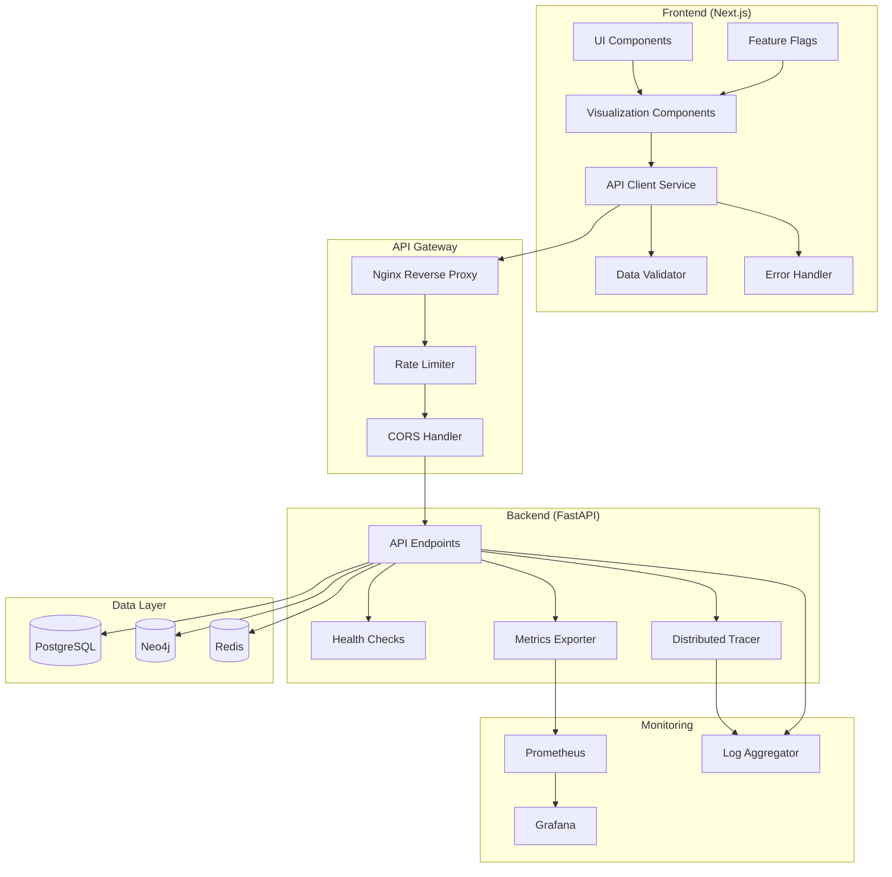
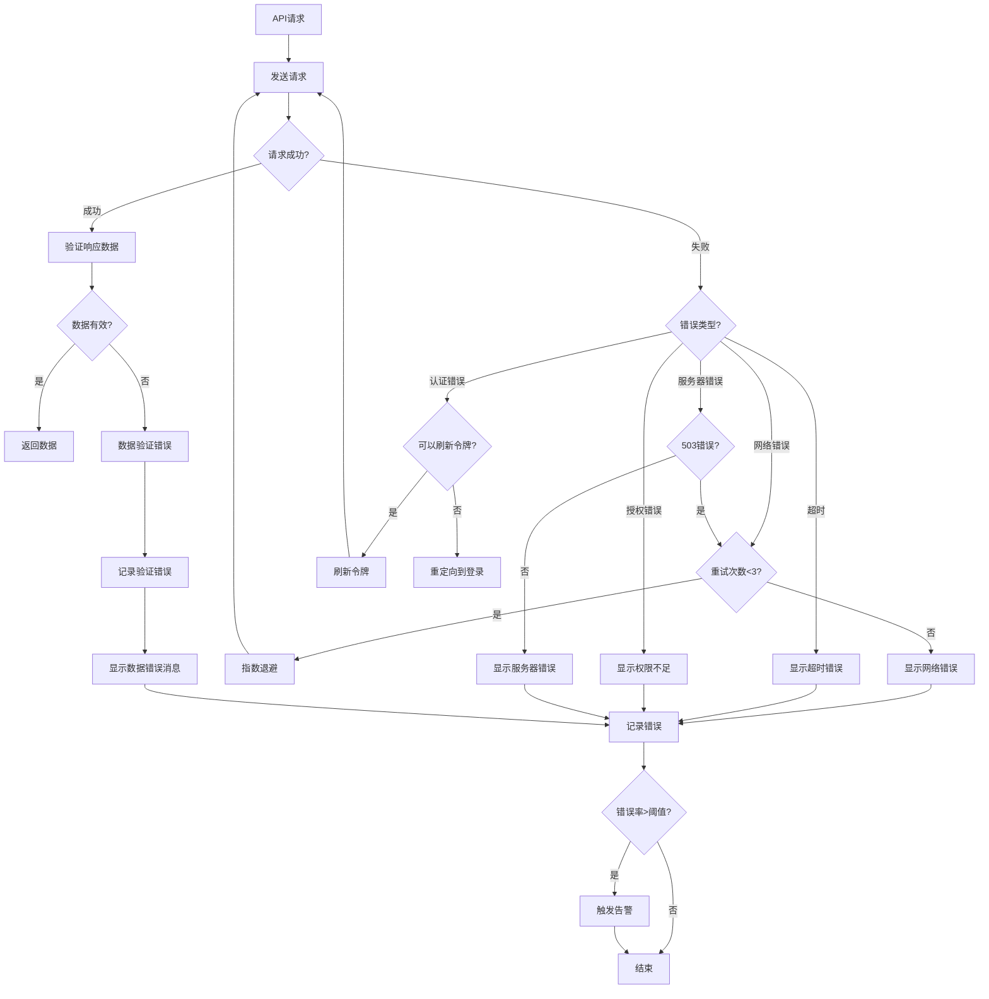

# Production Environment Migration Design Document

## Overview

This design document describes the technical solution for systematically migrating the AI Code Review Platform from development environment to production environment. The migration involves comprehensive transformation of both frontend (Next.js) and backend (FastAPI), ensuring all components use real data sources, production-grade API connections, comprehensive error handling, and data validation mechanisms.

### Design Goals

1. **Data Authenticity**: Remove all mock data, ensure system uses real backend API data
2. **Reliability**: Implement comprehensive error handling, retry mechanisms, and degradation strategies
3. **Observability**: Establish comprehensive monitoring, logging, and tracing systems
4. **Security**: Strengthen production environment security configuration and access control
5. **Maintainability**: Provide complete documentation and automated migration tools
6. **Progressive Migration**: Support feature flags and A/B testing to reduce migration risk

### Technology Stack

**Frontend**:
- Next.js 16.1.6 (React 19.2.4)
- TypeScript 5.9.3
- Zod 4.3.5 (data validation)
- Axios 1.7.2 + axios-retry 4.5.0 (HTTP client)
- TanStack Query 5.51.1 (data fetching and caching)
- D3.js, React Force Graph, ReactFlow, Recharts (visualization)

**Backend**:
- FastAPI 0.128.0
- Python 3.13
- PostgreSQL (primary database)
- Neo4j (graph database)
- Redis (caching and sessions)
- OpenTelemetry (distributed tracing)
- Prometheus (metrics monitoring)

### Migration Scope

This migration covers the following modules:

1. **Frontend Visualization Components**: ArchitectureGraph, DependencyGraphVisualization, Neo4jGraphVisualization, PerformanceDashboard
2. **API Integration Layer**: Unified API client service, environment configuration management
3. **Data Validation Layer**: Zod schema definitions, runtime type checking
4. **Error Handling Layer**: Global error handler, retry mechanisms, user-friendly error messages
5. **Monitoring and Logging**: Structured logging, Prometheus metrics, OpenTelemetry tracing
6. **Security Configuration**: Environment variable management, HTTPS enforcement, CORS policy, rate limiting
7. **Migration Tools**: Automated migration scripts, health checks, rollback plans
8. **Feature Flags**: Progressive migration support, A/B testing capability

## Architecture

### System Architecture Diagram



### Architecture Layers

#### 1. Frontend Layer

**Responsibilities**:
- User interface rendering and interaction
- Data visualization (charts, graphs, dashboards)
- API request management and caching
- Client-side data validation
- Error handling and user feedback
- Feature flag control

**Key Components**:
- **UI Components**: Accessible components based on Radix UI and Tailwind CSS
- **Visualization Components**: Visualization libraries like D3.js, ReactFlow, Recharts
- **API Client Service**: Unified HTTP client handling authentication, retry, timeout
- **Data Validator**: Zod schema validators ensuring API response type safety
- **Error Handler**: Global error handling, user-friendly error messages
- **Feature Flags**: Feature flag system supporting progressive migration

#### 2. API Gateway Layer

**Responsibilities**:
- Reverse proxy and load balancing
- SSL/TLS termination
- Rate limiting
- CORS policy enforcement
- Request logging and monitoring

**Key Components**:
- **Nginx**: Reverse proxy server handling HTTPS and static resources
- **Rate Limiter**: Rate limiting middleware based on SlowAPI
- **CORS Handler**: CORS policy configuration and enforcement

#### 3. Backend Service Layer

**Responsibilities**:
- Business logic processing
- Database operations
- External service integration (GitHub, LLM)
- Authentication and authorization
- Health checks and metrics exposure

**Key Components**:
- **API Endpoints**: RESTful API endpoints handling various business requests
- **Health Checks**: Health check endpoints (/health, /health/ready, /health/live)
- **Metrics Exporter**: Prometheus metrics exporter
- **Distributed Tracer**: OpenTelemetry distributed tracing

#### 4. Data Layer

**Responsibilities**:
- Data persistence
- Cache management
- Graph data storage

**Key Components**:
- **PostgreSQL**: Primary database storing users, projects, review results, etc.
- **Neo4j**: Graph database storing dependencies and architecture graphs
- **Redis**: Cache and session storage

#### 5. Monitoring Layer

**Responsibilities**:
- Metrics collection and visualization
- Log aggregation and analysis
- Distributed tracing
- Alert management

**Key Components**:
- **Prometheus**: Metrics collection and storage
- **Grafana**: Metrics visualization and dashboards
- **Log Aggregator**: Log aggregation system (CloudWatch or ELK)

### Data Flow

#### Normal Data Flow

1. User accesses frontend application in browser
2. Frontend components initiate API requests through API Client Service
3. Requests pass through Nginx reverse proxy, applying rate limiting and CORS policies
4. Backend API endpoints process requests, execute business logic
5. Backend retrieves data from databases (PostgreSQL/Neo4j/Redis)
6. Backend returns JSON response
7. Frontend Data Validator validates response data
8. Frontend components render data, update UI

#### Error Handling Flow

1. API request fails (network error, timeout, server error)
2. API Client Service captures error
3. Decide whether to retry based on error type (maximum 3 times, exponential backoff)
4. If retry fails, Error Handler processes error
5. Display user-friendly error message
6. Log error details to logging system
7. Optional: Trigger alert (if error rate exceeds threshold)

## Components and Interfaces

### 前端组件

#### 1. API Client Service

**文件**: `frontend/src/lib/api-client-enhanced.ts`

**职责**: 统一的HTTP客户端，处理所有API请求

**接口**:

```typescript
interface ApiClientConfig {
  baseURL: string;
  timeout: number;
  retryConfig: {
    retries: number;
    retryDelay: (retryCount: number) => number;
    retryCondition: (error: AxiosError) => boolean;
  };
}

interface ApiResponse<T> {
  data: T;
  status: number;
  headers: Record<string, string>;
}

interface ApiError {
  message: string;
  code: string;
  status: number;
  details?: unknown;
}

class ApiClient {
  constructor(config: ApiClientConfig);
  
  get<T>(url: string, config?: AxiosRequestConfig): Promise<ApiResponse<T>>;
  post<T>(url: string, data?: unknown, config?: AxiosRequestConfig): Promise<ApiResponse<T>>;
  put<T>(url: string, data?: unknown, config?: AxiosRequestConfig): Promise<ApiResponse<T>>;
  delete<T>(url: string, config?: AxiosRequestConfig): Promise<ApiResponse<T>>;
  
  setAuthToken(token: string): void;
  clearAuthToken(): void;
}
```

**Implementation Points**:
- Use axios and axios-retry libraries
- Automatically add authentication token to request headers
- Implement exponential backoff retry strategy
- Handle timeout (default 30 seconds)
- Interceptors: Request interceptor adds authentication header, response interceptor handles errors

#### 2. Data Validator

**文件**: `frontend/src/lib/validations/api-schemas.ts`

**职责**: 定义和验证API响应的数据模式

**接口**:

```typescript
import { z } from 'zod';

// 架构分析响应
const ArchitectureAnalysisSchema = z.object({
  id: z.string().uuid(),
  project_id: z.string().uuid(),
  branch_id: z.string().uuid(),
  status: z.enum(['pending', 'processing', 'completed', 'failed']),
  nodes: z.array(z.object({
    id: z.string(),
    label: z.string(),
    type: z.string(),
    properties: z.record(z.unknown()).optional(),
  })),
  edges: z.array(z.object({
    source: z.string(),
    target: z.string(),
    type: z.string(),
    properties: z.record(z.unknown()).optional(),
  })),
  metrics: z.object({
    total_nodes: z.number().int().nonnegative(),
    total_edges: z.number().int().nonnegative(),
    circular_dependencies: z.number().int().nonnegative(),
  }),
  created_at: z.string().datetime(),
  updated_at: z.string().datetime(),
});

type ArchitectureAnalysis = z.infer<typeof ArchitectureAnalysisSchema>;

// 验证函数
function validateArchitectureAnalysis(data: unknown): ArchitectureAnalysis {
  return ArchitectureAnalysisSchema.parse(data);
}

function safeValidateArchitectureAnalysis(data: unknown): {
  success: boolean;
  data?: ArchitectureAnalysis;
  error?: z.ZodError;
} {
  const result = ArchitectureAnalysisSchema.safeParse(data);
  if (result.success) {
    return { success: true, data: result.data };
  } else {
    return { success: false, error: result.error };
  }
}
```

**Implementation Points**:
- Define Zod schema for all API responses
- Provide both strict validation (parse) and safe validation (safeParse) methods
- Provide detailed error information on validation failure
- Support optional fields and default values

#### 3. Error Handler

**文件**: `frontend/src/lib/error-handler.ts`

**职责**: 统一的错误处理和用户反馈

**接口**:

```typescript
enum ErrorType {
  NETWORK_ERROR = 'NETWORK_ERROR',
  TIMEOUT_ERROR = 'TIMEOUT_ERROR',
  AUTH_ERROR = 'AUTH_ERROR',
  PERMISSION_ERROR = 'PERMISSION_ERROR',
  VALIDATION_ERROR = 'VALIDATION_ERROR',
  SERVER_ERROR = 'SERVER_ERROR',
  UNKNOWN_ERROR = 'UNKNOWN_ERROR',
}

interface ErrorInfo {
  type: ErrorType;
  message: string;
  userMessage: string;
  details?: unknown;
  retryable: boolean;
}

class ErrorHandler {
  static handleError(error: unknown): ErrorInfo;
  static getUserMessage(errorInfo: ErrorInfo): string;
  static shouldRetry(errorInfo: ErrorInfo): boolean;
  static logError(errorInfo: ErrorInfo): void;
}
```

**Implementation Points**:
- Identify different types of errors (network, timeout, authentication, permission, validation, server)
- Provide user-friendly messages for each error type
- Determine if error is retryable
- Log error details to console and logging system

#### 4. Feature Flags Service

**文件**: `frontend/src/lib/feature-flags.ts`

**职责**: 功能开关管理，支持渐进式迁移

**接口**:

```typescript
interface FeatureFlag {
  key: string;
  enabled: boolean;
  description: string;
  rolloutPercentage?: number;
}

interface FeatureFlagsConfig {
  flags: Record<string, FeatureFlag>;
}

class FeatureFlagsService {
  constructor(config: FeatureFlagsConfig);
  
  isEnabled(flagKey: string): boolean;
  isEnabledForUser(flagKey: string, userId: string): boolean;
  getAllFlags(): Record<string, FeatureFlag>;
  setFlag(flagKey: string, enabled: boolean): void;
}
```

**Implementation Points**:
- Support global feature flags
- Support user-based feature flags (A/B testing)
- Support percentage rollout
- Persist feature flag state to localStorage

#### 5. Visualization Components

**文件**: `frontend/src/components/visualizations/*.tsx`

**职责**: 数据可视化组件，从API获取数据并渲染

**关键组件**:

1. **ArchitectureGraph**: 架构图可视化
2. **DependencyGraphVisualization**: 依赖关系图可视化
3. **Neo4jGraphVisualization**: Neo4j图数据可视化
4. **PerformanceDashboard**: 性能指标仪表板

**通用接口**:

```typescript
interface VisualizationProps {
  analysisId: string;
  className?: string;
  onError?: (error: Error) => void;
  onLoad?: () => void;
}

interface VisualizationState {
  loading: boolean;
  error: Error | null;
  data: unknown | null;
}
```

**Implementation Points**:
- Remove all generateSampleData functions
- Use TanStack Query for data fetching and caching
- Display loading state (skeleton screen or loading indicator)
- Display error state (error message and retry button)
- Data validation (using Zod schema)

### 后端组件

#### 1. Health Check Service

**文件**: `backend/app/services/health_service.py`

**职责**: 健康检查和就绪检查

**接口**:

```python
from enum import Enum
from typing import Dict, List, Optional
from pydantic import BaseModel

class HealthStatus(str, Enum):
    HEALTHY = "healthy"
    DEGRADED = "degraded"
    UNHEALTHY = "unhealthy"

class DependencyHealth(BaseModel):
    name: str
    status: HealthStatus
    response_time_ms: Optional[float]
    error: Optional[str]

class HealthCheckResponse(BaseModel):
    status: HealthStatus
    version: str
    timestamp: str
    dependencies: List[DependencyHealth]

class HealthService:
    async def check_postgres(self) -> DependencyHealth: ...
    async def check_neo4j(self) -> DependencyHealth: ...
    async def check_redis(self) -> DependencyHealth: ...
    async def get_health_status(self) -> HealthCheckResponse: ...
    async def get_readiness_status(self) -> ReadinessCheckResponse: ...
    async def get_liveness_status(self) -> LivenessCheckResponse: ...
```

**Implementation Points**:
- Check all database connections (PostgreSQL, Neo4j, Redis)
- Measure response time
- Return detailed health status
- Distinguish between health check, readiness check, liveness check

#### 2. Migration Manager

**文件**: `backend/app/database/migration_manager.py`

**职责**: 数据库迁移管理和验证

**接口**:

```python
from typing import List
from pydantic import BaseModel

class MigrationInfo(BaseModel):
    revision: str
    description: str
    applied_at: Optional[str]
    status: str  # 'applied', 'pending', 'failed'

class MigrationStatus(BaseModel):
    current_revision: str
    pending_count: int
    applied_count: int
    migrations: List[MigrationInfo]

class MigrationManager:
    async def get_migration_status(self) -> MigrationStatus: ...
    async def apply_pending_migrations(self) -> MigrationStatus: ...
    async def rollback_migration(self, revision: str) -> bool: ...
    async def create_backup(self) -> str: ...
    async def restore_backup(self, backup_id: str) -> bool: ...
```

**Implementation Points**:
- Use Alembic for database migrations
- Automatically create backup before migration
- Automatically rollback on migration failure
- Record migration history

#### 3. Metrics Exporter

**文件**: `backend/app/middleware/prometheus_middleware.py`

**职责**: Prometheus指标导出

**指标**:

```python
# HTTP请求指标
http_requests_total = Counter(
    'http_requests_total',
    'Total HTTP requests',
    ['method', 'endpoint', 'status']
)

http_request_duration_seconds = Histogram(
    'http_request_duration_seconds',
    'HTTP request duration in seconds',
    ['method', 'endpoint']
)

# 数据库查询指标
db_query_duration_seconds = Histogram(
    'db_query_duration_seconds',
    'Database query duration in seconds',
    ['database', 'operation']
)

# 错误指标
error_total = Counter(
    'error_total',
    'Total errors',
    ['type', 'endpoint']
)

# 活跃连接指标
active_connections = Gauge(
    'active_connections',
    'Active database connections',
    ['database']
)
```

**Implementation Points**:
- Record all HTTP requests' method, endpoint, status code, response time
- Record database query response time
- Record error type and frequency
- Expose /metrics endpoint for Prometheus scraping

#### 4. Distributed Tracer

**文件**: `backend/app/core/tracing.py`

**职责**: OpenTelemetry分布式追踪

**接口**:

```python
from opentelemetry import trace
from opentelemetry.sdk.trace import TracerProvider
from opentelemetry.sdk.trace.export import BatchSpanProcessor
from opentelemetry.exporter.otlp.proto.grpc.trace_exporter import OTLPSpanExporter

class TracingConfig:
    def __init__(
        self,
        service_name: str,
        service_version: str,
        environment: str,
        otlp_endpoint: str,
    ): ...
    
    def instrument_fastapi(self, app: FastAPI) -> None: ...
    def instrument_httpx(self) -> None: ...
    def instrument_redis(self) -> None: ...
    def instrument_sqlalchemy(self) -> None: ...

def setup_tracing(
    service_name: str,
    service_version: str,
    environment: str,
    otlp_endpoint: str,
) -> TracingConfig: ...
```

**Implementation Points**:
- Configure OpenTelemetry TracerProvider
- Auto-instrument FastAPI, httpx, Redis, SQLAlchemy
- Export traces to OTLP endpoint (Jaeger or other)
- Add custom span attributes (user_id, project_id, etc.)

## Data Models

### 前端数据模型

#### 1. Architecture Analysis

```typescript
interface ArchitectureNode {
  id: string;
  label: string;
  type: 'class' | 'function' | 'module' | 'package';
  properties?: Record<string, unknown>;
  metrics?: {
    complexity?: number;
    lines_of_code?: number;
    dependencies_count?: number;
  };
}

interface ArchitectureEdge {
  source: string;
  target: string;
  type: 'imports' | 'calls' | 'inherits' | 'implements';
  properties?: Record<string, unknown>;
}

interface ArchitectureAnalysis {
  id: string;
  project_id: string;
  branch_id: string;
  status: 'pending' | 'processing' | 'completed' | 'failed';
  nodes: ArchitectureNode[];
  edges: ArchitectureEdge[];
  metrics: {
    total_nodes: number;
    total_edges: number;
    circular_dependencies: number;
    max_depth: number;
    avg_complexity: number;
  };
  circular_dependency_chains?: string[][];
  created_at: string;
  updated_at: string;
}
```

#### 2. Performance Metrics

```typescript
interface PerformanceMetric {
  timestamp: string;
  metric_name: string;
  value: number;
  unit: string;
  tags?: Record<string, string>;
}

interface PerformanceDashboardData {
  project_id: string;
  time_range: {
    start: string;
    end: string;
  };
  metrics: {
    response_time: PerformanceMetric[];
    throughput: PerformanceMetric[];
    error_rate: PerformanceMetric[];
    cpu_usage: PerformanceMetric[];
    memory_usage: PerformanceMetric[];
  };
  aggregations: {
    avg_response_time: number;
    p95_response_time: number;
    p99_response_time: number;
    total_requests: number;
    total_errors: number;
  };
}
```

#### 3. Code Review

```typescript
interface CodeReviewComment {
  id: string;
  file_path: string;
  line_number: number;
  severity: 'info' | 'warning' | 'error' | 'critical';
  category: string;
  message: string;
  suggestion?: string;
  code_snippet?: string;
}

interface CodeReview {
  id: string;
  project_id: string;
  pr_number: number;
  status: 'pending' | 'in_progress' | 'completed' | 'failed';
  comments: CodeReviewComment[];
  summary: {
    total_files: number;
    total_comments: number;
    severity_counts: Record<string, number>;
    categories: string[];
  };
  created_at: string;
  completed_at?: string;
}
```

### 后端数据模型

#### 1. Database Models (SQLAlchemy)

```python
from sqlalchemy import Column, String, Integer, DateTime, JSON, Enum, ForeignKey
from sqlalchemy.orm import relationship
from app.database.base import Base
import enum

class AnalysisStatus(str, enum.Enum):
    PENDING = "pending"
    PROCESSING = "processing"
    COMPLETED = "completed"
    FAILED = "failed"

class ArchitectureAnalysisModel(Base):
    __tablename__ = "architecture_analyses"
    
    id = Column(String, primary_key=True)
    project_id = Column(String, ForeignKey("projects.id"), nullable=False)
    branch_id = Column(String, nullable=False)
    status = Column(Enum(AnalysisStatus), default=AnalysisStatus.PENDING)
    nodes = Column(JSON, nullable=False)
    edges = Column(JSON, nullable=False)
    metrics = Column(JSON, nullable=False)
    circular_dependency_chains = Column(JSON, nullable=True)
    created_at = Column(DateTime, nullable=False)
    updated_at = Column(DateTime, nullable=False)
    
    project = relationship("ProjectModel", back_populates="analyses")
```

#### 2. API Response Models (Pydantic)

```python
from pydantic import BaseModel, Field, validator
from typing import List, Dict, Optional, Literal
from datetime import datetime

class ArchitectureNodeResponse(BaseModel):
    id: str
    label: str
    type: Literal['class', 'function', 'module', 'package']
    properties: Optional[Dict[str, Any]] = None
    metrics: Optional[Dict[str, float]] = None

class ArchitectureEdgeResponse(BaseModel):
    source: str
    target: str
    type: Literal['imports', 'calls', 'inherits', 'implements']
    properties: Optional[Dict[str, Any]] = None

class ArchitectureAnalysisResponse(BaseModel):
    id: str
    project_id: str
    branch_id: str
    status: Literal['pending', 'processing', 'completed', 'failed']
    nodes: List[ArchitectureNodeResponse]
    edges: List[ArchitectureEdgeResponse]
    metrics: Dict[str, int]
    circular_dependency_chains: Optional[List[List[str]]] = None
    created_at: datetime
    updated_at: datetime
    
    class Config:
        json_encoders = {
            datetime: lambda v: v.isoformat()
        }
```

### 环境配置模型

#### 前端环境变量

```typescript
// frontend/.env.production
interface FrontendEnv {
  NEXT_PUBLIC_API_URL: string;           // 后端API基础URL
  NEXT_PUBLIC_WS_URL: string;            // WebSocket URL
  NEXT_PUBLIC_ENVIRONMENT: string;       // 环境名称
  NEXT_PUBLIC_ENABLE_ANALYTICS: string;  // 是否启用分析
  NEXT_PUBLIC_LOG_LEVEL: string;         // 日志级别
}
```

#### 后端环境变量

```python
# backend/.env.production
class Settings(BaseSettings):
    # 应用配置
    PROJECT_NAME: str = "AI Code Review Platform"
    VERSION: str = "1.0.0"
    ENVIRONMENT: str = "production"
    DEBUG: bool = False
    
    # API配置
    API_V1_STR: str = "/api/v1"
    ALLOWED_ORIGINS: List[str] = ["https://yourdomain.com"]
    
    # 数据库配置
    POSTGRES_HOST: str
    POSTGRES_PORT: int = 5432
    POSTGRES_USER: str
    POSTGRES_PASSWORD: str
    POSTGRES_DB: str
    
    NEO4J_URI: str
    NEO4J_USER: str
    NEO4J_PASSWORD: str
    
    REDIS_HOST: str
    REDIS_PORT: int = 6379
    REDIS_PASSWORD: Optional[str] = None
    
    # 安全配置
    SECRET_KEY: str  # 至少32字符
    JWT_ACCESS_TOKEN_EXPIRE_MINUTES: int = 480  # 8小时
    
    # 监控配置
    OTLP_ENDPOINT: Optional[str] = None
    TRACING_ENABLED: bool = True
    TRACING_SAMPLE_RATE: float = 0.1
    
    # 日志配置
    LOG_LEVEL: str = "INFO"
    LOG_FORMAT: str = "json"
    
    class Config:
        env_file = ".env.production"
        case_sensitive = True
```


## Correctness Properties

*属性是一个特征或行为，应该在系统的所有有效执行中保持为真——本质上是关于系统应该做什么的形式化陈述。属性作为人类可读规范和机器可验证正确性保证之间的桥梁。*

### 属性反思

在分析了所有验收标准后，我识别出以下可测试的属性。通过反思，我发现了一些可以合并的冗余属性：

**冗余分析**:
1. 需求2.6和2.7都涉及API可用性处理，可以合并为一个综合属性
2. 需求3.2、3.3、3.5都涉及数据验证，可以合并为一个综合的验证属性
3. 需求4.1、4.2、4.5都涉及数据获取的通用行为，可以合并
4. 需求7.1和7.2都涉及日志记录，可以合并为一个综合的日志属性

经过反思，以下是去除冗余后的核心属性：

### 属性 1: 生产代码中无模拟数据生成

*对于任意*生产代码文件（排除测试文件和CSRF令牌生成），该文件不应包含Math.random()调用或generateSampleData函数。

**验证需求: 1.2, 1.3, 1.4**

### 属性 2: 可视化组件使用真实API数据

*对于任意*可视化组件，当组件挂载并请求数据时，该组件应该调用Production_API端点而不是使用本地生成的模拟数据。

**验证需求: 1.5**

### 属性 3: API端点健康检查和错误处理

*对于任意*Production_API端点，当该端点不可用时，前端应该显示适当的错误消息而不是回退到模拟数据，并且健康检查应该报告该端点的不健康状态。

**验证需求: 2.6, 2.7**

### 属性 4: API响应数据验证

*对于任意*从Production_API接收的响应数据，前端应该在使用前验证数据结构和类型，如果验证失败则记录详细错误信息并显示用户友好的错误消息，并且应该正确处理必需字段和可选字段。

**验证需求: 3.2, 3.3, 3.5**

### 属性 5: API响应包含版本信息

*对于任意*Production_API端点的响应，响应数据应该包含版本信息字段以支持向后兼容性。

**验证需求: 3.4**

### 属性 6: 后端输入验证

*对于任意*Production_API端点，当接收到格式不正确的请求数据时，后端应该拒绝该请求并返回适当的错误响应。

**验证需求: 3.6**

### 属性 7: 数值范围验证

*对于任意*包含数值字段的API请求或响应，系统应该验证数值在有效范围内，超出范围的数值应该被拒绝。

**验证需求: 3.7**

### 属性 8: 数据获取的加载状态和错误处理

*对于任意*数据获取操作，前端应该在操作期间显示加载状态指示器，如果操作失败则通过错误处理器捕获并处理错误，并记录错误详情。

**验证需求: 4.1, 4.2, 4.5**

### 属性 9: 长时间操作的进度指示

*对于任意*预期执行时间超过2秒的操作，前端应该显示进度指示器，让用户了解操作正在进行中。

**验证需求: 4.6**

### 属性 10: 可视化组件正确渲染真实数据

*对于任意*可视化组件和从Production_API获取的真实数据，组件应该正确渲染数据而不出现渲染错误或数据丢失。

**验证需求: 6.3**

### 属性 11: 跨API调用的数据一致性

*对于任意*相关的多个API调用序列，返回的数据应该保持一致性，例如获取列表后获取单个项目应该返回列表中存在的数据。

**验证需求: 6.8**

### 属性 12: API请求的结构化日志记录

*对于任意*API请求，后端应该记录包含请求路径、方法、响应状态和响应时间的结构化日志（JSON格式）。

**验证需求: 7.1, 7.2**

### 属性 13: 客户端错误报告

*对于任意*前端发生的错误，错误信息应该被发送到后端日志系统以便集中监控和分析。

**验证需求: 7.4**

### 属性 14: 速率限制执行

*对于任意*API端点，当客户端在1分钟内发送超过100个请求或1小时内发送超过5000个请求时，后端应该拒绝后续请求并返回429状态码。

**验证需求: 8.3**

### 属性 15: 认证失败审计日志

*对于任意*认证或授权失败的尝试，后端应该记录详细的审计日志，包括时间戳、用户标识、失败原因等信息。

**验证需求: 8.8**

### 属性 16: 功能开关状态变更审计

*对于任意*功能开关的状态变更（启用或禁用），系统应该记录审计日志，包括变更时间、操作者、变更前后状态等信息。

**验证需求: 10.6**

### 属性 17: 功能开关的优雅降级

*对于任意*被禁用的功能，前端应该显示适当的占位符或消息，而不是显示错误或空白页面。

**验证需求: 10.8**

## Error Handling

### 错误分类

系统将错误分为以下类别，每种类别有不同的处理策略：

#### 1. 网络错误 (Network Errors)

**场景**: 
- 无法连接到服务器
- DNS解析失败
- 连接超时

**处理策略**:
- 自动重试（最多3次，指数退避）
- 显示用户友好消息："网络连接失败，请检查您的网络连接"
- 提供"重试"按钮
- 记录错误到本地日志

**用户体验**:
```
┌─────────────────────────────────────┐
│  ⚠️  网络连接失败                    │
│                                     │
│  无法连接到服务器，请检查您的网络    │
│  连接后重试。                        │
│                                     │
│  [重试]  [取消]                     │
└─────────────────────────────────────┘
```

#### 2. 超时错误 (Timeout Errors)

**场景**:
- 请求超过30秒未响应

**处理策略**:
- 取消请求
- 显示超时消息："请求超时，服务器响应时间过长"
- 提供"重试"按钮
- 记录超时事件到监控系统

**用户体验**:
```
┌─────────────────────────────────────┐
│  ⏱️  请求超时                        │
│                                     │
│  服务器响应时间过长，请稍后重试。    │
│                                     │
│  [重试]  [取消]                     │
└─────────────────────────────────────┘
```

#### 3. 认证错误 (Authentication Errors)

**场景**:
- JWT令牌过期
- JWT令牌无效
- 未提供认证令牌

**处理策略**:
- 尝试刷新令牌（如果有刷新令牌）
- 如果刷新失败，重定向到登录页面
- 显示消息："您的会话已过期，请重新登录"
- 记录认证失败到审计日志

**用户体验**:
```
┌─────────────────────────────────────┐
│  🔒 会话已过期                       │
│                                     │
│  您的登录会话已过期，请重新登录。    │
│                                     │
│  [重新登录]                         │
└─────────────────────────────────────┘
```

#### 4. 授权错误 (Authorization Errors)

**场景**:
- 用户没有访问资源的权限
- 角色权限不足

**处理策略**:
- 显示权限不足消息
- 不重试（权限问题不会通过重试解决）
- 记录授权失败到审计日志
- 可选：提供申请权限的链接

**用户体验**:
```
┌─────────────────────────────────────┐
│  🚫 权限不足                         │
│                                     │
│  您没有访问此资源的权限。如需访问，  │
│  请联系管理员。                      │
│                                     │
│  [返回]  [申请权限]                 │
└─────────────────────────────────────┘
```


#### 5. 数据验证错误 (Validation Errors)

**场景**:
- API响应数据不符合预期schema
- 数据类型不匹配
- 必需字段缺失

**处理策略**:
- 不重试（数据格式问题不会通过重试解决）
- 显示数据错误消息
- 记录详细的验证错误到日志（包括schema和实际数据）
- 触发告警（可能是后端bug）

**用户体验**:
```
┌─────────────────────────────────────┐
│  ⚠️  数据格式错误                    │
│                                     │
│  服务器返回的数据格式不正确，我们已  │
│  记录此问题并将尽快修复。            │
│                                     │
│  [返回]  [报告问题]                 │
└─────────────────────────────────────┘
```

#### 6. 服务器错误 (Server Errors)

**场景**:
- 500 Internal Server Error
- 502 Bad Gateway
- 503 Service Unavailable

**处理策略**:
- 对于503，自动重试（服务可能正在重启）
- 对于500/502，不自动重试但提供手动重试按钮
- 显示服务器错误消息
- 记录错误到监控系统
- 触发告警（如果错误率超过阈值）

**用户体验**:
```
┌─────────────────────────────────────┐
│  ❌ 服务器错误                       │
│                                     │
│  服务器遇到了一个问题，我们正在处理  │
│  中。请稍后重试。                    │
│                                     │
│  [重试]  [返回首页]                 │
└─────────────────────────────────────┘
```

### 错误处理流程图



### 错误恢复策略

#### 自动恢复

1. **重试机制**:
   - 网络错误：最多重试3次
   - 503错误：最多重试3次
   - 指数退避：1秒、2秒、4秒

2. **令牌刷新**:
   - 401错误时自动尝试刷新JWT令牌
   - 刷新成功后重新发起原始请求
   - 刷新失败后重定向到登录页面

3. **降级服务**:
   - 如果主要功能不可用，显示基本功能
   - 使用缓存数据（如果可用）
   - 显示静态内容或占位符

#### 手动恢复

1. **重试按钮**:
   - 所有错误消息都提供"重试"按钮
   - 点击后重新发起请求
   - 保持用户输入的数据

2. **刷新页面**:
   - 提供"刷新页面"选项
   - 清除本地状态，重新加载

3. **返回导航**:
   - 提供"返回"或"返回首页"按钮
   - 允许用户离开错误状态

### 错误日志格式

所有错误都应该记录详细信息以便调试：

```typescript
interface ErrorLog {
  timestamp: string;           // ISO 8601格式
  level: 'error' | 'warning';  // 日志级别
  type: ErrorType;             // 错误类型
  message: string;             // 错误消息
  stack?: string;              // 堆栈跟踪
  context: {
    url: string;               // 请求URL
    method: string;            // HTTP方法
    status?: number;           // HTTP状态码
    userId?: string;           // 用户ID（如果已认证）
    sessionId?: string;        // 会话ID
    requestId?: string;        // 请求ID（用于追踪）
  };
  metadata?: Record<string, unknown>;  // 额外的元数据
}
```

示例日志：

```json
{
  "timestamp": "2024-01-15T10:30:45.123Z",
  "level": "error",
  "type": "NETWORK_ERROR",
  "message": "Failed to fetch architecture analysis",
  "stack": "Error: Network request failed\n    at ApiClient.get...",
  "context": {
    "url": "https://api.example.com/api/v1/architecture/123",
    "method": "GET",
    "userId": "user-456",
    "sessionId": "session-789",
    "requestId": "req-abc-123"
  },
  "metadata": {
    "retryCount": 3,
    "lastRetryAt": "2024-01-15T10:30:40.000Z"
  }
}
```

## Testing Strategy

### 测试方法概述

本项目采用双重测试策略，结合单元测试和基于属性的测试（Property-Based Testing, PBT），以确保全面的测试覆盖和系统正确性验证。

#### 单元测试 (Unit Tests)

**用途**:
- 验证特定的示例和边缘情况
- 测试组件的集成点
- 验证错误条件和异常处理
- 测试具体的业务逻辑

**工具**:
- 前端: Jest + React Testing Library
- 后端: pytest + pytest-asyncio

**覆盖范围**:
- 具体的API端点示例
- 特定的错误场景
- UI组件的渲染和交互
- 数据验证的边缘情况

**注意**: 避免编写过多的单元测试来覆盖所有可能的输入组合，这是属性测试的职责。单元测试应该专注于具体的示例和集成点。

#### 基于属性的测试 (Property-Based Tests)

**用途**:
- 验证在所有输入下都成立的通用属性
- 通过随机化输入发现边缘情况
- 验证系统的不变量和约束
- 确保API契约的一致性

**工具**:
- 前端: fast-check
- 后端: Hypothesis

**配置**:
- 每个属性测试至少运行100次迭代
- 使用随机种子以便重现失败的测试
- 每个测试必须引用设计文档中的属性

**标签格式**:
```typescript
// Feature: production-environment-migration, Property 2: 可视化组件使用真实API数据
test('visualization components fetch data from production API', async () => {
  // 属性测试实现
});
```

### 前端测试策略

#### 1. API客户端测试

**单元测试**:

```typescript
// frontend/src/lib/__tests__/api-client.test.ts

describe('ApiClient', () => {
  // 示例测试：成功的GET请求
  it('should make successful GET request', async () => {
    const mockData = { id: '123', name: 'Test' };
    mockAxios.get.mockResolvedValue({ data: mockData, status: 200 });
    
    const client = new ApiClient({ baseURL: 'http://api.test' });
    const response = await client.get('/test');
    
    expect(response.data).toEqual(mockData);
    expect(response.status).toBe(200);
  });
  
  // 示例测试：超时处理
  it('should handle timeout after 30 seconds', async () => {
    mockAxios.get.mockRejectedValue({ code: 'ECONNABORTED' });
    
    const client = new ApiClient({ baseURL: 'http://api.test', timeout: 30000 });
    
    await expect(client.get('/test')).rejects.toThrow('Request timeout');
  });
  
  // 示例测试：重试机制
  it('should retry failed requests up to 3 times', async () => {
    mockAxios.get
      .mockRejectedValueOnce({ code: 'ECONNREFUSED' })
      .mockRejectedValueOnce({ code: 'ECONNREFUSED' })
      .mockResolvedValueOnce({ data: { success: true }, status: 200 });
    
    const client = new ApiClient({ baseURL: 'http://api.test' });
    const response = await client.get('/test');
    
    expect(mockAxios.get).toHaveBeenCalledTimes(3);
    expect(response.data).toEqual({ success: true });
  });
});
```

**属性测试**:

```typescript
// frontend/src/lib/__tests__/api-client.properties.test.ts
import fc from 'fast-check';

describe('ApiClient Properties', () => {
  // Feature: production-environment-migration, Property 8: 数据获取的加载状态和错误处理
  it('should handle all API errors consistently', async () => {
    await fc.assert(
      fc.asyncProperty(
        fc.oneof(
          fc.constant({ code: 'ECONNREFUSED' }),
          fc.constant({ code: 'ECONNABORTED' }),
          fc.constant({ response: { status: 500 } }),
          fc.constant({ response: { status: 401 } }),
        ),
        async (error) => {
          mockAxios.get.mockRejectedValue(error);
          
          const client = new ApiClient({ baseURL: 'http://api.test' });
          const errorHandler = jest.fn();
          
          try {
            await client.get('/test');
          } catch (e) {
            errorHandler(e);
          }
          
          // 验证错误被捕获和处理
          expect(errorHandler).toHaveBeenCalled();
          
          // 验证错误被记录
          expect(console.error).toHaveBeenCalled();
        }
      ),
      { numRuns: 100 }
    );
  });
});
```

#### 2. 数据验证测试

**单元测试**:

```typescript
// frontend/src/lib/validations/__tests__/api-schemas.test.ts

describe('ArchitectureAnalysisSchema', () => {
  // 示例测试：有效数据
  it('should validate valid architecture analysis data', () => {
    const validData = {
      id: '123e4567-e89b-12d3-a456-426614174000',
      project_id: '123e4567-e89b-12d3-a456-426614174001',
      branch_id: 'main',
      status: 'completed',
      nodes: [],
      edges: [],
      metrics: { total_nodes: 0, total_edges: 0, circular_dependencies: 0 },
      created_at: '2024-01-15T10:30:00Z',
      updated_at: '2024-01-15T10:30:00Z',
    };
    
    const result = safeValidateArchitectureAnalysis(validData);
    expect(result.success).toBe(true);
  });
  
  // 示例测试：缺少必需字段
  it('should reject data missing required fields', () => {
    const invalidData = {
      id: '123',
      // 缺少其他必需字段
    };
    
    const result = safeValidateArchitectureAnalysis(invalidData);
    expect(result.success).toBe(false);
    expect(result.error).toBeDefined();
  });
});
```

**属性测试**:

```typescript
// frontend/src/lib/validations/__tests__/api-schemas.properties.test.ts
import fc from 'fast-check';

describe('Data Validation Properties', () => {
  // Feature: production-environment-migration, Property 4: API响应数据验证
  it('should validate all API responses before use', async () => {
    await fc.assert(
      fc.asyncProperty(
        fc.record({
          id: fc.uuid(),
          project_id: fc.uuid(),
          branch_id: fc.string(),
          status: fc.constantFrom('pending', 'processing', 'completed', 'failed'),
          nodes: fc.array(fc.record({
            id: fc.string(),
            label: fc.string(),
            type: fc.string(),
          })),
          edges: fc.array(fc.record({
            source: fc.string(),
            target: fc.string(),
            type: fc.string(),
          })),
          metrics: fc.record({
            total_nodes: fc.nat(),
            total_edges: fc.nat(),
            circular_dependencies: fc.nat(),
          }),
          created_at: fc.date().map(d => d.toISOString()),
          updated_at: fc.date().map(d => d.toISOString()),
        }),
        async (data) => {
          // 验证有效数据通过验证
          const result = safeValidateArchitectureAnalysis(data);
          expect(result.success).toBe(true);
          if (result.success) {
            expect(result.data).toEqual(data);
          }
        }
      ),
      { numRuns: 100 }
    );
  });
  
  // Feature: production-environment-migration, Property 7: 数值范围验证
  it('should reject out-of-range numeric values', async () => {
    await fc.assert(
      fc.asyncProperty(
        fc.integer({ min: -1000, max: -1 }),  // 负数（无效）
        async (invalidNumber) => {
          const data = {
            id: '123e4567-e89b-12d3-a456-426614174000',
            project_id: '123e4567-e89b-12d3-a456-426614174001',
            branch_id: 'main',
            status: 'completed',
            nodes: [],
            edges: [],
            metrics: {
              total_nodes: invalidNumber,  // 无效的负数
              total_edges: 0,
              circular_dependencies: 0,
            },
            created_at: '2024-01-15T10:30:00Z',
            updated_at: '2024-01-15T10:30:00Z',
          };
          
          const result = safeValidateArchitectureAnalysis(data);
          expect(result.success).toBe(false);
        }
      ),
      { numRuns: 100 }
    );
  });
});
```


#### 3. 可视化组件测试

**单元测试**:

```typescript
// frontend/src/components/visualizations/__tests__/ArchitectureGraph.test.tsx

describe('ArchitectureGraph', () => {
  // 示例测试：加载状态显示
  it('should show loading state while fetching data', () => {
    const { getByTestId } = render(
      <ArchitectureGraph analysisId="123" />
    );
    
    expect(getByTestId('loading-indicator')).toBeInTheDocument();
  });
  
  // 示例测试：错误状态显示
  it('should show error message when API fails', async () => {
    mockApiClient.get.mockRejectedValue(new Error('API Error'));
    
    const { findByText } = render(
      <ArchitectureGraph analysisId="123" />
    );
    
    expect(await findByText(/错误/)).toBeInTheDocument();
    expect(await findByText(/重试/)).toBeInTheDocument();
  });
});
```

**属性测试**:

```typescript
// frontend/src/components/visualizations/__tests__/ArchitectureGraph.properties.test.tsx
import fc from 'fast-check';

describe('ArchitectureGraph Properties', () => {
  // Feature: production-environment-migration, Property 2: 可视化组件使用真实API数据
  it('should always fetch data from production API', async () => {
    await fc.assert(
      fc.asyncProperty(
        fc.uuid(),  // 随机analysisId
        async (analysisId) => {
          const mockData = {
            id: analysisId,
            nodes: [],
            edges: [],
            // ... 其他字段
          };
          mockApiClient.get.mockResolvedValue({ data: mockData });
          
          render(<ArchitectureGraph analysisId={analysisId} />);
          
          await waitFor(() => {
            // 验证调用了API而不是使用本地数据
            expect(mockApiClient.get).toHaveBeenCalledWith(
              expect.stringContaining(`/architecture/${analysisId}`)
            );
          });
        }
      ),
      { numRuns: 100 }
    );
  });
  
  // Feature: production-environment-migration, Property 10: 可视化组件正确渲染真实数据
  it('should correctly render any valid data from API', async () => {
    await fc.assert(
      fc.asyncProperty(
        fc.record({
          id: fc.uuid(),
          nodes: fc.array(fc.record({
            id: fc.string(),
            label: fc.string(),
            type: fc.constantFrom('class', 'function', 'module'),
          }), { maxLength: 50 }),
          edges: fc.array(fc.record({
            source: fc.string(),
            target: fc.string(),
            type: fc.constantFrom('imports', 'calls'),
          }), { maxLength: 50 }),
        }),
        async (data) => {
          mockApiClient.get.mockResolvedValue({ data });
          
          const { container } = render(<ArchitectureGraph analysisId={data.id} />);
          
          await waitFor(() => {
            // 验证没有渲染错误
            expect(container.querySelector('.error')).not.toBeInTheDocument();
            
            // 验证渲染了图形
            expect(container.querySelector('svg')).toBeInTheDocument();
          });
        }
      ),
      { numRuns: 100 }
    );
  });
});
```

### 后端测试策略

#### 1. API端点测试

**单元测试**:

```python
# backend/tests/api/test_architecture.py

class TestArchitectureEndpoints:
    # 示例测试：成功获取架构分析
    async def test_get_architecture_analysis_success(self, client, db_session):
        # 创建测试数据
        analysis = ArchitectureAnalysisModel(
            id="123",
            project_id="proj-1",
            branch_id="main",
            status=AnalysisStatus.COMPLETED,
            nodes=[],
            edges=[],
            metrics={"total_nodes": 0},
        )
        db_session.add(analysis)
        await db_session.commit()
        
        # 发起请求
        response = await client.get("/api/v1/architecture/123")
        
        assert response.status_code == 200
        data = response.json()
        assert data["id"] == "123"
        assert data["status"] == "completed"
    
    # 示例测试：未找到资源
    async def test_get_architecture_analysis_not_found(self, client):
        response = await client.get("/api/v1/architecture/nonexistent")
        
        assert response.status_code == 404
        assert "not found" in response.json()["detail"].lower()
    
    # 示例测试：无效的UUID格式
    async def test_get_architecture_analysis_invalid_uuid(self, client):
        response = await client.get("/api/v1/architecture/invalid-uuid")
        
        assert response.status_code == 422  # Validation error
```

**属性测试**:

```python
# backend/tests/api/test_architecture_properties.py
from hypothesis import given, strategies as st
import pytest

class TestArchitectureProperties:
    # Feature: production-environment-migration, Property 6: 后端输入验证
    @given(st.text().filter(lambda x: not is_valid_uuid(x)))
    async def test_rejects_invalid_uuid_format(self, client, invalid_uuid):
        """对于任意无效的UUID格式，API应该拒绝请求"""
        response = await client.get(f"/api/v1/architecture/{invalid_uuid}")
        
        assert response.status_code in [400, 422]
        assert "invalid" in response.json()["detail"].lower()
    
    # Feature: production-environment-migration, Property 5: API响应包含版本信息
    @given(st.uuids())
    async def test_response_includes_version_info(self, client, db_session, analysis_id):
        """对于任意有效的架构分析请求，响应应该包含版本信息"""
        # 创建测试数据
        analysis = create_test_analysis(id=str(analysis_id))
        db_session.add(analysis)
        await db_session.commit()
        
        response = await client.get(f"/api/v1/architecture/{analysis_id}")
        
        if response.status_code == 200:
            data = response.json()
            assert "version" in data or "api_version" in data
```

#### 2. 健康检查测试

**单元测试**:

```python
# backend/tests/api/test_health.py

class TestHealthEndpoints:
    # 示例测试：健康检查返回正确格式
    async def test_health_check_format(self, client):
        response = await client.get("/health")
        
        assert response.status_code in [200, 503]
        data = response.json()
        assert "status" in data
        assert "dependencies" in data
        assert data["status"] in ["healthy", "degraded", "unhealthy"]
    
    # 示例测试：就绪检查验证数据库
    async def test_readiness_check_requires_database(self, client, mock_db):
        # 模拟数据库不可用
        mock_db.is_connected = False
        
        response = await client.get("/health/ready")
        
        assert response.status_code == 503
        data = response.json()
        assert data["ready"] is False
```

**属性测试**:

```python
# backend/tests/api/test_health_properties.py
from hypothesis import given, strategies as st

class TestHealthProperties:
    # Feature: production-environment-migration, Property 3: API端点健康检查和错误处理
    @given(st.sampled_from(['postgres', 'neo4j', 'redis']))
    async def test_health_check_reports_all_dependencies(self, client, dependency):
        """对于任意依赖项，健康检查应该报告其状态"""
        response = await client.get("/health")
        
        data = response.json()
        dependency_names = [d["name"].lower() for d in data["dependencies"]]
        
        assert dependency in dependency_names
```

#### 3. 速率限制测试

**单元测试**:

```python
# backend/tests/middleware/test_rate_limiting.py

class TestRateLimiting:
    # 示例测试：超过速率限制返回429
    async def test_rate_limit_exceeded(self, client):
        # 快速发送101个请求
        for i in range(101):
            response = await client.get("/api/v1/projects")
        
        # 第101个请求应该被限制
        assert response.status_code == 429
        assert "rate limit" in response.json()["detail"].lower()
```

**属性测试**:

```python
# backend/tests/middleware/test_rate_limiting_properties.py
from hypothesis import given, strategies as st

class TestRateLimitingProperties:
    # Feature: production-environment-migration, Property 14: 速率限制执行
    @given(st.integers(min_value=101, max_value=200))
    async def test_rate_limit_enforced_for_any_excess(self, client, request_count):
        """对于任意超过100的请求数，速率限制应该被执行"""
        responses = []
        for i in range(request_count):
            response = await client.get("/api/v1/projects")
            responses.append(response.status_code)
        
        # 至少有一个请求应该返回429
        assert 429 in responses
        
        # 前100个请求应该成功
        assert all(status == 200 for status in responses[:100])
```

### 集成测试

#### 端到端数据流测试

```typescript
// frontend/src/__tests__/e2e/architecture-analysis.test.tsx

describe('Architecture Analysis E2E', () => {
  it('should complete full architecture analysis workflow', async () => {
    // 1. 用户登录
    await login('test@example.com', 'password');
    
    // 2. 导航到项目页面
    await navigateTo('/projects/123');
    
    // 3. 触发架构分析
    await clickButton('分析架构');
    
    // 4. 等待分析完成
    await waitFor(() => {
      expect(screen.getByText('分析完成')).toBeInTheDocument();
    });
    
    // 5. 查看架构图
    await clickButton('查看架构图');
    
    // 6. 验证图形渲染
    expect(screen.getByTestId('architecture-graph')).toBeInTheDocument();
    expect(screen.queryByText('模拟数据')).not.toBeInTheDocument();
  });
});
```

### 性能测试

虽然性能测试不是属性测试的一部分，但我们需要验证系统满足性能要求：

```python
# backend/tests/performance/test_api_performance.py
import pytest
import asyncio
from locust import HttpUser, task, between

class ApiPerformanceTest(HttpUser):
    wait_time = between(1, 2)
    
    @task
    def get_architecture_analysis(self):
        self.client.get("/api/v1/architecture/123")
    
    @task
    def get_projects(self):
        self.client.get("/api/v1/projects")

# 运行命令：
# locust -f test_api_performance.py --host=http://localhost:8000 --users=100 --spawn-rate=10
```

### 测试覆盖率目标

- **单元测试覆盖率**: 至少80%的代码行覆盖率
- **属性测试覆盖率**: 所有设计文档中定义的属性都有对应的属性测试
- **集成测试覆盖率**: 所有关键用户流程都有端到端测试
- **API测试覆盖率**: 所有API端点都有单元测试和集成测试

### 持续集成

所有测试应该在CI/CD管道中自动运行：

```yaml
# .github/workflows/test.yml
name: Test

on: [push, pull_request]

jobs:
  frontend-tests:
    runs-on: ubuntu-latest
    steps:
      - uses: actions/checkout@v2
      - name: Install dependencies
        run: cd frontend && npm install
      - name: Run unit tests
        run: cd frontend && npm test
      - name: Run property tests
        run: cd frontend && npm run test:properties
      - name: Upload coverage
        uses: codecov/codecov-action@v2
  
  backend-tests:
    runs-on: ubuntu-latest
    steps:
      - uses: actions/checkout@v2
      - name: Set up Python
        uses: actions/setup-python@v2
        with:
          python-version: 3.13
      - name: Install dependencies
        run: cd backend && pip install -r requirements-test.txt
      - name: Run unit tests
        run: cd backend && pytest tests/unit
      - name: Run property tests
        run: cd backend && pytest tests/properties
      - name: Upload coverage
        uses: codecov/codecov-action@v2
```

## 迁移实施计划

### 阶段 1: 准备阶段（第1-2周）

#### 1.1 环境配置验证

**任务**:
- 创建生产环境配置文件（.env.production）
- 验证所有必需的环境变量
- 配置生产数据库连接
- 设置SSL证书

**验收标准**:
- 所有环境变量已设置且有效
- 数据库连接测试通过
- SSL证书配置正确

**脚本**: `scripts/validate-production-env.sh`

```bash
#!/bin/bash
# 验证生产环境配置

echo "验证生产环境配置..."

# 检查必需的环境变量
required_vars=(
  "NEXT_PUBLIC_API_URL"
  "POSTGRES_HOST"
  "POSTGRES_PASSWORD"
  "NEO4J_URI"
  "NEO4J_PASSWORD"
  "REDIS_HOST"
  "SECRET_KEY"
)

for var in "${required_vars[@]}"; do
  if [ -z "${!var}" ]; then
    echo "❌ 缺少环境变量: $var"
    exit 1
  fi
done

echo "✅ 所有必需的环境变量已设置"

# 测试数据库连接
python scripts/test_db_connections.py

# 验证SSL证书
if [ -f "certs/fullchain.pem" ] && [ -f "certs/privkey.pem" ]; then
  echo "✅ SSL证书存在"
else
  echo "❌ SSL证书缺失"
  exit 1
fi

echo "✅ 生产环境配置验证通过"
```

#### 1.2 代码审计

**任务**:
- 扫描前端代码中的Math.random()调用
- 识别所有generateSampleData函数
- 检查硬编码的测试数据
- 验证API端点配置

**验收标准**:
- 生成代码审计报告
- 识别所有需要清理的代码
- 创建清理任务清单

**脚本**: `scripts/audit-mock-data.sh`

```bash
#!/bin/bash
# 审计模拟数据使用

echo "审计前端模拟数据..."

# 查找Math.random()调用（排除测试文件和CSRF）
echo "查找Math.random()调用..."
grep -r "Math.random()" frontend/src \
  --exclude-dir=__tests__ \
  --exclude-dir=__mocks__ \
  --exclude="*csrf*" \
  > audit-report-random.txt

# 查找generateSampleData函数
echo "查找generateSampleData函数..."
grep -r "generateSampleData" frontend/src \
  --exclude-dir=__tests__ \
  > audit-report-sample-data.txt

# 查找硬编码的测试数据
echo "查找硬编码的测试数据..."
grep -r "mockData\|testData\|sampleData" frontend/src \
  --exclude-dir=__tests__ \
  --exclude-dir=__mocks__ \
  > audit-report-test-data.txt

echo "✅ 审计完成，报告已生成"
```


### 阶段 2: 后端API完善（第3-4周）

#### 2.1 API端点实现

**任务**:
- 实现所有必需的API端点
- 添加数据版本信息到响应
- 实施输入验证
- 添加健康检查端点

**验收标准**:
- 所有API端点已实现并通过测试
- API文档已更新
- 健康检查端点正常工作

**关键端点**:
- `GET /api/v1/architecture/{analysis_id}` - 获取架构分析
- `GET /api/v1/dependencies/{project_id}` - 获取依赖关系图
- `GET /api/v1/metrics/{project_id}` - 获取性能指标
- `GET /api/v1/reviews/{review_id}` - 获取代码审查结果
- `GET /api/v1/projects/{project_id}/analytics` - 获取项目分析数据

#### 2.2 监控和日志配置

**任务**:
- 配置结构化日志记录
- 设置Prometheus指标导出
- 配置OpenTelemetry追踪
- 设置告警规则

**验收标准**:
- 日志以JSON格式输出
- /metrics端点暴露关键指标
- 分布式追踪正常工作
- 告警规则已配置

### 阶段 3: 前端迁移（第5-7周）

#### 3.1 API客户端实现

**任务**:
- 实现统一的API客户端服务
- 配置重试机制
- 实现超时处理
- 添加请求拦截器

**验收标准**:
- API客户端服务已实现
- 重试机制测试通过
- 超时处理正常工作

**实现**: `frontend/src/lib/api-client-enhanced.ts`

```typescript
import axios, { AxiosInstance, AxiosRequestConfig, AxiosError } from 'axios';
import axiosRetry from 'axios-retry';

export class ApiClient {
  private client: AxiosInstance;
  
  constructor(config: ApiClientConfig) {
    this.client = axios.create({
      baseURL: config.baseURL,
      timeout: config.timeout || 30000,
      headers: {
        'Content-Type': 'application/json',
      },
    });
    
    // 配置重试
    axiosRetry(this.client, {
      retries: config.retryConfig?.retries || 3,
      retryDelay: config.retryConfig?.retryDelay || axiosRetry.exponentialDelay,
      retryCondition: config.retryConfig?.retryCondition || this.defaultRetryCondition,
    });
    
    // 请求拦截器：添加认证令牌
    this.client.interceptors.request.use(
      (config) => {
        const token = this.getAuthToken();
        if (token) {
          config.headers.Authorization = `Bearer ${token}`;
        }
        return config;
      },
      (error) => Promise.reject(error)
    );
    
    // 响应拦截器：处理错误
    this.client.interceptors.response.use(
      (response) => response,
      (error) => this.handleError(error)
    );
  }
  
  private defaultRetryCondition(error: AxiosError): boolean {
    // 重试网络错误和503错误
    return (
      axiosRetry.isNetworkError(error) ||
      error.response?.status === 503
    );
  }
  
  private handleError(error: AxiosError): Promise<never> {
    const errorInfo = ErrorHandler.handleError(error);
    ErrorHandler.logError(errorInfo);
    return Promise.reject(errorInfo);
  }
  
  async get<T>(url: string, config?: AxiosRequestConfig): Promise<ApiResponse<T>> {
    const response = await this.client.get<T>(url, config);
    return {
      data: response.data,
      status: response.status,
      headers: response.headers as Record<string, string>,
    };
  }
  
  // ... 其他HTTP方法
}
```

#### 3.2 数据验证实现

**任务**:
- 定义所有API响应的Zod schema
- 实现验证函数
- 添加验证错误处理

**验收标准**:
- 所有API响应都有对应的schema
- 验证函数测试通过
- 验证错误正确处理

**实现**: `frontend/src/lib/validations/api-schemas.ts`

```typescript
import { z } from 'zod';

// 架构节点schema
export const ArchitectureNodeSchema = z.object({
  id: z.string(),
  label: z.string(),
  type: z.enum(['class', 'function', 'module', 'package']),
  properties: z.record(z.unknown()).optional(),
  metrics: z.object({
    complexity: z.number().optional(),
    lines_of_code: z.number().optional(),
    dependencies_count: z.number().optional(),
  }).optional(),
});

// 架构边schema
export const ArchitectureEdgeSchema = z.object({
  source: z.string(),
  target: z.string(),
  type: z.enum(['imports', 'calls', 'inherits', 'implements']),
  properties: z.record(z.unknown()).optional(),
});

// 架构分析schema
export const ArchitectureAnalysisSchema = z.object({
  id: z.string().uuid(),
  project_id: z.string().uuid(),
  branch_id: z.string(),
  status: z.enum(['pending', 'processing', 'completed', 'failed']),
  nodes: z.array(ArchitectureNodeSchema),
  edges: z.array(ArchitectureEdgeSchema),
  metrics: z.object({
    total_nodes: z.number().int().nonnegative(),
    total_edges: z.number().int().nonnegative(),
    circular_dependencies: z.number().int().nonnegative(),
    max_depth: z.number().int().nonnegative().optional(),
    avg_complexity: z.number().nonnegative().optional(),
  }),
  circular_dependency_chains: z.array(z.array(z.string())).optional(),
  created_at: z.string().datetime(),
  updated_at: z.string().datetime(),
  version: z.string().optional(),  // API版本信息
});

export type ArchitectureAnalysis = z.infer<typeof ArchitectureAnalysisSchema>;

// 验证函数
export function validateArchitectureAnalysis(data: unknown): ArchitectureAnalysis {
  try {
    return ArchitectureAnalysisSchema.parse(data);
  } catch (error) {
    if (error instanceof z.ZodError) {
      console.error('数据验证失败:', error.errors);
      throw new ValidationError('API响应数据格式不正确', error.errors);
    }
    throw error;
  }
}

export function safeValidateArchitectureAnalysis(data: unknown): {
  success: boolean;
  data?: ArchitectureAnalysis;
  error?: z.ZodError;
} {
  const result = ArchitectureAnalysisSchema.safeParse(data);
  if (result.success) {
    return { success: true, data: result.data };
  } else {
    return { success: false, error: result.error };
  }
}
```

#### 3.3 可视化组件迁移

**任务**:
- 移除generateSampleData函数
- 集成API客户端
- 添加加载状态
- 添加错误处理

**验收标准**:
- 所有可视化组件使用真实API数据
- 加载状态正确显示
- 错误处理正常工作

**实现示例**: `frontend/src/components/visualizations/ArchitectureGraph.tsx`

```typescript
import { useQuery } from '@tanstack/react-query';
import { apiClient } from '@/lib/api-client-enhanced';
import { validateArchitectureAnalysis } from '@/lib/validations/api-schemas';
import { ErrorHandler } from '@/lib/error-handler';

export function ArchitectureGraph({ analysisId, className }: ArchitectureGraphProps) {
  const { data, isLoading, error, refetch } = useQuery({
    queryKey: ['architecture', analysisId],
    queryFn: async () => {
      try {
        const response = await apiClient.get(`/architecture/${analysisId}`);
        // 验证响应数据
        const validatedData = validateArchitectureAnalysis(response.data);
        return validatedData;
      } catch (err) {
        const errorInfo = ErrorHandler.handleError(err);
        ErrorHandler.logError(errorInfo);
        throw errorInfo;
      }
    },
    retry: 3,
    retryDelay: (attemptIndex) => Math.min(1000 * 2 ** attemptIndex, 30000),
  });
  
  if (isLoading) {
    return (
      <div className="flex items-center justify-center h-96">
        <LoadingSpinner />
        <span className="ml-2">加载架构图...</span>
      </div>
    );
  }
  
  if (error) {
    const errorInfo = error as ErrorInfo;
    return (
      <div className="flex flex-col items-center justify-center h-96">
        <ErrorIcon className="w-12 h-12 text-red-500" />
        <p className="mt-4 text-lg font-semibold">
          {ErrorHandler.getUserMessage(errorInfo)}
        </p>
        <button
          onClick={() => refetch()}
          className="mt-4 px-4 py-2 bg-blue-500 text-white rounded hover:bg-blue-600"
        >
          重试
        </button>
      </div>
    );
  }
  
  if (!data) {
    return null;
  }
  
  // 渲染架构图
  return (
    <div className={className}>
      <ForceGraph2D
        graphData={{
          nodes: data.nodes.map(node => ({
            id: node.id,
            name: node.label,
            type: node.type,
          })),
          links: data.edges.map(edge => ({
            source: edge.source,
            target: edge.target,
            type: edge.type,
          })),
        }}
        // ... 其他配置
      />
    </div>
  );
}
```

### 阶段 4: 功能开关实现（第8周）

#### 4.1 功能开关系统

**任务**:
- 实现功能开关服务
- 创建管理界面
- 添加A/B测试支持
- 实现审计日志

**验收标准**:
- 功能开关系统正常工作
- 管理界面可用
- A/B测试功能正常
- 审计日志记录完整

**实现**: `frontend/src/lib/feature-flags.ts`

```typescript
interface FeatureFlag {
  key: string;
  enabled: boolean;
  description: string;
  rolloutPercentage?: number;
}

class FeatureFlagsService {
  private flags: Map<string, FeatureFlag>;
  
  constructor() {
    this.flags = new Map();
    this.loadFlags();
  }
  
  private loadFlags(): void {
    // 从localStorage加载功能开关状态
    const stored = localStorage.getItem('feature-flags');
    if (stored) {
      const flags = JSON.parse(stored);
      Object.entries(flags).forEach(([key, flag]) => {
        this.flags.set(key, flag as FeatureFlag);
      });
    }
    
    // 设置默认功能开关
    this.setDefaultFlags();
  }
  
  private setDefaultFlags(): void {
    const defaults: FeatureFlag[] = [
      {
        key: 'use-production-api',
        enabled: false,
        description: '使用生产环境API',
        rolloutPercentage: 0,
      },
      {
        key: 'architecture-graph-production',
        enabled: false,
        description: '架构图使用生产API',
      },
      {
        key: 'dependency-graph-production',
        enabled: false,
        description: '依赖图使用生产API',
      },
    ];
    
    defaults.forEach(flag => {
      if (!this.flags.has(flag.key)) {
        this.flags.set(flag.key, flag);
      }
    });
  }
  
  isEnabled(flagKey: string): boolean {
    const flag = this.flags.get(flagKey);
    return flag?.enabled ?? false;
  }
  
  isEnabledForUser(flagKey: string, userId: string): boolean {
    const flag = this.flags.get(flagKey);
    if (!flag) return false;
    
    if (!flag.enabled) return false;
    
    // 如果设置了rollout百分比，使用用户ID的哈希来决定
    if (flag.rolloutPercentage !== undefined) {
      const hash = this.hashUserId(userId);
      return hash < flag.rolloutPercentage;
    }
    
    return true;
  }
  
  setFlag(flagKey: string, enabled: boolean): void {
    const flag = this.flags.get(flagKey);
    if (flag) {
      const oldValue = flag.enabled;
      flag.enabled = enabled;
      this.flags.set(flagKey, flag);
      this.saveFlags();
      
      // 记录审计日志
      this.logFlagChange(flagKey, oldValue, enabled);
    }
  }
  
  private saveFlags(): void {
    const flagsObj = Object.fromEntries(this.flags);
    localStorage.setItem('feature-flags', JSON.stringify(flagsObj));
  }
  
  private logFlagChange(flagKey: string, oldValue: boolean, newValue: boolean): void {
    const log = {
      timestamp: new Date().toISOString(),
      flagKey,
      oldValue,
      newValue,
      userId: getCurrentUserId(),
    };
    
    // 发送到后端日志系统
    apiClient.post('/api/v1/audit/feature-flags', log).catch(console.error);
  }
  
  private hashUserId(userId: string): number {
    // 简单的哈希函数，返回0-100的值
    let hash = 0;
    for (let i = 0; i < userId.length; i++) {
      hash = ((hash << 5) - hash) + userId.charCodeAt(i);
      hash = hash & hash;
    }
    return Math.abs(hash) % 100;
  }
}

export const featureFlagsService = new FeatureFlagsService();
```

### 阶段 5: 迁移脚本和工具（第9周）

#### 5.1 迁移脚本

**任务**:
- 创建环境配置转换脚本
- 创建数据库迁移脚本
- 创建备份和恢复脚本
- 创建验证脚本

**验收标准**:
- 所有脚本已实现并测试
- 脚本文档已完成
- 回滚方案已验证

**实现**: `scripts/migrate-to-production.sh`

```bash
#!/bin/bash
set -e

echo "========================================="
echo "生产环境迁移脚本"
echo "========================================="

# 颜色定义
RED='\033[0;31m'
GREEN='\033[0;32m'
YELLOW='\033[1;33m'
NC='\033[0m' # No Color

# 日志函数
log_info() {
    echo -e "${GREEN}[INFO]${NC} $1"
}

log_warn() {
    echo -e "${YELLOW}[WARN]${NC} $1"
}

log_error() {
    echo -e "${RED}[ERROR]${NC} $1"
}

# 检查前置条件
check_prerequisites() {
    log_info "检查前置条件..."
    
    # 检查环境变量
    if [ ! -f ".env.production" ]; then
        log_error "缺少.env.production文件"
        exit 1
    fi
    
    # 检查数据库连接
    python scripts/test_db_connections.py || {
        log_error "数据库连接失败"
        exit 1
    }
    
    log_info "前置条件检查通过"
}

# 创建备份
create_backup() {
    log_info "创建数据库备份..."
    
    BACKUP_DIR="backups/$(date +%Y%m%d_%H%M%S)"
    mkdir -p "$BACKUP_DIR"
    
    # 备份PostgreSQL
    pg_dump -h "$POSTGRES_HOST" -U "$POSTGRES_USER" -d "$POSTGRES_DB" \
        > "$BACKUP_DIR/postgres_backup.sql"
    
    # 备份Neo4j
    # (Neo4j备份命令取决于部署方式)
    
    log_info "备份已创建: $BACKUP_DIR"
    echo "$BACKUP_DIR" > .last_backup
}

# 应用数据库迁移
apply_migrations() {
    log_info "应用数据库迁移..."
    
    cd backend
    alembic upgrade head || {
        log_error "数据库迁移失败"
        rollback
        exit 1
    }
    cd ..
    
    log_info "数据库迁移完成"
}

# 部署前端
deploy_frontend() {
    log_info "部署前端..."
    
    cd frontend
    npm run build:production || {
        log_error "前端构建失败"
        rollback
        exit 1
    }
    cd ..
    
    log_info "前端部署完成"
}

# 部署后端
deploy_backend() {
    log_info "部署后端..."
    
    # 重启后端服务
    docker-compose -f docker-compose.production.yml up -d backend || {
        log_error "后端部署失败"
        rollback
        exit 1
    }
    
    log_info "后端部署完成"
}

# 验证部署
validate_deployment() {
    log_info "验证部署..."
    
    # 等待服务启动
    sleep 10
    
    # 健康检查
    curl -f http://localhost:8000/health || {
        log_error "健康检查失败"
        rollback
        exit 1
    }
    
    # 运行冒烟测试
    python scripts/smoke_tests.py || {
        log_error "冒烟测试失败"
        rollback
        exit 1
    }
    
    log_info "部署验证通过"
}

# 回滚
rollback() {
    log_warn "开始回滚..."
    
    BACKUP_DIR=$(cat .last_backup)
    
    if [ -z "$BACKUP_DIR" ]; then
        log_error "找不到备份目录"
        exit 1
    fi
    
    # 恢复数据库
    psql -h "$POSTGRES_HOST" -U "$POSTGRES_USER" -d "$POSTGRES_DB" \
        < "$BACKUP_DIR/postgres_backup.sql"
    
    # 回滚代码
    git checkout HEAD~1
    
    # 重启服务
    docker-compose -f docker-compose.production.yml restart
    
    log_info "回滚完成"
}

# 生成迁移报告
generate_report() {
    log_info "生成迁移报告..."
    
    REPORT_FILE="migration-report-$(date +%Y%m%d_%H%M%S).md"
    
    cat > "$REPORT_FILE" << EOF
# 生产环境迁移报告

## 迁移信息
- 日期: $(date)
- 执行者: $(whoami)
- Git提交: $(git rev-parse HEAD)

## 迁移步骤
1. ✅ 前置条件检查
2. ✅ 数据库备份
3. ✅ 数据库迁移
4. ✅ 前端部署
5. ✅ 后端部署
6. ✅ 部署验证

## 备份位置
$BACKUP_DIR

## 健康检查结果
$(curl -s http://localhost:8000/health | jq .)

## 下一步
- 监控系统指标
- 检查错误日志
- 验证用户功能

EOF
    
    log_info "迁移报告已生成: $REPORT_FILE"
}

# 主流程
main() {
    log_info "开始生产环境迁移..."
    
    check_prerequisites
    create_backup
    apply_migrations
    deploy_frontend
    deploy_backend
    validate_deployment
    generate_report
    
    log_info "迁移成功完成！"
}

# 捕获错误并回滚
trap 'log_error "迁移失败，开始回滚..."; rollback' ERR

# 执行主流程
main
```


### 阶段 6: 测试和验证（第10-11周）

#### 6.1 单元测试

**任务**:
- 编写API客户端单元测试
- 编写数据验证单元测试
- 编写可视化组件单元测试
- 编写后端API单元测试

**验收标准**:
- 单元测试覆盖率 > 80%
- 所有测试通过
- CI/CD集成完成

#### 6.2 属性测试

**任务**:
- 为所有设计属性编写属性测试
- 配置属性测试运行100次迭代
- 添加属性测试到CI/CD

**验收标准**:
- 所有17个属性都有对应的属性测试
- 属性测试通过
- 测试标签正确引用设计文档

#### 6.3 集成测试

**任务**:
- 编写端到端测试
- 测试完整的用户流程
- 测试错误场景

**验收标准**:
- 关键用户流程都有E2E测试
- 错误场景测试通过
- 测试在CI/CD中运行

#### 6.4 性能测试

**任务**:
- 使用Locust进行负载测试
- 验证API响应时间
- 验证前端性能指标

**验收标准**:
- API响应时间p95 < 200ms
- 前端FCP < 3秒
- 系统支持100并发用户

### 阶段 7: 渐进式迁移（第12-14周）

#### 7.1 第一批迁移（10%用户）

**任务**:
- 启用架构图的生产API（10%用户）
- 监控错误率和性能
- 收集用户反馈

**验收标准**:
- 错误率 < 1%
- 性能满足要求
- 无重大用户投诉

**功能开关配置**:
```typescript
{
  key: 'architecture-graph-production',
  enabled: true,
  rolloutPercentage: 10,
}
```

#### 7.2 第二批迁移（50%用户）

**任务**:
- 扩大架构图rollout到50%
- 启用依赖图的生产API（10%用户）
- 继续监控

**验收标准**:
- 错误率保持 < 1%
- 性能稳定
- 用户反馈积极

#### 7.3 全量迁移（100%用户）

**任务**:
- 所有可视化组件迁移到生产API
- 移除所有模拟数据代码
- 禁用功能开关

**验收标准**:
- 所有用户使用生产API
- 代码中无模拟数据
- 系统稳定运行

### 阶段 8: 文档和知识转移（第15周）

#### 8.1 技术文档

**任务**:
- 更新API文档
- 编写运维手册
- 创建故障排除指南
- 文档化性能基准

**验收标准**:
- 所有文档已完成
- 文档经过审查
- 文档发布到团队wiki

**文档清单**:
1. API文档（OpenAPI/Swagger）
2. 环境变量文档
3. 数据模型文档
4. 组件文档
5. 运维手册
6. 故障排除指南
7. 性能基准文档
8. 迁移总结报告

#### 8.2 团队培训

**任务**:
- 组织技术分享会
- 演示新的监控系统
- 培训故障排除流程
- 答疑解惑

**验收标准**:
- 所有团队成员参加培训
- 培训材料已分发
- 团队能够独立运维

## 监控和告警配置

### Prometheus指标

#### 关键指标

```yaml
# prometheus/alerts.yml
groups:
  - name: api_alerts
    interval: 30s
    rules:
      # API错误率告警
      - alert: HighErrorRate
        expr: |
          (
            sum(rate(http_requests_total{status=~"5.."}[5m]))
            /
            sum(rate(http_requests_total[5m]))
          ) > 0.05
        for: 5m
        labels:
          severity: critical
        annotations:
          summary: "API错误率超过5%"
          description: "过去5分钟API错误率为 {{ $value | humanizePercentage }}"
      
      # API响应时间告警
      - alert: HighResponseTime
        expr: |
          histogram_quantile(0.95,
            sum(rate(http_request_duration_seconds_bucket[5m])) by (le, endpoint)
          ) > 0.5
        for: 5m
        labels:
          severity: warning
        annotations:
          summary: "API响应时间p95超过500ms"
          description: "端点 {{ $labels.endpoint }} 的p95响应时间为 {{ $value }}s"
      
      # 数据库连接告警
      - alert: DatabaseConnectionIssue
        expr: active_connections{database="postgres"} < 1
        for: 1m
        labels:
          severity: critical
        annotations:
          summary: "数据库连接丢失"
          description: "PostgreSQL连接数为0"
      
      # CPU使用率告警
      - alert: HighCPUUsage
        expr: process_cpu_seconds_total > 0.8
        for: 10m
        labels:
          severity: warning
        annotations:
          summary: "CPU使用率超过80%"
          description: "CPU使用率持续10分钟超过80%"
```

### Grafana仪表板

#### 系统概览仪表板

```json
{
  "dashboard": {
    "title": "生产环境系统概览",
    "panels": [
      {
        "title": "API请求速率",
        "targets": [
          {
            "expr": "sum(rate(http_requests_total[5m])) by (endpoint)"
          }
        ]
      },
      {
        "title": "API错误率",
        "targets": [
          {
            "expr": "sum(rate(http_requests_total{status=~\"5..\"}[5m])) / sum(rate(http_requests_total[5m]))"
          }
        ]
      },
      {
        "title": "API响应时间（p95）",
        "targets": [
          {
            "expr": "histogram_quantile(0.95, sum(rate(http_request_duration_seconds_bucket[5m])) by (le, endpoint))"
          }
        ]
      },
      {
        "title": "数据库连接数",
        "targets": [
          {
            "expr": "active_connections"
          }
        ]
      },
      {
        "title": "内存使用",
        "targets": [
          {
            "expr": "process_resident_memory_bytes"
          }
        ]
      }
    ]
  }
}
```

### 日志聚合

#### CloudWatch配置（如果使用AWS）

```python
# backend/app/core/logging_config.py

import watchtower
import logging
from pythonjsonlogger import jsonlogger

def setup_cloudwatch_logging():
    """配置CloudWatch日志"""
    logger = logging.getLogger()
    
    # CloudWatch handler
    cloudwatch_handler = watchtower.CloudWatchLogHandler(
        log_group='/aws/application/ai-code-review',
        stream_name='production',
        use_queues=True,
    )
    
    # JSON formatter
    formatter = jsonlogger.JsonFormatter(
        '%(timestamp)s %(level)s %(name)s %(message)s',
        timestamp=True,
    )
    cloudwatch_handler.setFormatter(formatter)
    
    logger.addHandler(cloudwatch_handler)
    logger.setLevel(logging.INFO)
```

### 分布式追踪

#### OpenTelemetry配置

```python
# backend/app/core/tracing.py

from opentelemetry import trace
from opentelemetry.sdk.trace import TracerProvider
from opentelemetry.sdk.trace.export import BatchSpanProcessor
from opentelemetry.exporter.otlp.proto.grpc.trace_exporter import OTLPSpanExporter
from opentelemetry.instrumentation.fastapi import FastAPIInstrumentor
from opentelemetry.instrumentation.httpx import HTTPXClientInstrumentor
from opentelemetry.instrumentation.redis import RedisInstrumentor
from opentelemetry.instrumentation.sqlalchemy import SQLAlchemyInstrumentor

def setup_tracing(
    service_name: str,
    service_version: str,
    environment: str,
    otlp_endpoint: str,
) -> TracingConfig:
    """设置OpenTelemetry分布式追踪"""
    
    # 创建TracerProvider
    provider = TracerProvider(
        resource=Resource.create({
            "service.name": service_name,
            "service.version": service_version,
            "deployment.environment": environment,
        })
    )
    
    # 配置OTLP导出器
    otlp_exporter = OTLPSpanExporter(
        endpoint=otlp_endpoint,
        insecure=True,  # 生产环境应该使用TLS
    )
    
    # 添加批处理span处理器
    provider.add_span_processor(BatchSpanProcessor(otlp_exporter))
    
    # 设置全局TracerProvider
    trace.set_tracer_provider(provider)
    
    return TracingConfig(provider)

class TracingConfig:
    def __init__(self, provider: TracerProvider):
        self.provider = provider
    
    def instrument_fastapi(self, app: FastAPI) -> None:
        """Instrument FastAPI应用"""
        FastAPIInstrumentor.instrument_app(app)
    
    def instrument_httpx(self) -> None:
        """Instrument HTTPX客户端"""
        HTTPXClientInstrumentor().instrument()
    
    def instrument_redis(self) -> None:
        """Instrument Redis客户端"""
        RedisInstrumentor().instrument()
    
    def instrument_sqlalchemy(self) -> None:
        """Instrument SQLAlchemy"""
        SQLAlchemyInstrumentor().instrument()
```

## 回滚方案

### 回滚触发条件

以下任一条件满足时应该触发回滚：

1. **错误率超过阈值**: 错误率 > 5%持续5分钟
2. **响应时间超标**: p95响应时间 > 1秒持续5分钟
3. **数据库连接失败**: 数据库连接丢失超过1分钟
4. **关键功能不可用**: 任何关键API端点返回5xx错误率 > 10%
5. **用户投诉激增**: 用户投诉数量比平时增加3倍以上

### 自动回滚

迁移脚本包含自动回滚机制，在以下情况下自动触发：

- 数据库迁移失败
- 前端构建失败
- 后端部署失败
- 健康检查失败
- 冒烟测试失败

### 手动回滚步骤

如果需要手动回滚：

```bash
#!/bin/bash
# scripts/rollback.sh

echo "开始手动回滚..."

# 1. 获取最后一次备份
BACKUP_DIR=$(cat .last_backup)

if [ -z "$BACKUP_DIR" ]; then
    echo "错误: 找不到备份目录"
    exit 1
fi

echo "使用备份: $BACKUP_DIR"

# 2. 停止服务
echo "停止服务..."
docker-compose -f docker-compose.production.yml down

# 3. 恢复数据库
echo "恢复PostgreSQL数据库..."
psql -h "$POSTGRES_HOST" -U "$POSTGRES_USER" -d "$POSTGRES_DB" \
    < "$BACKUP_DIR/postgres_backup.sql"

# 4. 回滚代码
echo "回滚代码到上一个版本..."
git checkout HEAD~1

# 5. 重新构建和部署
echo "重新构建..."
cd frontend && npm run build:production && cd ..

# 6. 启动服务
echo "启动服务..."
docker-compose -f docker-compose.production.yml up -d

# 7. 验证
echo "验证服务..."
sleep 10
curl -f http://localhost:8000/health || {
    echo "错误: 健康检查失败"
    exit 1
}

echo "回滚完成"
```

### 回滚后验证

回滚完成后，需要验证以下内容：

1. **健康检查**: 所有健康检查端点返回正常
2. **关键功能**: 测试关键用户流程
3. **数据完整性**: 验证数据没有丢失或损坏
4. **性能指标**: 确认性能恢复到正常水平
5. **错误日志**: 检查错误日志，确保没有新的错误

### 回滚后分析

回滚后需要进行根因分析：

1. **收集日志**: 收集迁移期间的所有日志
2. **分析指标**: 分析Prometheus指标，找出问题时间点
3. **追踪请求**: 使用分布式追踪找出失败的请求
4. **识别根因**: 确定导致回滚的根本原因
5. **制定修复计划**: 制定修复计划，防止问题再次发生

## 风险管理

### 识别的风险

| 风险 | 影响 | 概率 | 缓解措施 |
|------|------|------|----------|
| API响应时间过长 | 高 | 中 | 性能测试、缓存优化、数据库索引 |
| 数据验证失败 | 高 | 中 | 完善的schema定义、详细的错误日志 |
| 数据库迁移失败 | 高 | 低 | 自动备份、回滚机制、充分测试 |
| 前端构建失败 | 中 | 低 | CI/CD集成、构建前验证 |
| 用户体验下降 | 中 | 中 | 渐进式迁移、A/B测试、用户反馈 |
| 监控系统故障 | 中 | 低 | 冗余监控、告警测试 |
| 安全漏洞 | 高 | 低 | 安全审计、渗透测试、依赖扫描 |
| 文档不完整 | 低 | 中 | 文档审查、团队培训 |

### 应急预案

#### 场景1: API响应时间过长

**症状**: p95响应时间 > 1秒

**应急措施**:
1. 检查数据库查询性能
2. 启用查询缓存
3. 增加数据库连接池大小
4. 如果无法快速修复，回滚到上一版本

#### 场景2: 数据验证频繁失败

**症状**: 大量数据验证错误日志

**应急措施**:
1. 检查API响应格式是否变更
2. 更新Zod schema定义
3. 如果是后端问题，修复后端API
4. 如果影响用户，临时禁用严格验证（记录警告而不是错误）

#### 场景3: 数据库连接丢失

**症状**: 数据库连接数为0

**应急措施**:
1. 检查数据库服务状态
2. 检查网络连接
3. 重启数据库连接池
4. 如果数据库故障，切换到备用数据库

#### 场景4: 前端白屏

**症状**: 用户报告页面无法加载

**应急措施**:
1. 检查前端构建是否成功
2. 检查静态资源是否正确部署
3. 检查CDN是否正常
4. 回滚到上一个稳定版本

## 成功标准

迁移成功的标准：

### 功能标准

- [ ] 所有可视化组件使用生产API数据
- [ ] 所有API端点正常工作
- [ ] 数据验证机制正常运行
- [ ] 错误处理正确工作
- [ ] 功能开关系统正常运行

### 性能标准

- [ ] API响应时间p95 < 200ms
- [ ] 前端首次内容绘制 < 3秒
- [ ] 前端交互时间 < 5秒
- [ ] 系统支持100并发用户

### 质量标准

- [ ] 单元测试覆盖率 > 80%
- [ ] 所有属性测试通过
- [ ] 集成测试通过
- [ ] 无关键bug

### 运维标准

- [ ] 监控系统正常运行
- [ ] 告警规则已配置
- [ ] 日志聚合正常工作
- [ ] 分布式追踪正常工作

### 文档标准

- [ ] API文档完整
- [ ] 运维手册完整
- [ ] 故障排除指南完整
- [ ] 团队培训完成

### 用户标准

- [ ] 用户满意度 > 90%
- [ ] 用户投诉 < 5个/周
- [ ] 无重大用户影响事件

## 总结

本设计文档详细描述了AI代码审查平台从开发环境到生产环境的系统性迁移方案。通过分阶段、渐进式的迁移策略，结合完善的监控、日志和回滚机制，我们可以确保迁移过程的安全性和可靠性。

关键要点：

1. **数据真实性**: 移除所有模拟数据，确保系统使用真实的API数据
2. **可靠性**: 实施完善的错误处理、重试机制和降级策略
3. **可观测性**: 建立全面的监控、日志和追踪系统
4. **安全性**: 强化生产环境的安全配置和访问控制
5. **可维护性**: 提供完整的文档和自动化工具
6. **渐进式迁移**: 通过功能开关和A/B测试降低风险

通过遵循本设计文档，我们可以确保迁移过程顺利进行，最终实现一个稳定、可靠、高性能的生产环境系统。
