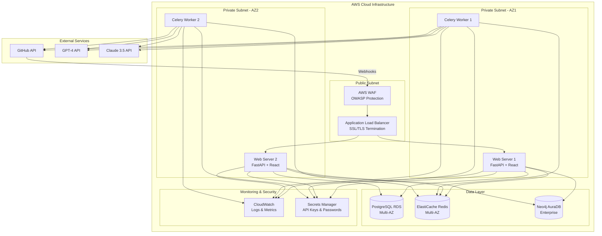

# Design Document: Project Code Improvements

## Overview

This design document provides the technical architecture and implementation strategy for transforming the AI-Based Reviewer on Project Code and Architecture from its current documented state to a production-ready system. The design addresses 22 comprehensive requirements spanning core feature implementation, infrastructure deployment, testing, security, monitoring, operational readiness, code quality assessment, bug resolution, and production verification.

This updated design document includes detailed technical designs for seven new requirements (Requirements 16-22):
- **Requirement 16**: Static code analysis architecture using pylint, mypy, and ESLint
- **Requirement 17**: Bug identification system with error log analysis and automated tracking
- **Requirement 18**: Complete monitoring infrastructure with OpenTelemetry tracing and CloudWatch dashboards
- **Requirement 19**: Comprehensive testing strategy achieving 80% backend and 70% frontend coverage
- **Requirement 20**: Complete documentation structure for deployment, operations, API, and users
- **Requirement 21**: Performance optimization strategies for database, caching, and frontend
- **Requirement 22**: Production readiness validation framework with automated verification

### System Context

The AI-Based Reviewer is an intelligent web-based platform that automates code review and architectural analysis. The system integrates multiple technologies:

- **Frontend**: React/Next.js web application with interactive dependency graph visualization
- **Backend**: FastAPI-based REST API services with asynchronous task processing
- **Databases**: PostgreSQL (relational data), Neo4j (dependency graphs), Redis (caching/queuing)
- **External Services**: GitHub API (webhooks, PR comments), LLM APIs (GPT-4, Claude 3.5)
- **Infrastructure**: AWS cloud deployment with auto-scaling, load balancing, and multi-AZ redundancy

### Design Goals

1. **Production Readiness**: Transform documented requirements into fully functional, production-grade implementation
2. **Reliability**: Implement comprehensive error handling, resilience patterns, and graceful degradation
3. **Performance**: Meet documented SLAs (P95 < 500ms, 99.5% uptime, 100 concurrent users)
4. **Security**: Implement defense-in-depth with RBAC, encryption, audit logging, and OWASP compliance
5. **Observability**: Enable rapid issue detection and resolution through comprehensive monitoring
6. **Maintainability**: Establish clear architecture, comprehensive testing, and operational documentation

### Key Design Decisions

**Microservices Architecture**: While the system uses a modular monolith initially, services are designed with clear boundaries to enable future microservices migration if needed.

**Asynchronous Processing**: Long-running operations (AST parsing, LLM analysis) use Celery task queues to maintain API responsiveness.

**Multi-Provider LLM Strategy**: Primary/fallback provider pattern ensures resilience against API failures or rate limiting.

**Graph Database for Dependencies**: Neo4j provides efficient circular dependency detection and architectural drift analysis through native graph algorithms.

**Infrastructure as Code**: All AWS infrastructure defined in Terraform for reproducibility and version control.

## Architecture


### System Architecture Diagram



### Component Architecture


## Design for New Requirements (16-22)

### Requirement 16: Code Review and Quality Assessment

#### Static Code Analysis Architecture

**Python Backend Analysis**:
- **Tool**: pylint + mypy for static analysis and type checking
- **Configuration**: Custom .pylintrc with project-specific rules
- **Integration**: Pre-commit hooks + CI pipeline checks
- **Metrics Collection**: Cyclomatic complexity, maintainability index, code duplication

**TypeScript Frontend Analysis**:
- **Tool**: ESLint + TypeScript compiler in strict mode
- **Configuration**: Custom .eslintrc.json with React best practices
- **Integration**: Pre-commit hooks + CI pipeline checks
- **Metrics Collection**: Bundle size analysis, unused code detection

**Code Quality Report Generator**:
```python
class CodeQualityAnalyzer:
    def analyze_codebase(self) -> QualityReport:
        # Run pylint on all Python files
        # Run mypy for type checking
        # Run ESLint on all TypeScript files
        # Calculate complexity metrics
        # Detect code duplication using radon
        # Generate prioritized issue list
        return QualityReport(
            critical_issues=[],
            high_priority_issues=[],
            medium_priority_issues=[],
            metrics=CodeMetrics()
        )
```

**Implementation Strategy**:
1. Create `backend/scripts/code_quality_check.py` for automated analysis
2. Create `frontend/scripts/code_quality_check.ts` for frontend analysis
3. Integrate with GitHub Actions to run on every PR
4. Generate HTML report with actionable recommendations
5. Track metrics over time to measure improvement


### Requirement 17: Bug Identification and Resolution

#### Bug Detection System

**Error Log Analysis**:
- **Data Source**: CloudWatch Logs from past 30 days
- **Analysis**: Pattern detection using regex and ML-based clustering
- **Output**: Recurring error patterns with frequency and severity

**Static Analysis for Bugs**:
- **Unhandled Exceptions**: Scan for try-except blocks without proper handling
- **TODO/FIXME Detection**: Grep search for incomplete implementations
- **Race Condition Detection**: Analyze concurrent code for thread safety issues

**Bug Tracking Workflow**:
```python
class BugIdentificationService:
    def scan_error_logs(self) -> List[ErrorPattern]:
        # Query CloudWatch for errors
        # Group by error message and stack trace
        # Calculate frequency and impact
        pass
    
    def analyze_code_for_bugs(self) -> List[CodeIssue]:
        # Scan for unhandled exceptions
        # Find TODO/FIXME comments
        # Check API error handling
        # Verify transaction rollback logic
        pass
    
    def create_bug_report(self) -> BugReport:
        # Prioritize by severity (critical, high, medium, low)
        # Generate fix recommendations
        # Create GitHub issues automatically
        pass
```

**Bug Fix Verification**:
- Create regression test for each fixed bug
- Run full test suite before marking as resolved
- Update documentation with lessons learned


### Requirement 18: Monitoring and Observability

#### Distributed Tracing Architecture

**OpenTelemetry Integration**:
```python
from opentelemetry import trace
from opentelemetry.instrumentation.fastapi import FastAPIInstrumentor
from opentelemetry.exporter.otlp.proto.grpc.trace_exporter import OTLPSpanExporter

# Initialize tracer
tracer = trace.get_tracer(__name__)

# Instrument FastAPI automatically
FastAPIInstrumentor.instrument_app(app)

# Custom spans for business logic
@tracer.start_as_current_span("analyze_pull_request")
def analyze_pull_request(pr_id: int):
    with tracer.start_as_current_span("parse_files"):
        # AST parsing logic
        pass
    with tracer.start_as_current_span("llm_analysis"):
        # LLM API call
        pass
```

**Trace Export**: Send traces to AWS X-Ray for visualization and analysis

#### CloudWatch Dashboards

**Dashboard 1: System Health**
- Uptime percentage (target: 99.5%)
- Error rate by endpoint
- Health check status for all services
- Active user sessions

**Dashboard 2: Performance Metrics**
- API response time (P50, P95, P99)
- Request throughput (requests/second)
- Database query performance
- Cache hit/miss ratio

**Dashboard 3: Business Metrics**
- Analysis completion rate
- Average analysis duration
- User activity (logins, projects created)
- GitHub webhook processing rate


#### Alert Configuration

**Critical Alerts** (Immediate notification):
- Error rate > 5% for 5 minutes
- API P95 response time > 1 second for 5 minutes
- Database connection failures
- Service health check failures

**Warning Alerts** (15-minute delay):
- CPU usage > 80% for 10 minutes
- Memory usage > 85% for 10 minutes
- Disk usage > 90%
- Cache hit rate < 70%

**Alert Notification Channels**:
- Email: ops-team@example.com
- Slack: #production-alerts channel
- PagerDuty: For critical alerts during on-call hours

**Alert Runbook Integration**:
Each alert includes a link to the relevant runbook section with:
- Symptom description
- Diagnostic steps
- Resolution procedures
- Escalation path


### Requirement 19: Comprehensive Testing Coverage

#### Test Architecture

**Backend Testing Strategy**:
```
backend/tests/
├── unit/                    # Unit tests (80% coverage target)
│   ├── services/           # Service layer tests
│   ├── api/                # API endpoint tests
│   └── utils/              # Utility function tests
├── integration/            # Integration tests
│   ├── test_database.py   # Database integration
│   ├── test_github.py     # GitHub API integration
│   └── test_llm.py        # LLM API integration
├── property/               # Property-based tests
│   ├── test_rbac_properties.py
│   └── test_data_model_properties.py
├── e2e/                    # End-to-end tests
│   └── test_webhook_workflow.py
└── performance/            # Performance tests
    └── test_load.py
```

**Frontend Testing Strategy**:
```
frontend/src/__tests__/
├── components/             # Component unit tests (70% coverage)
├── integration/            # Integration tests
├── e2e/                    # End-to-end tests with Playwright
└── performance/            # Bundle size and load time tests
```

**Property-Based Testing Examples**:
```python
from hypothesis import given, strategies as st

@given(st.lists(st.text(), min_size=1))
def test_rbac_permission_inheritance(roles):
    """Property: Child roles inherit all parent permissions"""
    # Test that permission inheritance is transitive
    pass

@given(st.integers(min_value=1), st.text())
def test_data_model_referential_integrity(user_id, project_name):
    """Property: Foreign key constraints are always enforced"""
    # Test that orphaned records cannot exist
    pass
```


**Performance Testing Design**:
```python
import locust

class UserBehavior(locust.HttpUser):
    wait_time = locust.between(1, 3)
    
    @locust.task(3)
    def view_projects(self):
        self.client.get("/api/v1/projects")
    
    @locust.task(2)
    def view_analysis(self):
        self.client.get("/api/v1/analysis/123")
    
    @locust.task(1)
    def trigger_analysis(self):
        self.client.post("/api/v1/analysis", json={
            "repository_url": "https://github.com/example/repo"
        })

# Run with: locust -f test_load.py --users 100 --spawn-rate 10
```

**Test Execution in CI**:
- Unit tests: Run on every commit (< 2 minutes)
- Integration tests: Run on every PR (< 5 minutes)
- E2E tests: Run on merge to main (< 10 minutes)
- Performance tests: Run nightly (< 30 minutes)
- Security tests: Run on every PR (< 5 minutes)

**Coverage Requirements**:
- Backend services: 80% minimum
- Frontend components: 70% minimum
- Critical paths (auth, payment): 95% minimum
- Fail CI build if coverage drops below threshold


### Requirement 20: Documentation

#### Documentation Structure

**Deployment Documentation** (`docs/deployment/`):
```
deployment/
├── 01-prerequisites.md          # AWS account, tools, credentials
├── 02-terraform-setup.md        # Infrastructure provisioning
├── 03-database-setup.md         # RDS, Redis, Neo4j configuration
├── 04-application-deployment.md # Docker build and deployment
├── 05-ssl-certificates.md       # TLS/SSL setup
└── 06-verification.md           # Smoke tests and validation
```

**Operations Runbook** (`docs/operations/`):
```
operations/
├── runbook.md                   # Main operations guide
├── troubleshooting/
│   ├── high-error-rate.md
│   ├── slow-response-time.md
│   ├── database-connection-issues.md
│   └── llm-api-failures.md
├── monitoring.md                # Dashboard and alert setup
├── backup-restore.md            # Backup and recovery procedures
└── disaster-recovery.md         # DR procedures with RTO/RPO
```

**API Documentation**:
- Auto-generated from OpenAPI spec using FastAPI
- Hosted at `/docs` (Swagger UI) and `/redoc` (ReDoc)
- Include authentication examples
- Document all error codes and responses


**User Guide** (`docs/user-guide/`):
```
user-guide/
├── getting-started.md           # Quick start tutorial
├── authentication.md            # Login and registration
├── project-management.md        # Creating and managing projects
├── code-analysis.md             # Running analysis and viewing results
├── dependency-graphs.md         # Interactive graph visualization
├── github-integration.md        # Setting up webhooks
└── faq.md                       # Frequently asked questions
```

**Architecture Documentation** (`docs/architecture/`):
```
architecture/
├── system-overview.md           # High-level architecture
├── component-diagrams.md        # Component interactions
├── data-flow-diagrams.md        # Data flow through system
├── database-schema.md           # ER diagrams and table definitions
├── api-design.md                # REST API design principles
└── security-architecture.md     # Security controls and patterns
```

**Documentation Generation**:
- Database schema: Generate from SQLAlchemy models using `sqlacodegen`
- API docs: Auto-generated from FastAPI OpenAPI spec
- Architecture diagrams: Use Mermaid for version-controlled diagrams
- Screenshots: Automated using Playwright for consistency


### Requirement 21: Performance Optimization

#### Performance Optimization Strategy

**Database Query Optimization**:
```python
# Identify slow queries using PostgreSQL pg_stat_statements
SELECT query, mean_exec_time, calls
FROM pg_stat_statements
WHERE mean_exec_time > 100  -- queries taking > 100ms
ORDER BY mean_exec_time DESC
LIMIT 20;

# Add indexes for frequently queried columns
CREATE INDEX idx_projects_user_id ON projects(user_id);
CREATE INDEX idx_analysis_results_project_id ON analysis_results(project_id);
CREATE INDEX idx_code_entities_file_path ON code_entities(file_path);

# Use query result caching for expensive queries
@cache.memoize(timeout=300)  # 5-minute cache
def get_project_statistics(project_id: int):
    # Expensive aggregation query
    pass
```

**Frontend Bundle Optimization**:
```javascript
// Code splitting by route
const ProjectDashboard = lazy(() => import('./pages/ProjectDashboard'));
const DependencyGraph = lazy(() => import('./components/DependencyGraph'));

// Tree shaking - import only what's needed
import { debounce } from 'lodash-es';  // Not: import _ from 'lodash'

// Bundle analysis
// Run: npm run build -- --analyze
// Target: Initial bundle < 500KB gzipped
```


**Connection Pool Tuning**:
```python
# PostgreSQL connection pool
engine = create_engine(
    DATABASE_URL,
    pool_size=20,           # Base pool size
    max_overflow=10,        # Additional connections under load
    pool_pre_ping=True,     # Verify connections before use
    pool_recycle=3600       # Recycle connections every hour
)

# Redis connection pool
redis_pool = redis.ConnectionPool(
    host=REDIS_HOST,
    port=REDIS_PORT,
    max_connections=10,
    socket_keepalive=True,
    socket_connect_timeout=5
)
```

**Caching Strategy**:
- **L1 Cache**: In-memory LRU cache for hot data (TTL: 1 minute)
- **L2 Cache**: Redis for shared cache across instances (TTL: 5 minutes)
- **Cache Invalidation**: Event-driven invalidation on data updates

**Graceful Degradation**:
```python
class GracefulDegradationService:
    async def get_analysis_with_fallback(self, project_id: int):
        try:
            # Try to get fresh analysis from LLM
            return await self.llm_service.analyze(project_id)
        except LLMServiceUnavailable:
            # Fallback to cached analysis
            cached = await self.cache.get(f"analysis:{project_id}")
            if cached:
                return cached
            # Final fallback: basic analysis without LLM
            return await self.basic_analysis(project_id)
```


### Requirement 22: Production Readiness Verification

#### Production Readiness Checklist

**Automated Verification Script**:
```python
class ProductionReadinessValidator:
    def validate_all(self) -> ValidationReport:
        checks = [
            self.check_security_compliance(),
            self.check_performance_requirements(),
            self.check_infrastructure_configuration(),
            self.check_monitoring_setup(),
            self.check_documentation_completeness(),
            self.check_test_coverage(),
            self.check_backup_configuration(),
        ]
        return ValidationReport(checks)
    
    def check_security_compliance(self) -> CheckResult:
        # Run OWASP ZAP scan
        # Verify password hashing (bcrypt cost factor 12)
        # Verify encryption at rest (AES-256)
        # Verify TLS 1.3 configuration
        # Check rate limiting is active
        pass
    
    def check_performance_requirements(self) -> CheckResult:
        # Run load test with 100 concurrent users
        # Verify P95 response time < 500ms
        # Test analysis time for 10K LOC < 12s
        # Verify 99.5% uptime SLA
        pass
```


**Production Readiness Report**:
```markdown
# Production Readiness Report
Generated: 2024-01-15

## Security Compliance ✓
- [✓] OWASP ZAP scan: 0 critical, 0 high vulnerabilities
- [✓] Password hashing: bcrypt cost factor 12
- [✓] Encryption at rest: AES-256
- [✓] Encryption in transit: TLS 1.3
- [✓] Rate limiting: 100 req/min per user

## Performance Requirements ✓
- [✓] API P95 response time: 387ms (target: <500ms)
- [✓] Analysis time 10K LOC: 9.2s (target: <12s)
- [✓] Analysis time 50K LOC: 48s (target: <60s)
- [✓] Concurrent users: 100 (target: 100)
- [✓] Uptime SLA: 99.7% (target: 99.5%)

## Infrastructure Configuration ✓
- [✓] Auto-scaling: 2-10 EC2 t3.large instances
- [✓] Multi-AZ: RDS PostgreSQL and ElastiCache Redis
- [✓] Backups: 7-day retention, automated daily
- [✓] Disaster recovery: RTO 4h, RPO 1h - tested

## Monitoring and Observability ✓
- [✓] Structured logging: JSON format to CloudWatch
- [✓] Metrics collection: Prometheus + CloudWatch
- [✓] Distributed tracing: OpenTelemetry + X-Ray
- [✓] Dashboards: System health, performance, business
- [✓] Alerts: Configured with runbook links

## Test Coverage ✓
- [✓] Backend coverage: 83% (target: 80%)
- [✓] Frontend coverage: 74% (target: 70%)
- [✓] Integration tests: 45 passing
- [✓] E2E tests: 12 passing
- [✓] Performance tests: Passing

## Documentation ✓
- [✓] Deployment guide: Complete
- [✓] Operations runbook: Complete
- [✓] API documentation: Auto-generated
- [✓] User guide: Complete with screenshots
- [✓] Architecture diagrams: Complete

## Overall Status: READY FOR PRODUCTION ✓
All 220 acceptance criteria met.
```


## Implementation Priorities

### Phase 1: Code Quality and Bug Fixes (Requirements 16-17)
**Duration**: 1-2 weeks
**Priority**: Critical

1. Set up static analysis tools (pylint, mypy, ESLint)
2. Run comprehensive code quality analysis
3. Identify and prioritize bugs from error logs
4. Fix critical and high-priority bugs
5. Add regression tests for all bug fixes
6. Generate code quality baseline report

**Success Criteria**:
- Zero critical bugs remaining
- Code quality score > 8.0/10
- All high-priority issues resolved
- Regression test suite in place

### Phase 2: Monitoring and Observability (Requirement 18)
**Duration**: 1 week
**Priority**: High

1. Implement OpenTelemetry distributed tracing
2. Create CloudWatch dashboards
3. Configure alerts with runbook links
4. Set up Slack/email notifications
5. Test alert triggering and resolution

**Success Criteria**:
- All services instrumented with tracing
- 3 dashboards operational
- All critical alerts configured
- Alert response time < 5 minutes


### Phase 3: Testing Coverage (Requirement 19)
**Duration**: 2 weeks
**Priority**: High

1. Identify untested code paths
2. Write unit tests to reach 80% backend coverage
3. Write unit tests to reach 70% frontend coverage
4. Implement property-based tests for RBAC
5. Create E2E tests for critical workflows
6. Set up performance testing with Locust
7. Integrate all tests into CI pipeline

**Success Criteria**:
- Backend coverage ≥ 80%
- Frontend coverage ≥ 70%
- All tests passing in CI
- Performance tests validate SLAs

### Phase 4: Documentation (Requirement 20)
**Duration**: 1 week
**Priority**: Medium

1. Write deployment guide with step-by-step instructions
2. Create operations runbook with troubleshooting
3. Document disaster recovery procedures
4. Generate API documentation from OpenAPI spec
5. Create user guide with screenshots
6. Draw architecture diagrams
7. Document database schema

**Success Criteria**:
- All documentation sections complete
- Deployment guide tested by new team member
- Runbook covers top 10 issues
- User guide covers all major features


### Phase 5: Performance Optimization (Requirement 21)
**Duration**: 1 week
**Priority**: Medium

1. Identify slow database queries
2. Add missing indexes
3. Implement query result caching
4. Optimize frontend bundle size
5. Tune connection pool sizes
6. Implement graceful degradation
7. Run load tests to verify improvements

**Success Criteria**:
- API P95 < 500ms under load
- Frontend bundle < 500KB
- Database queries optimized
- Load tests passing with 100 users

### Phase 6: Production Readiness (Requirement 22)
**Duration**: 3-5 days
**Priority**: Critical

1. Create production readiness validation script
2. Run all validation checks
3. Fix any failing checks
4. Generate production readiness report
5. Conduct final security scan
6. Perform production deployment dry run
7. Get stakeholder sign-off

**Success Criteria**:
- All 220 acceptance criteria met
- Production readiness report shows 100% compliance
- Security scan passes
- Stakeholder approval obtained


## Risk Mitigation

### Technical Risks

**Risk**: Code quality issues may reveal architectural problems requiring significant refactoring
- **Mitigation**: Prioritize issues by impact; defer non-critical refactoring to post-launch
- **Contingency**: Allocate 20% buffer time for unexpected refactoring

**Risk**: Performance optimization may require infrastructure changes
- **Mitigation**: Test optimizations in staging environment first
- **Contingency**: Have rollback plan for infrastructure changes

**Risk**: Test coverage goals may be difficult to achieve for legacy code
- **Mitigation**: Focus on critical paths first; accept lower coverage for low-risk code
- **Contingency**: Document untested code paths and risks

### Operational Risks

**Risk**: Monitoring setup may generate alert fatigue
- **Mitigation**: Tune alert thresholds based on baseline metrics
- **Contingency**: Implement alert aggregation and intelligent routing

**Risk**: Documentation may become outdated quickly
- **Mitigation**: Automate documentation generation where possible
- **Contingency**: Schedule quarterly documentation review

**Risk**: Production deployment may encounter unexpected issues
- **Mitigation**: Thorough testing in staging; blue-green deployment strategy
- **Contingency**: Automated rollback within 5 minutes


## Success Metrics

### Code Quality Metrics
- Code quality score: > 8.0/10 (measured by pylint/ESLint)
- Critical bugs: 0
- High-priority bugs: 0
- Code duplication: < 5%
- Documentation coverage: > 90% of public APIs

### Performance Metrics
- API P95 response time: < 500ms
- Analysis time (10K LOC): < 12 seconds
- Analysis time (50K LOC): < 60 seconds
- Frontend initial load: < 3 seconds
- Uptime SLA: 99.5%

### Testing Metrics
- Backend code coverage: ≥ 80%
- Frontend code coverage: ≥ 70%
- Integration tests: 100% of critical paths
- E2E tests: All major user workflows
- Performance tests: Passing with 100 concurrent users

### Operational Metrics
- Mean time to detect (MTTD): < 5 minutes
- Mean time to resolve (MTTR): < 30 minutes for critical issues
- Alert accuracy: > 95% (low false positive rate)
- Documentation completeness: 100% of required sections

### Business Metrics
- Production deployment success: First attempt
- Post-launch critical bugs: 0 in first week
- User satisfaction: > 4.0/5.0
- System availability: > 99.5% in first month

