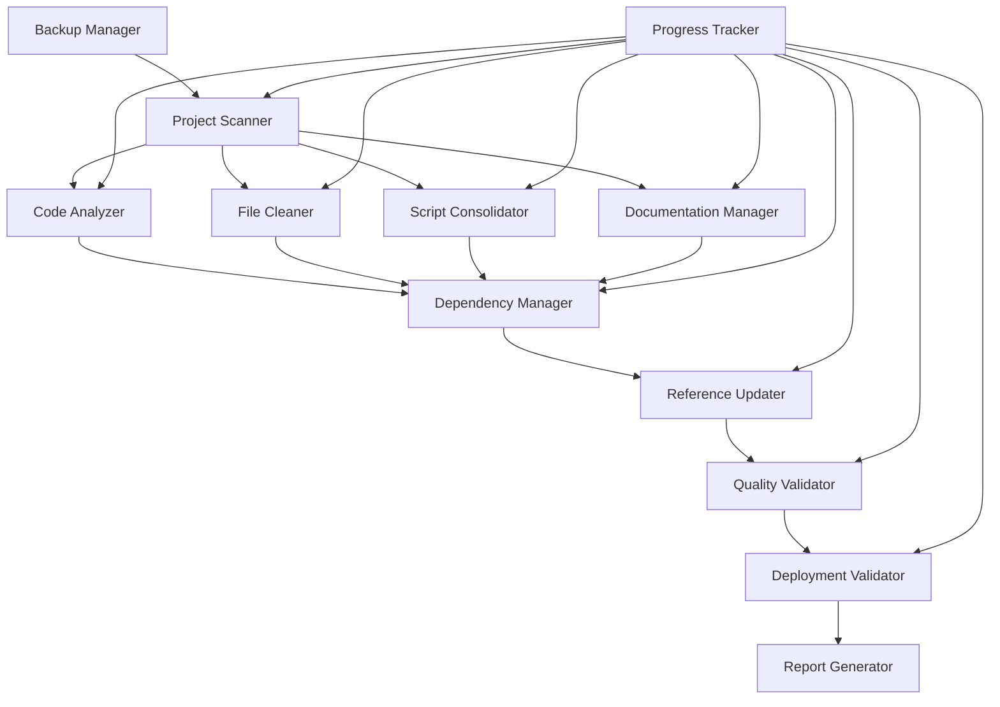

# Design Document: Project Reengineering and Optimization

## Overview

This design outlines a comprehensive system for reengineering and optimizing a complex multi-service project. The system will analyze, consolidate, and optimize code structure, dependencies, documentation, and deployment scripts while maintaining all core functionality through rigorous testing and validation.

The design follows a phased approach with safety mechanisms including backup/recovery, progress tracking, and rollback capabilities. Each phase includes validation checkpoints to ensure system integrity throughout the optimization process.

## Architecture

The reengineering system consists of several specialized components working together in a coordinated pipeline:



### Core Components

1. **Project Scanner**: Entry point that discovers all project files and creates initial inventory
2. **Code Analyzer**: Analyzes module dependencies and identifies consolidation opportunities
3. **File Cleaner**: Identifies and removes example/demo files and temporary content
4. **Script Consolidator**: Merges and standardizes build/deployment scripts
5. **Documentation Manager**: Consolidates and standardizes documentation
6. **Dependency Manager**: Analyzes and cleans up project dependencies
7. **Reference Updater**: Updates imports and configuration paths after restructuring
8. **Quality Validator**: Runs comprehensive tests to ensure functionality preservation
9. **Deployment Validator**: Validates configuration and deployment processes
10. **Backup Manager**: Handles backup creation and rollback capabilities
11. **Progress Tracker**: Monitors and reports progress throughout the process

## Components and Interfaces

### Project Scanner

**Purpose**: Discovers and catalogs all project files, creating the foundation for analysis.

**Interface**:
```python
class ProjectScanner:
    def scan_project(self, root_path: str) -> ProjectInventory
    def identify_service_boundaries(self, inventory: ProjectInventory) -> ServiceMap
    def detect_file_types(self, inventory: ProjectInventory) -> FileTypeMap
```

**Key Responsibilities**:
- Recursively scan project directory structure
- Identify service boundaries (backend, frontend, microservices)
- Classify files by type (source, config, documentation, examples, etc.)
- Create comprehensive inventory for downstream processing

### Code Analyzer

**Purpose**: Analyzes code structure and identifies opportunities for consolidation and simplification.

**Interface**:
```python
class CodeAnalyzer:
    def analyze_dependencies(self, inventory: ProjectInventory) -> DependencyGraph
    def identify_duplicates(self, graph: DependencyGraph) -> DuplicationReport
    def suggest_consolidation(self, report: DuplicationReport) -> ConsolidationPlan
    def validate_single_responsibility(self, plan: ConsolidationPlan) -> ValidationResult
```

**Analysis Algorithms**:
- **Dependency Graph Construction**: Parse import statements and build directed graph
- **Duplicate Detection**: Use AST comparison and semantic analysis to find similar functions/classes
- **Consolidation Planning**: Apply graph algorithms to identify optimal merge candidates
- **Responsibility Validation**: Ensure consolidated modules maintain single responsibility

### File Cleaner

**Purpose**: Identifies and safely removes unnecessary files while preserving core functionality.

**Interface**:
```python
class FileCleaner:
    def identify_example_files(self, inventory: ProjectInventory) -> FileList
    def identify_temporary_files(self, inventory: ProjectInventory) -> FileList
    def validate_safe_removal(self, files: FileList) -> SafetyReport
    def clean_files(self, files: FileList) -> CleanupResult
```

**Detection Patterns**:
- **Example Files**: `example_*`, `demo_*`, `sample_*`, `*_example.*`, `*_demo.*`
- **Temporary Files**: `*.tmp`, `*.temp`, `*~`, `.DS_Store`, `Thumbs.db`
- **Test Data**: `test_data_*`, `mock_*`, `fixture_*` (with validation for necessity)
- **Build Artifacts**: `*.pyc`, `node_modules`, `dist`, `build` (if not in .gitignore)

### Script Consolidator

**Purpose**: Merges overlapping scripts and creates configurable universal scripts.

**Interface**:
```python
class ScriptConsolidator:
    def analyze_scripts(self, inventory: ProjectInventory) -> ScriptAnalysis
    def identify_overlaps(self, analysis: ScriptAnalysis) -> OverlapReport
    def create_universal_scripts(self, report: OverlapReport) -> UniversalScriptSet
    def validate_script_functionality(self, scripts: UniversalScriptSet) -> ValidationResult
```

**Consolidation Strategy**:
- **Parameter Extraction**: Convert hardcoded values to configurable parameters
- **Function Merging**: Combine similar operations into reusable functions
- **Environment Handling**: Create environment-specific configuration layers
- **Error Standardization**: Implement consistent error handling and logging

### Documentation Manager

**Purpose**: Consolidates scattered documentation and applies consistent formatting.

**Interface**:
```python
class DocumentationManager:
    def scan_documentation(self, inventory: ProjectInventory) -> DocumentationMap
    def analyze_content_overlap(self, doc_map: DocumentationMap) -> ContentAnalysis
    def consolidate_documents(self, analysis: ContentAnalysis) -> ConsolidatedDocs
    def standardize_format(self, docs: ConsolidatedDocs) -> StandardizedDocs
```

**Documentation Structure**:
- **Root README**: Project overview, quick start, architecture summary
- **Service READMEs**: Service-specific setup, API documentation, configuration
- **Development Guide**: Setup, contribution guidelines, coding standards
- **Deployment Guide**: Environment setup, deployment procedures, troubleshooting
- **API Documentation**: Consolidated API reference with examples

### Dependency Manager

**Purpose**: Analyzes and optimizes project dependencies across all services.

**Interface**:
```python
class DependencyManager:
    def scan_dependencies(self, inventory: ProjectInventory) -> DependencyInventory
    def analyze_usage(self, deps: DependencyInventory) -> UsageAnalysis
    def identify_unused(self, analysis: UsageAnalysis) -> UnusedDependencies
    def suggest_consolidation(self, analysis: UsageAnalysis) -> ConsolidationSuggestions
```

**Analysis Process**:
- **Multi-Language Support**: Handle Python (requirements.txt, pyproject.toml), Node.js (package.json), Docker (Dockerfile)
- **Usage Tracking**: Parse source files to identify actual dependency usage
- **Version Alignment**: Identify version conflicts and suggest harmonization
- **Shared Library Opportunities**: Find dependencies used across multiple services

### Reference Updater

**Purpose**: Updates all imports and configuration paths after structural changes.

**Interface**:
```python
class ReferenceUpdater:
    def map_changes(self, old_structure: ProjectInventory, new_structure: ProjectInventory) -> ChangeMap
    def update_imports(self, change_map: ChangeMap) -> ImportUpdateResult
    def update_config_paths(self, change_map: ChangeMap) -> ConfigUpdateResult
    def validate_references(self, updates: UpdateResult) -> ValidationResult
```

**Update Strategies**:
- **Import Statement Parsing**: Use AST parsing for accurate import identification
- **Configuration File Handling**: Support JSON, YAML, TOML, and environment files
- **Path Resolution**: Handle both relative and absolute path references
- **Batch Processing**: Group related updates for atomic operations

## Data Models

### Core Data Structures

```python
@dataclass
class ProjectInventory:
    root_path: str
    services: Dict[str, ServiceInfo]
    files: List[FileInfo]
    total_size: int
    scan_timestamp: datetime

@dataclass
class ServiceInfo:
    name: str
    path: str
    type: ServiceType  # backend, frontend, microservice, gateway
    language: str
    dependencies: List[str]
    entry_points: List[str]

@dataclass
class FileInfo:
    path: str
    size: int
    type: FileType  # source, config, doc, example, temp, test
    language: Optional[str]
    last_modified: datetime
    dependencies: List[str]

@dataclass
class DependencyGraph:
    nodes: Dict[str, ModuleNode]
    edges: List[DependencyEdge]
    cycles: List[List[str]]
    metrics: GraphMetrics

@dataclass
class ConsolidationPlan:
    merges: List[MergeOperation]
    moves: List[MoveOperation]
    deletions: List[DeleteOperation]
    estimated_savings: ResourceSavings
    risk_assessment: RiskLevel
```

### Configuration Models

```python
@dataclass
class OptimizationConfig:
    aggressive_cleanup: bool = False
    preserve_git_history: bool = True
    backup_enabled: bool = True
    test_validation_required: bool = True
    max_consolidation_depth: int = 3
    file_size_threshold: int = 1024 * 1024  # 1MB
    
@dataclass
class SafetySettings:
    require_manual_approval: bool = True
    create_incremental_backups: bool = True
    rollback_on_test_failure: bool = True
    preserve_original_structure: bool = True
```

## Error Handling

### Error Categories and Responses

1. **File System Errors**
   - Permission denied → Request elevated permissions or skip with warning
   - File not found → Log warning and continue with available files
   - Disk space insufficient → Pause operation and request cleanup

2. **Analysis Errors**
   - Parse errors in source files → Log error, mark file as problematic, continue
   - Circular dependencies → Report cycle, suggest manual resolution
   - Ambiguous consolidation → Present options to user for decision

3. **Validation Errors**
   - Test failures after optimization → Halt process, provide rollback option
   - Broken imports after updates → Attempt automatic fix, fallback to manual
   - Configuration validation failure → Revert config changes, report issues

4. **Integration Errors**
   - Database connection failures → Verify connection strings, test connectivity
   - Service communication failures → Check network configuration, validate endpoints
   - External API failures → Verify credentials, check service status

### Recovery Mechanisms

```python
class ErrorRecovery:
    def handle_file_system_error(self, error: FileSystemError) -> RecoveryAction
    def handle_analysis_error(self, error: AnalysisError) -> RecoveryAction
    def handle_validation_error(self, error: ValidationError) -> RecoveryAction
    def rollback_changes(self, checkpoint: BackupCheckpoint) -> RollbackResult
```

## Testing Strategy

The testing strategy employs both unit tests for specific functionality and property-based tests for comprehensive validation of system behavior across diverse inputs.

### Unit Testing Approach

**Component Testing**:
- Test each analyzer component with known project structures
- Validate file cleaning with controlled test directories
- Test script consolidation with sample build scripts
- Verify documentation merging with test documentation sets

**Integration Testing**:
- Test end-to-end optimization pipeline with sample projects
- Validate backup and recovery mechanisms
- Test rollback functionality under various failure scenarios
- Verify cross-service dependency resolution

**Edge Case Testing**:
- Large projects with thousands of files
- Projects with complex circular dependencies
- Mixed-language projects with multiple package managers
- Projects with unusual file structures or naming conventions

### Property-Based Testing Configuration

All property-based tests will use Hypothesis (Python) with minimum 100 iterations per test. Each test will be tagged with the format: **Feature: project-reengineering-optimization, Property {number}: {property_text}**

## Correctness Properties

*A property is a characteristic or behavior that should hold true across all valid executions of a system—essentially, a formal statement about what the system should do. Properties serve as the bridge between human-readable specifications and machine-verifiable correctness guarantees.*

Before defining the correctness properties, I need to analyze the acceptance criteria from the requirements to determine which ones are testable as properties, examples, or edge cases.

Based on the prework analysis, I'll convert the testable acceptance criteria into universally quantified properties:

### Property 1: Comprehensive Project Discovery
*For any* project structure, the system should discover and correctly classify all files, dependencies, documentation, and scripts across all services
**Validates: Requirements 1.1, 2.1, 4.1, 5.1**

### Property 2: Functionality Preservation Invariant
*For any* optimization operation (consolidation, cleanup, or restructuring), all core functionality, required dependencies, and essential configuration must be preserved
**Validates: Requirements 1.4, 2.2, 2.3, 2.4, 3.4, 4.2, 5.3**

### Property 3: Duplicate Detection Accuracy
*For any* project with duplicate code patterns, the system should correctly identify all instances of redundant functionality for consolidation
**Validates: Requirements 1.2**

### Property 4: Single Responsibility Maintenance
*For any* module reorganization, each resulting module should maintain a single, well-defined responsibility
**Validates: Requirements 1.3**

### Property 5: Pattern Matching Consistency
*For any* file pattern (example files, temporary files, etc.), the system should consistently identify all files matching the specified patterns
**Validates: Requirements 2.1**

### Property 6: Script Consolidation Completeness
*For any* set of overlapping scripts, the consolidated universal scripts should maintain all original functionality while working across all target environments
**Validates: Requirements 3.1, 3.2, 3.5**

### Property 7: Standardization Consistency
*For any* standardization operation (scripts or documentation), all output should follow consistent formats, structures, and patterns
**Validates: Requirements 3.3, 4.3**

### Property 8: Information Preservation During Consolidation
*For any* documentation or content consolidation, all important and current information should be preserved in the merged output
**Validates: Requirements 4.2, 4.4**

### Property 9: Navigation Structure Completeness
*For any* consolidated documentation set, the system should generate complete navigation indexes that reference all included content
**Validates: Requirements 4.5**

### Property 10: Dependency Usage Analysis Accuracy
*For any* project dependencies, the system should correctly identify which dependencies are actually used versus unused across all source files
**Validates: Requirements 5.2**

### Property 11: Shared Dependency Identification
*For any* multi-service project, the system should correctly identify opportunities for shared libraries and dependency consolidation
**Validates: Requirements 5.4**

### Property 12: Reference Update Completeness
*For any* file movement or restructuring, all imports, configuration paths, and references (both relative and absolute) should be correctly updated
**Validates: Requirements 6.1, 6.2, 6.3, 6.5**

### Property 13: External Integration Stability
*For any* optimization that affects external interfaces, all external integrations and API compatibility should be maintained
**Validates: Requirements 6.4**

### Property 14: Comprehensive Validation Execution
*For any* completed optimization, all existing test suites, API endpoints, service integrations, and external connections should be validated
**Validates: Requirements 7.1, 7.3, 7.4, 8.1, 8.3, 8.4**

### Property 15: Error Detection and Reporting
*For any* validation failures or issues, the system should accurately identify, report, and provide specific details about the problems
**Validates: Requirements 7.2**

### Property 16: Deployment Process Validation
*For any* optimized project, Docker containerization and build processes should continue to work correctly
**Validates: Requirements 8.2, 8.3**

### Property 17: Rollback Capability
*For any* deployment validation failure, the system should provide functional rollback capabilities to restore the previous state
**Validates: Requirements 8.5**

### Property 18: Backup and Recovery Round-Trip
*For any* project state, creating a backup and then performing a rollback should restore the project to its exact original state
**Validates: Requirements 9.1, 9.3, 9.4**

### Property 19: Change Tracking Completeness
*For any* modification during optimization, all changes should be logged with proper timestamps, descriptions, and metadata for audit trails
**Validates: Requirements 9.2, 10.3**

### Property 20: Incremental Backup Functionality
*For any* optimization process, incremental backups should correctly capture state changes at each phase
**Validates: Requirements 9.5**

### Property 21: Progress Reporting Accuracy
*For any* optimization phase or completion, generated reports should accurately reflect the current state, metrics, and changes made
**Validates: Requirements 2.5, 5.5, 7.5, 10.2, 10.4**

### Property 22: Planning and Timeline Generation
*For any* optimization request, the system should generate detailed plans with realistic timelines and resource estimates
**Validates: Requirements 10.1**

### Property 23: Metrics Tracking Accuracy
*For any* optimization process, tracked metrics (files removed, dependencies cleaned, performance improvements) should accurately reflect actual changes
**Validates: Requirements 10.5**

## Error Handling

### Error Categories and Responses

1. **File System Errors**
   - Permission denied → Request elevated permissions or skip with warning
   - File not found → Log warning and continue with available files
   - Disk space insufficient → Pause operation and request cleanup

2. **Analysis Errors**
   - Parse errors in source files → Log error, mark file as problematic, continue
   - Circular dependencies → Report cycle, suggest manual resolution
   - Ambiguous consolidation → Present options to user for decision

3. **Validation Errors**
   - Test failures after optimization → Halt process, provide rollback option
   - Broken imports after updates → Attempt automatic fix, fallback to manual
   - Configuration validation failure → Revert config changes, report issues

4. **Integration Errors**
   - Database connection failures → Verify connection strings, test connectivity
   - Service communication failures → Check network configuration, validate endpoints
   - External API failures → Verify credentials, check service status

### Recovery Mechanisms

```python
class ErrorRecovery:
    def handle_file_system_error(self, error: FileSystemError) -> RecoveryAction
    def handle_analysis_error(self, error: AnalysisError) -> RecoveryAction
    def handle_validation_error(self, error: ValidationError) -> RecoveryAction
    def rollback_changes(self, checkpoint: BackupCheckpoint) -> RollbackResult
```

## Testing Strategy

The testing strategy employs both unit tests for specific functionality and property-based tests for comprehensive validation of system behavior across diverse inputs.

### Unit Testing Approach

**Component Testing**:
- Test each analyzer component with known project structures
- Validate file cleaning with controlled test directories
- Test script consolidation with sample build scripts
- Verify documentation merging with test documentation sets

**Integration Testing**:
- Test end-to-end optimization pipeline with sample projects
- Validate backup and recovery mechanisms
- Test rollback functionality under various failure scenarios
- Verify cross-service dependency resolution

**Edge Case Testing**:
- Large projects with thousands of files
- Projects with complex circular dependencies
- Mixed-language projects with multiple package managers
- Projects with unusual file structures or naming conventions

### Property-Based Testing Configuration

All property-based tests will use Hypothesis (Python) with minimum 100 iterations per test. Each test will be tagged with the format: **Feature: project-reengineering-optimization, Property {number}: {property_text}**

**Dual Testing Approach**:
- **Unit tests**: Verify specific examples, edge cases, and error conditions
- **Property tests**: Verify universal properties across all inputs
- Both are complementary and necessary for comprehensive coverage

**Unit Testing Balance**:
- Unit tests focus on specific examples that demonstrate correct behavior
- Integration points between components
- Edge cases and error conditions
- Property tests focus on universal properties that hold for all inputs
- Comprehensive input coverage through randomization

**Property Test Requirements**:
- Minimum 100 iterations per property test due to randomization
- Each property test must reference its design document property
- Tag format: **Feature: project-reengineering-optimization, Property {number}: {property_text}**
- Each correctness property must be implemented by a single property-based test