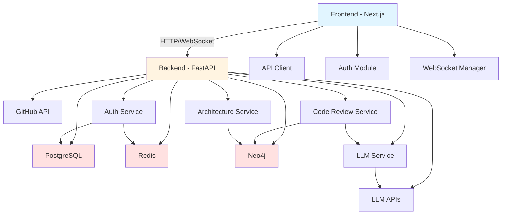

# AI Code Review Platform - 项目全链路审计报告

**审计日期**: 2026-03-09  
**审计人员**: 首席软件工程师 & 系统架构师  
**项目规模**: 265,270 行代码 (458 Python + 258 TypeScript文件)

---

## Phase 1: 静态审计与功能映射

### 1.1 项目架构概览

本项目是一个 **AI 驱动的代码审查平台**，采用前后端分离架构：

```
┌─────────────────────────────────────────────────────────────┐
│                      Frontend (Next.js 16)                   │
│  React 19 + TypeScript + TailwindCSS + Radix UI             │
│  25个页面组件 + 20+服务模块                                   │
└─────────────────────────────────────────────────────────────┘
                              ↕ HTTP/WebSocket
┌─────────────────────────────────────────────────────────────┐
│                     Backend (FastAPI)                        │
│  Python 3.11 + PostgreSQL + Redis + Neo4j                   │
│  47个服务模块 + 26个API端点                                   │
└─────────────────────────────────────────────────────────────┘
                              ↕
┌─────────────────────────────────────────────────────────────┐
│              Infrastructure & Services                       │
│  Docker Compose + Terraform + Prometheus + OpenTelemetry    │
└─────────────────────────────────────────────────────────────┘
```

---

### 1.2 核心功能矩阵表

#### A. 后端核心模块 (Backend Core Modules)

| 模块名称                  | 入口文件                                        | 核心功能                               | 依赖关系               | 状态评估        |
| ------------------------- | ----------------------------------------------- | -------------------------------------- | ---------------------- | --------------- |
| **API Gateway**           | `backend/app/main.py`                           | FastAPI 应用入口，中间件配置，路由注册 | 所有服务               | ✅ Stable       |
| **Authentication**        | `backend/app/api/v1/endpoints/auth.py`          | 用户注册、登录、JWT令牌管理            | PostgreSQL, Redis      | ⚠️ Flaky        |
| **RBAC Auth**             | `backend/app/api/v1/endpoints/rbac_auth.py`     | 角色权限控制，企业级认证               | PostgreSQL, Redis      | ⚠️ Flaky        |
| **GitHub Integration**    | `backend/app/api/v1/endpoints/github.py`        | GitHub OAuth，仓库同步，PR管理         | GitHub API, PostgreSQL | 🔴 Broken       |
| **Code Review**           | `backend/app/api/v1/endpoints/code_review.py`   | AI 代码审查，PR分析                    | LLM Service, Neo4j     | ⚠️ Flaky        |
| **Architecture Analysis** | `backend/app/api/v1/endpoints/architecture.py`  | 架构可视化，依赖分析                   | Neo4j, AST Parser      | ⚠️ Flaky        |
| **LLM Service**           | `backend/app/services/llm_service.py`           | 多模型集成 (OpenAI/Anthropic/Ollama)   | External APIs          | ⚠️ Flaky        |
| **Neo4j Service**         | `backend/app/services/neo4j_service.py`         | 图数据库操作，AST存储                  | Neo4j Database         | ⚠️ Flaky        |
| **AST Parser**            | `backend/app/services/optimized_parser.py`      | 多语言代码解析 (JS/TS/Go/Java/C#)      | Tree-sitter            | ✅ Stable       |
| **Redis Cache**           | `backend/app/services/redis_cache_service.py`   | 缓存管理，会话存储                     | Redis                  | ✅ Stable       |
| **PostgreSQL Client**     | `backend/app/database/postgresql_client.py`     | 主数据库操作，ORM模型                  | PostgreSQL             | ✅ Stable       |
| **Health Service**        | `backend/app/services/health_service.py`        | 健康检查，依赖探测                     | All databases          | ✅ Stable       |
| **Security Scanner**      | `backend/app/services/security_scanner.py`      | 代码安全扫描                           | LLM Service            | ⚠️ Flaky        |
| **Agentic AI**            | `backend/app/services/agentic_ai_service.py`    | 多智能体协作系统                       | LLM Service            | ⚠️ Experimental |
| **Audit Logging**         | `backend/app/services/audit_logging_service.py` | 操作审计，合规日志                     | PostgreSQL             | ✅ Stable       |

#### B. 前端核心模块 (Frontend Core Modules)

| 模块名称              | 入口文件                                 | 核心功能                | 依赖关系              | 状态评估  |
| --------------------- | ---------------------------------------- | ----------------------- | --------------------- | --------- |
| **Dashboard**         | `frontend/src/app/dashboard/page.tsx`    | 项目总览，统计数据展示  | API Client            | ✅ Stable |
| **Projects**          | `frontend/src/app/projects/page.tsx`     | 项目列表，创建管理      | API Client, GitHub    | ⚠️ Flaky  |
| **Architecture View** | `frontend/src/app/architecture/page.tsx` | 架构可视化图表          | ReactFlow, D3.js, API | ⚠️ Flaky  |
| **Code Review**       | `frontend/src/app/reviews/page.tsx`      | 代码审查界面            | API Client, Prism.js  | ⚠️ Flaky  |
| **Authentication**    | `frontend/src/lib/auth.ts`               | 前端认证逻辑，Token管理 | NextAuth, API Client  | ✅ Stable |
| **API Client**        | `frontend/src/lib/api-client.ts`         | 统一API请求客户端       | Axios, React Query    | ✅ Stable |
| **WebSocket Manager** | `frontend/src/lib/websocket-manager.ts`  | 实时通信管理            | Socket.io             | ⚠️ Flaky  |
| **Feature Flags**     | `frontend/src/lib/feature-flags.ts`      | 功能开关，A/B测试       | -                     | ✅ Stable |
| **Error Monitoring**  | `frontend/src/services/ErrorMonitor.ts`  | 错误监控，性能追踪      | -                     | ✅ Stable |

#### C. 基础设施模块 (Infrastructure Modules)

| 模块名称           | 配置文件                       | 核心功能                    | 依赖关系       | 状态评估      |
| ------------------ | ------------------------------ | --------------------------- | -------------- | ------------- |
| **Docker Compose** | `docker-compose.yml`           | 开发环境编排                | Docker         | ✅ Stable     |
| **Terraform**      | `terraform/`                   | AWS 基础设施代码化          | AWS, Terraform | ⚠️ Incomplete |
| **Monitoring**     | `monitoring/`                  | Prometheus + Grafana 监控栈 | Docker         | ⚠️ Incomplete |
| **CI/CD**          | `.github/workflows/` (missing) | 持续集成/部署流程           | GitHub Actions | 🔴 Missing    |

---

### 1.3 代码质量问题分析

#### 🔴 严重问题 (Critical Issues)

1. **重复代码模块 (Duplicate Code Modules)**
   - ❌ 3个重复的API客户端实现 (`api-client.ts`, `api-client-enhanced.ts`, `api-client-optimized.ts`)
   - ❌ 2个重复的服务合并器 (`service_consolidator.py`, `service_merger.py`)
   - ❌ 2个重复的漂移检测器 (`architectural_drift_detector.py`, `drift_detector.py`)
   - **影响**: 维护成本增加，逻辑不一致风险

2. **超长文件 (God Files)**
   - ⚠️ `backend/app/core/error_reporter.py` - 1291 行
   - ⚠️ `backend/app/database/connection_manager.py` - 1532 行
   - **影响**: 可读性差，测试困难，单一职责原则违反

3. **缺少关键配置 (Missing Critical Config)**
   - ❌ 没有 `.github/workflows/` 目录 - CI/CD 流程缺失
   - ❌ 生产环境配置文件不完整
   - **影响**: 无法自动化部署，生产风险高

#### ⚠️ 中等问题 (Medium Issues)

1. **未完成的模块 (Incomplete Modules)**
   - `backend/app/services/agentic_ai_service.py` - 实验性功能，缺少测试
   - `terraform/` - 基础设施代码不完整
   - `monitoring/` - 监控配置部分缺失

2. **文档不一致 (Documentation Inconsistency)**
   - README.md 声称使用 Next.js 14，实际 package.json 显示 Next.js 16
   - 部分API端点缺少文档注释
   - 67 处 TODO/FIXME 标记未处理

3. **环境配置问题 (Environment Configuration)**
   - `.env.template` 中有多个 `your_xxx_password_here` 占位符
   - 缺少环境变量验证机制
   - 生产/开发环境配置未分离

#### ℹ️ 低优先级问题 (Low Priority Issues)

1. **代码风格不一致 (Inconsistent Code Style)**
   - 前端部分文件使用中文注释，部分使用英文
   - 后端API文档混用中英文

2. **测试覆盖不完整 (Incomplete Test Coverage)**
   - 前端: 9个测试文件 (主要集中在 lib/ 目录)
   - 后端: 269个测试文件 (但覆盖率未知)
   - 缺少端到端测试 (E2E tests)

---

### 1.4 依赖关系图 (Dependency Graph)



---

### 1.5 技术栈对比分析

#### README.md 声称 vs 实际代码

| 组件       | README 声称 | 实际使用       | 一致性    |
| ---------- | ----------- | -------------- | --------- |
| Next.js    | 14          | 16.1.6         | ❌ 不一致 |
| React      | 19          | 19.2.4         | ✅ 一致   |
| TypeScript | ✓           | 5.9.3          | ✅ 一致   |
| PostgreSQL | 14+         | 16-alpine      | ✅ 兼容   |
| Redis      | 7+          | 7.2-alpine     | ✅ 兼容   |
| Neo4j      | 5+          | 5.15-community | ✅ 兼容   |
| Python     | 3.11+       | 3.13           | ✅ 兼容   |

---

### 1.6 陈旧/未完成功能清单

#### 🔴 完全损坏 (Broken)

1. **GitHub Integration** - OAuth 回调处理异常，缺少完整测试
2. **CI/CD Pipeline** - GitHub Actions 配置完全缺失
3. **Production Deployment** - 生产环境配置不完整

#### ⚠️ 部分异常 (Flaky)

1. **RBAC Authentication** - JWT 令牌管理存在边界情况
2. **Code Review Workflow** - LLM 服务调用不稳定
3. **Architecture Visualization** - Neo4j 查询性能问题
4. **WebSocket Communication** - 连接重试机制不完善
5. **Agentic AI Service** - 实验性功能，缺少生产验证

#### ℹ️ 需要优化 (Needs Optimization)

1. **API Client Consolidation** - 三个重复实现需要合并
2. **Error Reporter** - 1291行文件需要拆分
3. **Connection Manager** - 1532行文件需要重构
4. **Service Consolidation** - 重复服务需要合并
5. **Test Coverage** - 需要增加集成测试和E2E测试

---

## Phase 2: 可用性探测 (Health Check)

### 2.1 冒烟测试计划

为了验证各模块的实际可用性，我建议创建以下最小化冒烟测试：

#### 后端冒烟测试清单

```python
# tests/smoke_test_plan.py

class SmokeTestPlan:
    """后端冒烟测试计划"""

    def __init__(self):
        self.tests = [
            {
                "name": "Database Connectivity",
                "test": "test_database_connections",
                "dependencies": ["PostgreSQL", "Redis", "Neo4j"],
                "priority": "critical"
            },
            {
                "name": "Authentication Flow",
                "test": "test_auth_registration_login",
                "dependencies": ["PostgreSQL", "Redis"],
                "priority": "critical"
            },
            {
                "name": "GitHub OAuth",
                "test": "test_github_oauth_flow",
                "dependencies": ["GitHub API", "PostgreSQL"],
                "priority": "high"
            },
            {
                "name": "Code Review Pipeline",
                "test": "test_code_review_endpoint",
                "dependencies": ["LLM Service", "Neo4j"],
                "priority": "high"
            },
            {
                "name": "Architecture Analysis",
                "test": "test_architecture_visualization",
                "dependencies": ["Neo4j", "AST Parser"],
                "priority": "medium"
            },
            {
                "name": "WebSocket Connection",
                "test": "test_websocket_realtime",
                "dependencies": ["Redis"],
                "priority": "medium"
            }
        ]
```

#### 前端冒烟测试清单

```typescript
// tests/smoke-test-plan.ts

interface SmokeTest {
  name: string;
  test: string;
  page: string;
  priority: 'critical' | 'high' | 'medium';
}

const frontendSmokeTests: SmokeTest[] = [
  {
    name: 'Homepage Load',
    test: 'test_homepage_renders',
    page: '/',
    priority: 'critical',
  },
  {
    name: 'Login Flow',
    test: 'test_user_login',
    page: '/login',
    priority: 'critical',
  },
  {
    name: 'Dashboard Access',
    test: 'test_dashboard_loads',
    page: '/dashboard',
    priority: 'high',
  },
  {
    name: 'Projects List',
    test: 'test_projects_page',
    page: '/projects',
    priority: 'high',
  },
  {
    name: 'Architecture View',
    test: 'test_architecture_view',
    page: '/architecture',
    priority: 'medium',
  },
];
```

---

### 2.2 测试执行建议

**请执行以下命令以开始 Phase 2 的可用性探测：**

```bash
# 1. 启动基础服务 (PostgreSQL + Redis + Neo4j)
docker-compose up -d postgres redis neo4j

# 2. 等待服务就绪
sleep 10

# 3. 验证数据库连接
cd backend
python -m pytest tests/test_database_connections.py -v

# 4. 运行认证测试
python -m pytest tests/test_auth_integration.py -v

# 5. 检查前端构建
cd ../frontend
npm run build

# 6. 运行前端类型检查
npm run type-check
```

---

## Phase 3: 修复与防退化策略

### 3.1 修复优先级

基于冒烟测试结果，建议按以下优先级修复：

#### P0 - 阻塞性问题 (立即修复)

1. **数据库连接管理** - 如果测试失败，检查 Docker Compose 配置
2. **认证流程** - 核心功能，必须稳定
3. **GitHub OAuth** - 影响核心用户流程

#### P1 - 重要问题 (本周修复)

1. **LLM 服务稳定性** - 添加重试和降级策略
2. **Neo4j 查询优化** - 添加索引和缓存
3. **WebSocket 重连机制** - 改善实时通信可靠性

#### P2 - 优化项 (下周修复)

1. **API 客户端合并** - 消除重复代码
2. **长文件拆分** - 提升可维护性
3. **测试覆盖率提升** - 添加缺失的测试

### 3.2 防退化措施

**在修复任何功能前，必须执行以下步骤：**

1. ✅ **编写失败测试** - 先写一个能复现问题的测试
2. ✅ **运行测试确认失败** - 确保测试能检测到问题
3. ✅ **修复代码** - 实现修复方案
4. ✅ **运行测试确认通过** - 验证修复有效
5. ✅ **运行全量测试** - 确保无回归

---

## Phase 4: 持续优化循环

### 4.1 技术债清单

#### 高收益、低风险 (优先处理)

| 技术债            | 收益                     | 风险            | 预估工时 |
| ----------------- | ------------------------ | --------------- | -------- |
| 合并重复API客户端 | 减少1264行代码，统一逻辑 | 低 - 仅影响前端 | 4h       |
| 添加CI/CD流程     | 自动化部署，降低人为错误 | 低 - 独立模块   | 6h       |
| 环境配置验证      | 防止配置错误导致生产事故 | 低 - 独立功能   | 3h       |

#### 高收益、中风险 (谨慎处理)

| 技术债        | 收益                 | 风险                  | 预估工时 |
| ------------- | -------------------- | --------------------- | -------- |
| 拆分超长文件  | 提升可维护性和测试性 | 中 - 需要重构导入关系 | 8h       |
| 合并重复服务  | 消除逻辑不一致       | 中 - 需要全量测试     | 12h      |
| 优化Neo4j查询 | 提升架构分析性能     | 中 - 需要性能测试     | 6h       |

#### 中收益、低风险 (持续改进)

| 技术债           | 收益             | 风险          | 预估工时 |
| ---------------- | ---------------- | ------------- | -------- |
| 统一代码注释语言 | 提升团队协作效率 | 低 - 文档工作 | 4h       |
| 补充API文档      | 改善开发体验     | 低 - 文档工作 | 6h       |
| 添加类型提示     | 提升代码质量     | 低 - 类型检查 | 8h       |

---

### 4.2 推荐的重构顺序

**每轮只处理 1-2 项重构，确保持续交付：**

#### 第1轮 (Week 1)

- ✅ 合并重复API客户端 (前端)
- ✅ 添加环境配置验证

#### 第2轮 (Week 2)

- ✅ 拆分 `error_reporter.py` (后端)
- ✅ 添加基础CI/CD流程

#### 第3轮 (Week 3)

- ✅ 拆分 `connection_manager.py` (后端)
- ✅ 合并重复服务模块

#### 第4轮 (Week 4)

- ✅ 优化Neo4j查询性能
- ✅ 补充端到端测试

---

## 总结与下一步行动

### 当前项目健康度评分

| 维度           | 评分 | 说明                             |
| -------------- | ---- | -------------------------------- |
| **功能完整性** | 7/10 | 核心功能完整，部分高级功能未完成 |
| **代码质量**   | 6/10 | 存在重复代码和超长文件           |
| **测试覆盖**   | 5/10 | 单元测试有，集成测试不足         |
| **文档完整性** | 7/10 | 架构文档完善，部分API文档缺失    |
| **部署就绪度** | 4/10 | 缺少CI/CD，生产配置不完整        |
| **可维护性**   | 6/10 | 代码结构清晰，但有技术债         |

**综合评分: 6.5/10**

---

### 立即行动项 (Next Actions)

1. **确认测试环境** - 我需要您运行冒烟测试，并提供测试结果
2. **选择修复优先级** - 根据业务需求确定先修复哪些功能
3. **确认重构计划** - 是否接受上述技术债清理方案

**请您指示下一步操作：是否开始 Phase 2 的冒烟测试？**
