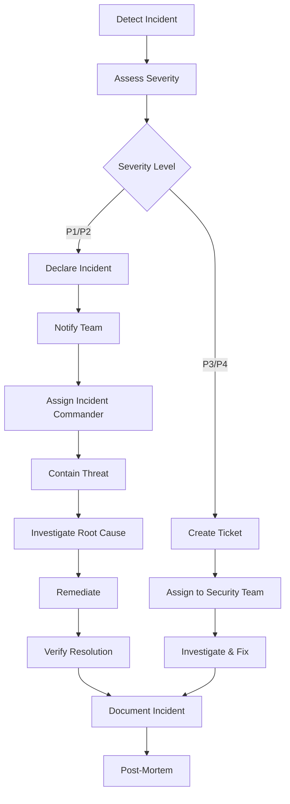

# Security Procedures

**Document Version**: 1.0  
**Last Updated**: 2024-01-26  
**Next Review**: 2024-04-26 (Quarterly)  
**Owner**: Security Team  
**Compliance**: OWASP Top 10, ISO 27001, GDPR, PCI-DSS

## Table of Contents

1. [Overview](#overview)
2. [Incident Response Procedures](#incident-response-procedures)
3. [Access Management Procedures](#access-management-procedures)
4. [Security Monitoring and Alerting](#security-monitoring-and-alerting)
5. [Vulnerability Management](#vulnerability-management)
6. [Security Audit Procedures](#security-audit-procedures)
7. [Compliance Procedures](#compliance-procedures)
8. [Security Contacts](#security-contacts)

---

## Overview

This document defines security procedures for the AI-Based Reviewer platform. These procedures ensure:
- Rapid detection and response to security incidents
- Proper access control and user management
- Continuous security monitoring and vulnerability management
- Compliance with security standards and regulations

**Scope**: All production and staging environments, including:
- Backend API services
- Frontend web application
- Databases (PostgreSQL, Neo4j, Redis)
- AWS infrastructure
- Third-party integrations (GitHub, LLM APIs)

**Roles and Responsibilities**:
- **Security Team**: Overall security oversight, incident response coordination
- **DevOps Team**: Infrastructure security, monitoring, access management
- **Development Team**: Secure coding practices, vulnerability remediation
- **Compliance Officer**: Audit logging, compliance reporting
- **Incident Commander**: Designated during security incidents (rotates)

---

## Incident Response Procedures

### 1.1 Incident Severity Levels

| Severity | Description | Examples | Response Time | Escalation |
|----------|-------------|----------|---------------|------------|
| **P1 - Critical** | Complete service outage, active data breach, ransomware | Database compromised, active attack in progress | **15 minutes** | Immediate - All hands |
| **P2 - High** | Major security vulnerability exploited, significant data exposure | Authentication bypass, mass unauthorized access | **1 hour** | 30 minutes |
| **P3 - Medium** | Security control failure, minor data exposure, suspicious activity | Failed security scan, audit log anomaly | **4 hours** | 2 hours |
| **P4 - Low** | Security configuration issue, potential vulnerability | Outdated dependency, missing security header | **24 hours** | N/A |


### 1.2 Incident Response Workflow



### 1.3 Detection Phase

**Automated Detection Sources**:
- CloudWatch alarms (error rate, unauthorized access attempts)
- Audit log anomalies (privilege escalation, unusual access patterns)
- Security scanning alerts (OWASP ZAP, Bandit)
- Rate limiting violations (potential DDoS or brute force)
- Failed authentication spikes
- AWS GuardDuty findings

**Manual Detection Sources**:
- User reports (suspicious activity, unauthorized access)
- Security team monitoring
- Third-party security researchers
- Penetration testing findings

**Detection Actions**:
1. Alert triggered or incident reported
2. On-call engineer receives notification (PagerDuty/Slack)
3. Initial triage within 5 minutes
4. Determine if incident or false positive


### 1.4 Assessment Phase

**Severity Assessment Checklist**:

**P1 - Critical** (Any of):
- [ ] Complete service outage affecting all users
- [ ] Active data breach or exfiltration in progress
- [ ] Database or system compromise confirmed
- [ ] Ransomware or destructive malware detected
- [ ] Authentication system completely bypassed
- [ ] Critical infrastructure (AWS, databases) compromised

**P2 - High** (Any of):
- [ ] Major security vulnerability actively exploited
- [ ] Significant unauthorized data access (>100 users affected)
- [ ] Authentication or authorization bypass affecting subset of users
- [ ] Sensitive data exposed (API keys, passwords, PII)
- [ ] Successful privilege escalation attack

**P3 - Medium** (Any of):
- [ ] Security control failure (rate limiting, encryption)
- [ ] Minor unauthorized access (<100 users affected)
- [ ] Suspicious activity detected but not confirmed malicious
- [ ] Audit log tampering attempt
- [ ] Failed security scan with high severity findings

**P4 - Low** (Any of):
- [ ] Security misconfiguration discovered
- [ ] Outdated dependency with known vulnerability
- [ ] Missing security header or control
- [ ] Failed security scan with medium/low findings

**Impact Assessment**:
- Number of users affected
- Type of data exposed (PII, credentials, business data)
- System availability impact
- Regulatory compliance implications
- Reputational risk


### 1.5 Containment Phase

**Immediate Containment Actions** (P1/P2):

1. **Isolate Affected Systems**:
   ```bash
   # Disable compromised user account
   docker exec ai_review_postgres psql -U postgres -d ai_code_reviewer -c \
     "UPDATE users SET is_active = false WHERE email = 'compromised@example.com';"
   
   # Revoke all active sessions for user
   docker exec ai_review_redis redis-cli -a ${REDIS_PASSWORD} \
     DEL "session:user:${USER_ID}:*"
   
   # Block IP address at firewall level
   aws ec2 authorize-security-group-ingress \
     --group-id sg-xxxxx \
     --protocol tcp \
     --port 443 \
     --cidr 192.168.1.100/32 \
     --rule-action deny
   ```

2. **Preserve Evidence**:
   ```bash
   # Export audit logs immediately
   docker exec ai_review_postgres psql -U postgres -d ai_code_reviewer -c \
     "COPY (SELECT * FROM audit_logs WHERE timestamp >= NOW() - INTERVAL '24 hours') \
     TO STDOUT WITH CSV HEADER" > incident_audit_logs_$(date +%Y%m%d_%H%M%S).csv
   
   # Capture system state
   docker ps -a > incident_containers_$(date +%Y%m%d_%H%M%S).txt
   docker logs ai_review_backend > incident_backend_logs_$(date +%Y%m%d_%H%M%S).txt
   
   # Snapshot database (if compromise suspected)
   aws rds create-db-snapshot \
     --db-instance-identifier ai-code-reviewer-prod \
     --db-snapshot-identifier incident-snapshot-$(date +%Y%m%d-%H%M%S)
   ```

3. **Limit Blast Radius**:
   - Disable affected features or endpoints
   - Rotate compromised credentials immediately
   - Enable additional monitoring and logging
   - Increase rate limiting thresholds temporarily

4. **Communication**:
   - Notify security team via Slack #security-incidents channel
   - Update status page if user-facing impact
   - Prepare internal communication for stakeholders


### 1.6 Investigation Phase

**Root Cause Analysis**:

1. **Review Audit Logs**:
   ```bash
   # Check authentication failures
   docker exec ai_review_postgres psql -U postgres -d ai_code_reviewer -c "
   SELECT timestamp, user_email, ip_address, action, success, error_message
   FROM audit_logs
   WHERE event_category = 'auth'
   AND timestamp >= NOW() - INTERVAL '24 hours'
   ORDER BY timestamp DESC
   LIMIT 100;"
   
   # Check authorization failures
   docker exec ai_review_postgres psql -U postgres -d ai_code_reviewer -c "
   SELECT timestamp, user_email, resource_type, action, ip_address
   FROM audit_logs
   WHERE event_type LIKE 'authz.%'
   AND timestamp >= NOW() - INTERVAL '24 hours'
   ORDER BY timestamp DESC;"
   
   # Check privilege escalation attempts
   docker exec ai_review_postgres psql -U postgres -d ai_code_reviewer -c "
   SELECT timestamp, user_email, action, description, metadata
   FROM audit_logs
   WHERE action LIKE '%role%' OR action LIKE '%permission%'
   AND timestamp >= NOW() - INTERVAL '24 hours'
   ORDER BY timestamp DESC;"
   ```

2. **Analyze Application Logs**:
   ```bash
   # Check for errors and exceptions
   grep -i "error\|exception\|unauthorized\|forbidden" backend/app.log | tail -100
   
   # Check CloudWatch logs
   aws logs filter-log-events \
     --log-group-name /aws/ec2/ai-code-reviewer \
     --start-time $(date -d '24 hours ago' +%s)000 \
     --filter-pattern "ERROR"
   ```

3. **Review Network Activity**:
   ```bash
   # Check AWS VPC Flow Logs
   aws ec2 describe-flow-logs --filter "Name=resource-id,Values=vpc-xxxxx"
   
   # Analyze suspicious IP addresses
   aws logs filter-log-events \
     --log-group-name /aws/vpc/flowlogs \
     --filter-pattern "[version, account, eni, source=192.168.1.100, ...]"
   ```

4. **Check System Integrity**:
   ```bash
   # Verify no unauthorized code changes
   git log --since="24 hours ago" --all
   
   # Check for unauthorized file modifications
   find /app -type f -mtime -1 -ls
   
   # Verify database schema integrity
   docker exec ai_review_postgres psql -U postgres -d ai_code_reviewer -c "\dt"
   ```

**Investigation Documentation**:
- Timeline of events (what happened when)
- Attack vector (how did attacker gain access)
- Affected systems and data
- Indicators of Compromise (IOCs)
- Evidence collected


### 1.7 Remediation Phase

**Remediation Actions by Incident Type**:

**Compromised Credentials**:
```bash
# 1. Revoke all tokens for affected user
docker exec ai_review_redis redis-cli -a ${REDIS_PASSWORD} \
  KEYS "token:*:user:${USER_ID}" | xargs redis-cli -a ${REDIS_PASSWORD} DEL

# 2. Force password reset
docker exec ai_review_postgres psql -U postgres -d ai_code_reviewer -c \
  "UPDATE users SET password_reset_required = true WHERE id = '${USER_ID}';"

# 3. Rotate API keys
python backend/scripts/rotate_api_keys.py --user-id ${USER_ID}

# 4. Notify user of compromise
python backend/scripts/send_security_notification.py \
  --user-id ${USER_ID} \
  --type credential_compromise
```

**SQL Injection Attack**:
```bash
# 1. Identify vulnerable endpoint
grep -r "execute.*%" backend/app/

# 2. Deploy hotfix with parameterized queries
git checkout -b hotfix/sql-injection-fix
# Fix code, commit, deploy

# 3. Verify no data exfiltration
docker exec ai_review_postgres psql -U postgres -d ai_code_reviewer -c "
SELECT * FROM audit_logs
WHERE action = 'data_export'
AND timestamp >= '${INCIDENT_START_TIME}';"

# 4. Run security scan
python backend/security/run_security_scan.sh
```

**Unauthorized Access**:
```bash
# 1. Review and fix RBAC rules
python backend/scripts/audit_rbac_permissions.py

# 2. Revoke unauthorized access
docker exec ai_review_postgres psql -U postgres -d ai_code_reviewer -c \
  "DELETE FROM project_access WHERE user_id = '${USER_ID}' AND authorized = false;"

# 3. Audit all access grants in last 30 days
docker exec ai_review_postgres psql -U postgres -d ai_code_reviewer -c "
SELECT * FROM audit_logs
WHERE action LIKE '%access%grant%'
AND timestamp >= NOW() - INTERVAL '30 days';"
```

**DDoS Attack**:
```bash
# 1. Enable AWS Shield Advanced (if not already)
aws shield create-protection \
  --name ai-code-reviewer-alb \
  --resource-arn arn:aws:elasticloadbalancing:...

# 2. Adjust rate limiting
docker exec ai_review_backend python -c "
from app.core.config import settings
settings.RATE_LIMIT_PER_MINUTE = 50  # Reduce from 100
"

# 3. Block attacking IPs at WAF level
aws wafv2 update-ip-set \
  --name blocked-ips \
  --scope REGIONAL \
  --addresses 192.168.1.100/32 192.168.1.101/32

# 4. Enable CloudFront (if not already) for DDoS protection
```


### 1.8 Verification Phase

**Verification Checklist**:

- [ ] Vulnerability patched and deployed to production
- [ ] Security scan passes (OWASP ZAP, Bandit)
- [ ] No unauthorized access in last 24 hours
- [ ] All compromised credentials rotated
- [ ] Audit logs show no suspicious activity
- [ ] Monitoring alerts configured for similar incidents
- [ ] All affected users notified (if required)
- [ ] Compliance requirements met (breach notification if applicable)

**Verification Commands**:
```bash
# Run security scan
cd backend/security
./run_security_scan.sh

# Verify no critical/high vulnerabilities
python verify_security_controls.py

# Check audit logs for anomalies
docker exec ai_review_postgres psql -U postgres -d ai_code_reviewer -c "
SELECT COUNT(*) as suspicious_events
FROM audit_logs
WHERE (success = false OR event_type LIKE '%failure%')
AND timestamp >= NOW() - INTERVAL '24 hours';"

# Verify rate limiting is working
curl -I https://api.example.com/health
# Should see X-RateLimit-* headers

# Verify encryption is enabled
curl -v https://api.example.com/health 2>&1 | grep "TLS"
# Should show TLS 1.3
```

### 1.9 Documentation Phase

**Incident Report Template**:

```markdown
# Security Incident Report: [Brief Description]

**Incident ID**: INC-2024-001
**Date**: 2024-01-26
**Severity**: P1 - Critical
**Status**: Resolved
**Incident Commander**: John Doe

## Executive Summary
Brief 2-3 sentence summary of what happened and impact.

## Timeline
- **10:00 UTC**: Alert triggered - High rate of failed authentication attempts
- **10:05 UTC**: Incident declared P2, security team notified
- **10:10 UTC**: Identified brute force attack from IP 192.168.1.100
- **10:15 UTC**: Blocked attacking IP at WAF level
- **10:20 UTC**: Verified attack stopped, no successful breaches
- **10:30 UTC**: Implemented additional rate limiting
- **11:00 UTC**: Incident resolved, monitoring continues

## Root Cause
Detailed explanation of what caused the incident and how attacker gained access.

## Impact Assessment
- **Users Affected**: 0 (attack blocked before any compromise)
- **Data Exposed**: None
- **System Availability**: No downtime
- **Financial Impact**: None
- **Regulatory Impact**: No breach notification required

## Remediation Actions Taken
1. Blocked attacking IP address at AWS WAF
2. Reduced rate limit from 100 to 50 requests/minute
3. Enabled additional CloudWatch alarms for auth failures
4. Reviewed audit logs for any successful breaches (none found)

## Preventive Measures
1. Implement CAPTCHA on login page after 3 failed attempts
2. Add IP reputation checking before authentication
3. Enable AWS Shield Advanced for DDoS protection
4. Conduct security training on brute force attack detection

## Lessons Learned
- Rate limiting was effective but could be more aggressive
- Need faster automated response to brute force attacks
- Monitoring and alerting worked well

## Follow-up Actions
- [ ] Implement CAPTCHA (Due: 2024-02-02, Owner: Dev Team)
- [ ] Enable AWS Shield Advanced (Due: 2024-01-30, Owner: DevOps)
- [ ] Security training session (Due: 2024-02-15, Owner: Security Team)

## Attachments
- Audit log export: incident_audit_logs_20240126.csv
- CloudWatch metrics: incident_metrics_20240126.png
- Network flow logs: incident_flowlogs_20240126.txt
```


### 1.10 Post-Mortem Phase

**Post-Mortem Meeting** (within 48 hours of resolution):

**Attendees**:
- Incident Commander
- Security Team
- DevOps Team
- Development Team (if code changes needed)
- Management (for P1/P2 incidents)

**Agenda**:
1. Review incident timeline
2. Discuss what went well
3. Discuss what could be improved
4. Identify root causes
5. Define preventive measures
6. Assign follow-up actions with owners and deadlines

**Blameless Culture**:
- Focus on systems and processes, not individuals
- Encourage honest discussion
- Learn from mistakes
- Improve security posture

**Post-Mortem Document**:
- Publish to internal wiki within 1 week
- Share lessons learned with entire team
- Track follow-up actions to completion

---

## Access Management Procedures

### 2.1 User Provisioning

**New User Onboarding**:

1. **Request Approval**:
   - Manager submits access request ticket
   - Security team reviews and approves
   - Minimum necessary access principle

2. **Account Creation**:
   ```bash
   # Create user account
   docker exec ai_review_backend python -c "
   from app.services.user_service import create_user
   user = create_user(
       email='newuser@example.com',
       role='developer',  # or 'viewer', 'admin'
       created_by='admin@example.com'
   )
   print(f'User created: {user.id}')
   "
   
   # Send welcome email with temporary password
   python backend/scripts/send_welcome_email.py \
     --email newuser@example.com \
     --temp-password
   ```

3. **Access Grant**:
   ```bash
   # Grant project access
   docker exec ai_review_postgres psql -U postgres -d ai_code_reviewer -c "
   INSERT INTO project_access (user_id, project_id, role, granted_by, granted_at)
   VALUES ('${USER_ID}', '${PROJECT_ID}', 'developer', '${ADMIN_ID}', NOW());"
   
   # Verify access granted
   docker exec ai_review_postgres psql -U postgres -d ai_code_reviewer -c "
   SELECT u.email, p.name, pa.role
   FROM project_access pa
   JOIN users u ON pa.user_id = u.id
   JOIN projects p ON pa.project_id = p.id
   WHERE u.id = '${USER_ID}';"
   ```

4. **Audit Logging**:
   - All user creation logged to audit_logs table
   - Access grants logged with grantor information
   - Review quarterly for compliance


### 2.2 Role Management

**Role Hierarchy**:
- **Admin**: Full system access, user management, configuration changes
- **Developer**: Create/modify projects, run analyses, view results
- **Viewer**: Read-only access to projects and results

**Role Assignment**:
```bash
# List available roles
docker exec ai_review_postgres psql -U postgres -d ai_code_reviewer -c "
SELECT id, name, description FROM roles ORDER BY name;"

# Assign role to user
docker exec ai_review_postgres psql -U postgres -d ai_code_reviewer -c "
UPDATE users
SET role_id = (SELECT id FROM roles WHERE name = 'developer')
WHERE email = 'user@example.com';"

# Verify role assignment
docker exec ai_review_postgres psql -U postgres -d ai_code_reviewer -c "
SELECT u.email, r.name as role
FROM users u
JOIN roles r ON u.role_id = r.id
WHERE u.email = 'user@example.com';"
```

**Role Change Approval**:
- Admin role changes require approval from 2 existing admins
- All role changes logged to audit_logs
- Quarterly review of admin accounts

### 2.3 User Deprovisioning

**Offboarding Checklist**:

- [ ] Disable user account immediately
- [ ] Revoke all active sessions
- [ ] Remove project access
- [ ] Rotate shared credentials (if any)
- [ ] Export user's audit logs for retention
- [ ] Schedule account deletion (30 days)

**Deprovisioning Commands**:
```bash
# 1. Disable account immediately
docker exec ai_review_postgres psql -U postgres -d ai_code_reviewer -c "
UPDATE users SET is_active = false, disabled_at = NOW(), disabled_by = '${ADMIN_ID}'
WHERE email = 'offboarding@example.com';"

# 2. Revoke all active sessions
docker exec ai_review_redis redis-cli -a ${REDIS_PASSWORD} \
  KEYS "session:user:${USER_ID}:*" | xargs redis-cli -a ${REDIS_PASSWORD} DEL

# 3. Revoke all tokens
docker exec ai_review_redis redis-cli -a ${REDIS_PASSWORD} \
  KEYS "token:*:user:${USER_ID}" | xargs redis-cli -a ${REDIS_PASSWORD} DEL

# 4. Remove project access
docker exec ai_review_postgres psql -U postgres -d ai_code_reviewer -c "
DELETE FROM project_access WHERE user_id = '${USER_ID}';"

# 5. Export audit logs for user
docker exec ai_review_postgres psql -U postgres -d ai_code_reviewer -c "
COPY (SELECT * FROM audit_logs WHERE user_id = '${USER_ID}')
TO STDOUT WITH CSV HEADER" > user_audit_logs_${USER_ID}_$(date +%Y%m%d).csv

# 6. Schedule deletion (mark for deletion in 30 days)
docker exec ai_review_postgres psql -U postgres -d ai_code_reviewer -c "
UPDATE users SET deletion_scheduled_at = NOW() + INTERVAL '30 days'
WHERE id = '${USER_ID}';"
```


### 2.4 Access Reviews

**Quarterly Access Review Process**:

1. **Generate Access Report**:
   ```bash
   # List all users and their roles
   docker exec ai_review_postgres psql -U postgres -d ai_code_reviewer -c "
   SELECT u.email, r.name as role, u.is_active, u.last_login_at, u.created_at
   FROM users u
   JOIN roles r ON u.role_id = r.id
   ORDER BY r.name, u.email;" > access_review_$(date +%Y%m%d).csv
   
   # List all admin users
   docker exec ai_review_postgres psql -U postgres -d ai_code_reviewer -c "
   SELECT u.email, u.last_login_at, u.created_at
   FROM users u
   JOIN roles r ON u.role_id = r.id
   WHERE r.name = 'admin'
   ORDER BY u.last_login_at DESC;"
   
   # List inactive users (no login in 90 days)
   docker exec ai_review_postgres psql -U postgres -d ai_code_reviewer -c "
   SELECT email, last_login_at, CURRENT_DATE - last_login_at::date as days_inactive
   FROM users
   WHERE last_login_at < NOW() - INTERVAL '90 days'
   OR last_login_at IS NULL
   ORDER BY last_login_at;"
   ```

2. **Review Process**:
   - Send report to managers for review
   - Verify each user still requires access
   - Identify and remove unnecessary access
   - Disable inactive accounts

3. **Remediation**:
   ```bash
   # Disable inactive accounts
   docker exec ai_review_postgres psql -U postgres -d ai_code_reviewer -c "
   UPDATE users SET is_active = false
   WHERE last_login_at < NOW() - INTERVAL '90 days'
   OR last_login_at IS NULL;"
   
   # Downgrade unnecessary admin accounts
   docker exec ai_review_postgres psql -U postgres -d ai_code_reviewer -c "
   UPDATE users
   SET role_id = (SELECT id FROM roles WHERE name = 'developer')
   WHERE email IN ('user1@example.com', 'user2@example.com');"
   ```

4. **Documentation**:
   - Document review findings
   - Track remediation actions
   - Report to compliance officer

### 2.5 Privileged Access Management

**Admin Account Security**:

1. **Multi-Factor Authentication** (MFA):
   - Required for all admin accounts
   - TOTP-based (Google Authenticator, Authy)
   - Backup codes provided

2. **Admin Session Monitoring**:
   ```bash
   # Monitor admin actions in real-time
   docker exec ai_review_postgres psql -U postgres -d ai_code_reviewer -c "
   SELECT timestamp, user_email, action, description, resource_type
   FROM audit_logs
   WHERE user_role = 'admin'
   AND timestamp >= NOW() - INTERVAL '1 hour'
   ORDER BY timestamp DESC;"
   ```

3. **Separation of Duties**:
   - No single admin can perform critical actions alone
   - Require approval for: user deletion, role changes to admin, system configuration changes

4. **Admin Account Review**:
   - Monthly review of all admin accounts
   - Quarterly recertification by management
   - Immediate revocation when no longer needed

