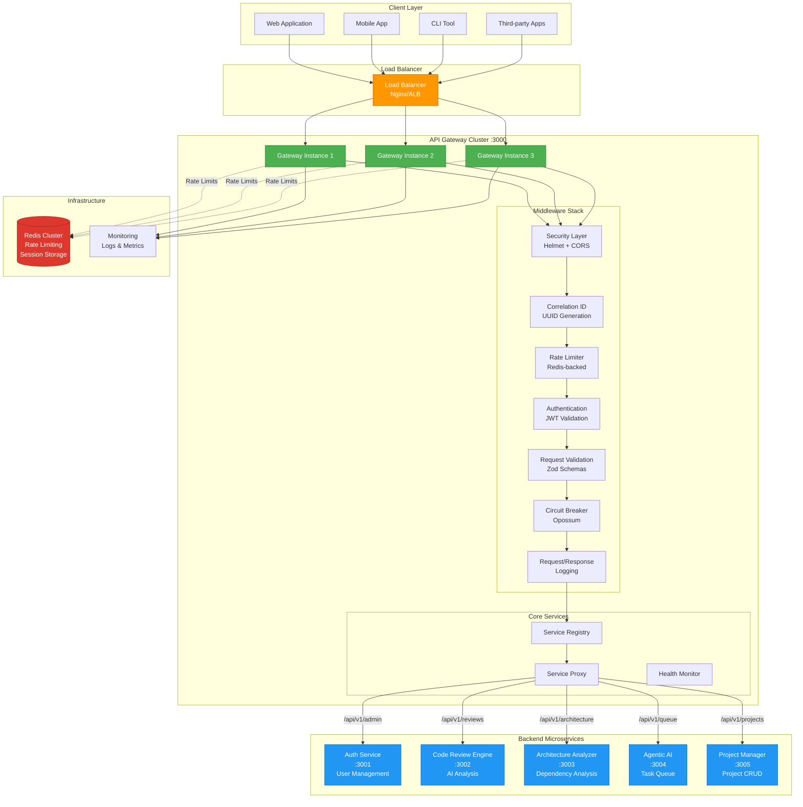
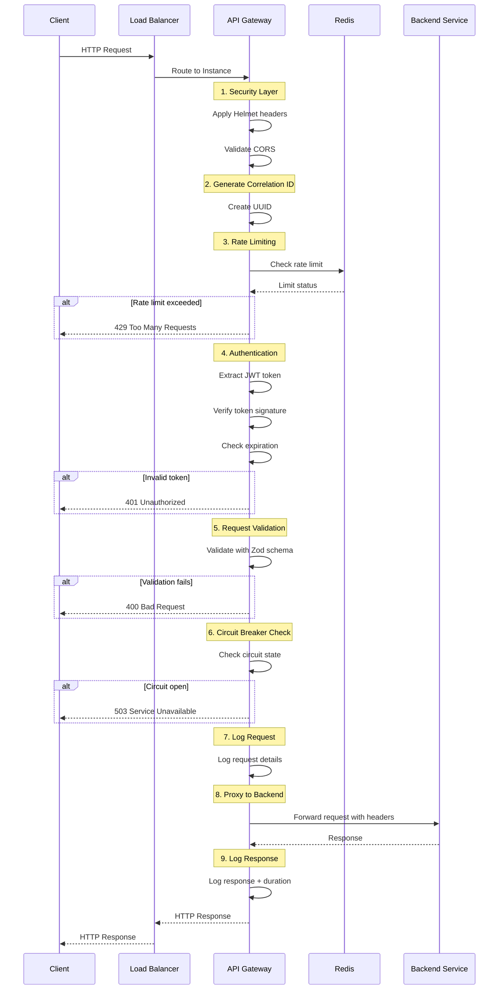
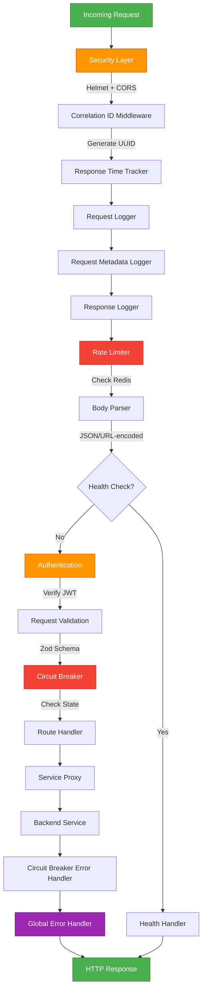
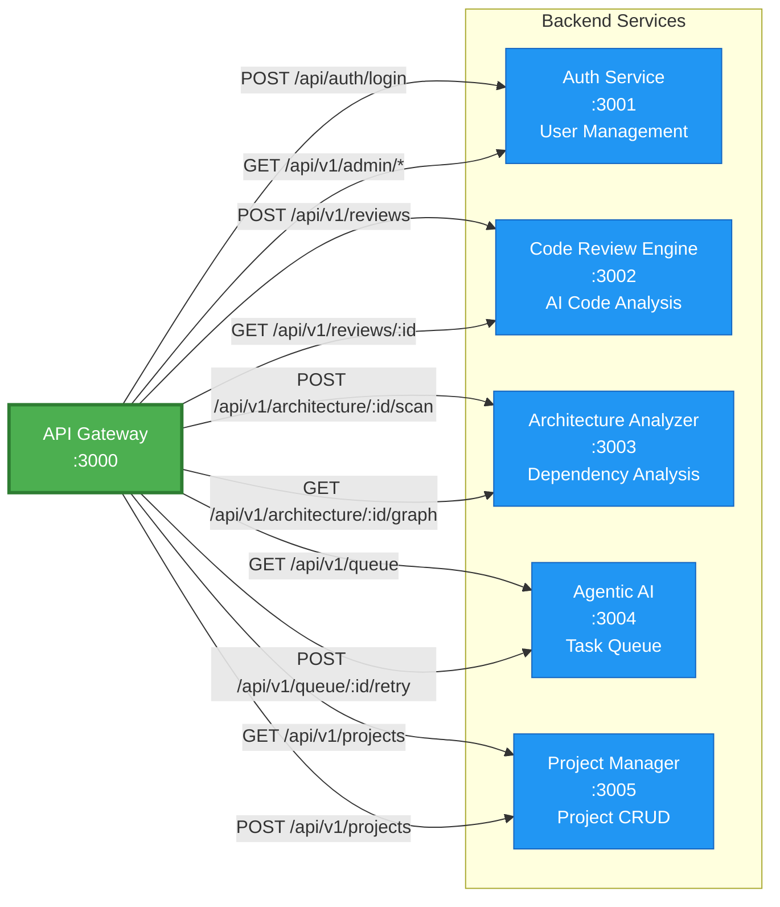
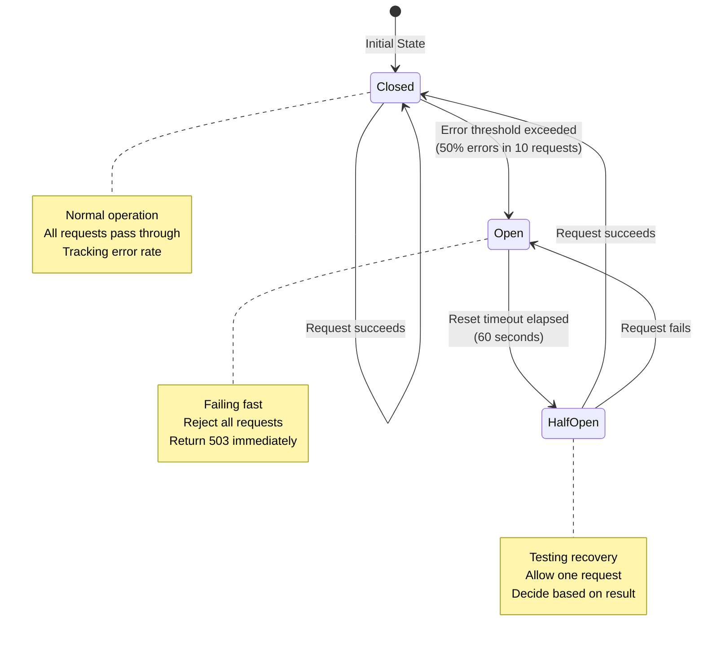
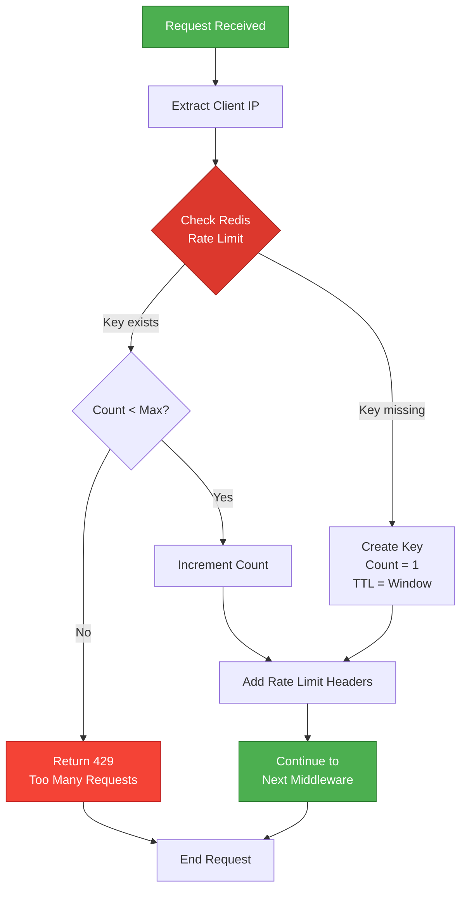
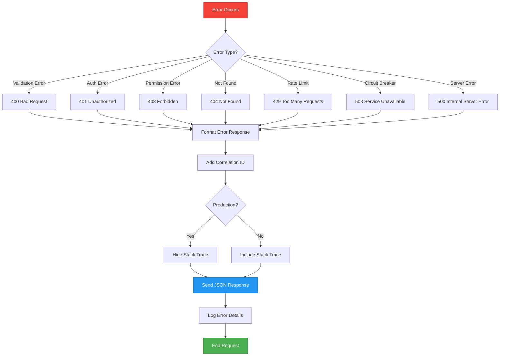
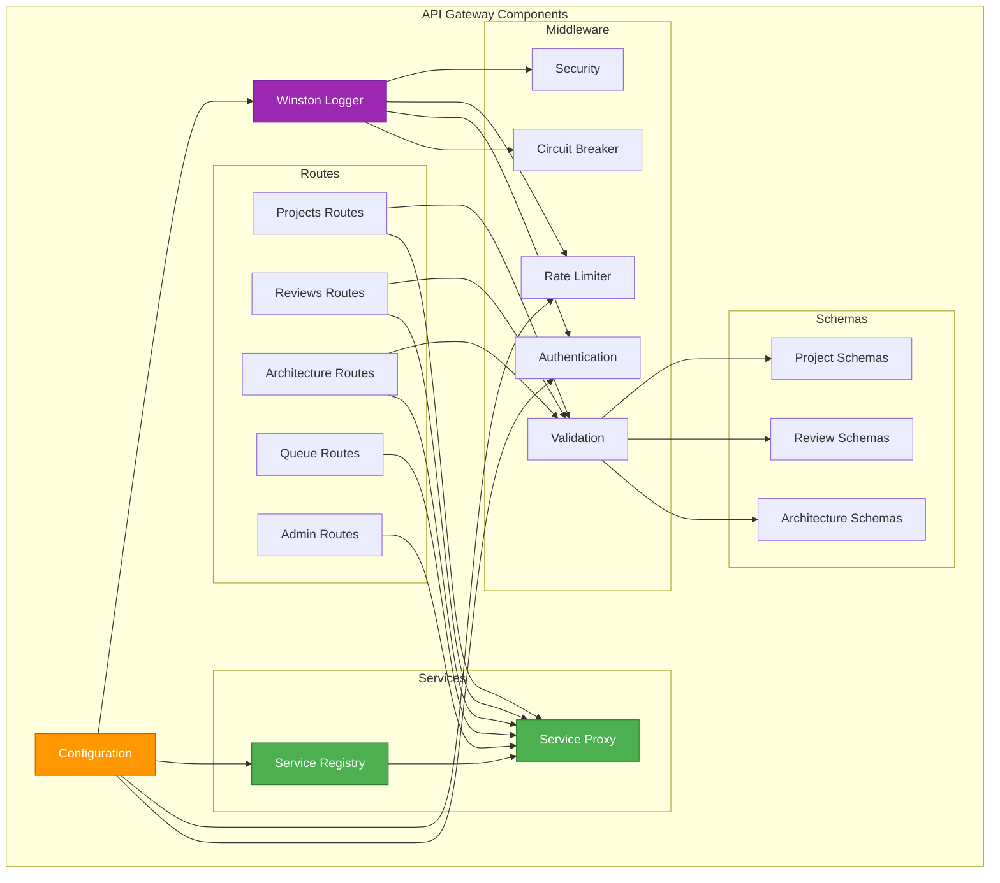
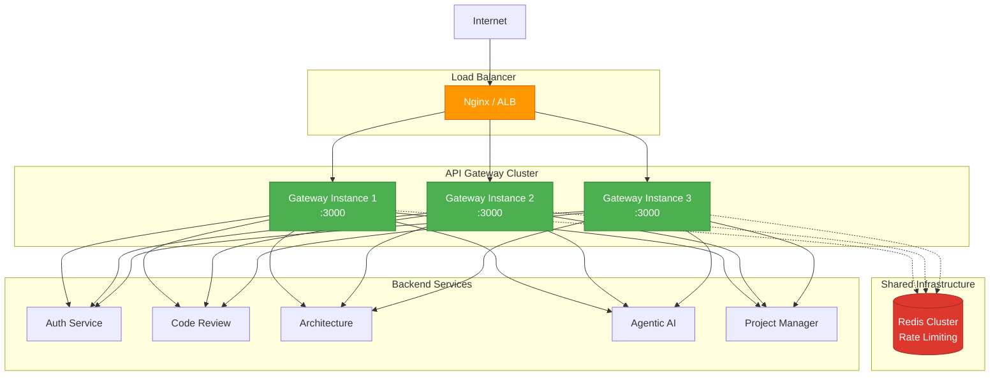
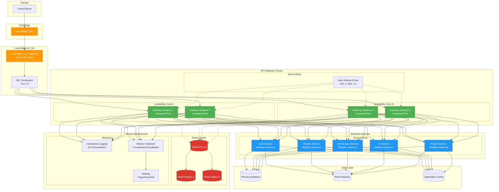

# API Gateway - Architecture Diagrams

> Visual representations of the API Gateway architecture, request flow, and component interactions

---

## Table of Contents

1. [High-Level Architecture](#high-level-architecture)
2. [Request Flow](#request-flow)
3. [Middleware Stack](#middleware-stack)
4. [Service Communication](#service-communication)
5. [Circuit Breaker States](#circuit-breaker-states)
6. [Rate Limiting Flow](#rate-limiting-flow)
7. [Error Handling Flow](#error-handling-flow)
8. [Production Deployment](#production-deployment)

---

## High-Level Architecture



---

## Request Flow



---

## Middleware Stack



---

## Service Communication



---

## Circuit Breaker States



### Circuit Breaker Configuration

```typescript
{
  timeout: 10000,              // 10 seconds
  errorThresholdPercentage: 50, // 50% error rate
  resetTimeout: 60000,          // 60 seconds
  volumeThreshold: 10           // Minimum 10 requests
}
```

---

## Rate Limiting Flow



### Rate Limit Headers

```http
X-RateLimit-Limit: 100
X-RateLimit-Remaining: 95
X-RateLimit-Reset: 1706097900
```

---

## Error Handling Flow



### Error Response Format

```json
{
  "error": {
    "code": "ERROR_CODE",
    "message": "Human-readable message",
    "details": ["Additional details"],
    "correlationId": "550e8400-e29b-41d4-a716-446655440000",
    "timestamp": "2026-01-24T10:00:00.000Z"
  }
}
```

---

## Component Interaction



---

## Deployment Architecture



---

## Production Deployment



### Production Deployment Features

**High Availability**
- Multi-AZ deployment across availability zones
- Auto-scaling based on CPU/memory/request metrics
- Load balancer health checks
- Circuit breaker protection

**Security**
- SSL/TLS termination at load balancer
- WAF (Web Application Firewall) protection
- VPC network isolation
- Security groups and NACLs

**Performance**
- CDN for static content and edge caching
- Redis cluster for distributed rate limiting
- Connection pooling and keep-alive
- Response compression

**Monitoring & Observability**
- Centralized logging with correlation IDs
- Real-time metrics collection
- Automated alerting
- Distributed tracing

**Scalability**
- Horizontal auto-scaling (2-10 instances)
- Database read replicas
- Application-level caching
- Service mesh for inter-service communication

---

**Last Updated**: January 24, 2026  
**Version**: 1.0.0
